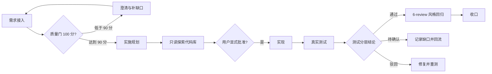
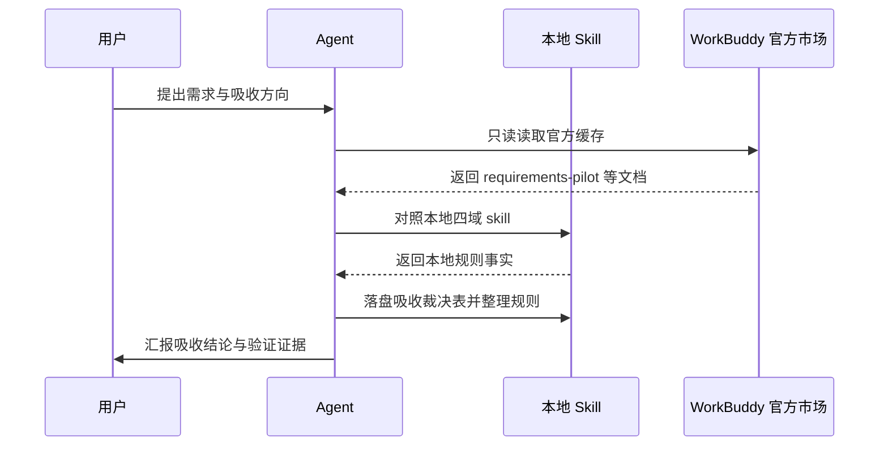

# WorkBuddy 官方市场规则吸收整理补充

结论：本次只做“整理补充”，不照搬整套流程，把 WorkBuddy 官方市场里更具体、更可量化的需求质量门、实施前代码库探索、Bug 修复风险分级和测试风险分层四项精华，按“保留 / 替换 / 合并 / 不吸收”并入我们已有的需求、实施、Bug、测试 skill，让规则更强而不是更多。影响：后续处理需求、实施、Bug 和测试时，会有更清晰的达标线、暂停线和交接线，同时不会新增一套平行工作流。范围：只修改本仓库四类 skill 及其参考文档，并落盘需求、实施、测试与风格回归证据。非范围：不安装 WorkBuddy 官方插件，不复制官方目录，不新建同类 skill 目录，不引入 `.codebuddy/specs/` 或 `--skip-tests` 选项，不改动与本次吸收无关的 skill。变化：需求接入时多一个可量化的 100 分质量门，实施规划时先只读探索代码库再形成计划，Bug 修复按风险高低决定等不等确认，测试按风险和分层结论收口。完成标准：四类 skill 的正文或 references 已按吸收裁决表落地，需求、实施总览、实施周期、测试和 6-review 证据全部落盘并通过机器校验。术语说明：无技术术语需要解释；“吸收”指把外部规则中比我们更好的内容合并进已有 skill，不新增同类 skill。验证状态：当前为已确认需求，实施计划随后落盘，真实测试以本地脚本和文档机器校验为准。

## 1. 文档信息

- 需求标题：WorkBuddy 官方市场规则吸收整理补充
- 版本与状态：v1.0 / 已确认
- 需求来源：用户会话提出“分析 skill、取精华去糟粕、吸收不是冗余、不是累加、而是整理补充”，并要求“根据需求实施 skill 的规则，将计划落盘，然后按照落盘的计划执行，允许多 agent 并行”
- 修订记录：
  - v1.0 / 2026-08-13 / 首次落盘 / 当前会话
- 来源对象标识：`REQ-WBA-20260813-001`
- 复杂度等级：L3
- 当前优先闭环：先完成四类 skill 吸收裁决并落盘全部文档证据

## 2. 当前计划最终方案简要说明

推荐方案：采用“保留 / 替换 / 合并 / 不吸收”四动作，把官方精华吸收进现有 skill，不复制整套流程。主落点：`implementation-planning-rules` 新增外部吸收裁决参考文档，需求、Bug、测试域各自把可量化门禁补进现有 references。为什么先走这条路线：本地 skill 已覆盖完整生命周期，缺的是可量化达标线和风险分级；补充这些比复制整套工作流更符合“不冗余累加”的目标。

## 3. Agent 对当前问题的理解

- 问题 / 目标：现有 skill 规则覆盖面较全，但部分场景缺少可量化门禁；WorkBuddy 官方市场存在类似 skill，其中需求 100 分质量门、实施前代码库探索、Bug 修复风险分级、测试风险优先级值得吸收。
- 本轮范围：需求、实施、Bug、测试四域 skill 的整理补充；需求文档、实施总览、实施周期、测试与 6-review 证据落盘；字典与项目记忆同步。
- 非范围：不引入官方插件目录、不新建同类 skill、不改需求域以外的无关规则、不执行 Git 提交。
- 当前优先闭环：先落盘需求与实施计划，再按实施周期逐个最小任务闭环。
- 关键假设 / 待确认点：本地 skill 文档与 WorkBuddy 官方市场缓存文件为事实基线；用户已明确允许吸收并支持多 agent 并行，不需要再确认流程方向。

## 3.1 决策冻结

| `DEC-*` | 决策问题 | 候选方案 | 选定方案 | 排除原因 | 影响面 | 回滚 |
| --- | --- | --- | --- | --- | --- | --- |
| `DEC-WBA-001` | 需求质量门采用哪种口径 | 官方 100 分制；本地现有缺口清单；两者并列 | 合并官方 100 分制到需求域 references | 本地缺口清单已存在，并列会造成双维护 | 需求域 skill | `ROLLBACK-WBA-001` |
| `DEC-WBA-002` | 实施前代码库探索如何落地 | 新增独立 skill；并入实施域 references | 并入实施域 references | 本地已有实施规划入口，新增 skill 会重复 | 实施域 skill | `ROLLBACK-WBA-002` |
| `DEC-WBA-003` | Bug 修复风险分级是否替换现有规则 | 替换现有回归风险路由；合并到现有路由 | 合并到现有回归风险路由 | 现有路由已覆盖风险维度，只需补决策表 | Bug 域 skill | `ROLLBACK-WBA-003` |
| `DEC-WBA-004` | 测试分层结论如何落地 | 新增结论类型；并入测试策略 references | 并入测试策略 references | 测试域已有优先级模型，只需补分层结论 | 测试域 skill | `ROLLBACK-WBA-004` |
| `DEC-WBA-005` | 官方整套流程是否吸收 | 吸收 requirements-pilot 整套流程；只吸收精华；不吸收 | 只吸收精华 | 整套流程会形成第二套工作流，违背不冗余累加 | 全局 | `ROLLBACK-WBA-005` |
| `DEC-WBA-006` | 是否引入官方插件目录 | 引入 `.codebuddy/specs/`；不引入 | 不引入 | 复制官方目录会破坏本地 skill 体系 | 全局 | `ROLLBACK-WBA-006` |

## 3.2 普通模型零决策执行契约

- 本文档只定义“做什么”和“做到什么算完成”，不定义低层实现细节。
- 普通模型执行时不得自行补充范围、默认值、异常、权限、兼容、文件落点、测试断言或回滚边界；任何缺失项必须写 `N/A + 原因 + 证据` 并回流需求域。
- 每个 `REQ-*` / `RULE-*` 必须能回指至少一个 `AC-*`，每个 `AC-*` 必须能回指实施计划或阻断原因。
- 需求文档未落盘或机器校验失败时，不得进入实施规划与编码。

## 3.3 垂直切片与追踪契约

- 垂直切片唯一归属：`SLICE-WBA-01` 为本需求当前优先切片，只归属需求域吸收整理，不与其他来源对象重复归属。
- 追踪契约：`SRC-* -> DEC-* -> REQ/RULE-* -> AC-* -> CYCLE-* -> TASK-* -> TEST-* -> EVIDENCE-*` 双向可追踪，详见第 13 章追踪矩阵。
- 未决项：无；所有真实不确定决策点已由用户确认。

## 4. 需求来源与证据台账

| 来源 ID | 来源类型 | 原文摘录 / 事实 | 证据路径 | 责任人 |
| --- | --- | --- | --- | --- |
| `SRC-WBA-001` | 用户会话 | 分析 skill 对需求、实施、bug、测试的规则；WorkBuddy 官方市场 skill 库中有很多类似 skill，取精华去糟粕；吸收不是冗余、不是累加、而是整理补充 | 当前会话 | 用户 |
| `SRC-WBA-002` | WorkBuddy 官方市场缓存 | requirements-pilot 的 100 分需求质量门、90 分才移交；用户显式批准后才进入实施 | `C:\Users\luode\.workbuddy\plugins\marketplaces\codebuddy-plugins-official\plugins\requirements-driven-workflow\commands\requirements-pilot.md` | WorkBuddy |
| `SRC-WBA-003` | WorkBuddy 官方市场缓存 | requirements-generate 的“每项规格可直接映射到具体代码动作，含文件路径、函数名、schema” | `C:\Users\luode\.workbuddy\plugins\marketplaces\codebuddy-plugins-official\plugins\requirements-driven-workflow\agents\requirements-generate.md` | WorkBuddy |
| `SRC-WBA-004` | WorkBuddy 官方市场缓存 | requirements-review 的“功能 40% / 集成 25% / 代码质量 20% / 性能 15%”评分；95-100 可直接部署 | `C:\Users\luode\.workbuddy\plugins\marketplaces\codebuddy-plugins-official\plugins\requirements-driven-workflow\agents\requirements-review.md` | WorkBuddy |
| `SRC-WBA-005` | WorkBuddy 官方市场缓存 | requirements-testing 的“单元 60% / 集成 30% / E2E 10%；关键路径 95%+、API 90%+、集成 80%+；不追求 100% 覆盖率” | `C:\Users\luode\.workbuddy\plugins\marketplaces\codebuddy-plugins-official\plugins\requirements-driven-workflow\agents\requirements-testing.md` | WorkBuddy |
| `SRC-WBA-006` | WorkBuddy 官方市场缓存 | feature-dev 的“先理解代码库、列出 5-10 个关键文件、不跳过澄清、用户批准后才实现” | `C:\Users\luode\.workbuddy\plugins\marketplaces\codebuddy-plugins-official\plugins\feature-dev\commands\feature-dev.md` | WorkBuddy |
| `SRC-WBA-007` | WorkBuddy 官方市场缓存 | code-reviewer 的“confidence >= 80 才报告；按 Critical / Important 分组；只报真正重要的问题” | `C:\Users\luode\.workbuddy\plugins\marketplaces\codebuddy-plugins-official\plugins\feature-dev\agents\code-reviewer.md` | WorkBuddy |
| `SRC-WBA-008` | 本地 skill | 本地需求域已有多条件路由、缺口路由、唯一主文档、极致完整性标准 | `requirement-intake-rules/SKILL.md` | 本地 |
| `SRC-WBA-009` | 本地 skill | 本地实施域已要求零决策计划、真实测试、6-review 闭环 | `implementation-planning-rules/SKILL.md` | 本地 |
| `SRC-WBA-010` | 本地 skill | 本地 Bug 域已有根因优先、风险分级、回归风险路由 | `bug-fix-proposal-rules/SKILL.md` | 本地 |
| `SRC-WBA-011` | 本地 skill | 本地测试域已有优先级模型、测试资产治理、local 红线 | `test-strategy-rules/SKILL.md` | 本地 |

## 5. 目标与非目标

| ID | 目标 | 验收回指 |
| --- | --- | --- |
| `REQ-WBA-001` | 为需求接入补齐可量化的 100 分质量门，达到 90 分才移交实施规划 | `AC-WBA-001` |
| `REQ-WBA-002` | 为实施规划补齐“先只读探索代码库 -> 总结发现 -> 用户显式批准后编码”的规则，且不与现有零决策计划冲突 | `AC-WBA-002` |
| `REQ-WBA-003` | 为 Bug 修复补齐风险分级和“必须确认 / 可直接编码”的决策表，与现有回归风险路由合并 | `AC-WBA-003` |
| `REQ-WBA-004` | 为测试域补齐风险优先级分层和分层结论（通过 / 待确认 / 驳回） | `AC-WBA-004` |
| `REQ-WBA-005` | 新增外部吸收裁决表，记录每条官方精华的保留 / 替换 / 合并 / 不吸收裁决 | `AC-WBA-005` |
| `REQ-WBA-006` | 不引入官方插件目录、不新建同类 skill、不引入 `.codebuddy/specs/` 或 `--skip-tests` | `AC-WBA-006` |
| `BOUND-WBA-001` | 非范围：不修改需求域以外的无关 skill，不重写历史文档 | `AC-WBA-006` |

## 6. 角色、权限与责任

| ID | 角色 | 责任 | 权限边界 |
| --- | --- | --- | --- |
| `REQ-WBA-010` | 用户 | 确认需求方向与实施授权 | 有权停止、变更范围 |
| `REQ-WBA-011` | 主 agent | 冻结吸收裁决、拆任务、执行实现、测试与 6-review | 不得在未落盘计划前进入编码 |
| `REQ-WBA-012` | 子 agent | 按写入集互斥并行整理各域 | 不得修改主 agent 未授权的文件 |
| `REQ-WBA-013` | artifact gate | 校验需求、实施、周期、测试、6-review 文档 | 校验失败必须回流，不得口头放行 |

## 7. 功能需求

| ID | 需求陈述 | 触发条件 / 输入 | 处理规则 | 输出 / 结果 | 异常与边界 | 验收回指 |
| --- | --- | --- | --- | --- | --- | --- |
| `REQ-WBA-001` | 需求接入时使用 100 分质量门 | 用户提出新需求或一句话 idea | 功能清晰 30 分、技术具体 25 分、实现完整 25 分、业务上下文 20 分；低于 90 分继续澄清，达到 90 分才移交实施规划 | 质量评分与缺口清单 | 无法补齐时进入 gap-routing，不得猜测 | `AC-WBA-001` |
| `REQ-WBA-002` | 实施前先只读探索代码库 | 需求或 Bug 边界稳定，准备规划实施 | 先扫描仓库结构、技术栈、代码模式、文档和既有工作流；形成发现摘要；用户显式批准后才编码 | 探索摘要与关键文件清单 | 探索失败或基线漂移时停止并回流 | `AC-WBA-002` |
| `REQ-WBA-003` | Bug 修复按风险分级决策 | 根因已稳定，准备形成修复建议 | 高风险（公共方法、共享模块、接口、数据库、缓存、兼容性、异常语义、历史能力变化）必须确认；低风险可直接编码 | 风险等级与确认结论 | 风险证据不足时暂停并补齐证据 | `AC-WBA-003` |
| `REQ-WBA-004` | 测试按风险优先级分层收口 | 测试前需要确定验证范围 | 按风险来源给测试路径排序；结论固定为通过 / 待确认 / 驳回 | 测试策略摘要与分层结论 | 关键路径无法本地验证时只能待确认，不得写通过 | `AC-WBA-004` |
| `REQ-WBA-005` | 新增外部吸收裁决表 | 引入外部 skill 精华 | 对每条官方精华执行保留 / 替换 / 合并 / 不吸收，并记录证据、影响面、回滚 | 裁决表落盘到实施域 references | 裁决表与 skill 正文不一致时阻断 | `AC-WBA-005` |
| `REQ-WBA-006` | 不引入官方插件目录、不新建同类 skill、不引入 `.codebuddy/specs/` 或 `--skip-tests` | 本次吸收全过程 | 只把官方精华合并到现有 skill 或 references，不复制整套流程 | 无新增 skill 目录、无 `.codebuddy` 目录 | 任何新增同类入口均视为范围外 | `AC-WBA-006` |

## 8. 业务规则与优先级

| ID | 规则 | 优先级 | 默认值 / 例外 | 关联需求 |
| --- | --- | --- | --- | --- |
| `RULE-WBA-001` | 官方精华只有在本地缺失或本地更弱时才吸收；本地已更强时保留本地并记录裁决 | P1 | 无 | `REQ-WBA-001` ~ `REQ-WBA-005` |
| `RULE-WBA-002` | 需求 90 分门禁只作为需求接入的达标线，不改变实施规划的零决策计划 | P1 | 无 | `REQ-WBA-001` |
| `RULE-WBA-003` | 测试分层结论“通过 / 待确认 / 驳回”不替代真实测试，也不把待确认写成通过 | P0 | 无 | `REQ-WBA-004` |
| `RULE-WBA-004` | 不吸收官方 `--skip-tests`、`.codebuddy/specs/`、requirements-pilot 整套工作流、Feature Dev 阶段问答链 | P0 | 无 | `REQ-WBA-006` |
| `RULE-WBA-005` | 并行整理只允许写入互斥文件集，任何两个线程不得写同一文件 | P0 | 无 | `REQ-WBA-011` |

## 9. 数据与外部契约

- 数据来源：本地 skill 文件、WorkBuddy 官方市场缓存文件。
- 外部项目代码引用：`N/A + 原因 + 证据`。原因：WorkBuddy 官方市场缓存仅作只读参考，不复制其代码或目录；本任务不引用其他项目可执行代码。证据：任务范围明确为本地 skill 整理，官方缓存只读路径已记录在 `SRC-WBA-002` 至 `SRC-WBA-007`。
- 兼容性：不修改现有 skill 的自动触发 description 以外的稳定字段；如改动 description 或 `##` 标题，按 `skill-dictionary/generate_dictionary.py` 刷新字典。

## 10. 状态、流程与时序

图形目的与关联 ID：此图为需求域主流程图，关联 `REQ-WBA-001`、`REQ-WBA-002`、`REQ-WBA-004`、`AC-WBA-001`、`AC-WBA-002`、`AC-WBA-004`。

图形目的与关联 ID：此图为需求域主流程图，关联 `REQ-WBA-001`、`REQ-WBA-002`、`REQ-WBA-004`、`AC-WBA-001`、`AC-WBA-002`、`AC-WBA-004`。

图形目的：说明吸收过程的来源、对照与落盘时序。关联 ID：`SRC-WBA-001`、`SRC-WBA-002`、`REQ-WBA-005`。

图形目的与关联 ID：此图为需求域时序图，关联 `SRC-WBA-001`、`SRC-WBA-002`、`REQ-WBA-005`。

## 10.1 图片资产决策

- 图片资产决策：`N/A + 原因 + 证据`。原因：本需求不涉及 UI、截图或位图资产；流程与时序已由 Mermaid 表达。证据：第 10 章已含 flowchart 与 sequenceDiagram。

## 11. 非功能与运营约束

- 可维护性：吸收后 skill 总数不增加；新增或修改的规则按职责进入已有 skill 的 `references/`，不另建同类 skill。
- 可观测性：吸收裁决表必须记录来源、证据、影响面、回滚。
- 安全与合规：不复制官方版权文本，仅吸收思想并用自己的中文表达。
- 回滚：任何 skill 正文修改均可按 `git diff` 回退；文档证据按 `doc/` 目录保留。

## 12. 风险、假设、依赖与阻断

| ID | 风险 / 阻断 | 触发证据 | 缓解 / 恢复 |
| --- | --- | --- | --- |
| `GAP-WBA-001` | 官方缓存路径不可读 | 命令读取失败 | 改用本地已有文档作为来源，阻断并记录 |
| `GAP-WBA-002` | skill 字典刷新失败 | 字典脚本退出码非 0 | 修复字典脚本或回退相关改动 |
| `GAP-WBA-003` | 并行写集冲突 | 两个线程写同一文件 | 停止冲突批次，由主 agent 串行裁决 |

## 13. 追踪矩阵

| `SRC-*` | `DEC-*` | `REQ-*` / `RULE-*` | `AC-*` | `CYCLE-*` | `TASK-*` | `TEST-*` | `EVIDENCE-*` |
| --- | --- | --- | --- | --- | --- | --- | --- |
| `SRC-WBA-002` | `DEC-WBA-001` | `REQ-WBA-001` | `AC-WBA-001` | `CYCLE-ABS-01` | `TASK-WBA-01` | `TEST-WBA-01` | `EVD-TASK-WBA-01-IMPL` / `EVD-TASK-WBA-01-TEST` / `EVD-TASK-WBA-01-STYLE` |
| `SRC-WBA-006` | `DEC-WBA-002` | `REQ-WBA-002` | `AC-WBA-002` | `CYCLE-ABS-01` | `TASK-WBA-02` | `TEST-WBA-02` | `EVD-TASK-WBA-02-IMPL` / `EVD-TASK-WBA-02-TEST` / `EVD-TASK-WBA-02-STYLE` |
| `SRC-WBA-010` | `DEC-WBA-003` | `REQ-WBA-003` | `AC-WBA-003` | `CYCLE-ABS-02` | `TASK-WBA-03` | `TEST-WBA-03` | `EVD-TASK-WBA-03-IMPL` / `EVD-TASK-WBA-03-TEST` / `EVD-TASK-WBA-03-STYLE` |
| `SRC-WBA-005` / `SRC-WBA-011` | `DEC-WBA-004` | `REQ-WBA-004` | `AC-WBA-004` | `CYCLE-ABS-03` | `TASK-WBA-05` | `TEST-WBA-05` | `EVD-TASK-WBA-05-IMPL` / `EVD-TASK-WBA-05-TEST` / `EVD-TASK-WBA-05-STYLE` |
| `SRC-WBA-001` | `DEC-WBA-005` | `REQ-WBA-005` | `AC-WBA-005` | `CYCLE-ABS-01` | `TASK-WBA-01` | `TEST-WBA-01` | `EVD-TASK-WBA-01-IMPL` |
| `SRC-WBA-004` / `SRC-WBA-007` | `DEC-WBA-006` | `REQ-WBA-006` | `AC-WBA-006` | 全部周期 | 全部任务 | `TEST-WBA-06` | `EVD-TASK-WBA-06-IMPL` |

## 14. 未决决策与交接说明

- `unresolved_decisions`：无。所有真实不确定且影响大的方向已由用户确认：吸收不是累加、不新建同类 skill、允许多 agent 并行。

## 15. 验收标准

| ID | 验收条件 | 验证入口 | 预期结果 |
| --- | --- | --- | --- |
| `AC-WBA-001` | 需求域已补齐 100 分质量门，90 分才移交 | 读取需求域 skill / references | 存在 100 分质量门说明与 90 分门禁 |
| `AC-WBA-002` | 实施域已补齐代码库探索与显式批准规则 | 读取实施域 skill / references | 存在先探索、总结发现、批准后编码的规则 |
| `AC-WBA-003` | Bug 域已补齐风险分级决策表 | 读取 Bug 域 skill / references | 存在高风险必须确认、低风险可直接编码的判定 |
| `AC-WBA-004` | 测试域已补齐风险优先级与分层结论 | 读取测试域 skill / references | 存在通过 / 待确认 / 驳回结论与优先级模型 |
| `AC-WBA-005` | 吸收裁决表已落盘 | 检查 `implementation-planning-rules/references/workbuddy-absorption-map.md` | 文件存在且每条官方精华都有裁决 |
| `AC-WBA-006` | 未新增官方插件目录、未新建同类 skill、未引入 `.codebuddy/specs/` 或 `--skip-tests` | 全仓检索 | 无对应目录和关键词 |

## 16. 执行附录

- local 环境：当前仓库 `D:\luode\luode-skills`，Python 3 可用。
- 执行顺序：需求文档落盘 -> 实施总览落盘 -> 实施周期落盘 -> 四域 skill 整理 -> 真实测试 -> 6-review -> 字典刷新与记忆同步。
- 精确命令：见实施总览与实施周期文档。
- 清理与回滚：任何 skill 修改可用 `git diff` 回退；文档证据保留在 `doc/`。

## 17. 追踪附录

- 来源、决策与证据追踪：见第 13 章追踪矩阵。
- 图片素材清单：`N/A + 原因 + 证据`。原因：本需求不涉及 UI、截图或位图资产；流程与时序已由 Mermaid 表达。证据：正文第 10 章已含 flowchart 与 sequenceDiagram。
- 变更追踪：v1.0 首次落盘。
