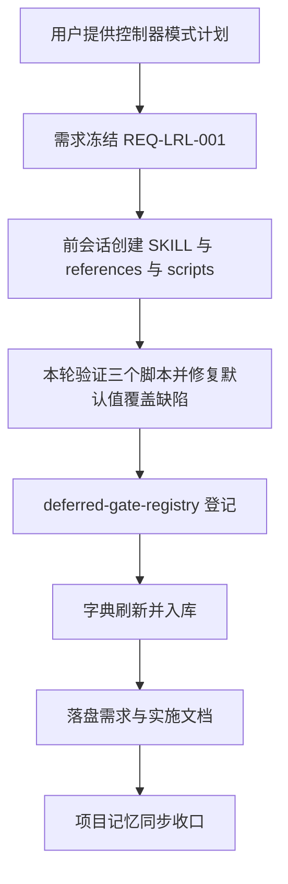
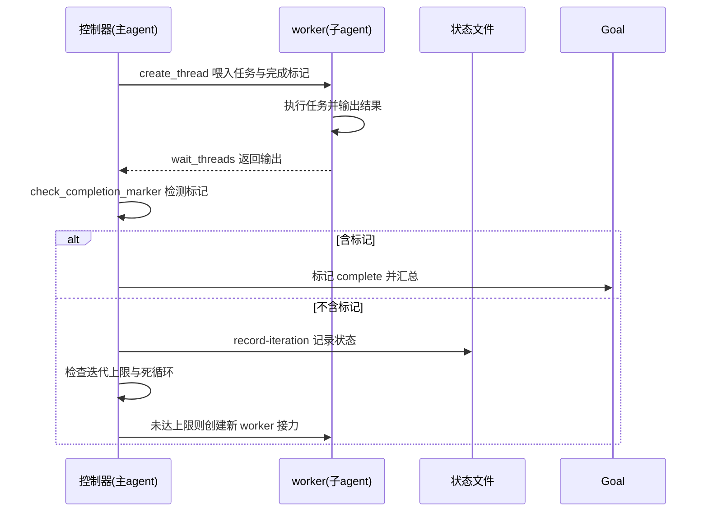

# 长任务自动循环 skill 创建

结论：新建 `long-run-loop-rules` skill，采用「主 agent 为控制器、子 agent 为工人」的线程接力模式，让 AI 持续工作直到任务真正完成。影响：新增一个 skill 目录及其 3 个 references、3 个 scripts，并在 `skill-hit-check-rules` 的延迟触发 gate 注册表登记、刷新 skill 字典。范围：仅 `long-run-loop-rules/` 目录、`skill-hit-check-rules/references/deferred-gate-registry.md`、`skill-dictionary/data.js` 与 `字典.md` 的本次生成差异。非范围：不改动 `autonomous-execution-rules` 的 L1 内部续跑路径，不改 `parallel-task-dispatch-rules` 的线程生命周期语义，不引入 CLI wrapper（纯 Desktop 环境可用）。变化：新增控制器模式、完成标记验证机制、三层递进架构（L1 内部续跑 / L2 线程接力 / L3 自动化监控）。完成标准：三个脚本语法与功能 smoke test 通过、完成标记检测与死循环检测符合预期、默认配置不被覆盖、字典刷新退出码 0 且入库、集成登记到位。术语说明：控制器 = 主 agent 只做管理决策不写业务代码；worker = 子 agent 执行实际任务并输出完成标记；完成标记 = worker 输出中表示任务真正完成的协议字符串。验证状态：本轮实施周期全部任务完成，脚本验证与门禁全部通过。

## 文档信息

| 字段 | 内容 |
|---|---|
| 文档 ID | `REQ-LRL-001` |
| 来源 | 用户提供的长任务自动循环 skill 创建计划（修订版 v2） |
| 当前周期 | `CYCLE-LRL-01` |
| 取代关系 | 无；本 skill 为新增，L2 线程接力路径与既有 `autonomous-execution-rules` 的 L1 内部续跑路径独立并存 |
| unresolved_decisions | 无；原因：控制器模式、文件结构、脚本设计与集成方式均由用户计划明确，无未决决策 |

图片资产决策：N/A + 原因：无视觉验收 + 证据：本文 Mermaid 流程图与三层递进架构图覆盖关系。

## 普通模型零决策执行契约

- 触发有两条独立路径：路径 A——`create_goal` 成功且 Goal 仍为 active 且 objective 含完成标记，自动进入循环模式；路径 B——用户显式提出 goal 或使用 `/goal` 命令（即使平台无 Goal 目标模式）也触发，并按工具可用性降级到可用的循环机制（无线程工具则降级为 L1 内部续跑）。两条路径都缺时不自动循环。
- 完成标记默认格式为 XML 包裹式（如 `promise DONE promise` 的标签写法），兼容 `##LOOP_DONE##` 与 `COMPLETE` 两种格式。
- 默认 `max_iterations = 50`，可在 objective 中用 `--max-iterations` 覆盖；默认 `checkpoint_interval = 10`、`max_runtime_minutes = 480`。
- 状态文件遵循 `$CODEX_HOME/state/long-run-loop/<task-sha256>.json` 约定。
- 主 agent 在控制器模式下不直接写业务代码，这是 worker 的职责。
- 本轮不执行 Git 历史写入；改动停在已改动未提交状态。

## 需求来源与证据台账

| 来源 ID | 已确认事实 | 规则落点 | 证据 |
|---|---|---|---|
| `SRC-LRL-001` | 用户提供控制器模式设计、文件结构、脚本详细设计、集成点、测试计划与假设默认值。 | `long-run-loop-rules/` 全部文件、deferred-gate-registry、字典 | 当前用户消息（修订版 v2 计划） |

## 变更范围

| 分类 | 内容 |
|---|---|
| 变更目标 | 新建 `long-run-loop-rules` skill，实现长任务跨线程自动循环与完成标记验证。 |
| 新增 | `long-run-loop-rules/SKILL.md`、3 个 references、3 个 scripts。 |
| 修改 | `skill-hit-check-rules/references/deferred-gate-registry.md` 追加登记；`skill-dictionary/data.js` 与 `字典.md` 重新生成。 |
| 保持不变 | `autonomous-execution-rules` L1 内部续跑、`parallel-task-dispatch-rules` 线程生命周期语义、`continuous-code-quality-supervisor-rules` 监控模式。 |
| 非范围 | 不引入 CLI wrapper，不新增对 create_thread / wait_threads 之外的平台依赖，不迁移业务项目，不执行 Git 提交。 |

## 目标与非目标

| 分类 | 内容 |
|---|---|
| 目标 | 控制器模式下主 agent token 只用于管理决策，实际工作由 worker 消耗，可跑更多轮次。 |
| 目标 | 提供完成标记检测、死循环检测、迭代上限三条安全机制。 |
| 目标 | 与既有 skill 完成集成并刷新字典。 |
| 非目标 | 不修改 L1 内部续跑路径，不替换现有线程生命周期管理。 |
| 非目标 | 不实现真实的跨进程调度，不依赖 CLI wrapper。 |

## 决策冻结

| 决策 ID | 结论 |
|---|---|
| `DEC-LRL-001` | 采用「主 agent 控制器 + worker 子 agent」架构，主 agent 不写业务代码。 |
| `DEC-LRL-002` | 完成标记默认格式为 XML 包裹式，兼容 `##LOOP_DONE##` 与 `COMPLETE`。 |
| `DEC-LRL-003` | 默认 `max_iterations = 50`，`checkpoint_interval = 10`，`max_runtime_minutes = 480`。 |
| `DEC-LRL-004` | 状态文件放 `$CODEX_HOME/state/long-run-loop/`，与 continuous-code-quality-supervisor-rules 约定一致。 |
| `DEC-LRL-005` | L2 线程接力与 L1 内部续跑是独立路径，不冲突；字典中以「扩展种子」入库，与 autonomous-execution-rules 一致。 |
| `DEC-LRL-006` | 触发条件增加「路径 B：用户显式 goal 意图」——用户提出 goal 或使用 `/goal` 命令即触发，即使平台无 Goal 目标模式（无 `create_goal` 工具）也应触发并降级到可用循环机制。 |

## 规则与验收

| ID | 要求 | 验收 |
|---|---|---|
| `RULE-LRL-001` | `check_completion_marker.py` 能精确/正则匹配完成标记。 | 含标记返回 found=true，不含返回 found=false。 |
| `RULE-LRL-002` | `loop_controller.py` 支持 start/record-iteration/status/stop 状态机。 | 完整流程跑通，默认值不被 None 覆盖。 |
| `RULE-LRL-003` | `detect_dead_loop.py` 能识别无实质进展的循环。 | 重复产出判死循环，有实质进展不判。 |
| `RULE-LRL-004` | deferred-gate-registry 追加 `long-run-loop-rules` 登记。 | 表内存在该行，触发检查点为中段推进。 |
| `RULE-LRL-005` | 字典重新生成，`long-run-loop-rules` 入库。 | 生成器退出码 0，data.js 与字典.md 均含该 skill。 |

- `AC-LRL-001`：三个脚本 `py_compile` 通过，功能 smoke test 覆盖测试计划的场景 2/4/5。
- `AC-LRL-002`：`check_completion_marker.py` 含标记/不含标记/regex 三种输入结果正确。
- `AC-LRL-003`：`loop_controller.py` start 传入 `--max-iterations` 时，未传的 `checkpoint_interval` 与 `max_runtime_minutes` 保留默认值（10 / 480）。
- `AC-LRL-004`：`detect_dead_loop.py` 对重复产出返回 `dead_loop=true`，对有实质进展返回 `dead_loop=false`。
- `AC-LRL-005`：字典生成退出码 0，`long-run-loop-rules` 以「扩展种子」入库，`seed_total` 由 34 增至 35。

## 功能需求

本 skill 提供三层递进：L1 内部续跑复用 `autonomous-execution-rules`；L2 线程接力跑是核心，主 agent 作为控制器创建 worker、检测完成标记、未完成则接力续跑、达上限或死循环则标记 blocked；L3 自动化监控集成 `continuous-code-quality-supervisor-rules`。控制器职责链为：解析任务提取标记 -> 创建 worker -> wait_threads 等待 -> 检测完成标记 -> 含标记则 Goal complete、不含则迭代加一并检查上限 -> 每轮汇总写入状态文件。

## 数据与外部契约

- 脚本使用纯标准库（argparse/json/os/sys/hashlib/re/datetime），无第三方依赖，managed Python 3.13 可直接运行。
- 状态文件为 UTF-8 JSON，字段含 `goal_objective`、`completion_marker`、`config`、`current_iteration`、`worker_thread_ids`、`worker_summaries`、`total_cost_estimate`、`dead_loop_count`、`status`。
- 测试只使用本地 Python、临时 `CODEX_HOME` 目录与 sha256 测试哈希，不连接数据库、缓存或外部服务。

## 风险、假设、依赖与阻断

| 类型 | 内容 | 处理 |
|---|---|---|
| 风险 | 完成标记误匹配普通字符串。 | 默认 XML 包裹式格式，检测脚本支持精确/正则两种模式。 |
| 风险 | 无限循环耗尽 API 账单。 | max_iterations、max_runtime、成本预警、速率限制四重硬限制。 |
| 假设 | `create_thread` 与 `wait_threads` 工具可用。 | 脚本与 SKILL.md 均保留「工具不可用降级为 L1 内部续跑」的兜底。 |
| 假设 | 完成标记默认 `<promise>...</promise>` 与 easy-vibe 页面推荐一致。 | 同时兼容 `##LOOP_DONE##` 与 `COMPLETE`。 |
| 阻断 | 需要真实 Goal 环境验证控制器模式启动。 | 脚本级 smoke test 覆盖可验证部分，控制器运行时行为留待真实 Goal 环境验证。 |

## 垂直切片与追踪契约

需求冻结 -> 三个脚本验证与修复 -> 集成点登记 -> 字典刷新 -> 落盘文档 -> 项目记忆同步。每个最小任务均登记 IMPL、TEST 两类证据。

## 主追踪矩阵

| 上游 | 规则 | AC | 周期/任务 | 文件/符号 | 测试/证据 |
|---|---|---|---|---|---|
| `SRC-LRL-001` | `RULE-LRL-001..005` | `AC-LRL-001..005` | `CYCLE-LRL-01/TASK-LRL-01..05` | `long-run-loop-rules/scripts/*.py`、`deferred-gate-registry.md`、`skill-dictionary/data.js`、`字典.md` | smoke test 命令输出、生成器退出码 |

## 流程图

图形目的：表达从需求冻结到脚本验证、集成与收口的闭环。关联 ID：`REQ-LRL-001`、`RULE-LRL-001..005`。

## 时序图

图形目的：表达控制器模式下一轮循环的决策顺序。关联 ID：`DEC-LRL-001`、`TASK-LRL-01..05`。

## 追踪附录

| 影响对象 | 失效旧结论 | 本轮新结论 | 重验 Owner |
|---|---|---|---|
| `loop_controller.py` | start 传入单参数时未传参数被 None 覆盖 | 仅显式传入参数才覆盖默认值 | TASK-LRL-01 |
| `deferred-gate-registry.md` | 无 long-run-loop-rules 登记 | 追加中段推进条件登记 | TASK-LRL-03 |
| `skill-dictionary/data.js`、`字典.md` | seed_total 34 | seed_total 35，long-run-loop-rules 作为扩展种子入库 | TASK-LRL-04 |
