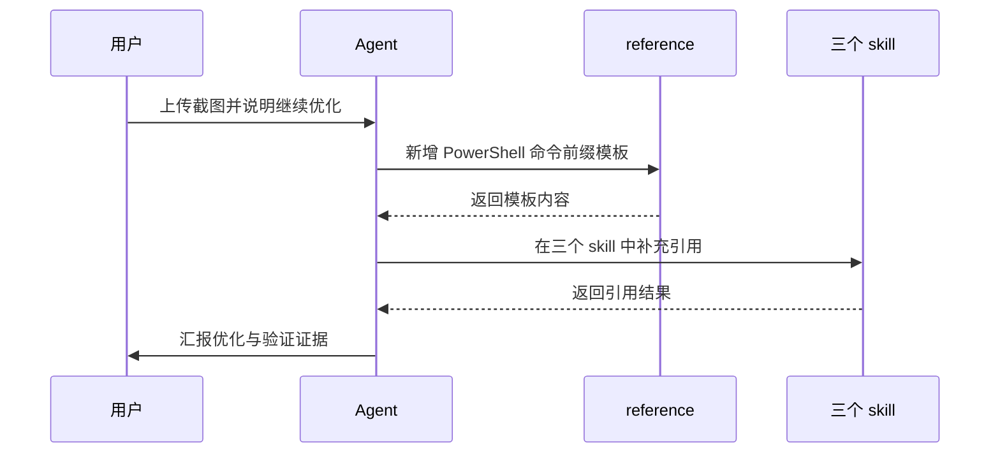

# PowerShell 控制继续优化

结论：本次把截图中的“调用 PowerShell 命令必须显式使用 `powershell.exe -NoProfile -ExecutionPolicy Bypass -Command` 并先设置 UTF-8 输出编码”这一规则，沉淀为可在三个 Windows skill 之间复用的标准调用前缀，并补齐三 skill 的衔接引用。影响：后续 agent 在 Windows 上运行 PowerShell 专项命令时，会先按统一前缀执行并保持中文不乱码，减少“命令能跑但输出乱码 / 命令前缀不一致”的问题。范围：只修改 `wsl-windows-bridge`、`windows-encoding-rules`、`windows-powershell-environment-rules` 三个 skill 的规则文档，并落盘需求、实施、测试与风格回归证据。非范围：不修改任何 PowerShell 脚本实现、不安装软件、不修改 `tool-manifest.yaml`、不新增 skill、不执行 Git 提交。变化：三份 skill 都能引用同一份“PowerShell 命令调用前缀模板”，其中 5.1 路径必须设置 UTF-8 编码，7 路径继续优先 `pwsh`。完成标准：三份 skill 文档新增引用且互相闭环，需求、实施总览、实施周期、测试、6-review 全部落盘并通过机器校验。术语说明：无技术术语需要解释；“标准调用前缀”指运行 PowerShell 一次命令时固定带 `-NoProfile -ExecutionPolicy Bypass -Command` 并显式设置输出编码的写法。验证状态：当前为已确认需求，实施计划随后落盘，真实测试以文档机器校验与脚本回读为准。

## 1. 文档信息

- 需求标题：PowerShell 控制继续优化
- 版本与状态：v1.0 / 已确认
- 需求来源：用户上传截图并说明“继续优化对于 PowerShell 的控制，我们有好几个优化 PowerShell 的 skill 规则，继续优化，也可以参考 workbuddy 中对于 PowerShell 优化的 skill 规则”
- 修订记录：
  - v1.0 / 2026-08-14 / 首次落盘 / 当前会话
- 来源对象标识：`REQ-PSCTL-20260814-001`
- 复杂度等级：L2
- 当前优先闭环：先把三份 skill 中缺失的“标准调用前缀模板”补上，再收口文档、测试与风格回归。

## 2. 当前计划最终方案简要说明

推荐方案：以 `wsl-windows-bridge/references/powershell-fallback-patterns.md` 为唯一真源，新增“PowerShell 命令前缀模板”章节，并在 `windows-encoding-rules/SKILL.md` 与 `windows-powershell-environment-rules/SKILL.md` 各自补充交叉引用。主落点：三份 skill 文档与一份 reference。为什么先走这条路线：当前三份 skill 对“何时进 PowerShell”和“进入后语法保底”描述较全，唯独缺少可复制粘贴的命令调用前缀，导致 5.1 路径的中文输出仍可能乱码。

## 3. Agent 对当前问题的理解

- 问题 / 目标：截图强调“调用 PowerShell 命令时必须显式使用 `powershell.exe -NoProfile -ExecutionPolicy Bypass -Command` 并设置 `[Console]::OutputEncoding`”，但三份 skill 都没有把这条规则固化为可直接复用的模板。
- 本轮范围：三份 skill 规则文档、一份 reference、需求 / 实施 / 测试 / 6-review 文档、`PROJECT_MEMORY.md` 与 skill 字典。
- 非范围：不修改 PowerShell 脚本实现、不安装软件、不新增 manifest 工具、不修改 `tool-manifest.yaml`、不执行 Git 提交。
- 当前优先闭环：落盘需求与实施文档，再按周期完成三份 skill 文档修改与收口。
- 关键假设 / 待确认点：用户明确授权继续优化三份 skill，并已允许参考 workbuddy；当前仓库未读取 git commit，以本地 skill 文件内容为基线。

## 3.1 决策冻结

| `DEC-*` | 决策问题 | 候选方案 | 选定方案 | 排除原因 | 影响面 | 回滚 |
| --- | --- | --- | --- | --- | --- | --- |
| `DEC-PSCTL-001` | 标准调用前缀以谁为唯一真源 | 三个 skill 各自写完整模板；只在 `powershell-fallback-patterns.md` 写一次，其他只引用 | 只在 reference 写一次，其他引用 | 三处重复会漂移，无法维护 | `wsl-windows-bridge`、`windows-encoding-rules`、`windows-powershell-environment-rules` | `ROLLBACK-PSCTL-001` |
| `DEC-PSCTL-002` | 5.1 路径是否需要 `[Console]::OutputEncoding` 前缀 | 需要；不需要 | 需要 | 5.1 默认 ANSI，中文输出会乱码 | `wsl-windows-bridge/references/powershell-fallback-patterns.md` | `ROLLBACK-PSCTL-002` |
| `DEC-PSCTL-003` | 是否同步修改 workbuddy 端 skill | 同步；不同步 | 不同步 | workbuddy 端与本地是同一份字节，同步会造成无意义双维护 | 无 | `ROLLBACK-PSCTL-003` |

## 3.2 普通模型零决策执行契约

- 本文档只定义“做什么”和“做到什么算完成”，不定义低层实现细节。
- 普通模型执行时不得自行补充范围、默认值、异常、权限、兼容、文件落点、测试断言或回滚边界；任何缺失项必须写 `N/A + 原因 + 证据` 并回流需求域。
- 每个 `REQ-*` / `RULE-*` 必须能回指至少一个 `AC-*`，每个 `AC-*` 必须能回指实施计划或阻断原因。
- 需求文档未落盘或机器校验失败时，不得进入实施规划与编码。

## 3.3 垂直切片与追踪契约

- 垂直切片唯一归属：`SLICE-PSCTL-01` 为本需求当前优先切片，只归属 PowerShell 三 skill 规则补充，不与其他来源对象重复归属。
- 追踪契约：`SRC-* -> DEC-* -> REQ/RULE-* -> AC-* -> CYCLE-* -> TASK-* -> TEST-* -> EVIDENCE-*` 双向可追踪，详见第 13 章追踪矩阵。
- `unresolved_decisions`：无；所有真实不确定决策点已由用户确认。

## 4. 需求来源与证据台账

| 来源 ID | 来源类型 | 原文摘录 / 事实 | 证据路径 | 责任人 |
| --- | --- | --- | --- | --- |
| `SRC-PSCTL-001` | 用户会话 | “按照截图的内容，继续优化对于 powershell 的控制，我们有好几个优化 powershell 的 skill 规则，继续优化，也可以参考 workbuddy 中对于 powershell 优化的 skill 规则” | 当前会话 | 用户 |
| `SRC-PSCTL-002` | 用户上传截图 | 调用 PowerShell 命令时必须显式使用 `powershell.exe -NoProfile -ExecutionPolicy Bypass -Command "[Console]::OutputEncoding=[System.Text.Encoding]::UTF8; ..."` | 截图 `codex-clipboard-cca64d06-...png` | 用户 |
| `SRC-PSCTL-003` | 本地 skill | `wsl-windows-bridge/references/powershell-fallback-patterns.md` 已有语法保底与编码规则，但缺少调用前缀模板 | 本地 skill 文件 | 本地 |
| `SRC-PSCTL-004` | 本地 skill | `windows-encoding-rules/SKILL.md` 已要求 PowerShell 显式 UTF-8，但未给出调用前缀模板 | 本地 skill 文件 | 本地 |
| `SRC-PSCTL-005` | 本地 skill | `windows-powershell-environment-rules/SKILL.md` 已管理 PowerShell 7 与工具恢复，但未把 inline 调用前缀写入 | 本地 skill 文件 | 本地 |
| `SRC-PSCTL-006` | workbuddy 缓存 | workbuddy 端 `windows-powershell-environment-rules` 与本地同一份内容，无额外 PowerShell 优化规则 | `C:\Users\luode\.workbuddy\skills\windows-powershell-environment-rules` | workbuddy |

## 5. 目标与非目标

| ID | 目标 | 验收回指 |
| --- | --- | --- |
| `REQ-PSCTL-001` | 在 `powershell-fallback-patterns.md` 新增“PowerShell 命令前缀模板”章节，给出 5.1 与 7 双轨最小片段 | `AC-PSCTL-001` |
| `REQ-PSCTL-002` | 在 `wsl-windows-bridge/SKILL.md` 的 PowerShell 专项保底模式中暴露该模板引用 | `AC-PSCTL-002` |
| `REQ-PSCTL-003` | 在 `windows-encoding-rules/SKILL.md` 增加调用前缀与交叉引用，确保 5.1 中文输出不乱码 | `AC-PSCTL-003` |
| `REQ-PSCTL-004` | 在 `windows-powershell-environment-rules/SKILL.md` 增加 inline 调用前缀拦截指针 | `AC-PSCTL-004` |
| `REQ-PSCTL-005` | 同步 `PROJECT_MEMORY.md` 稳定规则与 skill 字典，收口文档、测试与 6-review | `AC-PSCTL-005` |
| `BOUND-PSCTL-001` | 非范围：不修改 PowerShell 脚本实现、不安装软件、不新增 manifest 工具、不修改 `tool-manifest.yaml`、不执行 Git 提交 | `AC-PSCTL-005` |

## 6. 角色、权限与责任

| ID | 角色 | 责任 | 权限边界 |
| --- | --- | --- | --- |
| `REQ-PSCTL-010` | 用户 | 确认优化方向与实施授权 | 有权停止、变更范围 |
| `REQ-PSCTL-011` | 主 agent | 落盘需求与实施文档、按周期执行实现与测试、收口 6-review | 不得在未落盘计划前进入编码 |
| `REQ-PSCTL-012` | artifact gate | 校验需求、实施、周期、测试、6-review 文档 | 校验失败必须回流，不得口头放行 |

## 7. 功能需求

| ID | 需求陈述 | 触发条件 / 输入 | 处理规则 | 输出 / 结果 | 异常与边界 | 验收回指 |
| --- | --- | --- | --- | --- | --- | --- |
| `REQ-PSCTL-001` | `powershell-fallback-patterns.md` 新增“PowerShell 命令前缀模板” | 进入 PowerShell 专项场景 | 在 reference 中新增 5.1 与 7 双轨片段，5.1 必须包含 `[Console]::OutputEncoding` 初始化 | 可直接复制的调用前缀 | 5.1 前缀缺编码初始化则不合格 | `AC-PSCTL-001` |
| `REQ-PSCTL-002` | `wsl-windows-bridge/SKILL.md` 暴露模板引用 | 读取 SKILL.md 的 PowerShell 专项保底模式 | 在既有保底模式章节追加一句交叉引用 | 读者可跳到 reference | 引用断链则不合格 | `AC-PSCTL-002` |
| `REQ-PSCTL-003` | `windows-encoding-rules/SKILL.md` 补充调用前缀与交叉引用 | 编码 skill 被命中 | 新增一节与 reference 保持一致的调用前缀，并在末尾交叉引用 | 编码侧可复制同一前缀 | 与 reference 不一致则不合格 | `AC-PSCTL-003` |
| `REQ-PSCTL-004` | `windows-powershell-environment-rules/SKILL.md` 补充入口拦截指针 | 环境 skill 被命中 | 在默认边界后追加一句 inline 调用指针 | 环境侧可找到 reference | 指针缺失则不合格 | `AC-PSCTL-004` |
| `REQ-PSCTL-005` | 收口文档、测试与 6-review | 全部任务完成后 | 同步 `PROJECT_MEMORY.md`、刷新字典、落盘测试与 6-review | 机器校验与全量测试通过 | 任一校验失败则收口不成立 | `AC-PSCTL-005` |

## 8. 业务规则与优先级

| ID | 规则 | 优先级 | 默认值 / 例外 | 关联需求 |
| --- | --- | --- | --- | --- |
| `RULE-PSCTL-001` | 标准调用前缀只在 `powershell-fallback-patterns.md` 写一次，其他 skill 只引用 | P0 | 无 | `REQ-PSCTL-001` |
| `RULE-PSCTL-002` | 5.1 路径必须设置 `[Console]::OutputEncoding = [System.Text.Encoding]::UTF8`，7 路径优先 `pwsh` | P0 | 无 | `REQ-PSCTL-001`、`REQ-PSCTL-003` |
| `RULE-PSCTL-003` | 本轮不修改 workbuddy 端 skill，避免双维护 | P1 | 无 | `REQ-PSCTL-004` |

## 9. 数据与外部契约

- 数据来源：本地 skill 文件、用户上传截图。
- 外部项目代码引用：`N/A + 原因 + 证据`。原因：workbuddy 端 skill 只读参考且与本地同一份内容，不复制其代码或目录。证据：`SRC-PSCTL-006`。
- 兼容性：不修改三个 skill 的 description 与 `##` 级标题以外的稳定字段；如修改，按 `skill-dictionary/generate_dictionary.py` 刷新字典。

## 10. 状态、流程与时序

图形目的与关联 ID：此图为 PowerShell 调用前缀优化主流程图，关联 `REQ-PSCTL-001`、`REQ-PSCTL-002`、`REQ-PSCTL-003`、`AC-PSCTL-001`、`AC-PSCTL-002`、`AC-PSCTL-003`。

图形目的与关联 ID：此图为优化过程时序图，关联 `SRC-PSCTL-001`、`SRC-PSCTL-002`、`REQ-PSCTL-001`。

## 10.1 图片资产决策

- 图片资产决策：`N/A + 原因 + 证据`。原因：本需求不涉及 UI、截图或位图资产；流程与时序已由 Mermaid 表达。证据：第 10 章已含 flowchart 与 sequenceDiagram。

## 11. 非功能与运营约束

- 可维护性：三份 skill 引用同一份 reference，避免重复维护。
- 可观测性：新增内容必须能被 `Select-String` 或 `rg` 检索到。
- 安全与合规：不复制 workbuddy 版权文本，仅吸收思想并用中文表达。
- 回滚：任何 skill 正文修改均可按 `git diff` 回退；文档证据按 `doc/` 目录保留。

## 12. 风险、假设、依赖与阻断

| ID | 风险 / 阻断 | 触发证据 | 缓解 / 恢复 |
| --- | --- | --- | --- |
| `GAP-PSCTL-001` | 文档机器校验失败 | 校验脚本退出码非 0 | 修复文档结构与图注后再进入实施 |
| `GAP-PSCTL-002` | skill 字典刷新失败 | 字典脚本退出码非 0 | 修复字典脚本或回退相关改动 |
| `GAP-PSCTL-003` | 三份 skill 内容不一致 | 三份引用无法互相解析 | 回到唯一真源统一后再收口 |

## 13. 追踪矩阵

| `SRC-*` | `DEC-*` | `REQ-*` / `RULE-*` | `AC-*` | `CYCLE-*` | `TASK-*` | `TEST-*` | `EVIDENCE-*` |
| --- | --- | --- | --- | --- | --- | --- | --- |
| `SRC-PSCTL-002` | `DEC-PSCTL-002` | `REQ-PSCTL-001` | `AC-PSCTL-001` | `CYCLE-PSCTL-01` | `TASK-PSCTL-02` | `TEST-PSCTL-02` | `EVD-TASK-PSCTL-02-IMPL` / `EVD-TASK-PSCTL-02-TEST` / `EVD-TASK-PSCTL-02-STYLE` |
| `SRC-PSCTL-003` | `DEC-PSCTL-001` | `REQ-PSCTL-002` | `AC-PSCTL-002` | `CYCLE-PSCTL-01` | `TASK-PSCTL-03` | `TEST-PSCTL-03` | `EVD-TASK-PSCTL-03-IMPL` / `EVD-TASK-PSCTL-03-TEST` / `EVD-TASK-PSCTL-03-STYLE` |
| `SRC-PSCTL-004` | `DEC-PSCTL-001` | `REQ-PSCTL-003` | `AC-PSCTL-003` | `CYCLE-PSCTL-01` | `TASK-PSCTL-04` | `TEST-PSCTL-04` | `EVD-TASK-PSCTL-04-IMPL` / `EVD-TASK-PSCTL-04-TEST` / `EVD-TASK-PSCTL-04-STYLE` |
| `SRC-PSCTL-005` | `DEC-PSCTL-001` | `REQ-PSCTL-004` | `AC-PSCTL-004` | `CYCLE-PSCTL-01` | `TASK-PSCTL-05` | `TEST-PSCTL-05` | `EVD-TASK-PSCTL-05-IMPL` / `EVD-TASK-PSCTL-05-TEST` / `EVD-TASK-PSCTL-05-STYLE` |
| `SRC-PSCTL-006` | `DEC-PSCTL-003` | `REQ-PSCTL-005` | `AC-PSCTL-005` | `CYCLE-PSCTL-01` | `TASK-PSCTL-06` | `TEST-PSCTL-06` | `EVD-TASK-PSCTL-06-IMPL` / `EVD-TASK-PSCTL-06-TEST` / `EVD-TASK-PSCTL-06-STYLE` |
