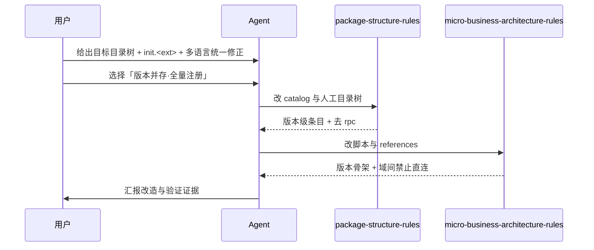

# 目录树多版本改造：多语言统一 · 去除 rpc

结论：本次把微业务/后端源码根的目录规范从「`business/<domain>` 平铺九类目录（router/controller 在源码根，域内 api/service/entity/base/constant/init/crontask/util/rpc）」改为「`<source-root>/<domain>` 直连源码根，`router/`/`controller/`/`entity/`/`service/` 各自内含版本目录 `<v?>`」，同时**完全移除 `rpc/` 跨业务公开入口**。影响：业务相关逻辑通过四类版本化目录各自的 `<v?>`（`v1`、`v2`…）隔离，版本目录从 v1 起递增，包名用 `v?router`/`v?controller`/`v?entity`/`v?service` 别名引用；域级通用目录为 `api/`、`base/`、`constant/`、`util/`（去掉域级 `crontask/`）；`init/` 目录收敛为单文件 `init.<ext>`（`<ext>` 为语言扩展名，Go=`.go`），由该入口全量注册本域所有版本路由，`/v1`、`/v2` 前缀区分、多版本并存对外；业务域之间禁止直接 import，跨域共享仅走根 `common/` 与 `global/`。范围：只修改 `package-structure-rules`（目录唯一 Owner）与 `micro-business-architecture-rules`（业务隔离 + 版本语义 Owner）两个 skill 的全部相关文件，并落盘需求、实施、测试与 6-review 证据。非范围：不为 Go 单独立一棵 `internal/` 树（四门语言用 `<source-root>` 占位符统一表达）、不新增旧版本冻结/只读检查、不迁移历史 `doc/3-实施/` 已有文档、不执行 Git 提交。变化：目录树去掉 `business/` 中间层，`router/`/`controller/` 从源码根下沉到业务域内并各自内含版本目录 `<v?>`，`entity/`/`service/` 同样各自内含 `<v?>`，删除 `rpc/` 与域级 `crontask/`，`init/` 目录收敛为单文件 `init.<ext>`。完成标准：两个 skill 的全部相关文件同步版本化口径并去掉 rpc 与域级 crontask，`placement_catalog.py query --artifact business-rpc` 失败关闭、`query --artifact router` 返回版本级条目（`<source-root>/<domain>/router/<v?>`），`micro_business.py scaffold` 产出版本骨架（`entity/v1`、`router/v1`、`controller/v1`、`service/v1`）+ 单文件 `init.go`、`check --detect-new` 三态判定可用，需求、实施总览、测试、6-review 全部落盘并通过机器校验。术语说明：`<source-root>` 指当前语言唯一源码根占位符（Go=`internal/`、Java=`src/main/java/<包>`、Node=`src/`、Python=`src/<包>`）；`<v?>` 解析为 `v[0-9]+`（从 `v1` 起）；「版本并存·全量注册」指 `init.<ext>` 注册本域所有版本路由且旧版本不因新版本诞生而下线。验证状态：当前为已确认需求，实施已推进至代码与测试，本文档用于冻结验收与追踪，真实测试以脚本命令与机器校验为准。

## 1. 文档信息

- 需求标题：目录树多版本改造：多语言统一 · 去除 rpc
- 版本与状态：v1.0 / 已确认
- 需求来源：用户给出原始目录树与目标新目录树（`<source-root>/<domain>/<v?>`），并追加「`init/` 改成单文件 `init.<ext>`」「`<source-root>/` 不用专门为 Go 定目录树」两条修正；版本路由方案经用户选择确认为「版本并存·全量注册」；最终用户再次推翻上一版域级 `<v?>` 设计，改为 `<v?>` 下沉到 `router/`/`controller/`/`entity/`/`service/` 各自内部并去掉域级 `crontask/`。
- 修订记录：
  - v1.0 / 2026-08-18 / 首次落盘 / 当前会话
- 来源对象标识：`REQ-DVT-20260818-001`
- 复杂度等级：L2
- 当前优先闭环：先把两个 skill 的机器事实源、人工目录树与 language reference、业务隔离脚本全量改到版本化口径并去 rpc，再收口测试、字典与 6-review。

## 2. 当前计划最终方案简要说明

推荐方案：`package-structure-rules` 的 `placement-catalog.yaml` + `placement_catalog.py` 作为唯一机器事实源先行（改 `router`/`controller` 为版本级条目、删 `business-rpc`），随后同步人工目录树 `project-layout-v2.md`、各语言 reference 与 `SKILL.md`；`micro-business-architecture-rules` 全量改脚本 `micro_business.py`（版本目录骨架 + 单文件 init + `--detect-new`）与全部 reference/templates。主落点：两个 skill 共约 15 个文件。为什么先走这条路线：机器事实源与检查脚本先行，可让后续人工文档与脚本行为以机器输出为锚，避免口径漂移；业务隔离脚本是版本语义的落地者，需与目录 Owner 同步收口。

## 3. Agent 对当前问题的理解

- 问题 / 目标：旧目录树 `business/<domain>` 平铺九类目录，`router`/`controller` 挂在源码根、`rpc/` 承担跨业务唯一公开入口，既不能按版本隔离业务逻辑，又引入了一套 JSON 字符串通信范式；需要改造为版本目录隔离并彻底去掉 rpc。
- 本轮范围：`package-structure-rules`、`micro-business-architecture-rules` 两个 skill 的全部相关文件，需求/实施/测试/6-review 文档，`PROJECT_MEMORY.md`、skill 字典、仓库级同步（`编码skill.md`/`README.md`）。
- 非范围：不为 Go 单独立 `internal/` 树、不新增旧版本冻结检查、不迁移历史 `doc/3-实施/` 文档、不执行 Git 提交、不改动其他兄弟 skill。
- 当前优先闭环：机器事实源与脚本、人工目录树、业务隔离脚本三线收口，再落测试与 6-review。
- 关键假设 / 待确认点：版本路由采用「版本并存·全量注册」已由用户确认；`init.<ext>` 的 `<ext>` 按当前语言扩展名取值；无其他真实不确定决策点。

## 3.1 决策冻结

| `DEC-*` | 决策问题 | 候选方案 | 选定方案 | 排除原因 | 影响面 | 回滚 |
| --- | --- | --- | --- | --- | --- | --- |
| `DEC-DVT-001` | 业务域与源码根的关系 | 保留 `business/<domain>` 中间层；业务域直连源码根 | 业务域直连源码根 | 中间层无信息量，且需为四门语言各定一棵树 | `package-structure-rules`、`micro-business-architecture-rules` | `ROLLBACK-DVT-001` |
| `DEC-DVT-002` | 跨业务通信入口 | 保留 `rpc/` 唯一公开入口；移除 rpc 改为域间禁止直连 | 移除 rpc，域间禁止直连 | JSON 字符串通信范式维护成本高，且与版本目录语义冲突 | 两 skill 全部 reference/scripts/templates | `ROLLBACK-DVT-002` |
| `DEC-DVT-003` | 域初始化入口形态 | `init/` 目录；单文件 `init.<ext>` | 单文件 `init.<ext>` | 初始化入口只需一个文件，目录无必要 | `micro_business.py scaffold`、`placement_catalog.py expand_init_path` | `ROLLBACK-DVT-003` |
| `DEC-DVT-004` | 是否单为 Go 定目录树 | 单独 `internal/` 树；`<source-root>` 占位符多语言统一 | `<source-root>` 占位符多语言统一 | 单语言树无法复用，四语言漂移 | 目录树与 language reference | `ROLLBACK-DVT-004` |
| `DEC-DVT-005` | 版本路由策略 | 版本并存·全量注册；单一活跃版本 | 版本并存·全量注册 | 支持灰度与向后兼容，旧版本不因新版本下线 | `init.<ext>` 语义、`placement-catalog.yaml` | `ROLLBACK-DVT-005` |
| `DEC-DVT-006` | 旧版本是否冻结 | 冻结旧版本只读；各版本可演进 | 各版本可演进，不冻结 | 冻结需额外只读检查，且与并存注册矛盾 | 目录树语义、脚本 | `ROLLBACK-DVT-006` |
| `DEC-DVT-007` | 版本目录位置 | 域级共享 `<v?>/` 内含四类；`<v?>` 下沉到 `router/`/`controller/`/`entity/`/`service/` 各自内部 | `<v?>` 下沉到四类目录各自内部 | 域级共享版本层会迫使非版本化目录与版本目录混层，包名与目录难以一一对应 | 目录树、catalog 路径、scaffold、reference | `ROLLBACK-DVT-007` |

## 3.2 普通模型零决策执行契约

- 本文档只定义「做什么」和「做到什么算完成」，不定义低层实现细节。
- 普通模型执行时不得自行补充范围、默认值、异常、权限、兼容、文件落点、测试断言或回滚边界；任何缺失项必须写 `N/A + 原因 + 证据` 并回流需求域。
- 每个 `REQ-*` / `RULE-*` 必须能回指至少一个 `AC-*`，每个 `AC-*` 必须能回指实施计划或阻断原因。
- 需求文档未落盘或机器校验失败时，不得进入实施规划与编码。

## 3.3 垂直切片与追踪契约

- 垂直切片唯一归属：`SLICE-DVT-01` 为本需求当前优先切片，只归属目录树多版本改造与去 rpc，不与其他来源对象重复归属。
- 追踪契约：`SRC-* -> DEC-* -> REQ/RULE-* -> AC-* -> CYCLE-* -> TASK-* -> TEST-* -> EVIDENCE-*` 双向可追踪，详见第 13 章追踪矩阵。
- `unresolved_decisions`：无；所有真实不确定决策点（版本路由策略）已由用户选择确认。

## 4. 需求来源与证据台账

| 来源 ID | 来源类型 | 原文摘录 / 事实 | 证据路径 | 责任人 |
| --- | --- | --- | --- | --- |
| `SRC-DVT-001` | 用户会话 | 用户给出原始目录树与目标新目录树（`<source-root>/<domain>/<v?>`），要求去掉 `business/` 中间层、用版本目录隔离业务逻辑；最终版 `<v?>` 下沉到 `router/`/`controller/`/`entity/`/`service/` 各自内部，去掉域级 `crontask/` | 当前会话 | 用户 |
| `SRC-DVT-002` | 用户会话 | 「`init/` 这个改成 `init.<ext>` 用单文件做初始化入口就行了」 | 当前会话 | 用户 |
| `SRC-DVT-003` | 用户会话 | 「`<source-root>/` 这个不改，不用专门为 Go 做目录树」 | 当前会话 | 用户 |
| `SRC-DVT-004` | 用户选择 | 版本路由方案选择「版本并存·全量注册」 | 当前会话选择记录 | 用户 |
| `SRC-DVT-005` | 本地 skill | `package-structure-rules/references/placement-catalog.yaml` 含 `backend.router`/`backend.controller`/`backend.business-rpc` 条目 | 本地 skill 文件 | 本地 |
| `SRC-DVT-006` | 本地 skill | `micro-business-architecture-rules/scripts/micro_business.py` 含 `BUSINESS_IMPORT_RE` 与 `--with-rpc` 白名单 | 本地 skill 文件 | 本地 |

## 5. 目标与非目标

| ID | 目标 | 验收回指 |
| --- | --- | --- |
| `REQ-DVT-001` | `placement-catalog.yaml`/`placement_catalog.py` 改为版本级 router/controller、删除 business-rpc、`expand_init_path` 产出单文件 init | `AC-DVT-001` |
| `REQ-DVT-002` | `project-layout-v2.md` 与各 language reference、`SKILL.md` 同步 `<source-root>/<domain>/<artifact>/<v?>` 版本化口径并去 rpc 与域级 crontask | `AC-DVT-002` |
| `REQ-DVT-003` | `micro_business.py` 改建版本目录骨架 + 单文件 init + `--detect-new`，`check` 校验域间禁止直连 | `AC-DVT-003` |
| `REQ-DVT-004` | `micro-business-architecture-rules` 全部 reference/templates 去 rpc、改版本目录语义 | `AC-DVT-004` |
| `REQ-DVT-005` | 更新测试契约、跑全量测试、刷新字典、同步 `PROJECT_MEMORY.md` 与仓库级文档、落 6-review 并机器校验 | `AC-DVT-005` |
| `BOUND-DVT-001` | 非范围：不为 Go 单独立 `internal/` 树、不新增旧版本冻结检查、不迁移历史 `doc/3-实施/` 文档、不执行 Git 提交 | `AC-DVT-005` |

## 6. 角色、权限与责任

| ID | 角色 | 责任 | 权限边界 |
| --- | --- | --- | --- |
| `REQ-DVT-010` | 用户 | 确认目录树改造方向、修正 init 形态与多语言口径、选择版本路由方案 | 有权停止、变更范围 |
| `REQ-DVT-011` | 主 agent | 落盘需求与实施文档、按周期完成两个 skill 的修改与测试、收口 6-review | 不得在未落盘计划前进入编码 |
| `REQ-DVT-012` | artifact gate | 校验需求、实施、周期、测试、6-review 文档 | 校验失败必须回流，不得口头放行 |

## 7. 功能需求

| ID | 需求陈述 | 触发条件 / 输入 | 处理规则 | 输出 / 结果 | 异常与边界 | 验收回指 |
| --- | --- | --- | --- | --- | --- | --- |
| `REQ-DVT-001` | Catalog 机器事实源版本化并去 rpc | 查询/渲染/初始化 router、controller、entity、service、business-rpc | `router`/`controller`/`entity`/`service` canonical_path 改为 `<source-root>/<domain>/<artifact>/<v?>/...` 并加 `requires_domain`；删 `backend.business-rpc` 条目；`expand_init_path` 产出单文件 `init.<ext>` | 版本级条目可查询、business-rpc 查询失败关闭、init 产出单文件 | business-rpc 查询应返回非 0 退出码 | `AC-DVT-001` |
| `REQ-DVT-002` | 人工目录树与 language reference 版本化并去 rpc | 读取 `project-layout-v2.md`、`SKILL.md`、各语言 reference | `<source-root>` 段替换为多语言统一新树（保留 `<source-root>` 占位符），第 5 条改「域间禁止直连」，删除 rpc 口径 | 目录树与各语言 reference 一致无 rpc | 残留 `business/` 或 `rpc` 口径则不合格 | `AC-DVT-002` |
| `REQ-DVT-003` | 业务隔离脚本版本化并去 rpc | 运行 `micro_business.py scaffold`/`check` | `scaffold` 建域级通用目录（api/base/constant/util，无 crontask）+ 四类版本化目录（entity/router/controller/service 各自含 `v1/`）+ 单文件 `init.go`；`check` 校验域间禁止直连；新增 `--detect-new` 三态判定 | 版本骨架、违规拒绝、三态判定 | 跨域 import 应报违规并退出非 0 | `AC-DVT-003` |
| `REQ-DVT-004` | 业务隔离 reference/templates 去 rpc | 读取 `SKILL.md`、`references/*`、`templates/*` | 去 rpc 与 JSON 通信范式，改版本目录语义与依赖方向表 | reference/templates 与脚本口径一致 | 残留 rpc 字段或关系表则不合格 | `AC-DVT-004` |
| `REQ-DVT-005` | 测试、字典、同步与 6-review 收口 | 全部实现完成后 | 跑全量测试、刷新字典、同步 `PROJECT_MEMORY.md`/`编码skill.md`/`README.md`、落测试主文档与 6-review | 机器校验与相关测试通过 | 任一校验失败则收口不成立 | `AC-DVT-005` |

## 8. 业务规则与优先级

| ID | 规则 | 优先级 | 默认值 / 例外 | 关联需求 |
| --- | --- | --- | --- | --- |
| `RULE-DVT-001` | `<v?>` 解析为 `v[0-9]+`，从 `v1` 起，`service/` 必建；`<v?>` 位于 `entity/`/`router/`/`controller/`/`service/` 各自内部，包名用 `v?entity`/`v?router`/`v?controller`/`v?service` 别名引用 | P0 | 无 | `REQ-DVT-001`、`REQ-DVT-003` |
| `RULE-DVT-002` | 业务域之间禁止直接 import 对方任何目录，跨域共享仅走根 `common/` 与 `global/` | P0 | 无 rpc 例外 | `REQ-DVT-002`、`REQ-DVT-003`、`REQ-DVT-004` |
| `RULE-DVT-003` | 版本并存·全量注册：`init.<ext>` 注册本域所有版本路由，`/v1`、`/v2` 前缀区分，旧版本不因新版本下线 | P0 | 无 | `REQ-DVT-001`、`REQ-DVT-003` |
| `RULE-DVT-004` | 目录树用 `<source-root>` 占位符多语言统一，不单为 Go 定 `internal/` 树 | P0 | 无 | `REQ-DVT-002` |
| `RULE-DVT-005` | 各版本可演进，不冻结旧版本、不新增只读检查 | P1 | 无 | `REQ-DVT-002`、`REQ-DVT-003` |

## 9. 数据与外部契约

- 数据来源：本地两个 skill 的配置文件、脚本、reference、templates；用户会话给出的目标目录树与修正。
- 外部项目代码引用：`N/A + 原因 + 证据`。原因：本改造只改本仓库两个 skill，不复制任何外部项目代码或目录。证据：`SRC-DVT-001` 至 `SRC-DVT-006` 均为本仓库与用户会话来源。
- 兼容性：`placement-catalog.yaml` 为 JSON 兼容 YAML，保留 `forbidden_paths` 不变；`placement_catalog.py` 保留既有 `query`/`render`/`init`/`check` 子命令与退出码语义；`micro_business.py` 保留 `scaffold`/`check`/`init` 子命令，仅新增 `--version` 与 `--detect-new`、移除 `--with-rpc`。

## 10. 状态、流程与时序

图形目的与关联 ID：此图为目录树改造主流程图，关联 `REQ-DVT-001`、`REQ-DVT-002`、`REQ-DVT-003`、`REQ-DVT-004`、`AC-DVT-001`、`AC-DVT-002`、`AC-DVT-003`。

图形目的与关联 ID：此图为改造过程时序图，关联 `SRC-DVT-001`、`SRC-DVT-002`、`SRC-DVT-003`、`SRC-DVT-004`、`REQ-DVT-001`。

## 10.1 图片资产决策

- 图片资产决策：`N/A + 原因 + 证据`。原因：本需求不涉及 UI、截图或位图资产；流程与时序已由 Mermaid 表达。证据：第 10 章已含 flowchart 与 sequenceDiagram。

## 11. 非功能与运营约束

- 可维护性：机器事实源（catalog）与人工目录树、脚本行为三方一致，避免口径漂移。
- 可观测性：`placement_catalog.py query` 与 `micro_business.py check/scaffold --detect-new` 均可被命令行观测。
- 安全与合规：不复制外部项目代码，仅在本仓库两个 skill 内改造。
- 回滚：`ROLLBACK-DVT-001` 至 `ROLLBACK-DVT-006` 分别对应六个决策，可据 `git diff` 回退；无 Git 提交授权，改动停在「已改动未提交」。

## 12. 风险、假设、依赖与阻断

| ID | 风险 / 阻断 | 触发证据 | 缓解 / 恢复 |
| --- | --- | --- | --- |
| `GAP-DVT-001` | 文档机器校验失败 | 校验脚本退出码非 0 | 修复文档结构与图注后再进入实施 |
| `GAP-DVT-002` | 全量测试失败 | `run_python_tests.py` 出现与改动相关失败 | 确认失败项与本次改动无关或修复后重跑 |
| `GAP-DVT-003` | 脚本与文档口径不一致 | 查询/校验结果与 reference 冲突 | 以机器输出为锚，回到 catalog 统一后再收口 |

## 13. 追踪矩阵

| `SRC-*` | `DEC-*` | `REQ-*` / `RULE-*` | `AC-*` | `CYCLE-*` | `TASK-*` | `TEST-*` | `EVIDENCE-*` |
| --- | --- | --- | --- | --- | --- | --- | --- |
| `SRC-DVT-001` | `DEC-DVT-001` | `REQ-DVT-001` | `AC-DVT-001` | `CYCLE-DVT-01` | `TASK-DVT-02` | `TEST-DVT-02` | `EVD-TASK-DVT-02-IMPL` / `EVD-TASK-DVT-02-TEST` |
| `SRC-DVT-002` | `DEC-DVT-003` | `REQ-DVT-002` | `AC-DVT-002` | `CYCLE-DVT-01` | `TASK-DVT-03` | `TEST-DVT-03` | `EVD-TASK-DVT-03-IMPL` / `EVD-TASK-DVT-03-TEST` |
| `SRC-DVT-003` | `DEC-DVT-004` | `REQ-DVT-003` | `AC-DVT-003` | `CYCLE-DVT-01` | `TASK-DVT-04` | `TEST-DVT-04` | `EVD-TASK-DVT-04-IMPL` / `EVD-TASK-DVT-04-TEST` |
| `SRC-DVT-004` | `DEC-DVT-005` | `REQ-DVT-004` | `AC-DVT-004` | `CYCLE-DVT-01` | `TASK-DVT-04` | `TEST-DVT-04` | `EVD-TASK-DVT-04-IMPL` / `EVD-TASK-DVT-04-TEST` |
| `SRC-DVT-005` | `DEC-DVT-002` | `REQ-DVT-005` | `AC-DVT-005` | `CYCLE-DVT-01` | `TASK-DVT-05` | `TEST-DVT-05` | `EVD-TASK-DVT-05-IMPL` / `EVD-TASK-DVT-05-TEST` |
| `SRC-DVT-006` | `DEC-DVT-006` | `RULE-DVT-005` | `AC-DVT-005` | `CYCLE-DVT-01` | `TASK-DVT-06` | `TEST-DVT-06` | `EVD-TASK-DVT-06-IMPL` / `EVD-TASK-DVT-06-TEST` |
