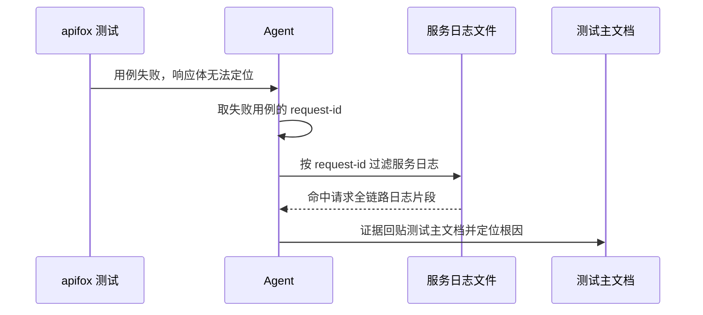

# 日志使用链路打通：写入 → 取证 → 定位

结论：本次把「日志使用」从只规定怎么写、补上怎么读和怎么用日志定位，形成"写入 → 取证 → 定位"的完整闭环。规则体系此前只管写日志一侧，读日志一侧只有零散习惯没有统一规则；本次新建一个读日志规则包作为唯一权威，并给写日志、bug 定位、接口测试三处既有规则补联动引用。
影响：今后所有靠日志分析推进的环节——bug 定位、接口测试失败排查、临时调试日志的使用与回收——都有统一规则可依；接口测试用例失败后必须去服务端日志取证据，不再止步于响应体。
范围：新建读日志规则包（含日志文件位置、级别切换、按请求编号反查、日志过滤取证、调试窗口纪律五项），并给写日志规则补可反查字段、给 bug 域与接口测试规则补读侧入口引用。
非范围：不改日志框架本身、不引入监控告警平台策略、不改错误处理机制、不重写既有规则主体、不做 Git 提交。
变化：新增"读日志"权威规则；写日志强制带可反查标识；接口测试失败后要求去服务端日志取证；测试脚本过程日志从可选项升级为默认要求。
完成标准：新规则包通过机器校验；写侧、bug 域、接口测试三处联动引用全部到位；字典、项目记忆与知识库同步；全量测试无本改动引入的新回归。
术语说明：request-id 指一次请求的唯一编号，用于从日志里反查这一请求经过的每一步；读侧指怎么取日志、怎么过滤、怎么定位；写侧指代码里怎么写日志；测试脚本过程日志指接口测试脚本在运行时打印的执行过程记录。
验证状态：本文档为已确认需求，实施按 4 个周期推进，真实测试以机器校验与语义检查为准。

## 1. 文档信息

- 需求标题：日志使用链路打通：写入 → 取证 → 定位
- 版本与状态：v1.0 / 已确认
- 需求来源：用户提出「bug 定位、测试调试、apifox 测试中对日志文件、调试日志、调试窗口打印日志的使用是如何规定的，很多步骤需要靠日志分析才能推进，有没有打通这个过程」；随后确认方案落盘推进。
- 修订记录：
  - v1.0 / 2026-08-25 / 首次落盘 / 当前会话
- 来源对象标识：`REQ-LOG-20260825-001`
- 复杂度等级：L2
- 当前优先闭环：先新建读日志规则包（周期 01），再补写读闭环与接口测试取证（周期 02/03），最后升级测试脚本过程日志并收口（周期 04）。

## 2. 当前计划最终方案简要说明

推荐方案：新建 `log-analysis-rules` 作为读日志侧唯一权威，把日志文件路径约定、DEBUG 级别切换与恢复、按 request-id 反查一次请求全链路、日志取证过滤、调试窗口使用与回收五件事收拢成一套规则（SKILL.md + 5 个 reference）；同时给写日志规则补「日志必须带可反查稳定标识」字段，给 bug 域两个规则补「查日志动作显式指向读侧入口」，给接口测试失败诊断补「第 5 步服务端取证」，并把测试脚本过程日志从「自查项」升级为「默认放行项」。为什么选这条路线：规则体系已有"单一权威 owner + 联动引用"的成熟模式（如 test-strategy-rules 被各 skill 引用），读日志侧照此办理最一致；纯补丁方案规则仍散落、没有唯一权威，只新建不联动则链路不闭合，二者都不如"新建 + 联动"。

## 3. Agent 对当前问题的理解

- 问题 / 目标：规则体系只管「怎么写日志」（logging-trace-rules 约束格式、字段、框架），不管「怎么读日志」——日志文件路径无约定、无按 request-id 反查的读取规范、DEBUG 级别切换无纪律、前端调试窗口打印无规定；apifox 失败诊断止于响应体，不要求去服务端日志取证；测试脚本过程日志只是软性自查项。导致"靠日志分析推进"的步骤实际无规则可依。
- 本轮范围：新建 `log-analysis-rules` skill；修改 `logging-trace-rules`、`bug-root-cause-rules`、`bug-intake-rules`、`test-program-rules`、`apifox-cli__skillhub/modules/testing-pitfalls.md`；落盘需求与实施文档；重跑 skill 字典；同步项目记忆与知识库；落 6-review。
- 非范围：不动日志框架本身与配置（如 logrus/zap 接入）、不引入监控告警平台策略（归监控域）、不改错误处理机制（归 error-handling-rules）、不重写既有 skill 主体结构、不做 Git 提交。
- 当前优先闭环：周期 01 新建读侧 skill + 周期 03 apifox 取证打通（用户痛点的两个核心）。
- 关键假设 / 待确认点：`[DEBUG-xxxx]` 唯一前缀标签沿用 bug 域既有约定；request-id 反查以既有 trace-propagation 原则为基础落地为可操作步骤；无其他真实不确定决策点。
- `unresolved_decisions`：无。

## 3.1 决策冻结

| `DEC-*` | 决策问题 | 候选方案 | 选定方案 | 排除原因 | 影响面 | 回滚 |
| --- | --- | --- | --- | --- | --- | --- |
| `DEC-LOG-001` | 读日志规则如何落地 | A 纯补丁（塞进既有 skill）/ B 只新建 skill / C 新建 + 联动 | C 新建 + 联动：新建 `log-analysis-rules` 作唯一权威，三处既有规则补引用 | 纯补丁规则仍散落、无唯一权威，没解决"没串成线"的本质；只新建不联动则没人走这条规则 | `log-analysis-rules`、`logging-trace-rules`、`bug-root-cause-rules`、`bug-intake-rules`、`test-program-rules`、apifox `testing-pitfalls.md` | `ROLLBACK-LOG-001`：删除新 skill 并还原四处补丁 |
| `DEC-LOG-002` | 测试脚本过程日志升级力度 | 保持自查项 / 默认放行项 / 硬阻断 | 默认放行项：默认必须输出过程日志，保留"实施计划冻结为硬判"出口 | 硬阻断会误伤不需要过程日志的简单脚本；保持自查项则约束太软 | `test-program-rules` | 同 `ROLLBACK-LOG-001` |
| `DEC-LOG-003` | 调试窗口纪律范围 | 只规定使用与回收纪律 / 延伸到前端代码规范（console.log 禁入生产） | 只规定使用与回收纪律 | 生产代码 console.log 禁令属写侧职责（logging-trace-rules），跨职责重叠 | `log-analysis-rules/references/debug-window-discipline.md` | 同 `ROLLBACK-LOG-001` |

## 3.2 普通模型零决策执行契约

- 本文档只定义「做什么」和「做到什么算完成」，不定义低层实现细节。
- 普通模型执行时不得自行补充范围、默认值、异常、权限、兼容、文件落点、测试断言或回滚边界；任何缺失项必须写 `N/A + 原因 + 证据` 并回流需求域。
- 每个 `REQ-*` / `RULE-*` 必须能回指至少一个 `AC-*`，每个 `AC-*` 必须能回指实施计划或阻断原因。
- 需求文档未落盘或机器校验失败时，不得进入实施规划与编码。

## 3.3 垂直切片与追踪契约

- 垂直切片唯一归属：`SLICE-LOG-01` 为本需求当前优先切片，只归属日志使用链路打通，不与其他来源对象重复归属。
- 追踪契约：`SRC-* -> DEC-* -> REQ/RULE-* -> AC-* -> CYCLE-* -> TASK-* -> TEST-* -> EVIDENCE-*` 双向可追踪，详见第 13 章追踪矩阵。
- `unresolved_decisions`：无；三个真实不确定决策点（方案形态、升级力度、窗口纪律范围）均按推荐方案采纳并经用户确认落盘推进。

## 4. 需求来源与证据台账

| 来源 ID | 来源类型 | 原文摘录 / 事实 | 证据路径 | 责任人 |
| --- | --- | --- | --- | --- |
| `SRC-LOG-001` | 用户会话 | 「对于 bug 定位、测试调试、apifox 测试中，对于日志文件、调试日志、调试窗口打印日志的使用，是如何规定的……很多步骤需要靠日志分析才能推进，我们有打通这个过程吗」 | 当前会话 | 用户 |
| `SRC-LOG-002` | 用户会话 | 用户对「新建 log-analysis-rules + 三处联动补丁」方案回复「开始落盘推进」 | 当前会话 | 用户 |
| `SRC-LOG-003` | 本地 skill | `logging-trace-rules` 只约束写日志（格式、字段、框架、trace-propagation 原则），无读取/反查操作约定 | `logging-trace-rules/SKILL.md` 与 `references/trace-propagation.md` | 本地 |
| `SRC-LOG-004` | 本地 skill | `bug-intake-rules/references/runtime-diagnostics.md` 有临时调试日志放置/清理规定，discovery 清单只说"查日志"没说怎么查 | `bug-intake-rules/references/*.md` | 本地 |
| `SRC-LOG-005` | 本地 skill | apifox `testing-pitfalls.md` 四层诊断止于响应体，无服务端日志取证步骤 | `apifox-cli__skillhub/modules/testing-pitfalls.md` | 本地 |
| `SRC-LOG-006` | 本地 skill | `test-program-rules` 定义 7 项最小过程日志但明示"默认自查项、非硬阻断" | `test-program-rules/SKILL.md` | 本地 |

## 5. 目标与非目标

| ID | 目标 | 验收回指 |
| --- | --- | --- |
| `REQ-LOG-001` | 新建 `log-analysis-rules` 作为读日志侧唯一权威：SKILL.md + 5 个 reference（日志文件位置、级别切换、request-id 反查、日志取证过滤、调试窗口纪律），通过 quick_validate 机器校验 | `AC-LOG-001` |
| `REQ-LOG-002` | `logging-trace-rules` 补充「日志字段必须含可反查稳定标识（request-id/订单号等）」规则，回应 trace-propagation 未落地的缺口 | `AC-LOG-002` |
| `REQ-LOG-003` | `bug-root-cause-rules` 与 `bug-intake-rules` 把「查日志」动作显式指向 `log-analysis-rules` 读侧入口 | `AC-LOG-003` |
| `REQ-LOG-004` | apifox `testing-pitfalls.md` 四层诊断后补「第 5 步服务端取证」：用例失败 → 按 request-id 去服务日志反查 → 证据回贴测试主文档 | `AC-LOG-004` |
| `REQ-LOG-005` | `test-program-rules` 将接口测试脚本过程日志从「自查项」升级为「默认放行项」，并指向 `log-analysis-rules` | `AC-LOG-005` |
| `BOUND-LOG-001` | 非范围：不改日志框架接入、不建监控告警策略、不改错误处理机制、不做 Git 提交 | `AC-LOG-005` |

## 6. 角色、权限与责任

| ID | 角色 | 责任 | 权限边界 |
| --- | --- | --- | --- |
| `REQ-LOG-010` | 用户 | 确认链路现状、拍板方案形态与两个力度决策 | 有权停止、变更范围 |
| `REQ-LOG-011` | 主 agent | 落盘需求与实施文档、按 4 周期完成新建与补丁、跑校验、收口 6-review | 不得在未落盘计划前进入编码 |
| `REQ-LOG-012` | artifact gate | 校验需求、实施、测试、6-review 文档 | 校验失败必须回流，不得口头放行 |

## 7. 功能需求

| ID | 需求陈述 | 触发条件 / 输入 | 处理规则 | 输出 / 结果 | 异常与边界 | 验收回指 |
| --- | --- | --- | --- | --- | --- | --- |
| `REQ-LOG-001` | 新建读日志规则包 | 触发信号：用户说"查日志/日志分析/根据日志定位"，或 bug/apifox 域需要取证 | SKILL.md 定义触发、进入流程、边界；5 个 reference 分别承载路径约定、级别切换、request-id 反查、取证过滤、窗口纪律；强制走框架日志、禁止把调试打印混入正式日志 | `log-analysis-rules/` 目录（SKILL.md + references/*.md） | 不代替 bug-root-cause 最终裁决；无控制台打印豁免 | `AC-LOG-001` |
| `REQ-LOG-002` | 写侧补可反查字段 | 任何新写或修改的日志语句 | 日志字段必须含可反查的稳定标识（request-id/订单号等），命名与 trace-propagation 约定一致 | `logging-trace-rules` 新增字段规则 | 纯本地任务无外部请求标识时写业务键 | `AC-LOG-002` |
| `REQ-LOG-003` | bug 域引用读侧入口 | bug 定位进入"查日志"环节 | 「查看现有日志」动作显式指向 `log-analysis-rules`（路径/过滤/反查步骤） | `bug-root-cause-rules`、`bug-intake-rules` 新增引用 | 不重复定义读侧步骤，只引用 | `AC-LOG-003` |
| `REQ-LOG-004` | 接口测试失败后服务端取证 | apifox 用例失败且四层诊断无法从响应体定位 | 新增第 5 步：按 request-id/trace-id 去本地服务日志反查，证据（日志片段）回贴测试主文档 | `testing-pitfalls.md` 更新四层诊断为五步 | 服务日志不可达时记录阻断并说明 | `AC-LOG-004` |
| `REQ-LOG-005` | 测试脚本过程日志默认放行 | 写接口测试脚本 | 最小过程日志清单（7 项）升级为默认必须输出；实施计划可冻结为硬判 | `test-program-rules` 状态升级并指向读侧 | 简单脚本经计划豁免可跳过 | `AC-LOG-005` |

## 8. 业务规则与优先级

| ID | 规则 | 优先级 | 默认值 / 例外 | 关联需求 |
| --- | --- | --- | --- | --- |
| `RULE-LOG-001` | 读日志动作统一走 `log-analysis-rules`，不允许各 skill 各自发明读日志步骤 | P0 | 无 | `REQ-LOG-001`、`REQ-LOG-003` |
| `RULE-LOG-002` | 日志字段必须含可反查稳定标识（request-id/订单号等），标识命名稳定、可被 grep 定位 | P0 | 纯本地无请求场景用业务键 | `REQ-LOG-002` |
| `RULE-LOG-003` | 临时调试日志必须带 `[DEBUG-xxxx]` 唯一前缀、走框架日志、定位后清理（沿用 bug 域既有约定） | P0 | 无 | `REQ-LOG-001`、`REQ-LOG-003` |
| `RULE-LOG-004` | apifox 用例失败后必须执行服务端取证，证据回贴测试主文档 | P1 | 服务日志不可达时记录阻断 | `REQ-LOG-004` |
| `RULE-LOG-005` | 测试脚本过程日志默认必须输出，计划冻结可升级硬判 | P1 | 简单脚本经计划豁免 | `REQ-LOG-005` |

## 9. 数据与外部契约

- 数据来源：本地既有 skill 资产（logging-trace-rules、bug-intake-rules、bug-root-cause-rules、test-program-rules、apifox-cli__skillhub）、用户会话确认的方案。
- 外部项目代码引用：`N/A + 原因 + 证据`。原因：本需求只改本仓库 skill 资产与文档，不复制或引用任何外部项目代码。证据：`SRC-LOG-001` 至 `SRC-LOG-006` 均为本仓库与用户会话来源。
- 兼容性：新建 skill 与既有 skill 并列存在，不替换任何既有规则；`[DEBUG-xxxx]` 前缀沿用 bug 域既有格式，保证 grep 回收逻辑不冲突；apifox 四层诊断保留原四层，新增第 5 步不改变既有步骤编号语义。

## 10. 状态、流程与时序

图形目的与关联 ID：此图为日志链路打通的实施主流程，关联 `REQ-LOG-001`、`REQ-LOG-002`、`REQ-LOG-003`、`REQ-LOG-004`、`REQ-LOG-005`。

图形目的与关联 ID：此图为一次典型"接口测试失败 → 日志取证"的时序，关联 `REQ-LOG-004`、`REQ-LOG-001`。

## 10.1 图片资产决策

- 图片资产决策：`N/A + 原因 + 证据`。原因：本需求为规则与文档型改造，不涉及 UI、截图或位图资产；流程与时序已由 Mermaid 表达。证据：第 10 章已含 flowchart 与 sequenceDiagram。

## 11. 非功能与运营约束

- 可维护性：读日志规则只在一处定义（log-analysis-rules），各 skill 引用不复制，避免口径漂移。
- 可观测性：request-id 反查、DEBUG 级别切换、日志过滤均有明确命令与步骤，可被人工与模型执行并核验。
- 安全与合规：不改日志框架与既有日志格式的向后兼容；不引入监控告警平台策略。
- 回滚：`ROLLBACK-LOG-001` 对应全部三个决策的还原路径；无 Git 提交授权，改动停在「已改动未提交」。

## 12. 风险、假设、依赖与阻断

| ID | 风险 / 阻断 | 触发证据 | 缓解 / 恢复 |
| --- | --- | --- | --- |
| `GAP-LOG-001` | 文档机器校验失败 | 校验脚本退出码非 0 | 修复文档结构与图注后再进入实施 |
| `GAP-LOG-002` | 新建 skill 与既有 skill 职责重叠 | 语义 grep 发现重复定义（如与 runtime-diagnostics 抢职责） | 读侧只做"取/读/定位"，临时调试日志放置与清理仍归 bug 域 |
| `GAP-LOG-003` | 全量测试出现新失败 | `run_python_tests.py` 出现与本次改动相关失败 | 确认失败项与本次改动无关或修复后重跑 |

## 13. 追踪矩阵

| 来源 / 完成条件 | 决策 | 需求 / 规则 | 周期 | 任务 | 文件 / 符号 | 测试 | 证据 | 状态 |
| --- | --- | --- | --- | --- | --- | --- | --- | --- |
| `SRC-LOG-001`/`AC-LOG-001` | `DEC-LOG-001` | `REQ-LOG-001`、`RULE-LOG-001` | `CYCLE-LOG-01` | `TASK-LOG-01` | `log-analysis-rules/SKILL.md` + `references/*.md` | `TEST-LOG-01` | `EVIDENCE-LOG-01` | 待实施 |
| `SRC-LOG-003`/`AC-LOG-002` | `DEC-LOG-001` | `REQ-LOG-002`、`RULE-LOG-002` | `CYCLE-LOG-02` | `TASK-LOG-02` | `logging-trace-rules/SKILL.md` | `TEST-LOG-02` | `EVIDENCE-LOG-02` | 待实施 |
| `SRC-LOG-004`/`AC-LOG-003` | `DEC-LOG-001` | `REQ-LOG-003`、`RULE-LOG-001` | `CYCLE-LOG-02` | `TASK-LOG-03` | `bug-root-cause-rules/SKILL.md`、`bug-intake-rules/SKILL.md` | `TEST-LOG-03` | `EVIDENCE-LOG-03` | 待实施 |
| `SRC-LOG-005`/`AC-LOG-004` | `DEC-LOG-001` | `REQ-LOG-004`、`RULE-LOG-004` | `CYCLE-LOG-03` | `TASK-LOG-04` | `apifox-cli__skillhub/modules/testing-pitfalls.md` | `TEST-LOG-04` | `EVIDENCE-LOG-04` | 待实施 |
| `SRC-LOG-006`/`AC-LOG-005` | `DEC-LOG-002` | `REQ-LOG-005`、`RULE-LOG-005` | `CYCLE-LOG-04` | `TASK-LOG-05` | `test-program-rules/SKILL.md` | `TEST-LOG-05` | `EVIDENCE-LOG-05` | 待实施 |
| `BOUND-LOG-001` | `DEC-LOG-003` | 非范围声明 | `CYCLE-LOG-04` | `TASK-LOG-06` | 字典/记忆/知识库/6-review | `TEST-LOG-06` | `EVIDENCE-LOG-06` | 待实施 |

`AC-*` 完成条件冻结：`AC-LOG-001` 新 skill 通过 quick_validate；`AC-LOG-002` 写侧字段规则落地且 grep 可查；`AC-LOG-003` 两处 bug skill 显式引用读侧入口；`AC-LOG-004` 四层诊断含第 5 步取证；`AC-LOG-005` 过程日志默认放行 + 收口资产齐备。

## 执行附录

- 执行顺序：T1（需求落盘）→ T2（实施总览）→ 周期 01（新建 log-analysis-rules）→ 周期 02（写读闭环）→ 周期 03（apifox 取证）→ 周期 04（升级 + 收口）。
- 关键命令：
  - skill 结构校验：`python -B .system/skill-creator/scripts/quick_validate.py log-analysis-rules`
  - 文档校验：`python artifact-delivery-gate-rules/scripts/validate_engineering_docs.py --profile <requirement|implementation_overview|implementation_cycle> --doc <文档路径> --root .`
  - 字典刷新：`python skill-dictionary/generate_dictionary.py`
  - 全量测试：`python -X utf8 test/run_python_tests.py`
  - 知识库检查：`python knowledge-flow/scripts/knowledge_index.py check`
- 环境：Python managed 3.13 venv `C:\Users\luode\.workbuddy\binaries\python\envs\default`（已装 PyYAML）。
- 清理与回滚：删除 `log-analysis-rules/` 目录并还原三处补丁即回滚（`ROLLBACK-LOG-001`）；未提交前可用 `git checkout -- <file>` 仅还原指定文件。

## 追踪附录

- 稳定 ID 清单：`REQ-LOG-20260825-001`、`SRC-LOG-001..006`、`DEC-LOG-001..003`、`REQ-LOG-001..005`、`RULE-LOG-001..005`、`BOUND-LOG-001`、`AC-LOG-001..005`、`SLICE-LOG-01`、`GAP-LOG-001..003`、`ROLLBACK-LOG-001`、`CYCLE-LOG-01..04`、`TASK-LOG-01..06`、`TEST-LOG-01..06`、`EVIDENCE-LOG-01..06`。
- 机器可读定位：`log-analysis-rules/SKILL.md`（读侧权威）、`logging-trace-rules/SKILL.md`（写侧字段）、`apifox-cli__skillhub/modules/testing-pitfalls.md`（取证）、`test-program-rules/SKILL.md`（过程日志）。
- 附录维护规则：执行附录与追踪附录连续位于文档末尾，其后无业务正文。
