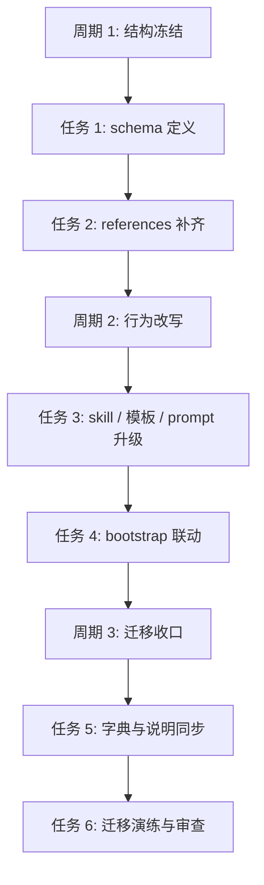

# 需求实施总览：project-memory-rules 双层知识库升级

## 1. 基本信息

- 对应需求文档: `doc/2-需求/2026-07-03_162802_project-memory-rules双层知识库升级.md`
- 来源对象标识（需求或 Bug）: `project-memory-rules双层知识库升级`
- 当前实施文档命名主干: `2026-07-03_162802_project-memory-rules双层知识库升级_实施总览`
- 对应验收标准文档: `doc/7-验收/2026-07-03_170712_project-memory-rules双层知识库升级_验收标准.md`
- 对应最终验收文档: `待创建`
- agent 理解的问题 / 目标:
  - 当前 `project-memory-rules` 只有 Markdown 词条式长期记忆，缺少结构化索引、关系、证据和状态管理。
  - 本轮目标是把升级方案拆成可执行实施路径，落到 `PROJECT_MEMORY.md` 单文件双区结构、skill 资产、自举联动和验证闭环。
- 当前计划范围:
  - `project-memory-rules` 单文件双区模型
  - 相关 `references/`
  - `agents/openai.yaml`
  - `project-agents-bootstrap`
  - 迁移、字典刷新和验证计划
- 明确不在范围:
  - 外部向量库 / 图数据库接入
  - 跨仓库统一知识中心
  - 当前轮直接进入代码实现
- 当前优先闭环:
  - 先把底部机器索引区 schema、引用资料、skill 工作流和 bootstrap 联动拆成 3 个实施周期。
- 关键假设 / 待确认点:
  - 默认不新增 `PROJECT_MEMORY_INDEX.yaml`
  - 默认在 `PROJECT_MEMORY.md` 底部新增 `## 机器索引区`
  - 默认采用“机器层先写、人类层同步”的更新顺序
  - 正式开工前需补齐独立验收标准文档
- 最大推进边界:
  - 当前轮只推进到“需求文档 + 实施总览 + 实施周期文档落盘”。
  - 在独立验收标准文档补齐、用户明确开工前，禁止进入任何 skill 资产实现、脚本改动、字典刷新、测试实施和审查收口执行。
- 当前状态: `执行中（前置验收已补齐，已获得开始实施授权）`
- 是否已获得开始实施授权: `是`
- 若当前为受限计划 / 阻断计划: `不适用`

## 2. 实施周期总览

- 总周期说明:
  - 本次升级会同时影响数据模型、skill 文本、提示词、自举脚本、字典与验证资产，不能压成一个粗粒度任务。
  - 因此拆成 3 个实施周期，每个周期只承载一个清晰目标。
- 本次计划拆分的子任务周期数: `3`
- 周期拆分原则:
  - 先定单文件双区模型与资料，再改 skill 行为，最后做迁移与验证。
- 周期 1:
  - 周期目标: 定义单文件双区记忆结构与核心 references
  - 完成标志: 底部机器索引区 schema、实体/关系类型、抽取/检索/冲突规则资料齐全
  - 与前后周期衔接: 为周期 2 的 skill 与 prompt 升级提供稳定锚点
- 周期 2:
  - 周期目标: 升级 `project-memory-rules` 行为并联动 `project-agents-bootstrap`
  - 完成标志: `SKILL.md`、`agents/openai.yaml`、bootstrap 规则与脚本口径一致
  - 与前后周期衔接: 为周期 3 的迁移、自检、字典刷新提供基础
- 周期 3:
  - 周期目标: 完成迁移、自测设计、字典刷新和项目文档同步
  - 完成标志: 升级说明、字典产物、验证方案与审查闭环具备
  - 与前后周期衔接: 作为正式开工后的收口周期
- 总体真实测试安排:
  - 真实测试是否默认必需: `是`
  - 覆盖哪些最小任务: `最小任务 1-6`
  - 公共测试环境 / 依赖: 当前仓库本地环境、skill 字典脚本、示例对话样本、根级长期记忆文件
  - 公共样本 / 数据来源: 当前 `PROJECT_MEMORY.md` 词条、用户本轮确认的单文件双区方向、后续固定演练样本
  - 总体通过标准:
    - 单文件双区结构能在规则层被清晰表达
    - 新旧记忆语义不冲突
    - 自举、提示词、引用资料、字典和验证方案口径一致

## 3. 阶段计划

- 阶段 1:
  - 阶段名称: `结构冻结`
  - 阶段目标: 冻结底部机器索引区 schema 与类型系统
  - 只做这一件事: 明确单文件内机器区数据结构与人类区同步边界
  - 输入条件: 当前需求文档已确认
  - 输出产物: schema / entity / relation / workflow / retrieval / conflict references
  - 验证门槛: 引用资料齐全，字段与状态定义可覆盖需求文档中的功能项
- 阶段 2:
  - 阶段名称: `行为改写`
  - 阶段目标: 让 skill 正文、prompt 和 bootstrap 行为对齐单文件双区模型
  - 只做这一件事: 改写规则和自举联动，不扩散到外部系统
  - 输入条件: 阶段 1 资料已冻结
  - 输出产物: 升级后的 `project-memory-rules` 与 `project-agents-bootstrap`
  - 验证门槛: `SKILL.md`、`openai.yaml`、bootstrap 规则无口径冲突
- 阶段 3:
  - 阶段名称: `迁移收口`
  - 阶段目标: 补齐迁移、自测、字典与文档同步
  - 只做这一件事: 收口升级后的验证和交付资产
  - 输入条件: 阶段 2 已完成
  - 输出产物: 字典刷新、自测方案、项目文档同步、审查结论
  - 验证门槛: 生成产物与原始规则变更一致，且无遗漏联动

## 4. 最小任务清单

- 最小任务 1:
  - 任务名: `定义底部机器索引区 schema`
  - 所属周期: `周期 1`
  - 所属阶段: `结构冻结`
  - 本任务只做这一件事: 新增并冻结 `PROJECT_MEMORY.md` 底部机器索引区的结构定义
  - 垂直切片目标: 让后续所有规则升级都能引用统一 schema
  - 输入条件: 需求文档已确认单文件双区方向
  - 实现产出:
    - `project-memory-rules/references/memory-index-schema.md`
    - `PROJECT_MEMORY.md` 底部机器索引区最小骨架约定
  - 真实测试是否必需: `是`
  - 真实测试入口: 以 3 组样本事实演练 schema 填充是否足够表达
  - 真实测试依赖环境: 本地仓库、Markdown/YAML 样本、手工比对
  - 真实测试样本 / 数据来源: 当前 `PROJECT_MEMORY.md` 现有词条 + 本轮对话确定的新规则
  - 真实测试通过标准: 三组样本都能表达实体、关系、证据、上下文和状态
  - 测试点: schema 字段完整性、可扩展性、兼容性
  - 审查点: 是否过度设计、是否与现有“唯一主文档”语义冲突
  - 验收点: schema 能作为后续 references 和 skill 正文的锚点
  - 任务完成条件: schema 文档冻结，关键字段与状态集合明确
  - 任务停止 / 结束条件: 若字段集仍无法覆盖样本，则继续补充；覆盖后停止
  - 阻断条件: 对 `PROJECT_MEMORY.md` 底部机器索引区固定结构无法达成一致
  - 前置依赖: `无`
  - 下一任务依赖: `最小任务 2`
  - 预计触达文件数: `2`
- 最小任务 2:
  - 任务名: `补齐实体、关系、检索与冲突 references`
  - 所属周期: `周期 1`
  - 所属阶段: `结构冻结`
  - 本任务只做这一件事: 新增成套引用资料，避免知识只留在 `SKILL.md`
  - 垂直切片目标: 让 agent 在升级后有稳定的读写与检索参考
  - 输入条件: 最小任务 1 完成
  - 实现产出:
    - `memory-entity-types.md`
    - `memory-relation-types.md`
    - `memory-extraction-workflow.md`
    - `memory-retrieval-patterns.md`
    - `memory-conflict-and-staleness.md`
  - 真实测试是否必需: `是`
  - 真实测试入口: 使用固定问答样本检查 5 份 reference 是否可互相引用
  - 真实测试依赖环境: 本地文档环境
  - 真实测试样本 / 数据来源: 当前 skill 现状 + 需求文档 REQ-FUNC 映射
  - 真实测试通过标准: 每一类 reference 都能支撑至少一个 REQ-FUNC
  - 测试点: 覆盖度、去重策略、状态迁移规则
  - 审查点: 职责边界是否清晰、是否与现有模板重复
  - 验收点: 五类 reference 成套且无明显职责重叠
  - 任务完成条件: references 可支撑 skill 正文改写
  - 任务停止 / 结束条件: 全部 reference 补齐并通过样本对照后停止
  - 阻断条件: 无法给出清晰的实体/关系边界
  - 前置依赖: `最小任务 1`
  - 下一任务依赖: `最小任务 3`
  - 预计触达文件数: `5`
- 最小任务 3:
  - 任务名: `改写 project-memory-rules 主规则与模板`
  - 所属周期: `周期 2`
  - 所属阶段: `行为改写`
  - 本任务只做这一件事: 让 `project-memory-rules` 明确采用“机器索引区优先、正文同步”
  - 垂直切片目标: 让 skill 正文、模板和 prompt 统一成单文件双区工作流
  - 输入条件: 周期 1 资料冻结
  - 实现产出:
    - `project-memory-rules/SKILL.md`
    - `project-memory-rules/references/project-memory-template.md`
    - `project-memory-rules/agents/openai.yaml`
  - 真实测试是否必需: `是`
  - 真实测试入口: 设计 3 个命中样本，验证 agent 是否知道先写机器索引区再同步正文区
  - 真实测试依赖环境: 本地文档环境、样本对话
  - 真实测试样本 / 数据来源: 本轮需求文档 + 当前 skill 使用场景
  - 真实测试通过标准: 三个样本都能输出正确落点和更新顺序
  - 测试点: 提示词一致性、模板字段一致性、默认流程一致性
  - 审查点: description/章节变更是否触发字典刷新联动
  - 验收点: 三个资产口径完全一致
  - 任务完成条件: skill 主体具备单文件双区工作流
  - 任务停止 / 结束条件: 若口径一致则结束；若 prompt 与 skill 冲突则继续修正
  - 阻断条件: 旧“唯一长期记忆文件”表述无法平滑迁移
  - 前置依赖: `最小任务 2`
  - 下一任务依赖: `最小任务 4`
  - 预计触达文件数: `3`
- 最小任务 4:
  - 任务名: `补齐 project-agents-bootstrap 单文件双区联动`
  - 所属周期: `周期 2`
  - 所属阶段: `行为改写`
  - 本任务只做这一件事: 让统一 md 自举编排支持 `PROJECT_MEMORY.md` 底部机器索引区
  - 垂直切片目标: 确保新会话和聚合 md 指令都能创建/补齐机器索引区
  - 输入条件: 最小任务 3 完成
  - 实现产出:
    - `project-agents-bootstrap/SKILL.md`
    - `project-agents-bootstrap/scripts/bootstrap_agents.sh`
  - 真实测试是否必需: `是`
  - 真实测试入口: 用空仓库 / 已有 `PROJECT_MEMORY.md` 仓库 两类样本验证自举路径
  - 真实测试依赖环境: 本地脚本执行环境
  - 真实测试样本 / 数据来源: 最小工程样本与当前仓库
  - 真实测试通过标准: 两类样本都能得到正确单文件双区状态
  - 测试点: 创建逻辑、幂等更新、已有文件兼容
  - 审查点: 是否误把机器索引区当成第二个主文件
  - 验收点: 自举行为与 `project-memory-rules` 说明完全一致
  - 任务完成条件: bootstrap 路径完整可说明
  - 任务停止 / 结束条件: 样本自举通过后结束
  - 阻断条件: bootstrap 脚本无法可靠判断单文件双区状态
  - 前置依赖: `最小任务 3`
  - 下一任务依赖: `最小任务 5`
  - 预计触达文件数: `2`
- 最小任务 5:
  - 任务名: `同步字典与项目级说明`
  - 所属周期: `周期 3`
  - 所属阶段: `迁移收口`
  - 本任务只做这一件事: 同步 description / 标题变更带来的字典和说明产物
  - 垂直切片目标: 让仓库检索入口和对外说明都认识单文件双区记忆能力
  - 输入条件: 最小任务 4 完成
  - 实现产出:
    - `skill-dictionary/data.js`
    - `字典.md`
    - `README.md`
    - 必要时更新根级长期记忆说明
  - 真实测试是否必需: `是`
  - 真实测试入口: 运行字典生成脚本并对照 README/字典是否包含新能力
  - 真实测试依赖环境: Python 脚本环境
  - 真实测试样本 / 数据来源: 当前仓库 skill 元数据
  - 真实测试通过标准: 生成产物包含单文件双区知识库相关描述，且无乱码
  - 测试点: 生成成功、内容一致、UTF-8 正常
  - 审查点: 是否遗漏因 `description` / `##` 标题变更触发的联动
  - 验收点: 字典与说明可检索到新能力
  - 任务完成条件: 生成产物与规则改动一致
  - 任务停止 / 结束条件: 所有生成产物核对完成后停止
  - 阻断条件: 脚本运行失败或产物与源文件不一致
  - 前置依赖: `最小任务 4`
  - 下一任务依赖: `最小任务 6`
  - 预计触达文件数: `4`
- 最小任务 6:
  - 任务名: `迁移演练与审查收口`
  - 所属周期: `周期 3`
  - 所属阶段: `迁移收口`
  - 本任务只做这一件事: 用真实样本演练迁移并完成测试/审查闭环
  - 垂直切片目标: 证明升级不是纸面设计，而是可落地、可回退
  - 输入条件: 最小任务 5 完成
  - 实现产出:
    - `doc/5-tests/` 下的升级验证资料
    - `doc/6-审查/` 下的当前改动审查
    - 迁移说明和回退说明
  - 真实测试是否必需: `是`
  - 真实测试入口: 选取当前仓库 3 条现有长期记忆词条，演练“转实体 -> 写机器索引区 -> 同步正文区”
  - 真实测试依赖环境: 当前仓库本地环境
  - 真实测试样本 / 数据来源: `PROJECT_MEMORY.md` 现有词条
  - 真实测试通过标准: 三条词条都能完成单文件双区演练，且 Markdown 可回读
  - 测试点: 迁移成功、状态标记、回退可行
  - 审查点: 是否遗留旧语义冲突、是否缺少验证证据
  - 验收点: 测试与审查都能支持后续最终验收
  - 任务完成条件: 测试与审查证据落盘
  - 任务停止 / 结束条件: 证据齐全且无阻断后结束
  - 阻断条件: 样本演练中出现不可解释的冲突或回退失败
  - 前置依赖: `最小任务 5`
  - 下一任务依赖: `无`
  - 预计触达文件数: `4`

## 5. 现状与落点

- 涉及目录:
  - `project-memory-rules/`
  - `project-agents-bootstrap/`
  - `skill-dictionary/`
  - `doc/5-tests/`
  - `doc/6-审查/`
- 涉及文件 / 模块:
  - `AGENTS.md`
  - `CLAUDE.md`
  - `PROJECT_MEMORY.md`
  - `project-memory-rules/SKILL.md`
  - `project-memory-rules/agents/openai.yaml`
  - `project-memory-rules/references/*`
  - `project-agents-bootstrap/SKILL.md`
  - `project-agents-bootstrap/scripts/bootstrap_agents.sh`
  - `README.md`
  - `字典.md`
  - `skill-dictionary/data.js`
- 复用点:
  - 现有 `project-memory-rules/references/project-memory-template.md`
  - 现有 `project-agents-bootstrap` 统一 md 编排逻辑
  - 现有字典生成脚本 `skill-dictionary/generate_dictionary.py`
- 需要新增的内容:
  - 机器层 schema 与类型资料
  - 冲突与失效处理资料
  - `PROJECT_MEMORY.md` 底部机器索引区最小骨架约定
- 代码落点目录树:

```text
PROJECT_MEMORY.md                                 # 唯一长期记忆主文件，正文区 + 底部机器索引区

project-memory-rules/
├── SKILL.md                                      # 单文件双区记忆主规则
├── agents/
│   └── openai.yaml                               # 单文件双区记忆提示词
└── references/
    ├── project-memory-template.md                # 双区模板
    ├── memory-index-schema.md                    # 新增，索引区 schema
    ├── memory-entity-types.md                    # 新增，实体类型
    ├── memory-relation-types.md                  # 新增，关系类型
    ├── memory-extraction-workflow.md             # 新增，抽取流程
    ├── memory-retrieval-patterns.md              # 新增，检索规则
    └── memory-conflict-and-staleness.md          # 新增，冲突/失效规则

project-agents-bootstrap/
├── SKILL.md                                      # 单文件双区自举规则
└── scripts/
    └── bootstrap_agents.sh                       # 单文件双区创建/检查

skill-dictionary/
└── data.js                                       # 变更后刷新

README.md                                         # 能力说明同步
字典.md                                            # 变更后刷新
```

- 新增文件清单（按需必填，目录树格式）:

```text
project-memory-rules/references/
├── memory-index-schema.md                        # 新增，定义底部机器索引区结构
├── memory-entity-types.md                        # 新增，定义实体类型
├── memory-relation-types.md                      # 新增，定义关系类型
├── memory-extraction-workflow.md                 # 新增，定义抽取和回写流程
├── memory-retrieval-patterns.md                  # 新增，定义检索规则
└── memory-conflict-and-staleness.md              # 新增，定义冲突和失效策略
```

## 6. 方案选择

- 方案 A: `继续单文档 Markdown 词条模式，仅补几个章节`
  - 优点: 改动小
  - 缺点: 关系、证据、状态和检索仍难稳定自动化
- 方案 B: `单文件双区结构，底部机器索引区 + 人类主文档正文`
  - 优点: 兼容现有阅读方式，不新增根级长期文件，同时为自动更新和未来扩展打基础
  - 缺点: 需要稳定约束受管区格式，避免单文件混乱
- 方案 C: `直接外接知识库 / 向量库 / 图数据库`
  - 优点: 理论扩展性强
  - 缺点: 当前仓库落地复杂度高，且不符合“先本地自包含”方向
- 推荐方案与原因:
  - 推荐 `方案 B`
  - 原因: 与用户已确认的单文件双区方向一致，兼顾当前仓库落地成本、兼容性与未来扩展空间

## 7. 实施步骤

1. 第一步:
   - 所属周期: `周期 1`
   - 所属阶段: `结构冻结`
   - 对应最小任务: `最小任务 1 + 最小任务 2`
   - 本步只做: 冻结底部机器索引区结构与所有核心 references
2. 第二步:
   - 所属周期: `周期 2`
   - 所属阶段: `行为改写`
   - 对应最小任务: `最小任务 3 + 最小任务 4`
   - 本步只做: 升级 `project-memory-rules` 与 `project-agents-bootstrap`
3. 第三步:
   - 所属周期: `周期 3`
   - 所属阶段: `迁移收口`
   - 对应最小任务: `最小任务 5 + 最小任务 6`
   - 本步只做: 刷新字典、演练迁移、补齐测试与审查证据

## 8. 每步验证点

- 真实测试总表:
  - 步骤 1: 用样本事实验证 schema 与 references 可表达性
  - 步骤 2: 用命中样本验证 skill 与 bootstrap 工作流一致性
  - 步骤 3: 用现有长期记忆词条做单文件双区迁移演练，并完成字典/审查收口
- 免测任务及理由: `无`
- 步骤 1 验证:
  - 至少 3 组样本事实能落入 schema
  - references 之间无明显职责空洞
- 步骤 2 验证:
  - `SKILL.md`、模板、prompt、自举规则无口径冲突
  - 新会话/聚合 md 路径都覆盖底部机器索引区
- 步骤 3 验证:
  - 字典脚本刷新成功
  - 迁移演练与审查文档真实落盘

## 9. 图形化执行路径



## 10. 风险与阻断项

- 风险:
  - 单文件双区语义若写法不稳，容易让正文与机器区互相漂移
  - references 分散后若缺统一 schema，仍会口径漂移
  - bootstrap 若未同步更新，实际使用会出现“只落一层”的假完成
- 最大推进边界:
  - 本文档是正式实施前的受限计划边界，不是实施授权。
  - 当前最多推进到“补齐独立验收标准文档并等待用户明确开工”，不得越过该边界进入实现。
- 依赖:
  - 需求文档确认
  - 独立验收标准文档补齐
  - 字典生成脚本可用
- 任务停止 / 结束条件总表:
  - 当前仅完成实施文档，不代表可以直接实施
  - 正式开工前，必须先补齐独立验收标准文档并获得用户明确开工授权

## 11. 数据库变更 SQL

- 建表 SQL（`CREATE TABLE`）: `无`
- 字段变更 SQL（`ALTER TABLE`）: `无`

## 12. 自审结论

- 覆盖度检查: `通过，已覆盖单文件双区结构、references、skill、bootstrap、迁移与验证`
- 实施周期检查: `通过，拆成 3 个单目标周期`
- 最小任务闭环检查: `通过，每个任务都有完成条件、停止条件与验证要求`
- 阶段单一目标检查: `通过`
- 占位词检查: `通过，无 TBD/TODO/后续再补 口头占位`
- 可执行性检查: `通过，但当前仍属于受限计划，需补独立验收标准文档后才能正式开工`
- 图文一致性检查: `通过`
- 用户确认状态: `待用户 review`
