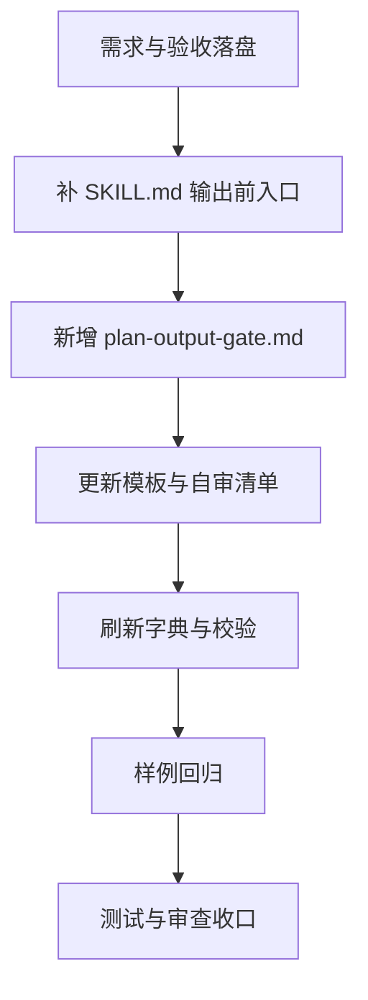

# 需求实施总览：实施计划 Skill 合规闸门优化

## 1. 基本信息

- 对应需求文档: `doc/2-需求/2026-07-04_023433_实施计划Skill合规闸门优化.md`
- 来源对象标识（需求或 Bug）: `实施计划Skill合规闸门优化`
- 当前实施文档命名主干: `2026-07-04_023433_实施计划Skill合规闸门优化_实施总览`
- 对应验收标准文档: `doc/7-验收/2026-07-04_023433_实施计划Skill合规闸门优化_验收标准.md`
- 对应最终验收文档: `doc/7-验收/2026-07-04_023433_实施计划Skill合规闸门优化_最终验收.md`
- agent 理解的问题 / 目标: `implementation-planning-rules` 已有完整计划模板要求，但缺少 Plan Mode 输出前的硬闸门，导致计划可能退化成通用工程计划壳。
- 当前计划范围: 补强计划输出闸门、模板联动、自审清单、字典刷新和验证记录。
- 明确不在范围: 不实现 Obsidian skill，不新增独立计划 skill，不修改系统 Plan Mode 协议。
- 当前优先闭环: 让计划输出前必须按 `plan-output-gate.md` 检查字段，缺字段时重写。
- 关键假设 / 待确认点: 现有 `implementation-planning-rules` 是正确承接点；本次不需要拆出新 skill。
- 当前状态: `实施中`
- 是否已获得开始实施授权: `已获得，用户要求“按照计划执行”`

## 2. 实施周期总览

- 总周期说明: 本次拆为文档基线、规则补强、验证收口三个周期。
- 本次计划拆分的子任务周期数: `3`
- 周期拆分原则: 先明确需求与验收，再修改规则，最后用脚本和样例回归验证。

| 周期 | 周期目标 | 完成标志 | 与前后周期衔接 |
| --- | --- | --- | --- |
| 周期 1 | 建立需求与验收基线 | 需求文档和验收标准落盘 | 为规则修改提供边界 |
| 周期 2 | 补强 Plan Mode 输出闸门 | `SKILL.md`、模板、自审清单和新 reference 完成 | 为验证提供规则依据 |
| 周期 3 | 验证与字典刷新 | 校验、字典、测试记录、审查记录完成 | 回到 Obsidian skill 计划重写 |

总体真实测试安排:

- 真实测试是否默认必需: `部分必需`
- 覆盖哪些最小任务: 任务 3
- 公共测试环境 / 依赖: 本地 Python、当前仓库文件
- 公共样本 / 数据来源: 前序 Obsidian skill 计划文本
- 总体通过标准: skill 校验、字典刷新、样例回归均通过

## 3. 阶段计划

| 阶段 | 阶段名称 | 阶段目标 | 只做这一件事 | 输入条件 | 输出产物 | 验证门槛 |
| --- | --- | --- | --- | --- | --- | --- |
| 阶段 1 | 固定问题定义 | 区分业务问题和 skill 闸门缺口 | 补需求与验收文档 | 已有不合规计划样例 | 需求文档、验收标准 | 文档说明目标 skill、缺口类型和完成标准 |
| 阶段 2 | 补强输出规则 | 让计划输出前必须通过字段闸门 | 修改计划 skill 及 references | 阶段 1 文档稳定 | 更新后的规则文件 | 缺字段必须阻断并重写 |
| 阶段 3 | 验证与回归 | 证明规则可发现问题 | 运行校验、字典和样例检查 | 阶段 2 修改完成 | 测试记录、审查记录、字典产物 | 验证命令通过且样例缺口可识别 |

## 4. 最小任务清单

| 最小任务 | 所属周期 | 所属阶段 | 本任务只做这一件事 | 垂直切片目标 | 实现产出 | 真实测试 | 完成条件 | 停止 / 结束条件 | 前置依赖 | 下一任务依赖 | 预计触达文件数 |
| --- | --- | --- | --- | --- | --- | --- | --- | --- | --- | --- | --- |
| 任务 1：建立需求基线 | 周期 1 | 阶段 1 | 创建需求和验收标准 | 从问题定义到验收口径闭环 | 需求文档、验收标准 | 否，纯文档基线 | 两份文档落盘 | 发现根因不是 skill gap | 无 | 任务 2 | 2 |
| 任务 2：补强输出闸门 | 周期 2 | 阶段 2 | 修改计划规则 | 从入口流程到输出前阻断闭环 | `SKILL.md`、3 个 reference | 否，规则文档用样例回归验证 | 规则可由 agent 执行 | 发现必须新增独立 skill | 任务 1 | 任务 3 | 4 |
| 任务 3：验证与收口 | 周期 3 | 阶段 3 | 验证并留痕 | 从规则修改到可发现可验证闭环 | 字典产物、测试记录、审查记录 | 是 | 校验和样例回归通过 | 字典生成或验证失败 | 任务 2 | 无 | 4 |

### 任务闭环细节

| 任务 | 输入条件 | 测试点 | 审查点 | 验收点 | 阻断条件 |
| --- | --- | --- | --- | --- | --- |
| 任务 1 | 当前对话结论 | 人工检查字段完整 | 需求是否指向正确 skill | 文档能指导规则修改 | 无法确认缺口类型 |
| 任务 2 | 任务 1 完成 | 样例计划字段检查 | 规则是否有硬失败动作 | 缺字段时必须重写 | 修改范围膨胀 |
| 任务 3 | 任务 2 完成 | 脚本与样例回归 | 无乱码、无无关回退 | 产物和记录齐全 | 验证不能复现缺口 |

## 5. 现状与落点

- 涉及目录:
  - `implementation-planning-rules/`
  - `implementation-planning-rules/references/`
  - `doc/2-需求/`
  - `doc/3-实施/`
  - `doc/5-tests/`
  - `doc/6-审查/`
  - `doc/7-验收/`
  - `skill-dictionary/`
- 涉及文件 / 模块:
  - `implementation-planning-rules/SKILL.md`
  - `implementation-planning-rules/references/plan-structure-template.md`
  - `implementation-planning-rules/references/plan-review-checklist.md`
  - `implementation-planning-rules/references/plan-output-gate.md`
- 复用点:
  - 继续复用现有实施计划模板。
  - 继续复用现有 skill 字典生成脚本。
- 需要新增的内容: `plan-output-gate.md` 及本轮需求、实施、验收、测试、审查文档。

```text
implementation-planning-rules/
├── SKILL.md                                      # 补强输出前闸门入口
└── references/
    ├── plan-output-gate.md                       # 新增 Plan Mode 输出前字段核对闸门
    ├── plan-review-checklist.md                  # 增加输出闸门自审项
    └── plan-structure-template.md                # 引用输出闸门并补硬失败说明
```

## 6. 方案选择

- 方案 A: 只在回复中提醒按模板写。驳回，仍依赖临时口头纪律。
- 方案 B: 补强 `implementation-planning-rules` 与 references。采用，最小改动且职责正确。
- 方案 C: 新增独立 `plan-output-gate-rules`。暂不采用，职责与现有 skill 重叠。
- 推荐方案与原因: 采用方案 B，在现有 skill 内补集中闸门 reference。

## 7. 实施步骤

1. 第一步:
   - 所属周期: 周期 1
   - 所属阶段: 阶段 1
   - 对应最小任务: 任务 1
   - 本步只做: 创建需求文档。
2. 第二步:
   - 所属周期: 周期 1
   - 所属阶段: 阶段 1
   - 对应最小任务: 任务 1
   - 本步只做: 创建验收标准文档。
3. 第三步:
   - 所属周期: 周期 2
   - 所属阶段: 阶段 2
   - 对应最小任务: 任务 2
   - 本步只做: 修改 `SKILL.md` 增加输出前闸门入口。
4. 第四步:
   - 所属周期: 周期 2
   - 所属阶段: 阶段 2
   - 对应最小任务: 任务 2
   - 本步只做: 新增 `plan-output-gate.md`。
5. 第五步:
   - 所属周期: 周期 2
   - 所属阶段: 阶段 2
   - 对应最小任务: 任务 2
   - 本步只做: 更新模板与自审清单引用。
6. 第六步:
   - 所属周期: 周期 3
   - 所属阶段: 阶段 3
   - 对应最小任务: 任务 3
   - 本步只做: 运行校验、字典刷新和样例回归。
7. 第七步:
   - 所属周期: 周期 3
   - 所属阶段: 阶段 3
   - 对应最小任务: 任务 3
   - 本步只做: 补测试记录与当前改动审查。

## 8. 每步验证点

- 真实测试总表:
  - `python F:\luode-skills\.system\skill-creator\scripts\quick_validate.py C:\Users\luode\.codex\skills\implementation-planning-rules`
  - `python C:\Users\luode\.codex\skills\skill-dictionary\generate_dictionary.py`
  - 样例回归检查上一版 Obsidian skill 计划缺口。
- 免测任务及理由:
  - 任务 1 和任务 2 为文档 / 规则变更，不改变运行时代码；使用结构审查与样例回归验证。
- 步骤 1 验证: 需求文档包含目标、范围、功能需求、图示和验证策略。
- 步骤 2 验证: 验收标准覆盖主路径、异常、边界和范围外。
- 步骤 3 验证: `SKILL.md` 明确要求输出前读取 `plan-output-gate.md`。
- 步骤 4 验证: `plan-output-gate.md` 包含字段矩阵和硬失败动作。
- 步骤 5 验证: 模板和自审清单均引用新增闸门。
- 步骤 6 验证: 命令通过且无乱码。
- 步骤 7 验证: 测试记录和审查记录可回指需求与验收标准。

## 9. 图形化执行路径



## 10. 风险与阻断项

- 风险:
  - 闸门过严可能让简单计划变长。
  - 若入口描述不够明确，agent 可能仍跳过新增 reference。
  - 若只改规则不跑样例回归，无法证明缺口被修复。
- 依赖:
  - 本地 Python。
  - 当前仓库可写。
  - 字典生成脚本可运行。
- 任务停止 / 结束条件总表:
  - 发现根因不是 skill gap 时停止。
  - 字典生成失败时停止排查。
  - 样例回归无法识别缺口时继续补规则，不收口。
- 最大推进边界:
  - 只优化计划输出合规能力。
  - 不提交 Git。
  - 不实现 Obsidian skill。

## 11. 数据库变更 SQL

- 建表 SQL: 不适用。
- 字段变更 SQL: 不适用。

## 12. 自审结论

- 覆盖度检查: 已覆盖问题理解、范围、非范围、当前优先闭环、关键假设、实施周期、阶段计划、最小任务、真实测试、完成条件、停止条件和最大推进边界。
- 实施周期检查: 3 个周期均目标单一。
- 最小任务闭环检查: 每个任务均包含产出、验证、审查、验收和阻断条件。
- 阶段单一目标检查: 通过。
- 占位词检查: 未保留 `TBD`、`TODO`、`后续补充`。
- 可执行性检查: 文件落点和验证命令明确。
- 图文一致性检查: 流程图与步骤一致。
- 用户确认状态: 用户已要求按计划执行。
