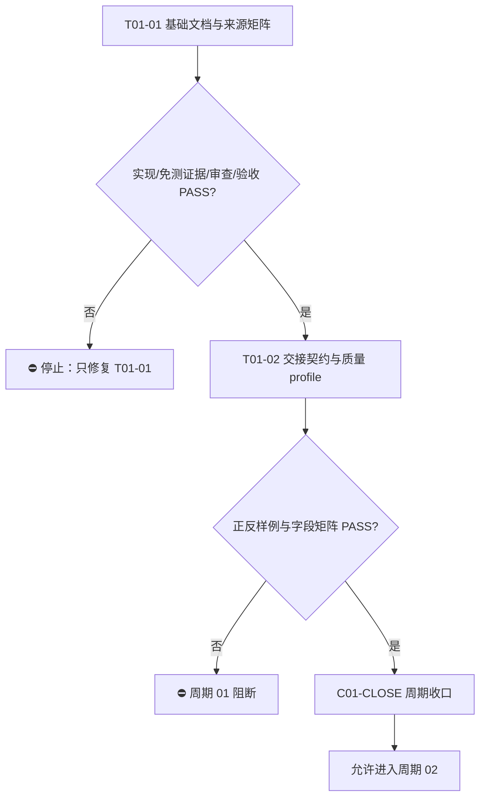

# 实施周期 01：契约与基线

## 1. 周期身份与来源回指

| 字段 | 内容 |
| --- | --- |
| 对应需求文档 | `doc/2-需求/2026-07-12_033322_需求与实施文档极致完备化.md`（拟创建） |
| 来源对象标识 | `REQ-DOC-COMPLETENESS-001` |
| 对应验收标准 | `doc/7-验收/2026-07-12_033322_需求与实施文档极致完备化_验收标准.md`（拟创建） |
| 对应实施总览 | `doc/3-实施/2026-07-12_033322_需求与实施文档极致完备化_实施总览.md` |
| 对应全量顺序总表 | `doc/3-实施/2026-07-12_033322_需求与实施文档极致完备化_需求与实施计划全量顺序实施方案.md` |
| 周期文档命名主干 | `2026-07-12_033322_需求与实施文档极致完备化_实施周期01_契约与基线` |
| 当前周期序号 / 大进度定位 | `01 / 第一阶段：契约与基线` |
| 当前状态 | 进行中；本子任务已落盘本周期实施域两份入口，等待同周期需求/验收写集完成后收口 |
| 开始实施授权 | 已获得；用户明确“按照计划执行”，但本周期仍受任务写集和闭环门禁约束 |
| Git 授权 | 未获得；不得 commit、push、merge、rebase 或改写历史 |

## 2. 当前周期最终方案简要说明

本周期只建立后续所有需求和实施文档共同使用的身份、职责、追踪和验收基线，并完成总表、实施总览、周期文档与同周期需求/验收文档的互链。先把“文档之间如何交接、哪些字段必须存在、缺什么必须阻断”冻结，再进入需求规则和实施规则的具体改造；本周期不修改任何 Skill 或产品代码。

## 3. 当前代码/文档基线

### 3.1 已确认的仓库事实

| 基线 ID | 事实 | 证据路径 | 对本周期的影响 |
| --- | --- | --- | --- |
| `BASE-001` | 文档按 `doc/1-架构` 至 `doc/7-验收` 分域存储 | `artifact-storage-rules/references/path-map.yaml` | 三份实施域文档必须落在 `doc/3-实施/`，需求/验收由各自域维护 |
| `BASE-002` | 实施总览、周期和全量顺序总表有固定命名模板 | `implementation-planning-rules/references/full-sequence-master-plan.md`、`artifact-storage-rules/references/path-map.yaml` | 文件名保留时间戳和来源对象标识，禁止只写“阶段说明” |
| `BASE-003` | 计划模板要求方案简要说明、问题理解、范围、周期、阶段、最小任务、真实测试和停止条件 | `implementation-planning-rules/references/plan-structure-template.md` | 本周期文档必须能被普通模型接手，并为后续 gate 提供字段基线 |
| `BASE-004` | 现有 `doc/3-实施/` 存在历史总览与周期样例 | `doc/3-实施/` 目录 | 历史文件作为兼容/回归样例，不在本周期批量迁移 |
| `BASE-005` | 当前仓库规则要求每个最小任务闭环为实现、测试、审查、验收 | `implementation-planning-rules/SKILL.md`、`AGENTS.md` | `T01-01` 纯文档免运行时测试，但必须提供结构、UTF-8、回指和链接证据 |

### 3.2 当前已存在的可复用结构

- `implementation-planning-rules/references/plan-structure-template.md`：作为总览章节顺序和字段最低基线。
- `implementation-planning-rules/references/full-sequence-master-plan.md`：作为项目级总表职责边界和回指约束基线。
- `artifact-storage-rules/references/path-map.yaml`：作为需求、验收、实施总览、实施周期和测试资产命名/路径事实来源。
- 历史周期文档：作为“周期目标、只做一件事、任务顺序、验证点、阻断项”写法的对照样例。

## 4. 当前周期目标、边界与进入条件

### 4.1 当前周期目标

冻结需求与实施文档极致完备化项目的跨域交接契约和基线入口，使后续普通模型执行时能够依据唯一来源、唯一 ID、唯一状态和可复验的证据链推进。

### 4.2 当前周期只做这一件事

完成“来源对象 -> 需求 -> 验收 -> 实施总览 -> 实施周期 -> 最小任务”的文档身份、路径、职责、顺序和状态基线；不写规则改造、不写校验器、不改变 Skill 行为。

### 4.3 纳入范围

- 创建/更新本周期所需的三份 `doc/3-实施/` 文档（需求与验收文档由同周期另一个写集维护）。
- 记录当前代码/文档基线、复用点、目录树、任务顺序、证据要求和回滚边界。
- 为 `T01-02` 预留交接契约、质量 profile、正反样例和机械校验输入。

### 4.4 明确不在范围

- 不修改 `requirement-*`、`acceptance-criteria-rules`、`implementation-planning-rules` 或其它 Skill 资产。
- 不新增/修改 `PROJECT_CURRENT.md`、`PROJECT_MEMORY.md`、`PROJECT_HISTORY.md`、`AGENTS.md` 或 `CLAUDE.md`。
- 不实现 Python 校验器、Mermaid CLI、测试脚本、模型调用或外部服务联调。
- 不把未冻结的业务默认值、API wire shape 或技术实现细节写入本周期作为既定事实。

### 4.5 进入条件

| 条件 | 判定证据 | 当前状态 |
| --- | --- | --- |
| 用户目标和执行计划已确认 | 当前用户消息与父任务授权 | 通过 |
| 项目规则、路径映射和计划模板可读取 | `AGENTS.md`、`artifact-storage-rules/references/path-map.yaml`、`implementation-planning-rules/references/*.md` | 通过 |
| 来源对象 ID、时间戳和中文主干已确定 | `REQ-DOC-COMPLETENESS-001`、`2026-07-12_033322_需求与实施文档极致完备化` | 通过 |
| 同周期需求与验收写集存在且不与本写集冲突 | 父任务写集分配 | 待同周期收口确认 |
| Git 写入授权 | 当前用户消息未提出 | `N/A` + 原因 + 证据：本轮未提出 Git 历史写入授权，禁止历史写入 |

## 5. 周期内最小任务执行顺序

执行顺序严格为 `T01-01 -> T01-02 -> C01-CLOSE`。不得把两个任务先连续修改再在周期末统一测试、审查或验收；`T01-01` 未收口前，`T01-02` 不得创建公共契约；周期 01 未收口前，周期 02 不得开始。

## 6. 最小任务闭环

### 6.0 文件/符号操作契约

| 任务 | 文件路径 | 符号/区段 | 操作 | 修改前职责 | 修改后职责 | 禁止触碰区 |
| --- | --- | --- | --- | --- | --- | --- |
| `T01-01` | `doc/3-实施/` 三份入口文档 | Markdown front matter、章节、追踪矩阵 | 新增 | N/A + 原因 + 证据：入口文档此前不存在 | 建立需求/验收/实施互链入口 | 代码、数据库和外部服务 |
| `T01-02` | `artifact-delivery-gate-rules/references/` | 契约字段、profile 键 | 新增 | N/A + 原因 + 证据：公共校验契约此前不存在 | 固化文档质量判定 | 需求业务规则和运行时代码 |

### 6.1 `T01-01` 基础文档与来源矩阵落盘

| 字段 | 规定 |
| --- | --- |
| 所属周期 / 周期内顺序 | 周期 01 / 第 1 个任务 |
| 阶段 | `S01 来源与契约基线` |
| 垂直切片目标 | 让一个来源对象拥有可回指的需求、验收、总表、实施总览和周期入口 |
| 本任务只做这一件事 | 创建/更新五类文档入口并冻结来源 ID、路径、状态、职责和顺序；本子任务仅写实施域三份文件 |
| 输入条件 | `BASE-001` 至 `BASE-005`，用户执行授权，同周期写集的来源主干 |
| 实现/落盘产出 | 本总表、实施总览、周期 01；同周期需求/验收文档由另一个互斥写集补齐 |
| 预计触达文件数 | 5 个项目级入口；当前子任务写入 3 个，未触碰另外 2 个 |
| 真实测试是否必需 | 运行时真实测试不必需；这是纯 Markdown 文档基线，不改变运行结果 |
| 合规验证入口 | PowerShell `Get-Content -Encoding UTF8` 回读；标题/链接/路径人工核对；`git diff --check` |
| 样本/数据来源 | 当前三份新文档、`path-map.yaml`、计划模板、已有历史总览/周期样例 |
| 通过标准 | UTF-8 解码与回读成功；无未决占位词；总表能回指需求/验收/总览/周期/任务；三份文档名称和来源对象一致；当前状态不虚报为已完成 |
| 实现审查点 | 开头有“当前计划最终方案简要说明”；范围、非范围、优先闭环、授权、最大推进边界完整；任务闭环字段不缺失；未越过本写集 |
| 验收点 | `REQ-DOC-COMPLETENESS-001` 的总表、总览和周期 01 可从任一入口互相定位；当前执行入口唯一为 `T01-01` |
| 任务完成条件 | 三份实施域文档落盘并通过上述合规验证；同周期需求/验收入口路径已写入且状态明确；审查无 P0/P1 问题 |
| 任务停止/结束条件 | 发现来源 ID 冲突、路径命名冲突、需求/验收写集覆盖同一文件、UTF-8/Markdown 乱码、父任务要求扩写到 Skill 或项目记忆 |
| 前置依赖 | 用户执行授权、路径映射、计划模板、父任务写集分配 |
| 下一任务依赖 | `T01-02` 依赖本任务和同周期需求/验收文档全部互链且状态一致 |
| 回滚 | 仅撤销本子任务新增的三个文件；保留父任务写集的其他文件和失败证据，不使用破坏性 Git 命令 |

### 6.2 `T01-02` 公共交接契约与质量 profile

| 字段 | 规定 |
| --- | --- |
| 所属周期 / 周期内顺序 | 周期 01 / 第 2 个任务 |
| 阶段 | `S01 来源与契约基线` |
| 垂直切片目标 | 将五类文档之间的字段责任、状态、ID、`N/A`、图形和失败等级变成可执行契约 |
| 本任务只做这一件事 | 创建跨域交接契约和质量 profile；不修改需求规则和实施规则正文 |
| 输入条件 | `T01-01` 四/五类文档已互链、来源和验收口径已冻结 |
| 实现/落盘产出 | `artifact-delivery-gate-rules/references/document-handoff-contract.md`、`document-quality-profiles.yaml`、正反样例清单 |
| 预计触达文件数 | 3 个 |
| 真实测试是否必需 | 必需；契约会改变后续 gate 的判定依据 |
| 真实测试入口 | 计划新增的 profile 校验脚本测试；在脚本尚未落盘前使用结构化正/反样例人工演练并记录差异 |
| 真实测试依赖环境 | Windows 本地 Python；只读仓库文件；不连接任何外部环境 |
| 样本/数据来源 | 当前总表/总览/周期 01；历史完整总览；故意缺少来源、孤立 ID、模糊动作、无测试入口的负向样例 |
| 通过标准 | 每种文档类型的强制字段、条件字段、`N/A` 理由、状态枚举、失败等级、回指关系可被唯一解释；负向样例全部被标记阻断 |
| 实现审查点 | 未把需求业务决策和实施技术决策混为同一权威来源；未新增平行文档入口；profile 与 `path-map.yaml` 不冲突 |
| 验收点 | 普通模型仅依据契约能判定“可执行/需回开/阻断”；P0/P1 未决不会被标记为通过 |
| 任务完成条件 | 契约、profile、正反样例和审查结论落盘；通过周期 01 收口矩阵；没有未解释的字段或状态 |
| 任务停止/结束条件 | 无法区分需求与实施职责、无法表达条件必填、校验规则无法稳定拒绝负向样例、工具环境超出 local |
| 前置依赖 | `T01-01` 收口、同周期需求和验收文档存在 |
| 下一任务依赖 | 周期 02 的需求入口模板和验收矩阵必须引用本契约 |
| 回滚 | 只回滚本任务公共契约/profile；不得删除已完成的来源/总表/总览/周期入口 |

## 7. 当前周期步骤与验证闭环

| 步骤 | 任务 | 本步只做 | 证据 | 验证点 | 审查点 | 验收结论 |
| --- | --- | --- | --- | --- | --- | --- |
| 1 | `T01-01` | 落盘三份实施域基线并写入同周期需求/验收回指 | `EVD-T01-01-IMPL-01` 至 `EVD-T01-01-IMPL-03` | UTF-8、标题、路径、链接、ID、状态 | 写集边界、无第二真相源、无计划占位词 | 入口可互相定位；未虚报收口 |
| 2 | `T01-01` | 完成纯文档合规检查 | `EVD-T01-01-TEST-01` | `Get-Content -Encoding UTF8`、结构核对、`git diff --check` | 检查范围覆盖三份文件 | 免运行时测试理由成立 |
| 3 | `T01-01` | 实现审查与父任务回报 | `EVD-T01-01-REVIEW-01` | 逐项对照总览/周期字段矩阵 | 当前计划不越过周期 01 | 待同周期需求/验收写集汇合 |
| 4 | `T01-02` | 创建契约/profile/正反样例 | `EVD-T01-02-IMPL-01` | 字段、状态、ID、失败等级可表达 | 不新增职责重叠 Skill | 待执行 |
| 5 | `T01-02` | 正反样例测试与审查 | `EVD-T01-02-TEST-01`、`EVD-T01-02-REVIEW-01` | 完整通过、负向阻断 | P0/P1 不可绕过 | 待执行 |
| 6 | `C01-CLOSE` | 周期验收和总表状态更新 | `EVD-C01-CLOSE-ACCEPT-01` | 追踪链和状态一致 | 总表/总览/周期同步 | 通过后才允许周期 02 |

## 8. 当前周期验证矩阵

| 验证 ID | 覆盖对象 | 方式 | 通过标准 | 状态 |
| --- | --- | --- | --- | --- |
| `V01-01` | 文件编码 | UTF-8 显式回读与字节检查 | 中文不乱码，无 UTF-8 BOM/换行异常证据 | 待 T01-01 收口 |
| `V01-02` | 结构完整性 | 按 `plan-structure-template.md` 字段逐项核对 | 方案说明在开头，周期/阶段/任务/测试/停止条件齐全 | 待 T01-01 收口 |
| `V01-03` | 回指完整性 | 总表、总览、周期、需求、验收路径交叉核对 | 无孤立入口，当前任务唯一 | 待同周期需求/验收汇合 |
| `V01-04` | 任务边界 | 写集和文件 diff 审查 | 当前子任务仅新增三份指定文件 | 待 T01-01 收口 |
| `V01-05` | 契约可判定性 | 正/反样例演练 | 字段缺失、未决、模糊动作和图形错误可阻断 | 待 T01-02 |
| `V01-06` | 周期收口 | 实现/测试/审查/验收证据矩阵 | 两个任务逐个闭环，无集中补测 | 待周期末 |

## 9. 周期阻断、停止与回滚

### 9.1 立即阻断条件

- 同一来源对象出现两个不同的需求、验收或实施总览主入口。
- 总表无法回指需求、验收、总览、周期或任务，或任务在总表中孤立存在。
- 文档含未决占位词或把未知决策伪装成既定结论。
- 关键字段缺失且没有 `N/A + 不适用原因 + 证据`。
- 同周期需求/验收写集修改了本子任务指定文件，导致无法判断真实内容。
- UTF-8 回读乱码、Markdown 结构失真、链接断裂或图形节点术语与正文不一致。
- 任何人要求本周期越界修改 Skill、项目四件套、产品代码、数据库或 Git 历史。

### 9.2 停止/结束条件

| 类型 | 条件 |
| --- | --- |
| 任务停止 | 当前任务的前置依赖失效、写集冲突、关键事实未确认、验证失败且未能在本任务内修复 |
| 周期停止 | `T01-01` 或 `T01-02` 任一未完成实现/测试/审查/验收，或存在 P0/P1 阻断 |
| 周期结束 | 两个任务均闭环，五类入口互链，契约/profile 和正反样例通过，`C01-CLOSE` 验收 PASS |
| 允许后续 | 仅在周期结束后，更新总表为“已完成”并开放周期 02 的 `T02-01` |
| 最大推进边界 | 本周期最多完成契约与基线文档；不得进入需求规则升级、实施模板改造、校验器、Mermaid 工具链或最终验收 |

### 9.3 回滚方案

1. 发现本子任务文档乱码或结构错误：停止后删除/重写本子任务新增文件，重新用 UTF-8 `apply_patch` 写入，再回读验证。
2. 发现总表或总览路径与同周期需求/验收不一致：保留失败证据，修正当前文档回指，不修改其他域文件。
3. 发现写集冲突：停止本子任务，不覆盖外部修改，重新读取当前文件后由父 agent 决定合并方式。
4. 发现周期边界被突破：将状态标记为 `已阻断`，撤回越界内容；不得用未决占位掩盖缺口。

## 10. 周期收口验收清单

- [ ] `REQ-DOC-COMPLETENESS-001` 的需求、验收、总表、实施总览和周期 01 五类入口全部存在或明确标记为同周期待落盘。
- [ ] 总表能够回指需求、验收、实施总览、实施周期和 `T01-01/T01-02`。
- [ ] 实施总览以“当前计划最终方案简要说明”开头，包含范围、非范围、优先闭环、授权、周期、阶段、任务、真实测试、停止条件和自审。
- [ ] 周期 01 只承载契约与基线，不出现 Skill 改造、产品代码或外部联调实现。
- [ ] 每个任务有唯一周期归属、周期内顺序、实现、测试/免测、审查、验收、完成和停止条件。
- [ ] 文档均可用 UTF-8 显式回读，Markdown 标题层级和 Mermaid 图形语法无明显错误。
- [ ] 当前总表状态与实施总览/周期状态一致；未授权 Git 历史写入未发生。
- [ ] 周期收口证据写入总表和实施总览后，才允许打开周期 02。

## 11. 自审结论

| 检查项 | 结果 | 说明 |
| --- | --- | --- |
| 当前周期只做一件事 | 通过 | 仅冻结契约与基线入口，不改 Skill/代码 |
| 最小任务顺序 | 通过 | `T01-01 -> T01-02 -> C01-CLOSE` |
| 实现/测试/审查/验收闭环 | 通过 | `T01-01` 明确纯文档免测理由，`T01-02` 明确真实测试入口 |
| 当前代码/文档基线 | 通过 | `BASE-001` 至 `BASE-005` 有真实路径证据 |
| 阻断与回滚 | 通过 | 第 9 节列出触发证据和恢复边界 |
| 图文一致性 | 通过 | 第 5 节图形节点与任务/状态名称一致 |
| 写集互斥性 | 通过 | 本子任务只新增本文件和同任务指定的两个实施域文件 |
| UTF-8 与占位词 | 待落盘后复核 | 使用显式 UTF-8 回读；“拟创建”只表示外部写集尚未落盘，不是执行占位 |

**本次改动点**：新增周期 01 契约与基线文档，记录真实基线、任务顺序、四类闭环、验证矩阵、阻断/回滚和周期收口清单。
