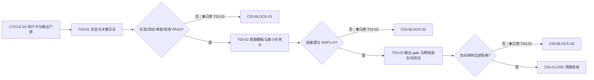
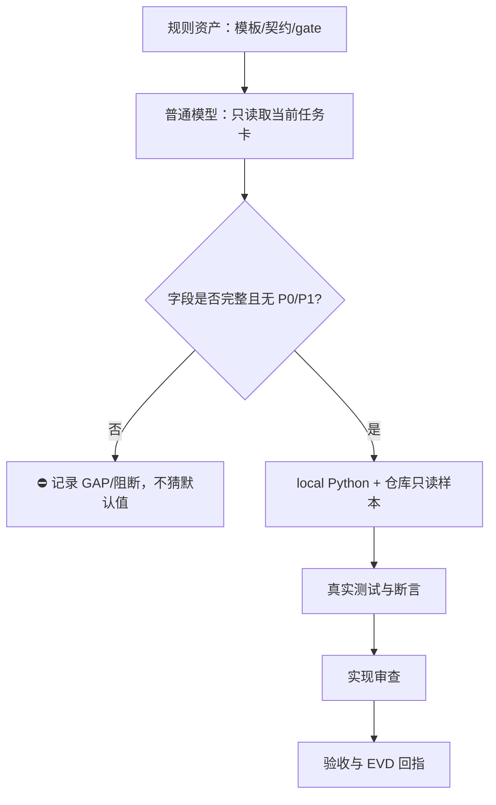

# 实施周期 03：执行卡与输出门禁

## 1. 周期身份与来源回指

| 字段 | 冻结内容 |
| --- | --- |
| 周期 ID | `CYCLE-03` |
| 来源需求 | `REQ-DOC-20260712-033322`；`doc/2-需求/2026-07-12_033322_需求与实施文档极致完备化.md` |
| 来源验收 | `AC-DOC-20260712-033322`；`doc/7-验收/2026-07-12_033322_需求与实施文档极致完备化_验收标准.md` |
| 实施总览 | `doc/3-实施/2026-07-12_033322_需求与实施文档极致完备化_实施总览.md` |
| 全量顺序总表 | `doc/3-实施/2026-07-12_033322_需求与实施文档极致完备化_需求与实施计划全量顺序实施方案.md` |
| 前置周期 | `CYCLE-01` 契约与基线；周期 02 的需求/验收规则落点由总表冻结后接入 |
| 本周期状态 | 已收口；`T03-01` 至 `T03-03` 实现/测试/审查/验收均 PASS，`C03-CLOSE` PASS |
| Git 历史授权 | `N/A` + 原因与证据：本轮用户未提出提交、推送、合并或改写历史授权；禁止执行历史写入 |

## 2. 当前周期最终方案简要说明

本周期采用“三个垂直切片、逐任务四阶段闭环”的方案：先把实施总览的技术决策与周期依赖冻结，再把普通模型可以直接照做的周期模板和最小任务执行卡冻结，最后用输出 gate、颗粒度规则和低推理负向样例证明缺字段、模糊动作、跨周期任务和集中测试会被阻断。所有证据落在实施规则引用、gate 测试和 `doc/5-tests/`，不改产品代码，不调用外部服务。

本周期允许的最终状态只有两种：每个任务均有 `实现 -> 真实测试/免测判定 -> 审查 -> 验收` 的 EVD 证据链并通过；或在第一个失败任务处记录阻断并停止。普通模型不得依据本文档之外的隐含默认值补全 P0/P1 决策。

## 3. 当前代码/文档基线

### 3.1 已核实事实

| 基线 ID | 事实 | 证据路径 | 对周期 03 的约束 |
| --- | --- | --- | --- |
| `BASE-03-01` | 实施总览模板已有范围、周期、任务、真实测试和自审字段 | `implementation-planning-rules/references/implementation-overview-template.md` | `T03-01` 必须补齐稳定 `DEC-*` 决策日志和可回指证据 |
| `BASE-03-02` | 周期模板已有进入/收口、任务顺序、文件/符号、测试、回滚和追踪矩阵段落 | `implementation-planning-rules/references/implementation-cycle-template.md` | `T03-02` 必须把字段变为单任务可执行契约，并提供低推理演练 |
| `BASE-03-03` | 最小任务执行契约已列唯一目标、允许文件、符号、测试、断言、清理、回滚、停止和最大边界 | `implementation-planning-rules/references/minimum-task-execution-contract.md` | `T03-02` 的任务卡不得省略任何硬字段 |
| `BASE-03-04` | 输出 gate、审查清单和颗粒度参考文档已存在 | `implementation-planning-rules/references/plan-output-gate.md`、`plan-review-checklist.md`、`task-granularity-and-order.md` | `T03-03` 需要用负向样例证明规则可拒绝错误计划 |
| `BASE-03-05` | 文档 profile 校验器支持 `implementation_cycle` profile、Mermaid 前置检查和严格追踪入口 | `artifact-delivery-gate-rules/scripts/validate_engineering_docs.py`、`references/document-quality-profiles.yaml` | 所有周期文档先过 profile，再过周期03专用低推理测试 |
| `BASE-03-06` | Mermaid CLI `mmdc` 当前不可用 | 本地命令 `Get-Command mmdc` 返回未找到；`node --version` 可用 | 只记录语法前置检查；不得宣称真实渲染解析已通过 |

### 3.2 本周期写集与禁止触碰区

| 写集 | 允许操作 | 禁止操作 |
| --- | --- | --- |
| 周期文档 | 新增本文档 | 修改周期 01、总览、全量总表或项目四件套 |
| 实施规划规则引用 | 为 `T03-01`、`T03-02`、`T03-03` 增补契约字段或测试样例 | 改写与本周期目标无关的 Skill、字典或触发器 |
| gate 测试 | 在 `artifact-delivery-gate-rules/references/tests` 或已有测试边界内补充负向测试 | 修改业务代码、数据库、外部连接或生产配置 |
| 周期03验证资产 | 新增 `doc/5-tests/2026-07-12_042731/` 下 README 和 ASCII Python 测试 | 在中文说明目录放置脚本、产物或散落 fixture |

发现写集冲突时，停止当前任务，先回读磁盘内容和 `git diff`，不得覆盖其他 agent 的修改。

## 4. 当前周期目标、边界与进入条件

### 4.1 周期只做这一件事

把“技术决策冻结 -> 周期执行卡 -> 输出 gate 负向验证”连成普通模型可执行、可审查、可回滚的单一证据链，并为后续周期开放唯一入口 `C03-CLOSE`。

### 4.2 纳入范围

- `T03-01`：总览模板、决策日志、周期依赖和证据回指。
- `T03-02`：周期模板、最小任务执行契约、低推理演练和 P0/P1 决策清零断言。
- `T03-03`：输出 gate、自审清单、任务颗粒度/顺序负向测试、Mermaid 图前说明门禁。
- 每项任务对应的 `EVD-*-IMPL/TEST/REVIEW/ACCEPT` 证据记录和失败样本。

### 4.3 明确不在范围

- 不修改产品、API、数据库、缓存、消息队列、前端或后端运行时代码。
- 不接入 test、staging、pre、release 或 production；本周期所有命令只读 local 仓库和本地 Python。
- 不安装 Mermaid CLI，不把静态正则检查写成渲染通过。
- 不修改周期 01、项目四件套、`AGENTS.md`、`CLAUDE.md`、Git 历史或远端。
- 不为未确认的业务字段、权限、默认值、接口 wire shape 写隐含决策。

### 4.4 进入条件

| 条件 ID | 条件 | 证据/命令 | 进入判定 |
| --- | --- | --- | --- |
| `IN-03-01` | 需求、验收、总览和全量总表路径已固定 | `rg --files doc/2-需求 doc/3-实施 doc/7-验收` | 通过 |
| `IN-03-02` | 周期 01 的契约基线可读取 | `Get-Content -Encoding UTF8` 回读周期01文档 | 通过；不修改 |
| `IN-03-03` | 实施规则引用和 gate profile 可读取 | `Get-Content -Encoding UTF8 implementation-planning-rules/references/*.md` | 通过 |
| `IN-03-04` | 本周期写集与其他 agent 写集无重叠 | `git status --short` + 路径清单审查 | 通过；冲突即停止 |
| `IN-03-05` | local Python 可执行 | `python -X utf8 --version` | 通过；不连接外部服务 |

### 4.5 收口条件

| 条件 ID | 通过标准 | 必需证据 |
| --- | --- | --- |
| `OUT-03-01` | `T03-01`、`T03-02`、`T03-03` 均有唯一目标、文件/符号、命令、样本、断言、回滚、停止和最大边界 | 各任务 `EVD-*-IMPL/TEST/REVIEW/ACCEPT` |
| `OUT-03-02` | 每个任务的未决 P0/P1 数量为 0；无法判定的输入被阻断 | `EVD-T03-02-TEST-01` |
| `OUT-03-03` | 缺字段、模糊动作、预计超过 5 文件、集中测试、孤立追踪和无图前说明的样例全部失败 | `EVD-T03-03-TEST-01` |
| `OUT-03-04` | 周期文档 profile、UTF-8、链接、Mermaid 前置语法检查通过 | `EVD-C03-CLOSE-TEST-01` |
| `OUT-03-05` | 审查无 P0/P1；总表只在上述条件全部通过后开放下一周期 | `EVD-C03-CLOSE-REVIEW-01`、`EVD-C03-CLOSE-ACCEPT-01` |

### 4.6 进入条件与收口条件

进入条件由 `IN-03-01` 至 `IN-03-05` 逐项证明；收口条件由 `OUT-03-01` 至 `OUT-03-05` 逐项证明。任一条件缺证据、状态不明或依赖未收口，周期状态必须保持 `blocked` 或 `in_progress`，不得写成 `accepted`。

## 5. 周期图形与任务顺序

### 5.1 任务 DAG

图形目的：展示周期03的唯一顺序、任务依赖和失败停止点。关联 ID：`CYCLE-03`、`T03-01`、`T03-02`、`T03-03`、`C03-CLOSE`。

边界说明：`STOP1`、`STOP2`、`STOP3` 是硬停止节点；禁止从任一停止节点跳到 `C03-CLOSE`，也禁止绕过任务顺序直接修改后续周期。

### 5.2 领域匹配与证据流

图形目的：说明规则资产如何被普通模型执行，再由 gate 和审查产出证据。关联 ID：`RULE-03`、`TASK-03`、`TEST-03`、`EVIDENCE-03`。

边界说明：该图只描述文档规则执行，不代表任何业务服务调用；外部连接、运行时代码和未授权决策均在 `BLOCK` 分支结束。

## 6. 周期内最小任务执行顺序

执行顺序严格为 `T03-01 -> T03-02 -> T03-03 -> C03-CLOSE`。每个任务必须在自己的 `实现、真实测试/免测判定、审查、验收` 四步全部通过后，才允许进入下一任务。

| 顺序 | 任务 ID | 唯一目标 | 前置 | 收口门槛 |
| --- | --- | --- | --- | --- |
| 1 | `T03-01` | 冻结总览模板的技术决策、周期顺序、依赖和证据回指 | `IN-03-01` 至 `IN-03-05` | `DEC-*` 日志完整；正例通过、缺决策负例阻断 |
| 2 | `T03-02` | 让普通模型仅凭周期模板和任务卡完成一次低推理执行 | `T03-01` 收口 | 每个任务 P0/P1 未决为 0；文件/符号/命令/断言全齐 |
| 3 | `T03-03` | 证明输出 gate 和颗粒度规则可拒绝典型错误计划 | `T03-02` 收口 | 六类负向样例全部失败；正例全部通过 |
| 4 | `C03-CLOSE` | 汇总证据、审查和验收，开放下一周期唯一入口 | 三项任务均收口 | profile、UTF-8、追踪和 `git diff --check` 全通过 |

## 7. 最小任务闭环

### 7.1 文件/符号操作总契约

| 任务 | 允许文件 | 允许符号/区段 | 操作 | 禁止触碰区 |
| --- | --- | --- | --- | --- |
| `T03-01` | `implementation-planning-rules/SKILL.md`；`references/implementation-overview-template.md`；`references/plan-structure-template.md`；本周期文档 | “实施总览字段”“决策日志”“周期依赖”“追踪矩阵” | 新增或补充字段和示例 | 产品代码、周期01、项目记忆、外部服务 |
| `T03-02` | `references/implementation-cycle-template.md`；`references/minimum-task-execution-contract.md`；本周期文档 | “任务唯一目标”“文件/符号操作契约”“真实测试与断言”“停止/最大边界” | 新增可执行字段、低推理样例 | 业务实现、数据库、总表状态 |
| `T03-03` | `references/plan-output-gate.md`；`references/plan-review-checklist.md`；`references/task-granularity-and-order.md`；`artifact-delivery-gate-rules/tests/`；`doc/5-tests/2026-07-12_042731/` | “输出 gate”“自审清单”“颗粒度与顺序”“负向样例” | 新增拒绝条件和自动化测试 | 规则以外的 Skill、Mermaid 安装、生产环境 |

### 7.2 `T03-01` 总览模板与技术决策日志

| 字段 | 执行契约 |
| --- | --- |
| 所属周期/顺序 | `CYCLE-03` / 第 1 个任务 |
| 唯一目标 | 使实施总览能冻结方案选择、技术决策、周期顺序、依赖、风险、回滚和证据的唯一来源 |
| 本任务只做这一件事 | 在总览模板和计划结构模板中加入稳定 `DEC-*` 决策日志字段，并为每个决策写来源、选项、选择理由、影响、回滚和证据回指 |
| 修改前职责 | 现有模板描述了方案表和周期表，但没有稳定决策 ID 的闭环要求 |
| 修改后职责 | 普通模型可以从 `DEC-*` 读取唯一技术结论，不得重新比较已冻结方案 |
| 预计触达文件数 | 4 个；不超过 5 个文件门槛 |
| 文件/符号 | `implementation-overview-template.md`：决策日志表；`plan-structure-template.md`：`DEC-*` 字段；`implementation-planning-rules/SKILL.md`：总览硬闸门；本周期文档：执行证据 |
| 真实测试入口 | `python -X utf8 doc/5-tests/2026-07-12_042731/implementation_planning_cycle03/test_cycle03_contract.py -k decision`；`python -X utf8 artifact-delivery-gate-rules/scripts/validate_engineering_docs.py --profile implementation_overview --doc <总览路径> --root .` |
| local 依赖 | Windows 本地 Python、仓库文件；不使用数据库、缓存、HTTP/RPC 或远端 API |
| 样本 | 完整总览正例；删除 `DEC-` 日志的负例；存在 `方案 A/B` 但没有选择理由的负例；存在 P0 未决项的负例 |
| 断言 | 正例 `valid == true`；缺 `DEC-*`、缺选择理由、存在 `P0 unresolved` 的样例 `valid == false`；每个决策可回指 `SRC -> DEC -> REQ/RULE -> AC -> TEST -> EVIDENCE` |
| 失败预期 | 任一决策没有唯一 ID、来源或回滚证据时，测试必须失败且报告字段名；不得自动选择方案 |
| 实现审查 | 检查决策日志没有把业务需求改写成技术结论；检查 `DEC-*` 不与需求/验收 ID 重名；检查字段顺序与总览模板一致 |
| 验收 | `EVD-T03-01-ACCEPT-01`：总览正例通过，三类缺陷负例均阻断，文档 profile 通过 |
| 回滚 | 仅回滚本任务新增的模板字段和测试样例；保留失败输出；不删除周期基线或覆盖其他 agent 修改 |
| 停止条件 | 发现总览已有未读修改、无法确认决策来源、预计触达文件数超过 5、profile 与模板字段冲突、需要业务默认值才能完成 |
| 最大推进边界 | 只完成总览模板和决策日志契约；不开始周期模板或输出 gate 实现 |

#### `T03-01` EVD 证据矩阵

| EVD | 阶段 | 证据内容 | 通过断言 |
| --- | --- | --- | --- |
| `EVD-T03-01-IMPL-01` | 实现 | 模板、Skill 和周期文档的实际 diff 路径与区段 | 只在允许写集内 |
| `EVD-T03-01-TEST-01` | 真实测试 | 正例、缺决策日志、P0 未决三组样本输出 | 正例通过，三组负例阻断 |
| `EVD-T03-01-REVIEW-01` | 审查 | `DEC-*` 唯一性、来源回指、回滚字段、文件数 | 无 P0/P1、无孤立决策 |
| `EVD-T03-01-ACCEPT-01` | 验收 | 父 agent 逐项核对任务卡与 gate 输出 | 任务收口，允许进入 `T03-02` |

`T03-01` 决策日志正例（测试样本，不替代总览最终决策）：`DEC-03-001` 的来源为 `SRC-03-001`，选择 `OPTION-A`，理由、影响、回滚和 `EVD-T03-01-TEST-01` 均有值；缺少选择理由或保留 `P0 unresolved` 的同结构样例必须失败。

### 7.3 `T03-02` 周期模板与最小任务执行卡

| 字段 | 执行契约 |
| --- | --- |
| 所属周期/顺序 | `CYCLE-03` / 第 2 个任务 |
| 唯一目标 | 让一般模型无需补问 P0/P1 决策，按一张任务卡完成实现、测试、审查和验收 |
| 本任务只做这一件事 | 把周期模板和最小任务契约中的字段变成逐任务可判定表，并用 deterministic 低推理演练验证字段完整性 |
| 修改前职责 | 模板已有字段清单，但缺少“低推理执行时如何逐项判定”的可执行样本 |
| 修改后职责 | 每张任务卡都给出唯一目标、输入、文件、符号、命令、样本、断言、清理、回滚、停止和最大边界 |
| 预计触达文件数 | 3 个；不超过 5 个文件门槛 |
| 文件/符号 | `implementation-cycle-template.md`：周期进入/收口和任务顺序；`minimum-task-execution-contract.md`：任务字段；本周期文档：低推理验收 |
| 真实测试入口 | `python -X utf8 doc/5-tests/2026-07-12_042731/implementation_planning_cycle03/test_cycle03_contract.py -k low_reasoning` |
| local 依赖 | Windows 本地 Python 标准库；只读 Markdown 样本；不调用模型 API |
| 样本 | 完整三任务卡正例；缺文件/符号；缺命令/断言；跨周期任务；`P0 unresolved`；预计 6 文件的负例 |
| 断言 | 正例每个任务字段齐全；负例分别报告缺失字段、跨周期、P0/P1 未决或文件数超限；`unresolved_decisions` 中 P0/P1 数量必须为 0 |
| 失败预期 | 任何缺字段或未决项均返回失败；测试不能通过猜测默认文件、符号或命令来修复样例 |
| 实现审查 | 检查任务卡只有一个垂直切片目标；检查任务之间没有共享“周期末统一测试”步骤；检查每个命令明确 local 环境和样本 |
| 验收 | `EVD-T03-02-ACCEPT-01`：低推理正例通过，五类缺陷负例全部阻断，任务卡可由普通模型逐项执行 |
| 回滚 | 只回滚本任务新增字段和测试样本；保留失败输出；不修改 T03-01 的决策日志和周期总表 |
| 停止条件 | 无法将任务拆成单一目标、P0/P1 仍需用户决策、文件/符号无法核实、测试命令需要非 local 连接或任务预计超过 5 个文件 |
| 最大推进边界 | 只完成周期模板和最小任务契约；不实现输出 gate 的规则变更 |

#### `T03-02` EVD 证据矩阵

| EVD | 阶段 | 证据内容 | 通过断言 |
| --- | --- | --- | --- |
| `EVD-T03-02-IMPL-01` | 实现 | 模板字段和任务卡示例 diff | 每个字段有唯一职责 |
| `EVD-T03-02-TEST-01` | 真实测试 | 低推理演练正例与五类负例输出 | 正例通过，负例逐一阻断 |
| `EVD-T03-02-REVIEW-01` | 审查 | 文件数、任务唯一目标、P0/P1、逐任务测试和停止边界 | 无集中测试或隐含默认值 |
| `EVD-T03-02-ACCEPT-01` | 验收 | 普通模型执行契约逐项点检 | 任务收口，允许进入 `T03-03` |

### 7.4 `T03-03` 输出 gate、自审与颗粒度负向测试

| 字段 | 执行契约 |
| --- | --- |
| 所属周期/顺序 | `CYCLE-03` / 第 3 个任务 |
| 唯一目标 | 证明输出 gate、自审清单和颗粒度规则能拒绝缺字段、模糊动作、集中测试、超 5 文件和孤立追踪 |
| 本任务只做这一件事 | 补齐规则负向样例与可执行测试，不扩大规则职责，不安装新运行时依赖 |
| 修改前职责 | 规则文本已有建议和正例，但缺少覆盖六类典型失败的统一测试入口 |
| 修改后职责 | gate 在文档进入实施前拒绝结构缺陷，并将失败原因映射到任务、字段和 EVD |
| 预计触达文件数 | 5 个以内：三个规则引用、一个测试模块、一个 README；若实际超过 5 个立即停止并拆分 |
| 文件/符号 | `plan-output-gate.md`：输出门槛；`plan-review-checklist.md`：自审项；`task-granularity-and-order.md`：颗粒度/顺序；`doc/5-tests/.../test_cycle03_contract.py`：负向断言；README：执行证据 |
| 真实测试入口 | `python -X utf8 doc/5-tests/2026-07-12_042731/implementation_planning_cycle03/test_cycle03_contract.py -k negative`；`python -X utf8 artifact-delivery-gate-rules/tests/test_validate_engineering_docs.py` |
| local 依赖 | Windows 本地 Python；仓库内 Markdown；不读取外部 URL，不写数据库，不调用模型 |
| 样本 | 缺周期/任务 ID；缺真实测试字段；集中测试；模糊动作；预计 6 文件；孤立任务追踪；Mermaid 无图前目的/关联 ID |
| 断言 | 七类负例全部失败且错误指向明确；完整周期03正例通过；`T03-01/T03-02/T03-03` 各有 IMPL/TEST/REVIEW/ACCEPT 证据 |
| 失败预期 | 任何负例被 gate 放行都判定任务失败；不得以人工阅读或静态 `build/lint` 替代真实断言 |
| 实现审查 | 检查负例不依赖偶然顺序；检查测试输出能区分任务 ID、字段名和失败等级；检查 Mermaid 只做语法前置检查并如实记录 CLI 缺失 |
| 验收 | `EVD-T03-03-ACCEPT-01`：正例通过、七类负例阻断、测试 README 含命令/样本/断言/清理/证据路径 |
| 回滚 | 删除本任务新增负向样例和测试资产即可恢复；不回滚已通过的模板字段；不执行 Git 历史写入 |
| 停止条件 | 负例无法稳定复现、测试依赖非 local 服务、规则职责发生重叠、实际写集超过 5 个文件、Mermaid 需要安装工具才能完成判定 |
| 最大推进边界 | 只完成输出 gate 和颗粒度负向验证；不开放下一周期、不更新外部字典、不提交 Git |

#### `T03-03` EVD 证据矩阵

| EVD | 阶段 | 证据内容 | 通过断言 |
| --- | --- | --- | --- |
| `EVD-T03-03-IMPL-01` | 实现 | 规则引用、测试脚本和 README 路径 | 写集不超过 5 个文件 |
| `EVD-T03-03-TEST-01` | 真实测试 | 正例与七类负向样例的完整输出 | 正例通过、负例全阻断 |
| `EVD-T03-03-REVIEW-01` | 审查 | gate 字段、错误映射、图形说明和失败等级复核 | 无误放行、无集中测试 |
| `EVD-T03-03-ACCEPT-01` | 验收 | 父 agent 复核测试命令与证据路径 | 任务收口，允许 `C03-CLOSE` |

## 8. 当前周期验证矩阵

| TEST ID | 覆盖任务 | 命令 | 输入样本 | 关键断言 | 失败后动作 |
| --- | --- | --- | --- | --- | --- |
| `TEST-T03-01-01` | `T03-01` | `python -X utf8 .../test_cycle03_contract.py -k decision` | 总览正例、缺 `DEC-*`、P0 未决 | 正例 true；负例 false；输出决策 ID | 只修 T03-01 |
| `TEST-T03-02-01` | `T03-02` | `python -X utf8 .../test_cycle03_contract.py -k low_reasoning` | 完整任务卡、缺字段、跨周期、超文件数 | 每任务字段齐全；P0/P1=0 | 只修 T03-02 |
| `TEST-T03-03-01` | `T03-03` | `python -X utf8 .../test_cycle03_contract.py -k negative` | 七类负例和周期03正例 | 七类负例全失败；正例全通过 | 只修 T03-03 |
| `TEST-C03-CLOSE-01` | `C03-CLOSE` | `python -X utf8 artifact-delivery-gate-rules/tests/test_validate_engineering_docs.py` | gate 单元测试 | 所有测试退出码 0 | 周期阻断 |
| `TEST-C03-CLOSE-02` | `C03-CLOSE` | `python -X utf8 artifact-delivery-gate-rules/scripts/validate_engineering_docs.py --profile implementation_cycle --doc <周期03> --root .` | 周期03 Markdown | `valid: true`、Mermaid 前置语法无错误、链接未断 | 周期阻断；不宣称 Mermaid CLI 通过 |
| `TEST-C03-CLOSE-03` | `C03-CLOSE` | `git diff --check` | 本周期写集 | 无空格/冲突标记错误 | 修复写入格式后重跑 |

测试口径：构建、lint、静态人工阅读只能作为辅助证据，不能替代上述真实断言。所有命令使用 local 仓库和本地 Python；禁止回退到 test/prod 连接。

## 9. 周期追踪矩阵

| 来源/规则 | 验收 | 周期 | 任务 | 测试 | EVD |
| --- | --- | --- | --- | --- | --- |
| `REQ-DOC-20260712-033322` | `AC-DOC-20260712-033322` | `CYCLE-03` | `T03-01` | `TEST-T03-01-01` | `EVD-T03-01-IMPL-01`、`EVD-T03-01-TEST-01`、`EVD-T03-01-REVIEW-01`、`EVD-T03-01-ACCEPT-01` |
| `RULE-IMPL-OVERVIEW` | `AC-OVERVIEW-03` | `CYCLE-03` | `T03-02` | `TEST-T03-02-01` | `EVD-T03-02-IMPL-01`、`EVD-T03-02-TEST-01`、`EVD-T03-02-REVIEW-01`、`EVD-T03-02-ACCEPT-01` |
| `RULE-IMPL-CYCLE` | `AC-CYCLE-03` | `CYCLE-03` | `T03-03` | `TEST-T03-03-01` | `EVD-T03-03-IMPL-01`、`EVD-T03-03-TEST-01`、`EVD-T03-03-REVIEW-01`、`EVD-T03-03-ACCEPT-01` |
| `RULE-OUTPUT-GATE` | `AC-GATE-03` | `CYCLE-03` | `C03-CLOSE` | `TEST-C03-CLOSE-01` 至 `TEST-C03-CLOSE-03` | `EVD-C03-CLOSE-TEST-01`、`EVD-C03-CLOSE-REVIEW-01`、`EVD-C03-CLOSE-ACCEPT-01` |

## 10. 周期阻断、停止、回滚与最大推进边界

### 10.1 立即阻断条件

- `T03-01`、`T03-02` 或 `T03-03` 出现第二个“唯一目标”，或任务横跨两个周期。
- 任一任务缺文件/符号、真实测试、断言、回滚、停止或最大推进边界，且没有 `N/A + 原因 + 证据`。
- `unresolved_decisions` 中存在 P0/P1；普通模型需要自行选择业务或技术方案。
- 任务预计触达文件数大于 5，或测试被集中到周期末。
- 负向样例被放行、正例被误拒、错误信息不能定位到任务和字段。
- local Python、UTF-8 回读、Markdown 链接或 Mermaid 前置语法检查失败。
- 写集冲突、项目记忆被改动、出现外部连接或要求执行未授权 Git 历史动作。

### 10.2 任务停止/结束条件

| 状态 | 判定 |
| --- | --- |
| 任务停止 | 前置事实变化、写集冲突、关键符号不存在、测试命令不再可执行或出现 P0/P1；保留失败 EVD 并停止 |
| 任务完成 | 实现、真实测试/免测理由、审查、验收四项均 PASS；EVD 四类齐全；无 P0/P1 |
| 周期停止 | 任一任务未完成，或 C03-CLOSE 的 profile/追踪/格式证据失败 |
| 周期完成 | 三个任务和 C03-CLOSE 全部通过，父 agent 才能更新总表并开放下一周期 |
| 允许后续 | 仅允许进入全量总表指定的下一周期入口；不得在本周期完成后自动扩展新目标 |

### 10.3 回滚步骤

1. 记录失败命令、退出码、样本、断言和当前文件指纹到对应 EVD；不覆盖失败证据。
2. 只撤销产生失败的本任务写集；保留其他任务和其他 agent 的修改。
3. 重新 `Get-Content -Encoding UTF8` 回读受影响文件，确认没有编码漂移或整文件伪变更。
4. 修复后只重跑当前任务的测试；当前任务 PASS 后再允许下一任务。
5. 若三次同一条件失败且无法通过只读排查恢复，标记 `C03-BLOCK-*` 并交父 agent 裁决；不得用猜测填充。

### 10.4 最大推进边界

本周期最多完成三项规则资产的执行契约、负向测试和本地证据；不得实现业务功能、安装 Mermaid CLI、更新远端知识库、刷新无关字典、提交/推送 Git，或把“未来可优化”变成新任务。

### 10.5 回滚与停止条件

发现 P0/P1 未决、写集冲突、测试失败、跨周期修改、非 local 连接或证据无法回指时，立即停止当前任务，保留失败输出，按 `10.3` 回滚本任务新增内容；未完成的任务不得被标记为通过。

## 11. 周期收口验收清单

- [x] `T03-01` 有稳定 `DEC-*` 日志、来源/选择/影响/回滚/证据字段，缺决策负例被阻断。
- [x] `T03-02` 的周期模板和最小任务卡可由普通模型逐项执行，P0/P1 未决数为 0。
- [x] `T03-03` 的输出 gate、自审和颗粒度测试覆盖七类负例，负例全部失败、正例全部通过。
- [x] 三个任务各自有 `IMPL`、`TEST`、`REVIEW`、`ACCEPT` 四类 EVD；没有跨任务集中测试。
- [x] 本文档通过 `implementation_cycle` profile、UTF-8 回读、链接检查、Mermaid 前置语法检查和 `git diff --check`。
- [x] Mermaid CLI 真解析未在本周期宣称通过，能力边界已记录并交给周期 04。
- [x] 未修改周期 01、项目四件套、业务代码、外部环境和 Git 历史。
- [x] 全部清单通过，允许父 agent 将 `CYCLE-03` 标记完成并开放下一周期。

## 12. 自审结论

| 审查项 | 结论 | 证据 |
| --- | --- | --- |
| 当前周期只做一个目标 | 通过 | 第 4.1 节和第 10.4 节 |
| 任务垂直切片与唯一归属 | 通过 | 第 6、7 节；`T03-01 -> T03-02 -> T03-03` |
| 文件/符号和写集边界 | 通过 | 第 3.2、7.1 节；每项预计不超过 5 文件 |
| 真实测试和断言 | 通过 | 第 8 节；命令、样本、断言、失败预期齐全 |
| 低推理与 P0/P1 闸门 | 通过 | `EVD-T03-02-TEST-01`、`EVD-T03-03-TEST-01` |
| 阻断、停止、回滚、最大推进边界 | 通过 | 第 10 节；禁止猜测和越界 |
| 图形可读性与边界说明 | 通过 | 第 5 节；每图前有目的/关联 ID，图后有边界说明 |
| Mermaid 真实能力声明 | 通过 | 周期 03 只记录前置语法检查，真实 npx 离线解析留给周期 04 |
| 当前状态是否虚报完成 | 通过 | front matter 与独立 C03 审查/验收证据一致 |

**周期03当前结论**：`T03-01`、`T03-02`、`T03-03` 已逐项完成实现、测试、审查和验收；`EVD-C03-CLOSE-REVIEW-01` 与 `EVD-C03-CLOSE-ACCEPT-01` PASS，允许进入周期 04。

图片资产决策：N/A + 原因 + 证据：本周期只升级实施执行卡与输出门禁，不展示具体 UI、截图或真实产物；真实图片由 CYCLE-05/T05-03 的 local fixture 验证。
