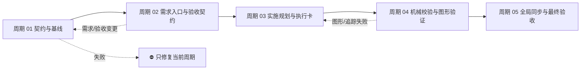
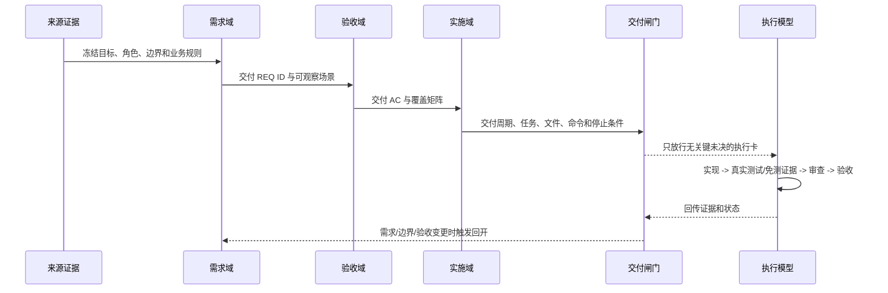

# 需求实施总览：需求与实施文档极致完备化

## 1. 当前计划最终方案简要说明

采用“统一交接契约 + 分层文档职责 + 周期内最小任务闭环 + 机器化质量闸门”的方案：需求域冻结业务决策，实施域冻结技术决策，执行卡冻结文件/符号/命令/证据。先建立总表与周期 01 基线，再升级需求链、实施链、校验器和最终收口，确保普通模型在没有聊天上下文时仍能零决策执行。

## 2. 基本信息

| 字段 | 内容 |
| --- | --- |
| 对应需求文档 | `doc/2-需求/2026-07-12_033322_需求与实施文档极致完备化.md`（拟创建） |
| 来源对象标识 | `REQ-DOC-COMPLETENESS-001` |
| 当前实施文档命名主干 | `2026-07-12_033322_需求与实施文档极致完备化` |
| 对应需求与实施计划全量顺序实施方案 | `doc/3-实施/2026-07-12_033322_需求与实施文档极致完备化_需求与实施计划全量顺序实施方案.md` |
| 对应验收标准文档 | `doc/7-验收/2026-07-12_033322_需求与实施文档极致完备化_验收标准.md`（拟创建） |
| 对应最终验收文档 | `doc/7-验收/2026-07-12_033322_需求与实施文档极致完备化_最终验收.md`（计划末期创建） |
| agent 理解的问题 / 目标 | 当前需求、实施总览和周期文档能表达“要做什么”，但对普通模型执行所需的决策、证据、图形、异常、回滚和停止条件还不够完备；本计划把这些信息固化为可追踪、可审查、可验证的 Markdown 交接包。 |
| 当前计划范围 | 需求/验收/实施文档契约、实施周期、最小任务、图形化、追踪矩阵、机器验证、低推理模型演练和收口闸门。 |
| 明确不在范围 | 产品运行代码、业务 API/数据库、外部服务联调、历史文档批量迁移、Git 历史写入。 |
| 当前优先闭环 | 周期 01：落盘并互链总表、实施总览、周期 01 与同周期需求/验收文档，冻结字段责任和执行入口。 |
| 关键假设 / 待确认点 | 需求与验收文档路径按 `artifact-storage-rules` 命名；新建/修改文档采用 schema v1；Mermaid 使用本地可锁定版本真解析；低推理模型演练以 local 配置执行。 |
| 当前状态 | 进行中；当前只推进周期 01。 |
| 是否已获得开始实施授权 | 是。用户已明确“按照计划执行”，并允许 subagent 并行；本轮仍受每个子任务写集约束。 |
| 受限计划说明 | 本文为正式实施总览；未完成前置验收、总表回指或周期收口时，后续周期不得实施。 |

## 3. 实施周期总览

### 3.1 总体周期与衔接



总周期数为 5。每个周期是不可跨越的大进度边界；周期内最小任务必须逐个完成“实现/落盘 -> 真实测试或合规免测 -> 实现审查 -> 周期验收”，再进入下一个任务。任何周期未收口，不得开始后续周期。

### 3.2 周期明细

| 周期 | 期次定位与目标 | 周期内最小任务 | 进入条件 | 收口条件 | 完成标志 | 衔接 |
| --- | --- | --- | --- | --- | --- | --- |
| 01 契约与基线 | 冻结来源对象、文档职责、字段责任、回指链和当前代码/文档基线 | `T01-01` 基础文档落盘；`T01-02` 交接契约与质量 profile | 已确认需求目标、验收方向、路径规则和开工授权 | 四份基础文档互链；公共契约、反例和字段矩阵通过审查 | `C01-CLOSE` | 进入需求规则升级 |
| 02 需求入口与验收契约 | 将需求侦察、缺口、边界、拆分、变更和验收收敛为可判定输入 | `T02-01` 至 `T02-04` | 周期 01 收口；来源对象稳定 | 需求项、决策、边界、AC 追踪覆盖 100% | `C02-CLOSE` | 进入实施规划 |
| 03 实施规划与执行卡 | 将技术方案、周期、阶段和最小任务写成普通模型可执行的零决策卡 | `T03-01` 至 `T03-03` | 周期 02 收口；验收标准已冻结 | 每个任务有文件/符号/命令/样本/证据/完成/停止条件 | `C03-CLOSE` | 进入机械校验 |
| 04 机械校验与图形验证 | 建立 Markdown/profile/追踪校验器和 Mermaid 真解析门禁 | `T04-01`、`T04-02` | 周期 03 文档模板和正反例齐备 | CLI、单元/集成 fixtures、图形解析均通过 | `C04-CLOSE` | 进入全局同步 |
| 05 全局同步与最终验收 | 同步规则入口、字典、记忆、知识和最终验收证据 | `T05-01` 至 `T05-03` | 周期 04 校验器稳定 | Skill 审计、项目变更审查、前置/最终验收全部 PASS | `C05-CLOSE` | 计划完成，保持未提交 |

### 3.3 总体真实测试安排

- 真实测试默认必需：所有会影响规则触发、文档校验、CLI、模型演练或验收判定的任务必须执行真实测试；纯文档落盘任务可以免测运行时，但不能免 UTF-8、结构、回指和链接检查。
- 公共环境：Windows 本地工作区；只读仓库文件、local 配置和锁定的本地工具。禁止使用 test/prod 连接信息。
- 公共样本：完整需求样例、完整验收样例、实施总览样例、周期/任务样例，以及缺字段、孤立 ID、模糊动作、Mermaid 语法错误和未决决策负向 fixtures。
- 总体通过标准：字段矩阵 PASS；`REQ -> AC -> PLAN -> CYCLE -> TASK -> TEST -> EVIDENCE` 覆盖率 100%；P0/P1 未决为 0；Mermaid 真解析通过；低推理模型演练不需要补决策；所有受影响 Skill 审查和最终验收 PASS。

## 4. 阶段计划

| 阶段 | 阶段名称 | 阶段只做一件事 | 输入条件 | 输出产物 | 验证门槛 |
| --- | --- | --- | --- | --- | --- |
| S01 | 来源与契约基线 | 冻结文档身份、职责和跨域交接契约 | 用户目标、路径规则、现有模板 | 总表、总览、周期 01、契约/profile 设计 | 回指完整、无冲突来源、UTF-8 |
| S02 | 需求与验收收敛 | 把业务目标转成可追踪、可二值验收的需求 | S01 收口、来源对象稳定 | 需求模板、缺口/边界/拆分/变更规则、AC 矩阵 | 每个 REQ 有来源、决策和 AC |
| S03 | 实施执行化 | 把技术方案拆成周期和零决策最小任务 | S02 AC 100% 覆盖 | 总览、周期模板、任务执行卡、输出 gate | 普通模型演练不补问关键决策 |
| S04 | 自动验证 | 把质量约束变成 CLI、fixtures 和 Mermaid 真解析 | S03 模板与正反例 | 校验器、报告、图形检查 | 失败样例稳定拒绝，完整样例稳定通过 |
| S05 | 全局收口 | 同步规则入口、知识、审查和最终验收 | S04 全部通过 | 字典/记忆更新、审查、前置/最终验收 | 所有硬闸门 PASS，Git 未提交 |

## 5. 最小任务清单

### 5.1 周期 01：契约与基线

| 任务 ID | 任务名 | 本任务只做这一件事 | 产出 | 预计触达文件数 | 真实测试 | 完成条件 | 停止/阻断条件 |
| --- | --- | --- | --- | ---: | --- | --- | --- |
| `T01-01` | 基础文档与来源矩阵落盘 | 创建并互链需求、验收、总表、实施总览和周期 01 五类入口 | 本总表、实施总览、周期 01；同周期需求/验收主文档 | 5 | 纯文档免运行时测试；必须做 UTF-8 回读、Markdown 结构、路径和回指检查 | 五类入口存在、ID/状态/路径一致，当前任务证据可回指 | 任一路径未确认、写集冲突、乱码、需求/验收关键决策未冻结 |
| `T01-02` | 公共交接契约与质量 profile | 冻结 schema、字段责任、`N/A` 规则、状态、图形和追踪校验口径 | `artifact-delivery-gate-rules/references/` 契约/profile 设计（后续任务落盘） | 3 | 正/反文档样例结构验证；不得以人工阅读替代字段测试 | 普通模型可按契约交接，P0/P1 未决被拒绝 | 需求域与实施域职责不能唯一归属，或无法表达失败等级 |

### 5.2 周期 02：需求入口与验收契约

| 任务 ID | 任务名 | 本任务只做这一件事 | 产出 | 预计触达文件数 | 真实测试入口 | 完成条件 | 停止/阻断条件 |
| --- | --- | --- | --- | ---: | --- | --- | --- |
| `T02-01` | 需求入口与完整模板 | 固化来源、角色、目标、约束、输入输出、异常、兼容和图形字段 | `requirement-intake-rules` 模板/规则 | 4 | 需求样例结构与触发行为测试 | 新需求可独立生成完整主文档 | 关键来源或角色无法确认 |
| `T02-02` | 缺口与决策阻断 | 固化 P0/P1/P2 缺口、默认值、待确认项及证据级别 | `requirement-gap-rules` 规则/模板 | 4 | 缺口正反样例、未决默认值拒绝测试 | 关键缺口未关闭时不能进入 AC/实施 | 缺口来源不明、默认值无授权 |
| `T02-03` | 边界、拆分与变更传播 | 固化范围/非范围、垂直切片、影响矩阵和变更回开链 | `requirement-boundary-rules`、`requirement-splitting-rules`、`requirement-change-rules` | 5 | 边界冲突、切片超限、变更传播测试 | 每个切片唯一归属且能回开下游 | 边界或依赖无法裁决 |
| `T02-04` | 验收场景与覆盖矩阵 | 将每个可观察需求写成二值 AC，并建立 REQ-AC 追踪 | `acceptance-criteria-rules` 与验收样例 | 3 | REQ-AC 覆盖率、负向场景、异常路径测试 | 覆盖率 100%，无孤立 AC | 需求仍有不可观察表述 |

### 5.3 周期 03：实施规划与执行卡

| 任务 ID | 任务名 | 本任务只做这一件事 | 产出 | 预计触达文件数 | 真实测试入口 | 完成条件 | 停止/阻断条件 |
| --- | --- | --- | --- | ---: | --- | --- | --- |
| `T03-01` | 实施总览模板与决策日志 | 固化推荐方案、阶段、周期、依赖、风险、回滚和技术决策日志 | `implementation-planning-rules` 总览模板/参考 | 4 | 历史完整/不完整总览回归检查 | 总览可冻结技术路线且不重复需求真相 | 方案选择或依赖无法冻结 |
| `T03-02` | 周期与最小任务执行卡 | 固化文件/符号、命令、样本、证据、完成/停止条件 | 周期模板、任务执行契约 | 4 | 低推理模型执行演练与任务颗粒度测试 | 普通模型无需补问 P0/P1 决策 | 任务跨周期、文件数超限或测试入口缺失 |
| `T03-03` | 输出闸门、自审与颗粒度 | 让缺字段、模糊动作、集中测试和孤立任务稳定失败 | 输出 gate、review checklist、正反样例 | 4 | 历史不合格计划回归 | gate 能拒绝所有硬失败结构 | 失败条件无法机械表达 |

### 5.4 周期 04：机械校验与图形验证

| 任务 ID | 任务名 | 本任务只做这一件事 | 产出 | 预计触达文件数 | 真实测试入口 | 完成条件 | 停止/阻断条件 |
| --- | --- | --- | --- | ---: | --- | --- | --- |
| `T04-01` | 文档 profile 与追踪校验器 | 校验 UTF-8、元数据、标题顺序、ID、链接、覆盖率和失败等级 | `artifact-delivery-gate-rules/scripts/validate_engineering_docs.py` 及 fixtures | 5 | Python `unittest` + CLI 集成测试 | 完整样例通过，负向样例逐类拒绝 | 解析器无法区分缺字段和不适用字段 |
| `T04-02` | Mermaid 真解析与图文一致性 | 真渲染所有图，检查节点/术语/ID 和正文一致 | Mermaid 锁定工具、图形 fixtures | 3 | `mmdc` 真解析与像素/退出码检查 | 所有受影响图解析成功，语义引用不漂移 | 工具不可安装或图文术语冲突 |

### 5.5 周期 05：全局同步与最终验收

| 任务 ID | 任务名 | 本任务只做这一件事 | 产出 | 预计触达文件数 | 真实测试入口 | 完成条件 | 停止/阻断条件 |
| --- | --- | --- | --- | ---: | --- | --- | --- |
| `T05-01` | 存储、交付闸门和入口同步 | 同步路径、触发链、交付 gate 和仓库规则入口 | `artifact-storage-rules`、`artifact-delivery-gate-rules`、仓库入口 | 5 | Skill quick validation、路径/触发回归 | 无重复真相源、无路径冲突 | 任一入口规则冲突 |
| `T05-02` | 字典、项目记忆与知识收口 | 刷新 Skill 字典，更新项目四件套，按规则沉淀稳定事实 | `skill-dictionary/data.js`、`字典.md`、PROJECT_*、Obsidian 知识 | 5 | 生成脚本、记忆索引、Obsidian CLI 验证 | 字典/记忆/知识可检索且无敏感信息 | CLI 不可用、敏感扫描失败 |
| `T05-03` | 全链路行为测试、审查与验收 | 运行全量 fixtures、实施审查、前置验收和最终验收 | 测试报告、审查文档、验收文档 | 5 | 全量行为测试与最终验收清单 | 所有 AC 和 gate PASS，工作树未提交 | 任一 P0/P1、覆盖率不足或审查 FAIL |

## 6. 现状与落点

### 6.1 当前代码/文档基线

- 规则资产以独立目录存在，已具备 `requirement-*`、`acceptance-criteria-rules`、`implementation-planning-rules`、`artifact-storage-rules` 和 `artifact-delivery-gate-rules` 等职责边界。
- `implementation-planning-rules/references/plan-structure-template.md` 已要求计划开头方案说明、实施周期、阶段、最小任务、真实测试、停止条件和自审，但质量字段、跨域追踪、图形语义和低推理模型交接仍需统一。
- `artifact-storage-rules/references/path-map.yaml` 已固定 `doc/2-需求`、`doc/3-实施`、`doc/7-验收` 及文件命名模板；本计划沿用其路径，不新增平行目录。
- `doc/3-实施/` 已有历史实施总览和周期文档，可作为正例/兼容样本；不在本轮批量迁移，后续被修改时按新 gate 升级。

### 6.2 计划落点目录树

```text
doc/
├── 2-需求/
│   └── 2026-07-12_033322_需求与实施文档极致完备化.md       # 需求主文档（同周期落盘）
├── 3-实施/
│   ├── 2026-07-12_033322_需求与实施文档极致完备化_需求与实施计划全量顺序实施方案.md  # 跨来源全量顺序
│   ├── 2026-07-12_033322_需求与实施文档极致完备化_实施总览.md                       # 单来源实施总览
│   └── 2026-07-12_033322_需求与实施文档极致完备化_实施周期01_契约与基线.md            # 周期 01
├── 5-tests/
│   └── 2026-07-12_033322_需求与实施文档极致完备化/README.md # 测试任务说明（周期 04 建立）
└── 7-验收/
    ├── 2026-07-12_033322_需求与实施文档极致完备化_验收标准.md # 前置验收
    └── 2026-07-12_033322_需求与实施文档极致完备化_最终验收.md # 最终验收

artifact-delivery-gate-rules/
├── references/document-handoff-contract.md       # 跨域零决策交接契约
├── references/document-quality-profiles.yaml     # 文档类型条件必填矩阵
└── scripts/validate_engineering_docs.py          # 统一机器校验器

implementation-planning-rules/references/
├── implementation-overview-template.md            # 总览完整模板
├── implementation-cycle-template.md               # 周期完整模板
└── minimum-task-execution-contract.md             # 普通模型执行卡
```

当前 T01-01 只落盘 `doc/3-实施/` 下三份文件；需求主文档和验收标准由同周期写集补齐，其他目录在对应周期才允许新增。

## 7. 方案选择

| 方案 | 做法 | 取舍 |
| --- | --- | --- |
| A（推荐） | 公共交接契约 + 需求/实施分层 + profile/CLI 门禁 + Mermaid 真解析 + 低推理模型演练 | 初期文档量较大，但可以把高推理模型的决策完整传给普通模型，失败可定位、可复验 |
| B | 只扩充 `implementation-planning-rules` 文本，不建公共 profile/CLI | 改动较少，但无法机械判断完整性，普通模型仍需猜测，长期难以回归 |
| C | 新建独立“文档编排”Skill 承担所有需求和实施职责 | 统一入口明显，但会与现有需求/实施/交付 Skill 重叠，造成第二真相源和路由冲突 |

推荐 A：它在现有职责边界内补齐契约和可验证性，支持渐进升级历史文档，同时满足极致详细、图形化和跨模型交接目标。

## 8. 实施步骤

1. **周期 01 / 阶段 S01 / `T01-01`**：落盘并互链需求、验收、总表、总览和周期 01；本步不修改 Skill。
2. **周期 01 / 阶段 S01 / `T01-02`**：根据五类文档冻结公共交接契约、质量 profile、状态和 `N/A` 规则；本步不扩展需求范围。
3. **周期 02 / 阶段 S02 / `T02-01`**：将需求入口改为可追踪完整模板，并为每一项补来源和图形要求。
4. **周期 02 / 阶段 S02 / `T02-02`**：加入缺口分级、默认值授权和 P0/P1 阻断。
5. **周期 02 / 阶段 S02 / `T02-03`**：加入边界、垂直切片、变更传播和下游回开矩阵。
6. **周期 02 / 阶段 S02 / `T02-04`**：将需求映射为二值验收场景，建立 REQ-AC 覆盖率。
7. **周期 03 / 阶段 S03 / `T03-01`**：升级实施总览模板和技术决策日志。
8. **周期 03 / 阶段 S03 / `T03-02`**：升级周期模板和最小任务执行卡，固化文件/符号/命令/证据。
9. **周期 03 / 阶段 S03 / `T03-03`**：升级输出 gate、自审和颗粒度正反样例。
10. **周期 04 / 阶段 S04 / `T04-01`**：实现文档 profile、ID、链接、覆盖率和失败等级校验器。
11. **周期 04 / 阶段 S04 / `T04-02`**：锁定 Mermaid 真解析工具，校验图文一致性。
12. **周期 05 / 阶段 S05 / `T05-01`**：同步存储、交付闸门和仓库入口。
13. **周期 05 / 阶段 S05 / `T05-02`**：刷新字典、项目记忆并按需通过 Obsidian CLI 沉淀稳定事实。
14. **周期 05 / 阶段 S05 / `T05-03`**：完成全链路测试、实现审查、前置验收和最终验收。

每一步必须在对应最小任务完成条件达到后才可开始下一步；任何变更都要回写总表状态。

## 9. 真实测试安排

| 测试层 | 入口 | 依赖环境 | 样本/数据来源 | 通过标准 |
| --- | --- | --- | --- | --- |
| 文档基线 | PowerShell UTF-8 回读、Markdown 链接和结构检查、`git diff --check` | Windows 本地工作区 | 当前三份文档及同周期需求/验收 | 无乱码、无断链、关键标题顺序正确 |
| 规则行为 | 各受影响 Skill 的 `quick_validate.py` 与触发样例 | local 仓库、Python 运行时 | 完整/缺字段/冲突/占位词 fixtures | 完整样例通过，硬失败样例拒绝 |
| 追踪校验 | `validate_engineering_docs.py --strict` | 周期 04 建立的本地脚本 | REQ/AC/PLAN/CYCLE/TASK/TEST/EVIDENCE 样例 | 覆盖率 100%，孤立 ID 为 0 |
| 图形校验 | Mermaid CLI `mmdc` 真解析 | 锁定 Node/npm 包，local only | flowchart、sequence、state、DAG 样例 | 退出码 0，节点与正文术语一致 |
| 低推理交接 | 固定输入执行演练并读取 `unresolved_decisions` | 已授权的 local 模型入口 | 周期/任务执行卡和负向计划 | P0/P1 未决为 0，不补问关键决策 |
| 最终回归 | 全量 fixtures + Skill 审计 + 项目变更审查 | local 仓库 | 当前版本所有受影响文档和历史不合格样例 | 所有 AC、gate、审查和验收 PASS |

免测任务：仅创建/修改 Markdown 文档且不改变运行时行为的 `T01-01`，免除运行时功能测试；仍必须完成 UTF-8、链接、结构、回指和 `git diff --check` 检查。任何新增脚本、规则触发或校验器行为均不得免测。

## 10. 图形化执行路径



图形要求：需求文档至少包含业务流程图和关键时序图；实施总览至少包含周期 DAG 和系统边界/交接图；周期文档至少包含任务顺序图和验证闭环图；状态变化需补状态图，条件组合需补决策表，数据关系需补 ER 图。所有图必须标明用途并与正文 ID/术语一致。

## 11. 风险与阻断项

| 风险/阻断 | 触发证据 | 处理与停止边界 |
| --- | --- | --- |
| 需求与实施出现第二真相源 | 同一决策在两个域有不同值 | 立即停止当前任务，回到需求/验收裁决后再更新实施文档 |
| 文档极度详细但无法执行 | 低推理模型产生未决决策或补问 | 退回 `T03-02`，补文件/符号/命令/证据/停止条件；不允许模型自行猜测 |
| 图形与正文漂移 | Mermaid 节点不对应 ID/术语 | 阻断周期 04 收口，修复图文或回开上游文档 |
| 历史文档兼容性 | 未修改历史文档被新 gate 批量误伤 | 仅对新建/被修改文档执行 schema v1；不批量迁移 |
| 本地工具或模型不可用 | CLI 失败、环境缺失或输出不满足标准 | 触发执行失败学习/记录阻断；不回退 test/prod，不伪造证据 |
| 写集冲突 | 其他 agent 同时修改同一文件 | 停止本子任务写入，重新读取当前文件并由父 agent 裁决 |

### 11.1 总体任务停止/结束条件

- **停止**：任一 P0/P1 决策未冻结、关键来源缺失、依赖工具不能安全使用、真实测试失败、审查发现职责冲突或当前文件被外部修改。
- **结束**：所有周期按顺序收口，追踪覆盖 100%，Mermaid 真解析通过，低推理演练无关键未决，Skill 审计/项目变更审查/前置和最终验收全部 PASS。
- **最大推进边界**：本计划最多推进到文档、规则、校验器、测试证据、审查和验收收口；不执行 Git 历史写入，不扩展产品代码或外部环境。

## 12. 数据库变更 SQL

本计划不涉及数据库、表、字段、索引或迁移脚本；本节明确标记为“不适用”，不生成虚假 SQL。

## 13. 自审结论

| 检查项 | 结果 | 说明 |
| --- | --- | --- |
| 方案开头和问题理解 | 通过 | 第 1、2 节先于基本信息说明推荐方案和目标 |
| 周期与阶段单一目标 | 通过 | 五个周期、五个阶段均有唯一目标和输入/输出/门槛 |
| 最小任务唯一归属与顺序 | 通过 | `T01-01` 至 `T05-03` 均有唯一周期、顺序和文件数 |
| 文件/模块落点 | 通过 | 第 6 节含真实目录树，文档任务边界明确 |
| 真实测试与免测理由 | 通过 | 第 9 节独立列入口、环境、样本、标准和免测边界 |
| 完成、停止、阻断和最大推进边界 | 通过 | 第 5、11 节逐任务和总体说明 |
| 图文一致性 | 通过 | 第 3、10 节图形节点与任务/周期术语一致 |
| 占位词检查 | 通过 | 未保留未决占位标记；“拟创建”仅表示真实尚未落盘路径 |
| 当前授权与 Git 边界 | 通过 | 已记录开始实施授权；明确不执行 Git 历史写入 |

**本次改动点**：新增单来源实施总览，冻结五周期、十四个最小任务、文件落点、真实测试、图形要求、阻断/回滚和最终放行条件，并回指项目级全量顺序总表。
