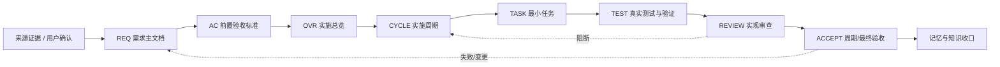
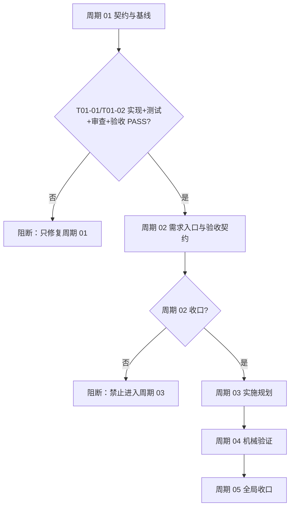
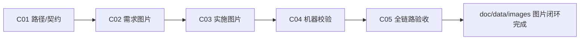

# 需求与实施计划全量顺序实施方案：需求与实施文档极致完备化

## 1. 文档定位与维护状态

| 字段 | 值 |
| --- | --- |
| 项目 / 来源集合标识 | `REQ-DOC-20260712-033322` / 需求与实施文档极致完备化 |
| 文档类型 | 项目级跨来源对象全量顺序实施方案 |
| 文档版本 | `v1.0` |
| 适用阶段 | 需求确认后、正式编码前、规则与文档体系升级阶段 |
| 当前维护状态 | 已完成；周期 01-05 的机器校验、回归、审查、真实 imagegen 和最终验收均通过，当前入口为 C05-CLOSE PASS |
| 来源需求文档 | `doc/2-需求/2026-07-12_033322_需求与实施文档极致完备化.md`（已创建） |
| 前置验收标准 | `doc/7-验收/2026-07-12_033322_需求与实施文档极致完备化_验收标准.md`（已创建） |
| 最终验收文档 | `doc/7-验收/2026-07-12_033322_需求与实施文档极致完备化_最终验收.md`（已创建） |
| 当前实施总览 | `doc/3-实施/2026-07-12_033322_需求与实施文档极致完备化_实施总览.md` |
| 当前实施周期 | `doc/3-实施/2026-07-12_061500_需求与实施文档极致完备化_实施周期05_全局同步与最终验收.md` |
| Git 状态 | 本轮未授权提交、推送、合并或重写历史 |

本总表只负责跨文档、跨周期排序和执行入口，不替代需求主文档、验收标准、实施总览、实施周期或最终验收。任一任务没有上游需求、验收依据、实施落点和周期归属时，不得进入执行队列。

## 2. 目标、范围与职责边界

### 2.1 目标

建立“高推理模型负责冻结决策，普通模型负责按文档执行”的完整交接链。需求文档冻结业务事实和可观察行为，验收标准冻结二值化完成条件，实施总览冻结技术路线与周期顺序，实施周期冻结执行边界，最小任务冻结文件、符号、命令、证据和停止条件。

### 2.2 纳入范围

- 需求、验收、实施总览、实施周期和最小任务之间的唯一回指关系。
- UTF-8 Markdown 统一元数据、ID、状态、版本、来源和证据约束。
- `REQ -> AC -> PLAN -> CYCLE -> TASK -> TEST -> EVIDENCE` 双向追踪。
- 需求和实施文档的极致完整性字段、条件必填项、`N/A` 理由和阻断规则。
- Mermaid 流程图、时序图、状态图、决策表、周期 DAG 和任务 DAG 的语义一致性门禁。
- 机器校验、负向样例、低推理模型执行演练、审查、验收及知识收口。

### 2.3 明确不在范围

- 不直接修改产品运行时代码、业务 API、数据库或外部服务。
- 不把实现细节回写成需求域的第二真相源。
- 不批量重写未被本轮触碰的历史需求、验收或实施文档。
- 不连接 `test`、`staging`、`pre`、`release`、`prod` 或 `production` 环境。
- 不在本轮自动执行 Git commit、push、rebase、merge 或 PR。

## 3. 执行关系图

图形目的：展示来源、需求、验收、实施周期、最小任务、测试、审查和验收的端到端追踪链。关联 ID：`REQ-DOC-001`、`AC-DOC-001`、`CYCLE-01`、`TASK-03`、`TEST-03`。

图中每个节点必须有唯一文档路径和状态；虚线回路表示需求、边界、验收或代码事实变化后必须回开上游文档，不能只修改实施总览。

## 4. 来源对象清单与回指关系

| 来源对象 ID | 来源类型 | 需求文档 | 验收标准 | 实施总览 | 实施周期 | 当前状态 |
| --- | --- | --- | --- | --- | --- | --- |
| `REQ-DOC-20260712-033322` | 需求 | [需求主文档](../2-需求/2026-07-12_033322_需求与实施文档极致完备化.md)（已创建） | [前置验收标准](../7-验收/2026-07-12_033322_需求与实施文档极致完备化_验收标准.md)（已创建） | [实施总览](./2026-07-12_033322_需求与实施文档极致完备化_实施总览.md) | 周期 01/02/03（已收口）、[周期 04](./2026-07-12_045805_需求与实施文档极致完备化_实施周期04_机械校验与图形验证.md)（已收口）、[周期 05](./2026-07-12_061500_需求与实施文档极致完备化_实施周期05_全局同步与最终验收.md)（阻断） | 已阻断 |

回指约束：需求文档定义“做什么”，验收标准定义“怎样算完成”，实施总览定义“为什么按此路线做”，周期文档定义“本期只做什么”，最小任务定义“下一步精确改什么和如何证明完成”。同一结论只允许在一个责任域作为权威来源，其他文档只能引用 ID 和路径。

## 5. 全量执行顺序

| 总序号 | 项目期次 | 来源对象 | 对应需求 | 对应验收 | 实施总览 | 实施周期 | 周期内最小任务 | 前置依赖 | 进入条件 | 收口条件 | 状态 |
| ---: | --- | --- | --- | --- | --- | --- | --- | --- | --- | --- | --- |
| 00-01 | 基线 | `REQ-DOC-20260712-033322` | 需求主文档（已创建） | 验收标准（已创建） | 本总览 | 周期 01 | `T01-01` 四份基础文档已落盘并完成互链 | 用户确认目标与实施授权 | 已读取仓库规则、路径映射和现有模板 | 四份基础文档互链、UTF-8、状态一致 | 已完成 |
| 01-01 | 周期 01：契约与基线 | `REQ-DOC-20260712-033322` | 需求主文档 | 验收标准 | 本总览 | [周期 01](./2026-07-12_033322_需求与实施文档极致完备化_实施周期01_契约与基线.md) | `T01-01` 基线文档与来源矩阵 | 00-01 | 路径、命名、职责边界已确定 | 来源矩阵、任务 ID、状态和回指链可检查 | 已完成 |
| 01-02 | 周期 01：契约与基线 | 同上 | 同上 | 同上 | 本总览 | 周期 01 | `T01-02` 跨域交接契约与质量 profile | `T01-01` 收口 | 可执行的字段矩阵、`N/A` 规则和失败等级已冻结 | 正反样例评审通过，阻断条件可机械表达 | 已完成 |
| 02-01 | 周期 02：需求入口 | 同上 | 同上 | 同上 | [周期 02](./2026-07-12_042832_需求与实施文档极致完备化_实施周期02_需求入口与验收契约.md) | `T02-01` 需求主入口与完整模板 | 周期 01 收口，前置验收已确认 | 所有需求输入、角色、目标、约束和来源可追踪 | 需求入口样例通过结构与语义自审 | 已完成 |
| 02-02 | 周期 02：需求入口 | 同上 | 同上 | 同上 | 周期 02 | `T02-02` 缺口、默认值和待确认项阻断 | `T02-01` | P0/P1 缺口、默认值和证据状态可判定 | 未决关键决策不会流入验收或实施 | 已完成 |
| 02-03 | 周期 02：需求边界 | 同上 | 同上 | 同上 | 周期 02 | `T02-03` 边界、拆分与变更传播 | `T02-02` | 范围、非范围、垂直切片和影响矩阵可追踪 | 边界变更能回开验收、总览和周期 | 已完成 |
| 02-04 | 周期 02：验收契约 | 同上 | 同上 | 同上 | 周期 02 | `T02-04` 验收场景与 REQ-AC 覆盖矩阵 | `T02-03` | 每个可观察需求都有二值验收场景 | 覆盖率 100%，无孤立 AC | 已完成 |
| 03-01 | 周期 03：实施规划 | 同上 | 同上 | 同上 | [周期 03](./2026-07-12_033322_需求与实施文档极致完备化_实施周期03_执行卡与输出门禁.md) | `T03-01` 实施总览模板与技术决策日志 | 周期 02 收口 | 周期、阶段、依赖、风险和方案选择冻结 | 实施总览可直接交给执行模型 | 已完成 |
| 03-02 | 周期 03：实施规划 | 同上 | 同上 | 同上 | 周期 03 | `T03-02` 实施周期与最小任务执行卡 | `T03-01` | 文件、符号、命令、证据和停止条件明确 | 任一任务无需补问技术决策即可执行 | 已完成 |
| 03-03 | 周期 03：实施规划 | 同上 | 同上 | 同上 | 周期 03 | `T03-03` 输出闸门、自审与颗粒度规则 | `T03-02` | 缺字段、模糊动作和跨周期任务可拒绝 | 完整与不完整正反样例均有结论 | 已完成 |
| 04-01 | 周期 04：机械验证 | 同上 | 同上 | 同上 | [周期 04](./2026-07-12_045805_需求与实施文档极致完备化_实施周期04_机械校验与图形验证.md) | `T04-01` Markdown/profile/追踪校验器 | 周期 03 收口 | CLI 能报告字段、ID、引用、覆盖率和阻断 | 单元与集成 fixtures 通过 | 已完成 |
| 04-02 | 周期 04：机械验证 | 同上 | 同上 | 同上 | 周期 04 | `T04-02` Mermaid 真解析与图文一致性检查 | `T04-01` | 所有图可真解析，图节点与正文 ID 一致 | 正反图样例均可判定 | 已完成 |
| 05-01 | 周期 05：全局同步 | 同上 | 同上 | 同上 | [周期 05](./2026-07-12_061500_需求与实施文档极致完备化_实施周期05_全局同步与最终验收.md) | `T05-01` 同步存储、交付闸门与仓库入口 | 周期 04 收口 | 触发链、路径和门禁无冲突 | 规则审计通过 | 已完成 |
| 05-02 | 周期 05：全局同步 | 同上 | 同上 | 同上 | [周期 05](./2026-07-12_061500_需求与实施文档极致完备化_实施周期05_全局同步与最终验收.md) | `T05-02` 字典、项目记忆和知识收口 | `T05-01` | 规则可检索、稳定事实可沉淀 | 字典刷新与 Obsidian CLI 证据齐全 | 已完成 |
| 05-03 | 周期 05：最终验收 | 同上 | 同上 | 同上 | [周期 05](./2026-07-12_061500_需求与实施文档极致完备化_实施周期05_全局同步与最终验收.md) | `T05-03` 全链路行为测试、审查、真实 imagegen、前置/最终验收 | `T05-02` | 机器校验/回归/审查 PASS 且真实图片证据齐全 | imagegen 通道已恢复并完成真实图片验收 | 已完成 |

### 5.1 周期顺序硬约束

图形目的：展示周期 01 至周期 05 的严格顺序和未收口时的阻断边界。关联 ID：`CYCLE-01`、`CYCLE-02`、`CYCLE-03`、`CYCLE-04`、`CYCLE-05`。

禁止跨周期并行修改同一文档；旁路证据收集可以并行，但执行顺序、测试、审查和验收必须按表中总序号逐项闭环。

## 6. 当前执行入口

- 当前入口：图片增量总序号 `IMG-12`，周期 `CYCLE-05`，最小任务 `T05-03`（已阻断）。
- 本轮已完成：原文档完备性基线、图片规则、validator、回归测试、真实 imagegen 和审查均已收口；`T05-03` 已完成图片增量与最终验收。
- 不得跳过：路径命名核对、来源对象 ID、验收 ID、周期归属、任务顺序、状态一致性、UTF-8 回读和 `git diff --check`。
- 收口交接：最终验收文档已读取周期 02-05 的测试、审查和验收证据；若后续需求或规则变化，必须按变更回路回开对应 owner。

## 7. 依赖、进入、收口与阻断

| 类别 | 强制条件 |
| --- | --- |
| 外部前置 | 用户目标已确认；需求边界、验收口径和开始实施授权已存在 |
| 文档前置 | `doc/3-实施/`、`implementation-planning-rules` 模板、`artifact-storage-rules/path-map.yaml` 可读取 |
| 周期进入 | 上一总序号所有最小任务完成实现、真实测试、审查和验收，且没有 P0/P1 阻断 |
| 周期收口 | 本周期文档、任务状态、追踪矩阵、验证证据和审查结论互相一致 |
| 立即阻断 | 需求或验收未冻结、来源 ID 冲突、总表无法回指、出现未决占位标记、图文术语不一致、UTF-8 乱码、违反写集边界 |
| 变更回路 | 需求、边界、默认值、验收或代码事实变化时回开需求 -> 验收 -> 总览 -> 周期 -> 总表 |
| 回滚 | 当前周期未收口时只撤销当前周期新增内容并保留失败证据；不得以历史文档替代当前事实 |

## 8. 状态与证据规则

状态只能使用 `未开始`、`进行中`、`已阻断`、`已完成`、`待重验` 五个值。`已完成` 必须同时给出实现、真实测试、审查、验收四类证据入口；纯文档任务可以把真实测试标记为“免测”，但必须给出 UTF-8、Markdown 结构、引用和链接检查证据。

证据命名建议：`EVD-<任务ID>-<类别>-<序号>`，类别取 `IMPL`、`TEST`、`REVIEW`、`ACCEPT`。证据必须能回指到具体文件、命令、样本和结论，不能只写“已验证”或“人工确认”。

## 9. 顺序变更记录

| 日期 | 变更前 | 变更后 | 触发原因 | 影响文档 | 决策状态 |
| --- | --- | --- | --- | --- | --- |
| 2026-07-12 | 无本项目总表 | 创建 `REQ-DOC-20260712-033322` 总顺序，并将周期 01 置为当前入口 | 用户要求按计划执行且允许 subagent 并行 | 本总表、实施总览、周期 01 | 已确认 |

后续任何顺序调整必须追加一行，同时同步修改受影响的实施总览和周期文档；不得仅在聊天中改变顺序。

## 10. 自审结论

| 检查项 | 结果 | 证据 |
| --- | --- | --- |
| 需求、验收、总览、周期、任务全量回指 | 通过 | 第 4、5 节路径与表格 |
| 周期顺序与当前入口 | 通过 | 第 5、6 节及 Mermaid 图 |
| 每项任务唯一周期归属 | 通过 | 第 5 节“实施周期”列 |
| 进入、收口、阻断和回滚 | 通过 | 第 7 节 |
| 已完成项证据要求 | 通过 | 第 8 节 |
| 当前写集边界 | 通过 | 本文仅新增本总表 |
| 占位词与未知决策 | 通过 | 需求、验收、总表、总览、周期 01 和最终验收均已落盘；未保留未决占位标记 |
| 图文一致性 | 通过 | Mermaid 节点与文档术语一致 |

**本次改动点**：新增项目级全量顺序总表，冻结来源对象、文档回指、周期顺序、当前执行入口、阻断/回滚规则和证据要求。

## 11. CHG-DOC-IMG-001 图片增量顺序

图片能力沿既有五周期串行推进，禁止跨周期抢跑。中央路径契约先于模板，模板先于 validator，validator 先于真实生图和最终验收。

图片资产决策：N/A + 原因 + 证据：本全量顺序方案只编排图片任务，不展示具体 UI、截图或真实产物；真实图片由 `T05-03` 的 local fixture 验证。

| 增量序号 | 周期 | 最小任务 | 唯一目标 | 前置 | 收口证据 |
| --- | --- | --- | --- | --- | --- |
| IMG-01 | CYCLE-01 | `T01-03` | 回写目录变更到需求/验收/总表/总览/周期 01 | 现有 C01 写集重读无冲突 | 五份文档路径一致、追踪矩阵和 profile 通过 |
| IMG-02 | CYCLE-01 | `T01-04` | 冻结 `doc/data/images/` path-map、命名和目录职责 | `T01-03` | YAML 加载、旧路径零残留 |
| IMG-03 | CYCLE-01 | `T01-05` | 固化共享、返修、删除与孤儿职责 | `T01-04` | 共享/返修/删除演练 |
| IMG-04 | CYCLE-02 | `T02-05` | 需求入口、模板、完备性标准和 checklist 图片能力 | C01 收口 | `需要图片` / `N/A` fixture |
| IMG-05 | CYCLE-02 | `T02-06` | gap、boundary、change 的缺图/版本/传播规则 | `T02-05` | 缺图、范围变化、共享旧版样例 |
| IMG-06 | CYCLE-03 | `T03-04` | 实施总览/周期/计划结构图片能力 | C02 收口 | 总览/周期图片 fixture |
| IMG-07 | CYCLE-03 | `T03-05` | 任务契约、输出 gate、自审图片门禁 | `T03-04` | 缺路径、缺生成输入、替代 Mermaid 负例 |
| IMG-08 | CYCLE-04 | `T04-03` | 交付契约和 quality profile v3 | C03 收口 | profile 正反样例 |
| IMG-09 | CYCLE-04 | `T04-04` | validator 图片引用、签名、决策、孤儿检查 | `T04-03` | unittest + CLI 集成报告 |
| IMG-10 | CYCLE-05 | `T05-01` | README、编码入口和 PROJECT_CURRENT 同步 | C04 收口 | 路径/职责检索 |
| IMG-11 | CYCLE-05 | `T05-02` | PROJECT_MEMORY、字典和稳定事实收口 | `T05-01` | 字典生成、记忆检索、敏感扫描 |
| IMG-12 | CYCLE-05 | `T05-03` | 真实生图、引用、validator、审查和最终验收 | `T05-02` | imagegen、`view_image`、全部 AC PASS，工作树未提交 |

图形目的：展示图片增量从路径契约到最终验收的串行依赖。关联 ID：`CHG-DOC-IMG-001`、`CYCLE-01..05`、`T01-03..T05-03`。

图片增量完成条件：`doc/data/images/` 成为唯一图片目录，旧路径与旧示例零残留，合法/非法引用、签名、决策、资产清单和孤儿扫描均有机器证据，真实 imagegen 通道通过；`gpt-image-2` 已生成真实 PNG 并完成 `view_image` 与 validator 验证，`IMG-12` 和总表状态为 `PASS`。
