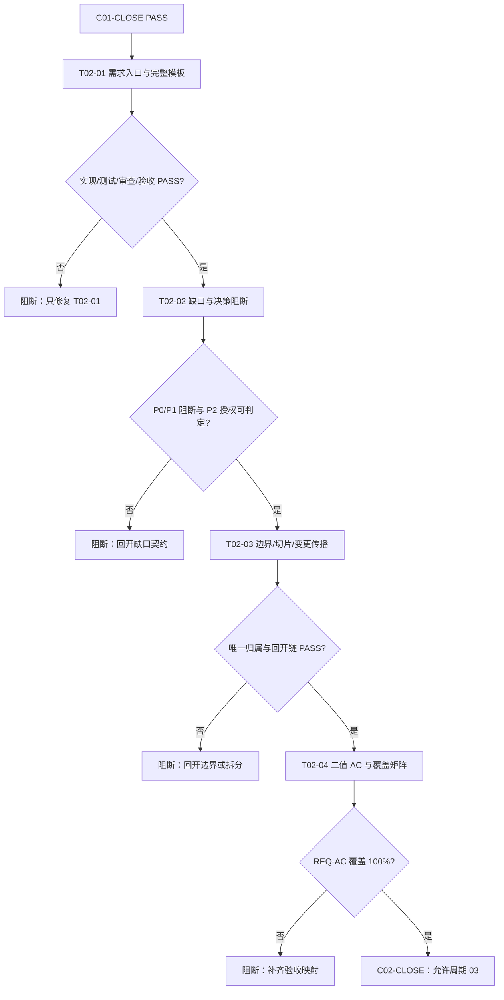

# 实施周期 02：需求入口与验收契约

## 1. 当前周期最终方案简要说明

本周期采用“模板字段冻结 + Skill 闸门冻结 + 默认提示冻结 + 正反行为测试”的垂直闭环，先让高推理模型把来源、决策、范围、切片、变更和验收口径完整写入 Markdown，再让普通模型只按稳定 ID、命令、样本和证据执行。周期 02 只修改六个需求/验收 Skill 的文档资产与默认提示，并为每个任务建立独立实现、真实测试、审查和验收证据；不修改实施规划 Skill、交付校验器、项目记忆、字典或周期 01。

## 2. Agent 对当前问题的理解

| 维度 | 冻结结论 |
| --- | --- |
| 问题 | 需求入口、缺口、边界、拆分、变更和验收模板仍允许“建议”字段，普通模型可能自行补齐关键决策，导致范围、测试和回滚不可复核。 |
| 目标 | 将六个 Skill 的模板/规则/default prompt 升级为极致完整、零决策、图形化、双向可追踪的强制契约。 |
| 本周期范围 | `requirement-intake-rules`、`acceptance-criteria-rules`、`requirement-gap-rules`、`requirement-boundary-rules`、`requirement-splitting-rules`、`requirement-change-rules` 的现有 references、SKILL 硬闸门和 `agents/openai.yaml` 默认提示；新增周期 02 测试说明、脚本和证据。 |
| 非范围 | 周期 01 文件、`implementation-planning-rules`、`artifact-delivery-gate-rules`、`skill-dictionary`、`PROJECT_*`、产品代码、数据库、外部服务和 Git 历史。 |
| 优先闭环 | `T02-01` 需求字段 -> `T02-02` 缺口/决策阻断 -> `T02-03` 边界/切片/变更回开 -> `T02-04` 二值 AC 与覆盖矩阵。 |
| 关键假设 | `C01-CLOSE` 已 PASS；六个 Skill 的现有职责边界继续有效；测试仅读取 local 工作区，不连接 test/prod。 |
| 未决决策 | 无 P0/P1 未决项。P2 规则默认值已写入 Skill 文档，由本周期测试验证；若新增业务默认值，必须回开需求文档。 |

## 3. 当前代码/文档基线

| 基线 ID | 事实 | 证据路径 | 对本周期影响 |
| --- | --- | --- | --- |
| `BASE-C02-01` | `requirement-intake-rules` 已有极致完整性标准与零决策闸门 | `requirement-intake-rules/SKILL.md`、`references/extreme-completeness-standard.md` | T02-01 复用既有 ID、N/A + 原因 + 证据（不适用项写法）、图形和追踪口径 |
| `BASE-C02-02` | acceptance Skill 已有可执行性硬闸门，但模板仍将流程图/决策表写为建议 | `acceptance-criteria-rules/SKILL.md`、`references/acceptance-template.md` | T02-04 将字段、二值断言和证据冻结到模板 |
| `BASE-C02-03` | gap/boundary/splitting/change 的 reference 与默认提示缺少统一极致字段 | 各 Skill `references/*`、`agents/openai.yaml` | T02-02/T02-03 补齐 GAP/BOUND/SLICE/CHG 契约 |
| `BASE-C02-04` | 周期 01 已冻结跨域交接、状态和 `N/A` 基线 | `doc/3-实施/2026-07-12_033322_..._实施周期01_契约与基线.md` | 周期 02 证据必须使用同一来源 ID 和状态口径；不适用项按 N/A + 原因 + 证据填写 |

## 4. 当前周期目标、边界与进入条件

### 4.1 周期目标

让普通模型从需求主文档和验收文档中直接获得来源、决策、字段、范围、切片、变更、测试、清理和回滚信息，不再需要猜测关键口径。

### 4.2 周期边界

- 只写六个 Skill 目录、`doc/3-实施/` 本周期文件和 `doc/5-tests/2026-07-12_042832/` 测试目录。
- 不改周期 01、交付校验器、项目四件套、字典和其他 Skill。
- 不调用数据库、缓存、消息队列、HTTP/RPC、test/staging/pre/release/prod/production 环境。
- 不执行 `git commit`、`push`、`merge`、`rebase` 或其他历史写入。

### 4.3 进入条件

| 条件 | 证据 | 状态 |
| --- | --- | --- |
| 周期 01 已收口 | `C01-CLOSE` 验收 PASS，父 agent 明确解除闸门 | 通过 |
| 六个 Skill 写集已确认 | 本周期任务范围与父 agent 分配 | 通过 |
| 测试时间戳已确定 | `2026-07-12_042832` | 通过 |
| local Python 可用 | `python -X utf8 --version` | 待执行测试时复核 |

### 4.4 进入条件与收口条件

#### 4.4.1 进入条件复核

进入条件已在 4.3 节逐项列出；本周期执行前由父 agent 复核并保留证据。

#### 4.4.2 收口条件

四个任务必须逐个完成实现、真实测试、审查、验收；正例全部通过，负例按预期阻断；所有新增文档和测试资产 UTF-8 可回读；无 P0/P1；本周期证据可回指具体文件、命令、样本和断言；父 agent 更新总表/总览后才允许进入周期 03。

## 5. 周期内最小任务执行顺序

图形目的：展示周期 02 四个需求/验收任务的顺序、逐任务闭环和 C02-CLOSE 放行点。关联 ID：`CYCLE-02-20260712-042832`、`T02-01`、`T02-02`、`T02-03`、`T02-04`。

## 6. 文件/符号操作契约

| 任务 | 写入文件/目录 | 符号/区段 | 只做这一件事 | 禁止触碰 |
| --- | --- | --- | --- | --- |
| `T02-01` | `requirement-intake-rules/references/requirement-structure-template.md`、`agents/openai.yaml` | 字段契约、零决策闸门、default_prompt | 冻结需求来源/决策/REQ/RULE/图形/追踪字段 | 周期 01、实施规划 Skill、校验器 |
| `T02-02` | `requirement-gap-rules/SKILL.md`、`references/missing-info-checklist.md`、`agents/openai.yaml` | GAP 矩阵、P0/P1/P2、默认授权 | 冻结缺口记录和阻断规则 | 需求边界、拆分、变更实现 |
| `T02-03` | boundary/splitting/change 三个 Skill 的 SKILL、references、agents | BOUND/SLICE/CHG 契约与回开闸门 | 冻结范围、唯一切片归属、变更传播 | acceptance 模板、实施规划正文 |
| `T02-04` | `acceptance-criteria-rules/references/acceptance-template.md`、`agents/openai.yaml` | AC 字段、二值规则、图形要求 | 冻结 REQ/RULE-AC-TEST-EVIDENCE 覆盖 | 需求业务内容、最终验收结论 |

## 7. 最小任务闭环

### 7.1 `T02-01` 需求入口与完整模板

| 字段 | 规定 |
| --- | --- |
| 任务目标 | 让每个需求条目都能由来源、决策、输入、处理、输出、异常、权限、兼容、观测、回滚和 AC 回指组成。 |
| 实现落点 | `requirement-intake-rules/references/requirement-structure-template.md` 的“极致完整性字段契约”；`agents/openai.yaml` 的 `default_prompt`。 |
| 真实测试 | `python -X utf8 doc/5-tests/2026-07-12_042832/需求与验收Skill极致完整性行为测试/test_extreme_requirements.py --case T02-01`。 |
| local 样本与断言 | 正例字符串集合包含 `SRC-*`、`DEC-*`、`REQ-*`、`RULE-*`、`AC-*`、`unresolved_decisions`、`N/A + 原因 + 证据`、`flowchart`、`sequenceDiagram`；缺任一项退出码 1。 |
| 失败预期 | 缺来源、决策、双向追踪、图形或零决策阻断字段时必须 FAIL；不得静默放行。 |
| 清理 | 测试只读现有 Skill 文件，无运行时数据写入；无需清理。 |
| 回滚 | 只删除本任务新增的模板尾部和 default prompt 变更，保留周期 02 其他任务文件与失败证据。 |
| 完成/停止 | 正例 PASS、负例 FAIL 断言均成立且 quick validator 通过；若文件被外部修改、编码异常或触达非授权文件立即停止。 |

#### 7.1.1 任务证据登记

| 证据 ID | 类型 | 命令/落点 | 状态 |
| --- | --- | --- | --- |
| `EVD-T02-01-TEST-01` | 真实测试 | `test_extreme_requirements.py --case T02-01` | PASS；正例与缺 `SRC-*` 负例均符合预期 |
| `EVD-T02-01-REVIEW-01` | 实现审查 | 父 agent 独立复核 T02-01 文件/符号与最小改动边界 | PASS；`EVD-C02-REVIEW-01` |
| `EVD-T02-01-ACCEPT-01` | 任务验收 | 父 agent 独立核对 T02-01 完成条件与停止条件 | PASS；`EVD-C02-CLOSE-ACCEPT-01` |

### 7.2 `T02-02` 缺口与决策阻断

| 字段 | 规定 |
| --- | --- |
| 任务目标 | 让普通模型无法绕过 P0/P1 缺口或无授权默认值；P2 必须可追责、可复核。 |
| 实现落点 | `requirement-gap-rules/SKILL.md`、`references/missing-info-checklist.md`、`agents/openai.yaml`。 |
| 真实测试 | `python -X utf8 doc/5-tests/2026-07-12_042832/需求与验收Skill极致完整性行为测试/test_extreme_requirements.py --case T02-02`。 |
| local 样本与断言 | 正例包含 `GAP-*`、P0/P1/P2、授权人/有效期/复核、`blocked`、发现证据、验证/清理/回滚；负例移除任一关键字段后退出码 1。 |
| 失败预期 | 仅写“待确认”或“执行模型判断”必须 FAIL；P0/P1 不得被标记可进入 AC/实施。 |
| 清理/回滚 | 只读测试无数据清理；回滚仅撤销本任务三个文件的新增规则。 |
| 完成/停止 | 正反样例结果符合预期；发现默认值无授权、来源不明或写集冲突即停止并保留证据。 |

#### 7.2.1 任务证据登记

| 证据 ID | 类型 | 命令/落点 | 状态 |
| --- | --- | --- | --- |
| `EVD-T02-02-TEST-01` | 真实测试 | `test_extreme_requirements.py --case T02-02` | PASS；正例与缺 `GAP-*` 负例均符合预期 |
| `EVD-T02-02-REVIEW-01` | 实现审查 | 父 agent 独立复核 T02-02 文件/符号与 P0/P1/P2 口径 | PASS；`EVD-C02-REVIEW-01` |
| `EVD-T02-02-ACCEPT-01` | 任务验收 | 父 agent 独立核对 T02-02 完成条件与停止条件 | PASS；`EVD-C02-CLOSE-ACCEPT-01` |

### 7.3 `T02-03` 边界、切片与变更传播

| 字段 | 规定 |
| --- | --- |
| 任务目标 | 冻结唯一范围归属、垂直切片闭环、无环依赖和 CHG 变更回开链。 |
| 实现落点 | boundary `BOUND-*`、splitting `SLICE-*`、change `CHG-*` 的 references/SKILL/default prompt。 |
| 真实测试 | `python -X utf8 doc/5-tests/2026-07-12_042832/需求与验收Skill极致完整性行为测试/test_extreme_requirements.py --case T02-03`。 |
| local 样本与断言 | 正例同时含 In/Out Scope、唯一归属、文件/符号、依赖 DAG、实现-测试-审查-验收、CHG 原值/新值/回开；负例重复归属或缺回开字段必须 FAIL。 |
| 失败预期 | 边界变化只改段落、不更新图/矩阵/验收/周期时必须 FAIL；P0/P1 未决不得生成可执行切片。 |
| 清理/回滚 | 只读测试无数据写入；回滚分别撤销 boundary/splitting/change 三组新增条款。 |
| 完成/停止 | 三个 Skill 正反样例均符合预期且 quick validator 通过；依赖无法裁决或触达实施规划文件即停止。 |

#### 7.3.1 任务证据登记

| 证据 ID | 类型 | 命令/落点 | 状态 |
| --- | --- | --- | --- |
| `EVD-T02-03-TEST-01` | 真实测试 | `test_extreme_requirements.py --case T02-03` | PASS；正例与缺 `BOUND-*` 负例均符合预期 |
| `EVD-T02-03-REVIEW-01` | 实现审查 | 父 agent 独立复核 T02-03 唯一归属、DAG 与 CHG 回开链 | PASS；`EVD-C02-REVIEW-01` |
| `EVD-T02-03-ACCEPT-01` | 任务验收 | 父 agent 独立核对 T02-03 完成条件与停止条件 | PASS；`EVD-C02-CLOSE-ACCEPT-01` |

### 7.4 `T02-04` 验收场景与覆盖矩阵

| 字段 | 规定 |
| --- | --- |
| 任务目标 | 将可观察需求转为二值 AC，并要求主/异常/边界/权限兼容路径可执行且可追踪。 |
| 实现落点 | `acceptance-criteria-rules/references/acceptance-template.md`、`agents/openai.yaml`。 |
| 真实测试 | `python -X utf8 doc/5-tests/2026-07-12_042832/需求与验收Skill极致完整性行为测试/test_extreme_requirements.py --case T02-04`。 |
| local 样本与断言 | 正例含 AC 字段、PASS/FAIL、REQ/RULE 回指、local 命令/样本/断言、失败预期、清理/回滚、flowchart/sequenceDiagram；孤立 AC 或抽象表述负例必须 FAIL。 |
| 失败预期 | 缺任一关键路径、清理/回滚、测试入口或证据字段时必须 FAIL；REQ-AC 覆盖不足不得放行。 |
| 清理/回滚 | 只读测试无数据清理；回滚仅撤销 acceptance 模板和 default prompt 新增条款。 |
| 完成/停止 | 正例 PASS、负例 FAIL、六个 Skill quick validator 全部通过；发现需求仍不可观察或覆盖率不足即停止。 |

#### 7.4.1 任务证据登记

| 证据 ID | 类型 | 命令/落点 | 状态 |
| --- | --- | --- | --- |
| `EVD-T02-04-TEST-01` | 真实测试 | `test_extreme_requirements.py --case T02-04` | PASS；正例与缺 `AC-*` 负例均符合预期 |
| `EVD-T02-04-REVIEW-01` | 实现审查 | 父 agent 独立复核 T02-04 二值 AC、图形与 REQ-AC 追踪 | PASS；`EVD-C02-REVIEW-01` |
| `EVD-T02-04-ACCEPT-01` | 任务验收 | 父 agent 独立核对 T02-04 完成条件与停止条件 | PASS；`EVD-C02-CLOSE-ACCEPT-01` |

## 8. 当前周期验证矩阵

| 验证 ID | 覆盖对象 | 入口/命令 | 通过标准 | 状态 |
| --- | --- | --- | --- | --- |
| `TEST-C02-01` | T02-01 需求模板/default prompt | `test_extreme_requirements.py --case T02-01` | 正例字段全在，缺字段负例 FAIL | PASS（`EVD-T02-01-TEST-01`） |
| `TEST-C02-02` | T02-02 缺口分级/阻断 | 同上 `--case T02-02` | GAP/P0/P1/P2/授权/blocked 可判定 | PASS（`EVD-T02-02-TEST-01`） |
| `TEST-C02-03` | T02-03 边界/切片/变更 | 同上 `--case T02-03` | BOUND/SLICE/CHG 唯一归属与回开可判定 | PASS（`EVD-T02-03-TEST-01`） |
| `TEST-C02-04` | T02-04 AC/REQ 覆盖 | 同上 `--case T02-04` | 二值 AC、异常边界、清理回滚和覆盖可判定 | PASS（`EVD-T02-04-TEST-01`） |
| `TEST-C02-05` | 六个 Skill 结构合法性 | `python -X utf8 .system/skill-creator/scripts/quick_validate.py <skill>`（逐目录） | 六个 Skill 全部 PASS | PASS（`EVD-C02-TEST-02`） |
| `TEST-C02-06` | UTF-8 与写集边界 | PowerShell `Get-Content -Encoding UTF8`、`git diff --check` | 中文无乱码、无非授权文件 | PASS（`EVD-C02-TEST-03`；工作树含父 agent 既有改动，未越界写入） |

## 9. 周期阻断、停止与回滚

### 9.1 立即阻断

- 任一 `P0/P1` 未决、默认值无授权或 `unresolved_decisions` 与状态不一致。
- 需求、边界、切片、变更、AC 任一 ID 孤立、重复或无法双向追踪。
- 负向测试放行、正向测试失败、quick validator 失败、UTF-8/Markdown 失真或链接/图形口径不一致。
- 写集越界修改周期 01、实施规划 Skill、交付校验器、项目记忆、字典或产品代码。
- 任何测试尝试连接非 local 环境，或需要真实外部服务才能完成断言。

### 9.2 停止/结束条件

| 类型 | 条件 |
| --- | --- |
| 任务停止 | 当前任务正反行为测试未通过、关键文件被外部修改、测试命令不可用或出现非 local 连接。 |
| 周期停止 | 四个任务未逐个完成实现/测试/审查/验收，或存在 P0/P1、孤立 ID、覆盖率不足。 |
| 周期结束 | `TEST-C02-01` 至 `TEST-C02-06` PASS，四个任务证据完整，周期文档和测试 README 互相回指，父 agent 完成总表/总览同步。 |
| 最大推进边界 | 只推进六个需求/验收 Skill 的文档契约与行为测试；不得进入周期 03 的实施规划 Skill 改造。 |

### 9.3 回滚

1. 规则文本错误：只撤销对应 Skill 目录本任务新增内容，保留其他周期 02 文件和失败 fixture。
2. 测试失败：保留失败输出，修复同一任务后重新运行；不得删除失败证据或跳到下一任务。
3. 写集冲突：停止写入，重新读取当前文件，由父 agent 裁决合并；不得覆盖外部改动。
4. 发现周期边界突破：标记本周期阻断，撤销越界文件，保留审查证据；不使用破坏性 Git 命令。

## 10. 自审结论

| 检查项 | 结果 | 证据 |
| --- | --- | --- |
| 周期只做一件事 | 通过 | 六个需求/验收 Skill 的极致完整性契约与行为测试 |
| 任务顺序与唯一归属 | 通过 | 第 5 节 Mermaid 与第 7 节四个任务契约 |
| 文件/符号落点 | 通过 | 第 6 节写集矩阵与各任务实现落点 |
| 真实测试与失败预期 | 通过 | 第 7、8 节 local 命令、样本、断言、负向预期 |
| 停止、阻断、回滚、最大推进边界 | 通过 | 第 9 节 |
| `unresolved_decisions` 与 N/A 证据 | 通过 | 第 2、7、9 节 |
| 图形化表达 | 通过 | 第 5 节 Mermaid flowchart；需求/验收模板冻结 flowchart/sequenceDiagram |
| 当前状态 | 已收口；四个任务实现/测试/审查/验收均 PASS | `EVD-C02-TEST-01`、`EVD-C02-TEST-02`、`EVD-C02-TEST-03`、`EVD-C02-REVIEW-01`、`EVD-C02-CLOSE-ACCEPT-01` |

**本次改动点**：新增周期 02 实施文档，冻结 T02-01 至 T02-04 的字段、文件/符号、真实测试、失败预期、清理/回滚、停止边界和证据链；未修改周期 01、实施规划 Skill、交付校验器、字典或项目记忆。

图片资产决策：N/A + 原因 + 证据：本周期只升级需求入口与验收契约，不展示具体 UI、截图或真实产物；真实图片由 CYCLE-05/T05-03 的 local fixture 验证。
