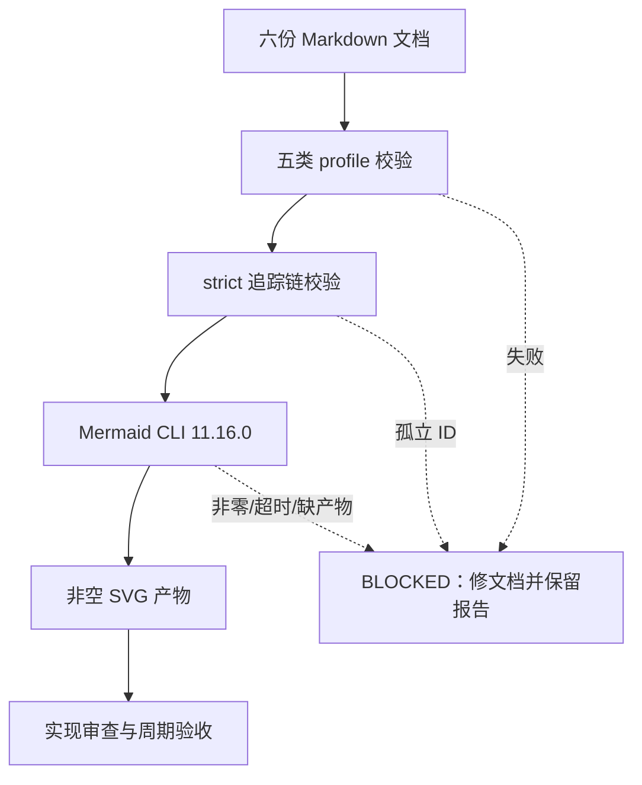
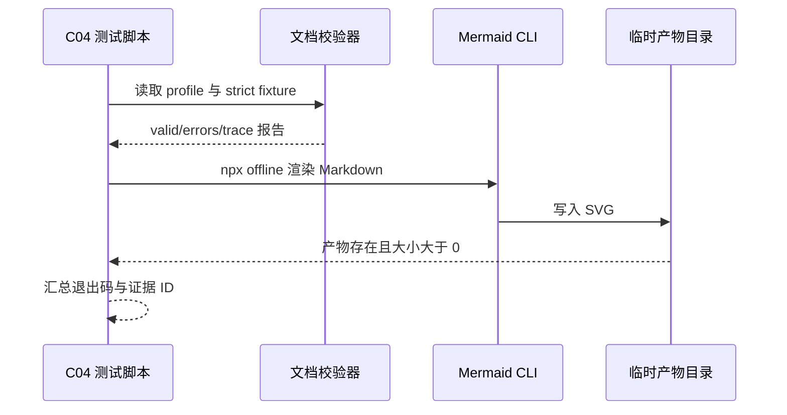

# 实施周期 04：机械校验与图形验证

## 1. 当前周期最终方案简要说明

采用“严格追踪 CLI + 正反 fixture + Mermaid CLI 真解析”的方案：先验证 `REQ -> AC -> CYCLE -> TASK -> TEST -> EVIDENCE` 链和五类文档 profile，再用本机 npm 缓存中的 Mermaid CLI `11.16.0` 对当前六份 Markdown 逐份渲染，要求退出码为 `0` 且生成非空 SVG。任何缺链、缺字段、孤立证据、图形语法错误或无产物都阻断收口。

## 2. 当前周期目标、边界与进入条件

| 维度 | 冻结内容 |
| --- | --- |
| 周期目标 | 将文档完整性、跨文档追踪和 Mermaid 图形从人工约定变成可重复的 local CLI/测试断言 |
| 纳入范围 | `validate_engineering_docs.py` 严格模式、单元测试、周期 04 测试脚本/fixtures、六份当前文档的 profile 与 Mermaid 真解析 |
| 非范围 | 产品代码、数据库、外部服务、历史文档批量迁移、Git 历史写入、周期 05 知识收口 |
| 进入条件 | 周期 03 `C03-CLOSE` PASS；Python、Node/npm 和离线 Mermaid 包可用；当前六份文档已落盘 |
| 关键假设 | `npx --offline --yes @mermaid-js/mermaid-cli` 使用本机 npm 缓存，不进行网络回退 |
| 未决决策 | 无 P0/P1；若离线包缺失，状态必须 `blocked`，不得以静态检查替代真解析 |

## 当前代码/文档基线

| 基线对象 | 当前事实 | 证据 |
| --- | --- | --- |
| 校验器 | 已支持五类 profile、UTF-8、ID、链接、N/A 理由校验和 Mermaid 前置检查 | `artifact-delivery-gate-rules/scripts/validate_engineering_docs.py` |
| 上游文档 | 需求、验收、总表、总览和周期 01-03 已落盘 | 周期 03 收口证据 |
| Mermaid 工具 | 本机 npm 缓存可提供 `@mermaid-js/mermaid-cli` 11.16.0 | `npx --offline --yes @mermaid-js/mermaid-cli` |
| Git 边界 | 当前轮不写入历史 | front matter `baseline_commit` |

## 3. 图形化执行路径

图形目的：展示周期 04 从 profile、strict 追踪到 Mermaid 真解析和非空 SVG 的执行顺序。关联 ID：`CYCLE-04-20260712-045805`、`TEST-C04-01`、`TEST-C04-03`。

图形目的：展示校验顺序和阻断点。关联 ID：`TEST-C04-01`、`TEST-C04-02`、`EVD-T04-02-TEST-01`。

图形目的：明确测试脚本、校验器、Mermaid CLI 和临时文件的边界。关联 ID：`EVD-T04-01-TEST-01`、`EVD-T04-02-TEST-01`。

## 4. 文件/符号操作契约

| 任务 | 文件/符号 | 唯一目标 | 真实测试 | 停止条件 | 回滚 |
| --- | --- | --- | --- | --- | --- |
| `T04-01` | `artifact-delivery-gate-rules/scripts/validate_engineering_docs.py` 的 `check_strict_trace`、`check_mermaid_syntax`；对应 unittest | 让 strict 追踪和明显 Mermaid 语法错误可机械判定 | `python -X utf8 -m unittest artifact-delivery-gate-rules/tests/test_validate_engineering_docs.py -v` | 追踪链缺 ID、孤立任务或负向 fixture 放行 | 只撤销 strict/语法检查和新增单测 |
| `T04-02` | `doc/5-tests/2026-07-12_045805/artifact_delivery_gate_rules/test_cycle04_gate_and_mermaid.py`、fixtures、六份当前文档 | 证明 Mermaid CLI 真解析并生成非空 SVG | `python -X utf8 doc/5-tests/2026-07-12_045805/artifact_delivery_gate_rules/test_cycle04_gate_and_mermaid.py` | npx/离线包不可用、任一文档非零或 SVG 为空 | 只删除周期 04 测试资产和临时产物，不改上游文档 |

每个任务预计触达文件不超过 5 个；测试仅使用 local 仓库、本机 Python 和 npm 缓存，不写运行时数据。

## 周期内最小任务执行顺序

| 顺序 | 任务 | 前置 | 输出 | 停止条件 |
| ---: | --- | --- | --- | --- |
| 1 | `T04-01` | C03 收口 | strict/profile 校验器和单元测试 | 任一追踪链或负向 fixture 误放行 |
| 2 | `T04-02` | T04-01 PASS | Mermaid CLI 真解析报告与 SVG | npx 非零、离线包缺失或 SVG 为空 |

两个任务必须按顺序完成实现、真实测试、审查和验收；不得跨周期并行修改同一文档。

## 5. 任务闭环与证据

## 最小任务闭环

每个任务均按“实现 -> 真实测试 -> 审查 -> 验收”闭环。`T04-01` 负责追踪与静态语法，`T04-02` 负责 Mermaid 真解析；任一任务未给出 `IMPL/TEST/REVIEW` 证据时，周期状态只能保持 `进行中` 或 `已阻断`。

### 5.1 `T04-01` 严格追踪与 profile 集成

目标：校验短任务/证据 ID、任务唯一周期归属、`IMPL/TEST/REVIEW` 证据类别和完整追踪链；负向 fixture 缺 REVIEW 时必须失败。

证据：`EVD-T04-01-IMPL-01`（strict/语法实现）、`EVD-T04-01-TEST-01`（单元测试 9/9）、`EVD-T04-01-REVIEW-01`（审查）、`EVD-T04-01-ACCEPT-01`（验收）。

### 5.2 `T04-02` Mermaid 真解析与图文一致性

目标：使用 `npx --offline --yes @mermaid-js/mermaid-cli` 对需求、验收、实施总览、周期 01/02/03 六份文档逐份渲染；每份退出码 `0`，生成非空 SVG，总产物不少于 8 个。

证据：`EVD-T04-02-IMPL-01`（测试脚本/fixture）、`EVD-T04-02-TEST-01`（3 tests OK、真实 SVG）、`EVD-T04-02-REVIEW-01`（范围与产物审查）、`EVD-T04-02-ACCEPT-01`（验收）。

## 6. 验证矩阵

## 当前周期验证矩阵

| 验证 ID | 覆盖 | 通过标准 | 状态 |
| --- | --- | --- | --- |
| `TEST-C04-01` | strict 正反 fixture | 完整链 PASS，孤立任务 BLOCKED | PASS |
| `TEST-C04-02` | 六份 profile | 全部 `valid: true` | PASS |
| `TEST-C04-03` | Mermaid CLI 真解析 | 6 份文档退出码 0，非空 SVG >= 8 | PASS |
| `TEST-C04-04` | Mermaid 负向静态 fixture | 失衡 delimiter 被拒绝 | PASS |
| `TEST-C04-05` | UTF-8/差异 | AST、UTF-8、`git diff --check` 无错误 | PASS |

## 7. 回滚与停止条件

- 任一 profile、strict、fixture 或 Mermaid 解析失败，立即停止在当前任务，保留 JSON/终端/产物证据。
- Mermaid CLI 超时、离线依赖缺失或生成空 SVG 时，状态为 `blocked`；不得改写成 PASS，也不得联网回退。
- 修复只允许触碰当前任务写集；不得使用破坏性 Git 命令或删除上游周期证据。

## 8. 收口结论

## 自审结论

| 检查项 | 结果 | 证据 |
| --- | --- | --- |
| 当前代码/文档基线 | 通过 | 基线表与 C03 收口证据 |
| 最小任务顺序与唯一归属 | 通过 | `T04-01` -> `T04-02` |
| 文件/符号、真实测试、停止条件和回滚 | 通过 | 第 4、7 节 |
| Mermaid 真解析与非空产物 | 通过 | `EVD-T04-02-TEST-01` |

`C04-CLOSE` PASS。严格追踪、五类 profile、负向 fixture 和 Mermaid CLI 真解析均已通过；允许进入周期 05 的全局同步与最终验收。

图片资产决策：N/A + 原因 + 证据：本周期只验证机器校验和 Mermaid 真解析，不展示具体 UI、截图或真实产物；真实图片由 CYCLE-05/T05-03 的 local fixture 验证。
