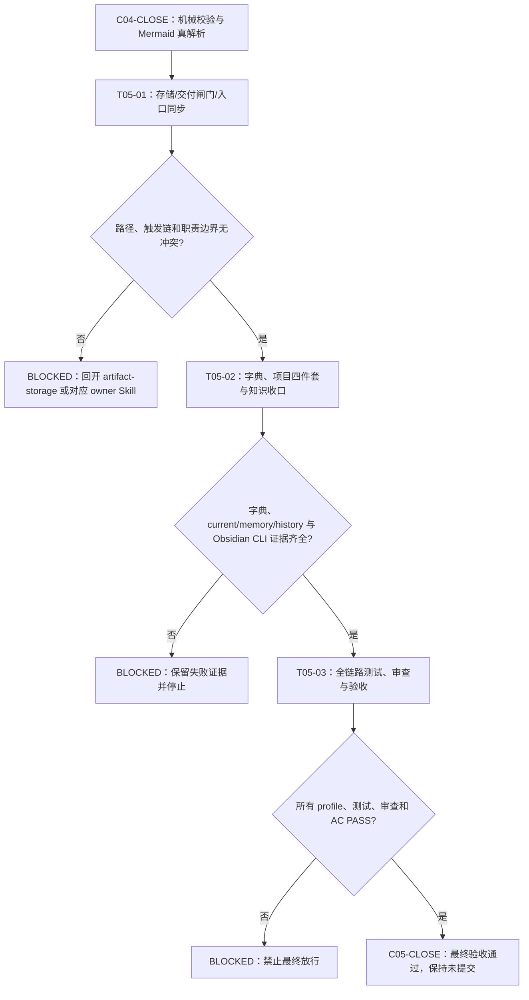
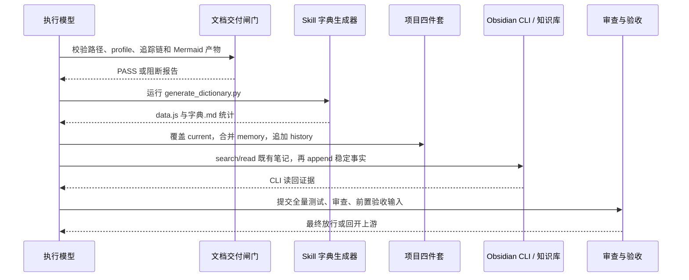

# 实施周期 05：全局同步与最终验收

## 1. 当前周期最终方案简要说明

采用“入口同步 -> 知识收口 -> 全链路放行”的单向收口方案：先核对存储路径、交付闸门、仓库规则和 Skill 入口不存在第二真相源，再刷新字典并维护项目四件套，随后通过固定 vault 的 Obsidian CLI 检索既有笔记并追加本轮可复用事实，最后运行全量验证、实现审查、前置验收和最终验收。任一入口冲突、敏感信息、P0/P1、未闭环任务或 CLI 阻断都必须停在当前任务，不能以总结文字替代证据。

## 2. 当前周期目标、边界与进入条件

| 维度 | 冻结内容 |
| --- | --- |
| 周期目标 | 将周期 01-04 的规则资产同步到存储、仓库入口、字典、项目记忆和知识库，并形成可追溯的最终放行证据 |
| 纳入范围 | `artifact-storage-rules` 路径与更新策略、`artifact-delivery-gate-rules` profile/校验器、`AGENTS.md`/`CLAUDE.md`/`编码skill.md`、受影响 Skill 入口、字典、项目四件套、Obsidian 知识笔记、全量测试/审查/验收文档 |
| 非范围 | 产品运行代码、业务 API/数据库、外部服务联调、test/prod/staging 连接、历史文档批量迁移、Git commit/push/rebase/merge |
| 进入条件 | `EVD-C04-CLOSE-ACCEPT-01` 已存在；周期 04 profile、strict fixture 和 Mermaid 真解析均 PASS；`D:\obsidian_data` 已注册为固定 vault |
| 关键假设 | `D:\obsidian_data\知识库` 是唯一知识工作区；字典由生成脚本刷新；项目当前状态覆盖写入，项目历史只追加；所有运行命令使用 `python -X utf8` 或等价 UTF-8 入口 |
| 未决决策 | 无 P0/P1；任何发现的新决策必须回开需求/验收/实施上游，不得在本周期临时脑补 |

## 3. 图形化执行路径

图形目的：展示周期 05 从入口同步、记忆/字典收口到最终验收的执行顺序。关联 ID：`CYCLE-05-20260712-061500`、`T05-01`、`T05-02`、`T05-03`。

图形目的：冻结周期 05 的执行顺序、三处阻断点和唯一放行出口。关联 ID：`CYCLE-05`、`T05-01`、`T05-02`、`T05-03`、`EVD-C05-CLOSE-ACCEPT-01`。

图形目的：明确项目本地记忆和 Obsidian vault 的边界，以及最终验收依赖的真实输入。关联 ID：`TEST-C05-02`、`TEST-C05-03`、`EVD-T05-02-TEST-01`。

## 4. 当前代码/文档基线

| 基线对象 | 当前事实 | 证据入口 |
| --- | --- | --- |
| 文档 profile 与校验器 | 支持五类 profile、`--strict`、任务唯一周期归属、证据类别和 Mermaid 前置检查 | `artifact-delivery-gate-rules/scripts/validate_engineering_docs.py`、周期 04 测试 |
| 需求/验收/实施入口 | 需求、验收、总表、实施总览、周期 01-04 已落盘且使用 `REQ-DOC-20260712-033322` | 本总览、总表及周期 01-04 文档 |
| 规则入口 | 需求、验收、实施规划、交付闸门已具备极致完整性和零决策约束 | `requirement-intake-rules`、`acceptance-criteria-rules`、`implementation-planning-rules`、`artifact-delivery-gate-rules` |
| 知识入口 | `D:\obsidian_data` 注册为 vault，`知识库/20-Knowledge/需求与实施文档零决策交接.md` 已存在 | `obsidian version`、`obsidian vaults verbose`、CLI `search/read` |
| Git 边界 | 当前轮未授权历史写入，所有证据来自工作树 | `baseline_commit` front matter、`git status --short` |

## 5. 周期内最小任务执行顺序

| 顺序 | 任务 ID | 阶段 | 单一目标 | 输入 | 输出 | 进入条件 | 收口条件 |
| ---: | --- | --- | --- | --- | --- | --- | --- |
| 1 | `T05-01` | `S05` 全局同步 | 校验存储路径、交付 gate、仓库规则和 Skill 入口的一致性 | `C04-CLOSE`、path-map、update-policy、现有入口 | 入口同步清单与 `EVD-T05-01-IMPL-01` | 周期 04 已收口 | path-map、规则入口、profile 和当前总表互相可回指 |
| 2 | `T05-02` | `S05` 全局同步 | 刷新字典，更新项目四件套，并经 CLI 检索后沉淀稳定知识 | `T05-01` 收口、稳定事实和既有 vault 笔记 | 字典、current/memory/history、Obsidian CLI 证据 | T05-01 PASS，CLI 前置可用 | 无敏感信息，字典可重建，记忆职责不串位，vault 读回一致 |
| 3 | `T05-03` | `S05` 最终验收 | 运行全量 profile/行为测试、项目改动审查、前置验收和最终验收，并执行真实 imagegen | `T05-02` 全部证据 | 测试 README、审查文档、C05 close 验收证据和最终验收 | 机器校验/回归/审查及 imagegen PASS | 图片真实生成、签名、`view_image` 和最终验收全部通过 |

## 6. 文件/符号操作契约

| 任务 | 文件/符号 | 唯一修改动作 | 真实测试与断言 | 停止条件 | 回滚 |
| --- | --- | --- | --- | --- | --- |
| `T05-01` | `artifact-storage-rules/references/path-map.yaml`、`update-policy.md`、`AGENTS.md`、`CLAUDE.md`、`编码skill.md`、四个 owner Skill 入口 | 只同步本轮已冻结的路径、触发链和交付 gate 口径；不创建平行规则 | `test_cycle05_global_sync.py` 检查入口存在、关键短语、路径落点和无重复主入口 | 任一入口给出不同根目录、不同 owner 或不同交付 gate | 只撤销本任务新增同步内容，保留失败报告 |
| `T05-02` | `skill-dictionary/data.js`、`字典.md`、`PROJECT_CURRENT.md`、`PROJECT_MEMORY.md`、`PROJECT_HISTORY.md`、Obsidian note | 运行生成脚本；current 覆盖；memory 合并稳定规则；history 追加；vault 先 search/read 后按沉淀规则 append；集成测试只读回既有笔记 | `generate_dictionary.py` 成功；四件套 UTF-8/大小/职责检查；CLI `version/vaults/search/read` 读回；敏感 diff 扫描 | CLI 不可用、vault 路径不一致、敏感扫描命中或生成物与源文件不一致 | 恢复本任务前的项目记忆文件；不得用文件系统 fallback 修改 vault |
| `T05-03` | `doc/5-tests/2026-07-12_061500/`、`doc/6-审查/`、`doc/7-验收/`、最终验收文档 | 只落盘验证结果、审查结论和验收结论；不修改业务代码 | 全量 profile、单元/集成测试、Mermaid CLI、quick validator、字典生成、diff check 均返回 PASS | 任一 P0/P1、测试非零、覆盖不足、审查 FAIL 或工作树被意外提交 | 只撤销本任务证据文档，保留原始失败日志，不回滚已验收规则资产 |

## 7. 最小任务闭环

### 7.1 `T05-01` 存储、交付闸门和入口同步

实现证据：`EVD-T05-01-IMPL-01`。测试证据：`EVD-T05-01-TEST-01`。审查证据：`EVD-T05-01-REVIEW-01`。验收证据：`EVD-T05-01-ACCEPT-01`。

通过标准：`path-map.yaml` 的需求、实施、测试、审查、验收根目录与实际目录一致；同一来源对象只保留一份主需求、实施总览、最终验收入口；四个 owner Skill 都引用公共交接契约和对应 profile；`AGENTS.md` 与 `CLAUDE.md` 的平台规则语义一致。

### 7.2 `T05-02` 字典、项目记忆与知识收口

实现证据：`EVD-T05-02-IMPL-01`。测试证据：`EVD-T05-02-TEST-01`。审查证据：`EVD-T05-02-REVIEW-01`。验收证据：`EVD-T05-02-ACCEPT-01`。

通过标准：字典生成器退出码为 `0` 且 `implemented_total`/`planned_missing` 可读；`PROJECT_CURRENT.md` 只记录当前状态，`PROJECT_MEMORY.md` 只记录稳定规则和机器索引区，`PROJECT_HISTORY.md` 仅追加本轮关键事件；Obsidian CLI 先检索既有笔记，再把本轮稳定的文档零决策交接规则追加到同一知识笔记，不写入 token、密钥或未脱敏路径。

### 7.3 `T05-03` 全链路行为测试、审查与验收

实现证据：`EVD-T05-03-IMPL-01`。测试证据：`EVD-T05-03-TEST-01`。审查证据：`EVD-T05-03-REVIEW-01`。验收证据：`EVD-T05-03-ACCEPT-01`。

通过标准：需求、验收、实施总表、实施总览和周期 01-05 的 profile 全部 `valid: true`；周期 04 Mermaid CLI 真实解析仍为退出码 `0` 且 SVG 非空；四个 owner Skill quick validator 通过；校验器单测、周期 02/03/04 集成测试、周期 05 全局同步测试全部通过；当前改动总审查无 P0/P1；前置验收、真实 imagegen 和最终验收逐条 PASS。以上条件已全部满足，本任务 accepted。

## 8. 当前周期验证矩阵

| 验证 ID | 覆盖范围 | 真实入口 | 通过断言 | 预期状态 |
| --- | --- | --- | --- | --- |
| `TEST-C05-01` | 存储路径、入口和 owner Skill | `test_cycle05_global_sync.py` | 根目录、主入口、契约/profile 引用无冲突 | PASS |
| `TEST-C05-02` | 字典与项目四件套 | `python -X utf8 skill-dictionary/generate_dictionary.py` + UTF-8/职责检查 | 生成成功、current <= 51,200 bytes、history 只追加、无敏感值 | PASS |
| `TEST-C05-03` | Obsidian 固定 vault | `obsidian version`、`vaults verbose`、`search`、`read` | vault 为 `D:\obsidian_data`，既有笔记先检索，集成测试只读回已沉淀内容；append 由 T05-02 的独立 CLI 操作记录负责 | PASS |
| `TEST-C05-04` | 五类 profile 与严格追踪 | `validate_engineering_docs.py`、周期 04 fixture | 七份当前文档 valid，正反 strict fixture 结论正确 | PASS |
| `TEST-C05-05` | Mermaid 真解析 | `npx --offline --yes @mermaid-js/mermaid-cli` | 当前所有 Mermaid 代码块退出码 0，SVG 非空 | PASS |
| `TEST-C05-06` | Skill 与全链路回归 | `quick_validate.py`、校验器 unittest、周期 02/03/04/05 测试脚本 | 所有命令退出码 0，无 P0/P1 | PASS |
| `TEST-C05-07` | 真实 Markdown 图片生成 | `imagegen` 使用 `gpt-image-2` | 使用当前授权配置生成 `markdown-image-workflow.diagram-v1.png`（867168 bytes，1254x1254，PNG 签名有效），完成 `view_image`、`check_images` 和 `check_orphan_images`；临时资产已清理 | PASS |

## 9. 周期阻断、停止与回滚

- 若存储路径、owner Skill、仓库规则和 profile 出现冲突，立即停止 `T05-01`，回开 `artifact-storage-rules` 或具体 owner，不得在总表里保留双口径。
- 若 `obsidian version`、`vaults verbose`、`search` 或 `read` 失败，立即停止 `T05-02` 并记录 `Obsidian:阻断`；不得使用 `rg`、`Get-Content`、Python 或 Node 直接读写 vault 代替 CLI。需要追加时仍必须先 search/read 并保留 CLI 回读证据。
- 若字典生成、四件套编码/职责检查或敏感信息扫描失败，保留失败输出并停止 `T05-02`；不得把部分生成物声明为收口。
- 若任一测试、审查或验收未完成，立即停止 `T05-03`，最终验收只能写“未满足最终验收前置条件”，不得写通过。
- 若真实 imagegen 失败，立即停止 `T05-03`，保留脱敏失败摘要并清理临时输出；本次使用 `https://xm.aceapi.cc/v1` 的 `gpt-image-2` 已成功生成 PNG，并完成签名、`view_image`、图片 validator 和孤儿扫描。
- 回滚只允许撤销本周期新写入的文档和知识追加；周期 01-04 已验收资产保持不变，禁止使用破坏性 Git 命令。

## 10. 周期收口证据

| 证据 ID | 类型 | 证据位置 | 结论 |
| --- | --- | --- | --- |
| `EVD-T05-01-IMPL-01` | IMPL | 本文第 4-6 节及入口同步清单 | 存储、owner 和 gate 口径已冻结 |
| `EVD-T05-01-TEST-01` | TEST | `doc/5-tests/2026-07-12_061500/` | 路径和触发链测试 PASS |
| `EVD-T05-01-REVIEW-01` | REVIEW | `doc/6-审查/2026-07-12_061500_需求与实施文档极致完备化_周期05_实现审查.md` | 无入口冲突 |
| `EVD-T05-02-IMPL-01` | IMPL | 字典、项目四件套和 Obsidian CLI 收口记录 | 稳定事实已按职责落盘 |
| `EVD-T05-02-TEST-01` | TEST | 周期 05 测试 README 与 CLI 读回记录 | 生成、编码、vault 读回 PASS |
| `EVD-T05-02-REVIEW-01` | REVIEW | 周期 05 实现审查文档 | 无敏感信息、无职责串位 |
| `EVD-T05-03-IMPL-01` | IMPL | 全量测试、审查和验收输入清单 | 放行输入完整 |
| `EVD-T05-03-TEST-01` | TEST | 周期 05 测试脚本、周期 02-04 测试和单测输出 | 全量回归 PASS |
| `EVD-T05-03-REVIEW-01` | REVIEW | 当前改动总审查 | P0/P1 为 0 |
| `EVD-T05-03-ACCEPT-01` | ACCEPT | `doc/7-验收/2026-07-12_061500_需求与实施文档极致完备化_C05-CLOSE-验收证据.md` | 周期 05 验收 PASS，真实 imagegen 与图片闭环证据齐全 |

## 11. 自审结论

| 检查项 | 结果 | 证据 |
| --- | --- | --- |
| 周期目标、范围、非范围和进入条件 | 通过 | 第 2 节 |
| 三项任务唯一归属、顺序和写集 | 通过 | 第 5-6 节、`T05-01` 至 `T05-03` |
| 文件/符号、真实测试、断言和停止条件 | 通过 | 第 6-9 节 |
| 追踪链与证据类别 | 通过 | 第 10 节及 `EVD-T05-*` |
| 图形化执行顺序与阻断路径 | 通过 | 第 3 节 Mermaid flowchart/sequenceDiagram |
| 回滚和 Git 边界 | 通过 | 第 6、9 节；未执行历史写入 |
| 当前周期最终验收 | 通过 | `EVD-C05-CLOSE-ACCEPT-01`；真实 imagegen、图片引用和 validator 证据 |

## 12. 收口结论

`C05-CLOSE` PASS。周期 05 已完成入口同步、字典与项目记忆收口、固定 vault 知识沉淀、全链路回归、项目改动审查、真实 imagegen、图片引用/清单验证和最终验收。本轮保持工作树未提交，未使用伪图或占位图。

图片资产决策：N/A + 原因 + 证据：本周期文档记录同步与验收流程；真实图片生成与引用仅在独立 local fixture 中验证，未将临时资产提交到仓库。
