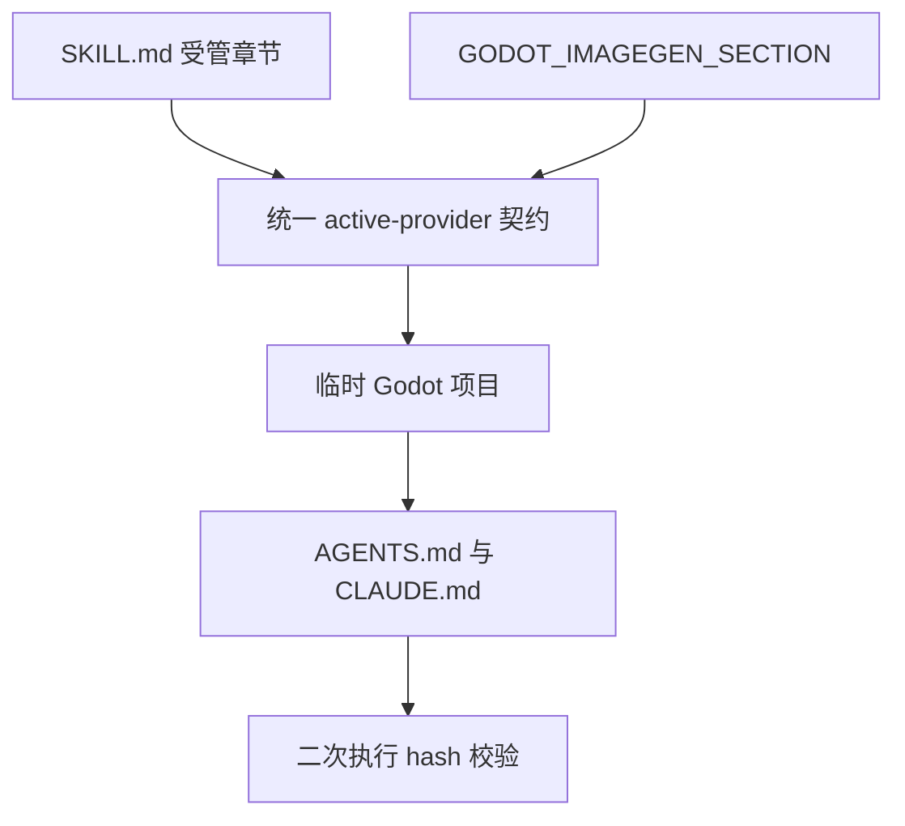

# project-agents-bootstrap 图像配置：实施周期 01 模板契约

## 1. 当前代码/文档基线

- `F:\luode-skills\project-agents-bootstrap\SKILL.md` 当前写入固定 `https://api.openai.com/v1` 和 `gpt-image-1`。
- `F:\luode-skills\project-agents-bootstrap\scripts\bootstrap_agents.sh` 的 `GODOT_IMAGEGEN_SECTION` 与 Skill 文档不一致，且同样固定 OpenAI。
- 基线提交：`f894b924d14a00d2524ab4829ba2a7bc4bf59ac9`。
- 本周期不修改 imagegen 运行时。

## 2. 当前周期目标、边界与进入条件

- 周期目标：将两个受管模板统一为 active-provider 读取契约。
- 范围：现有图像生成配置章节和 heredoc 模板。
- 进入条件：`IMPL-IMAGE-CHANNEL-OVERVIEW-20260712` 已落盘，契约稳定。
- 收口条件：生成配置无固定 OpenAI URL、模型为 `gpt-image-2`、回退配置为空、重复执行幂等。

## 3. 周期内最小任务执行顺序

| 顺序 | 任务 | 文件/符号 | 前置 | 后置 |
|---|---|---|---|---|
| 1 | `TASK-01` | `SKILL.md`、`GODOT_IMAGEGEN_SECTION` | `TASK-00` | `TASK-02` |

## 4. 文件与符号操作契约

| 文件 | 允许修改 | 禁止修改 |
|---|---|---|
| `project-agents-bootstrap/SKILL.md` | 现有图像生成配置正文 | `description`、标题、其他章节 |
| `bootstrap_agents.sh` | `GODOT_IMAGEGEN_SECTION` heredoc | 同步流程、其他受管区块 |

模板固定内容：`codex-auth:active_provider_api_key`、`codex-config:active_provider_base_url`、`gpt-image-2`、空回退 `api/baseurl`。

## 5. 最小任务闭环

### `TASK-01`：更新模板

- 只做一件事：移除固定 OpenAI 配置并写入 active-provider 约定。
- 真实测试：`bash -n project-agents-bootstrap/scripts/bootstrap_agents.sh`。
- 集成样本：临时 Godot fixture，执行 `bash .../bootstrap_agents.sh --repo <fixture> --target both` 两次。
- 断言：生成内容包含 active-provider token、`gpt-image-2`，不包含 `https://api.openai.com/v1`；第二次执行 hash 不变。
- 失败预期：仍有固定 URL、重复章节、真实密钥或脚本语法错误时失败。
- 回滚：只恢复本任务两个文件。
- 停止条件：模板契约与 runtime token 无法一致。
- 最大推进边界：不触碰其他 Skill 或运行时。

## 6. 当前周期验证矩阵

| 测试 ID | 入口 | 样本 | 通过标准 | 失败动作 |
|---|---|---|---|---|
| `TEST-101` | `bash -n` | Shell 文件 | 退出码 0 | 停止并修复语法 |
| `TEST-102` | bootstrap fixture | 临时 Godot 项目 | 目标章节正确 | 停止并回滚本任务 |
| `TEST-103` | 二次 bootstrap | 同一 fixture | hash 不变 | 判定幂等失败 |
| `TEST-104` | UTF-8 回读 | 两个目标文件 | 中文无乱码 | 转回 UTF-8 后重测 |

## 7. 周期追踪矩阵

| 需求/规则 | 验收 | 任务 | 文件/符号 | 测试 |
|---|---|---|---|---|
| `REQ-01` 不固定 URL | `AC-01` | `TASK-01` | heredoc、图像章节 | `TEST-102` |
| `RULE-01` 不写密钥 | `AC-04` | `TASK-01` | 模板正文 | `TEST-104` |

## 8. 流程图

图形目的：表达模板源与生成结果的一致性。关联 ID：`TASK-01`、`TEST-102`、`TEST-103`。

## 9. 回滚与停止条件

- `ROLLBACK-101`：删除本任务新增的临时 fixture，恢复两个受影响文件的工作树内容。
- 停止：固定 URL 仍生成、模板与 SKILL 不一致、脚本语法错误、测试访问外部服务。
- 周期完成：`TEST-101` 至 `TEST-104` 全部 PASS，并通过实现审查。

## 10. 图片资产决策

图片资产决策：N/A + 原因 + 证据：本周期只修改 Markdown 模板和 Shell heredoc，不产生视觉产物；模板依赖关系已由 Mermaid 表达。

## 11. 自审结论

- 文件边界：通过。
- 单一目标：通过。
- 测试与证据：通过；测试命令和失败预期已冻结。
- 当前状态：`accepted`；`TEST-101` 至 `TEST-104` 已通过，已进入并完成后续周期。
