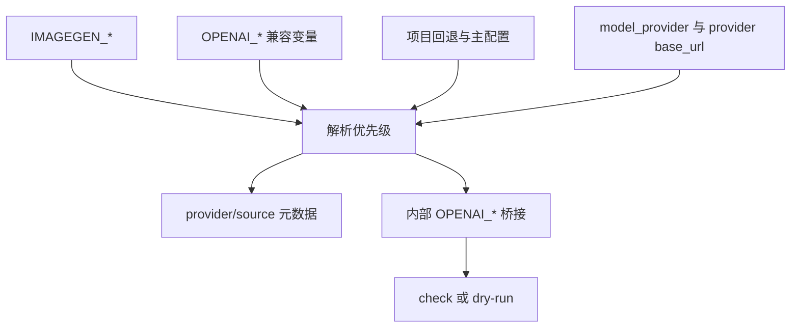

# imagegen 当前渠道解析：实施周期 02 运行时解析

## 1. 当前代码/文档基线

- `bootstrap_imagegen_env.py` 只读取 `OPENAI_API_KEY`、`OPENAI_BASE_URL`、auth JSON 和单一顶层 `base_url`。
- `image_gen.py` 只检查 `OPENAI_API_KEY`，Shell/PowerShell check 只展示 OpenAI 名称。
- 周期 01 输出 active-provider token，本周期负责解析和内部桥接。

## 2. 当前周期目标、边界与进入条件

- 周期目标：解析 active provider，保留旧变量兼容，并向 OpenAI-compatible SDK 输出内部变量。
- 进入条件：`TASK-01` 完成且模板 token 已冻结。
- 范围：Python 解析器、测试、鉴权提示、Bash/PowerShell 入口。
- 非范围：独立供应商协议、HTTP 客户端、图片参数和真实网络。
- 收口条件：OpenAI/custom/缺失 provider/旧配置/优先级 fixture 全部通过。

## 3. 周期内最小任务执行顺序

| 顺序 | 任务 | 文件 | 前置 | 收口 |
|---|---|---|---|---|
| 1 | `TASK-02` | `bootstrap_imagegen_env.py`、测试 | `TASK-01` | parser unittest PASS |
| 2 | `TASK-03` | `image_gen.py`、run 入口 | `TASK-02` | check/dry-run PASS |

## 4. 文件/符号操作契约

| 文件 | 允许修改 | 禁止修改 |
|---|---|---|
| `bootstrap_imagegen_env.py` | provider 读取、token、输出元数据 | 图片生成请求 |
| `doc/5-tests/2026-07-12_171805/project-agents-image-channel/imagegen/test_bootstrap_imagegen_env.py` | local fixture 测试 | 真实密钥、外部网络 |
| `image_gen.py` | `_ensure_api_key` 文案 | 模型/图片处理逻辑 |
| `run_imagegen.sh/.ps1` | check 诊断 | 参数兼容和请求流程 |

## 5. 最小任务闭环

### `TASK-02`：解析 active provider

- 真实入口：`python -X utf8 -m unittest discover -s doc/5-tests/2026-07-12_171805/project-agents-image-channel -p "test_*.py" -v`。
- fixture：临时 `config.toml`、`auth.json`、`AGENTS.md`，provider 为 `openai` 和 `custom`。
- 断言：读取 `[model_providers.<model_provider>].base_url`；`IMAGEGEN_*` 优先于 `OPENAI_*`；无 provider 时不注入硬编码 URL；旧 token 仍有效。
- 失败预期：解析错误、优先级错误、密钥写入输出或访问外部网络时失败。
- 回滚：恢复 parser，删除新增测试。
- 停止：无法确认 auth schema 或需猜测非兼容协议。

### `TASK-03`：入口与诊断

- 真实入口：Python dry-run、PowerShell check、Bash `-n`。
- 断言：dry-run 缺 key 只 warning；check 只展示 SET/MISSING、provider、source；旧 `IMAGEGEN_OPENAI_*_SOURCE` 仍存在。
- 失败预期：真实请求、原值泄漏、PowerShell/Bash 桥接失败。
- 回滚：恢复三个入口文件。
- 停止：SDK 行为被意外改写。

## 6. 当前周期验证矩阵

| 测试 ID | 场景 | 通过标准 |
|---|---|---|
| `TEST-201` | OpenAI provider | 使用对应 provider URL |
| `TEST-202` | custom provider | 使用 custom URL |
| `TEST-203` | 缺失 provider | 不使用固定 OpenAI URL |
| `TEST-204` | 环境变量优先级 | `IMAGEGEN_*` 高于旧变量 |
| `TEST-205` | CLI dry-run/check | 不联网且不打印密钥 |

## 7. 周期追踪矩阵

| 规则 | 验收 | 任务 | 符号 | 测试 |
|---|---|---|---|---|
| `RULE-01` active provider | `AC-02` | `TASK-02` | `read_base_url`、`main` | `TEST-201`/`TEST-202` |
| `RULE-02` 旧变量兼容 | `AC-03` | `TASK-02`/`TASK-03` | emit 与 `_ensure_api_key` | `TEST-204`/`TEST-205` |
| `RULE-03` 不泄漏密钥 | `AC-04` | `TASK-03` | check 输出 | `TEST-205` |

## 8. 流程图

图形目的：表达配置来源到内部 SDK 环境的解析路径。关联 ID：`TASK-02`、`TASK-03`。

## 9. 回滚与停止条件

- `ROLLBACK-201`：恢复 parser、入口和测试文件，不改变用户配置。
- 停止：任何真实网络调用、密钥原值出现在日志、provider schema 无法解析、测试不能隔离 local fixture。
- 周期完成：`TEST-201` 至 `TEST-205` 全部 PASS，且实现审查无 P0/P1。

## 10. 图片资产决策

图片资产决策：N/A + 原因 + 证据：本周期只修改 Python、Shell、PowerShell 和测试代码，不产生 UI、截图或游戏图片；配置流转已由 Mermaid 表达。

## 11. 自审结论

- 接口边界：通过；输入别名、active provider 和内部桥接已冻结。
- 兼容性：通过；旧 `OPENAI_*` 保留。
- 真实测试：已定义 local fixture、dry-run 和跨平台入口。
- 当前状态：`accepted`；`TEST-201` 至 `TEST-205` 已通过，运行时和入口审查无 P0/P1。
