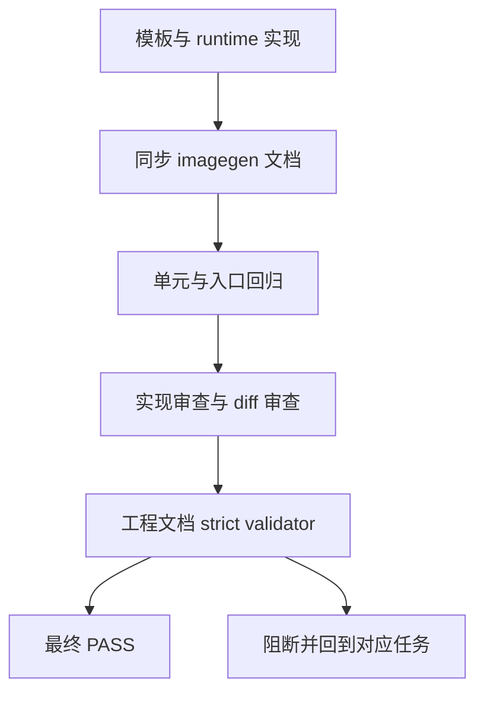

# imagegen 文档与回归：实施周期 03 验证收口

## 1. 当前代码/文档基线

- imagegen 文档仍使用 OpenAI-only 表述和旧项目变量示例。
- 周期 01 负责模板，周期 02 负责 runtime，本周期只同步文档并完成最终门禁。
- 当前工作树基线为 `f894b924d14a00d2524ab4829ba2a7bc4bf59ac9`。

## 2. 当前周期目标、边界与进入条件

- 周期目标：文档与实现一致，完成完整回归、审查和交付门禁。
- 进入条件：`TASK-02`、`TASK-03` 完成。
- 范围：四个 imagegen 文档、测试、diff、文档 validator。
- 非范围：新增 provider、真实 API、图片资产、Git 历史。
- 收口条件：文档无固定 OpenAI 默认、测试和 validator 全 PASS。

## 3. 周期内最小任务执行顺序

| 顺序 | 任务 | 文件/范围 | 前置 | 后置 |
|---|---|---|---|---|
| 1 | `TASK-04` | imagegen 文档 | `TASK-03` | `TASK-05` |
| 2 | `TASK-05` | 全量验证与审查 | `TASK-04` | 最终验收 |

## 4. 文件/符号操作契约

| 文件 | 允许修改 | 禁止修改 |
|---|---|---|
| `imagegen/SKILL.md` | 环境与 fallback 说明 | description、标题、无关章节 |
| `references/local-entrypoints.md` | 配置示例和优先级 | 运行时代码 |
| `references/cli.md` | CLI 鉴权说明 | CLI 参数定义 |
| `references/error-casebook.md` | 错误文案断言 | 案例结构 |

## 5. 最小任务闭环

### `TASK-04`：文档同步

- 只做一件事：让文档说明 active provider、兼容别名和 OpenAI-compatible 边界。
- 验证：UTF-8 回读、固定 URL 关键词检查、文档 diff 审查。
- 通过标准：文档不宣称未实现协议；不包含真实密钥；示例使用 active-provider token。
- 免测理由：纯 Markdown 文案修改不改变运行时结果；仍必须执行静态一致性检查。
- 回滚：恢复四个文档文件。
- 停止：文档需要引入未实现接口或出现敏感信息。

### `TASK-05`：全量回归与门禁

- 真实测试：unittest、py_compile、bash -n、PowerShell check、`git diff --check`、文档 validator。
- 样本：OpenAI/custom/缺失 provider/旧变量/项目 fallback fixture。
- 通过标准：全部退出码 0，测试全 PASS，差异只在计划范围，文档 `valid: true`。
- 失败预期：任一 P0/P1、密钥泄漏、外部网络依赖、固定 URL回归时阻断。
- 回滚：保留失败证据，回到对应任务；不自动回滚用户文件。
- 停止：无法完成 local 隔离或文档 strict 校验。

## 6. 当前周期验证矩阵

| 测试 ID | 入口 | 断言 | 失败动作 |
|---|---|---|---|
| `TEST-301` | `python -X utf8 -m unittest discover -s doc/5-tests/2026-07-12_171805/project-agents-image-channel -p "test_*.py" -v` | 全部 provider fixture PASS（7/7） | 回到 `TASK-02` |
| `TEST-302` | py_compile | Python 语法通过 | 修复后重测 |
| `TEST-303` | bash -n | Shell 语法通过 | 回到 `TASK-03` |
| `TEST-304` | PowerShell check | check/dry-run 不联网 | 回到 `TASK-03` |
| `TEST-305` | doc validator strict | 文档 `valid: true` | 回到 `TASK-04` |
| `TEST-306` | diff/secret scan | 无越界改动和密钥 | 立即阻断 |

## 7. 周期追踪矩阵

| 需求/规则 | 验收 | 任务 | 测试 | 证据 |
|---|---|---|---|---|
| `REQ-01` | `AC-01`、`AC-04` | `TASK-04` | `TEST-305`、`TEST-306` | 文档 diff |
| `RULE-04` 每任务闭环 | `AC-05` | `TASK-05` | `TEST-301` 至 `TEST-306` | validator 与测试输出 |

## 8. 流程图

图形目的：表达文档同步、回归、审查和最终交付门禁。关联 ID：`TASK-04`、`TASK-05`、`AC-05`。

## 9. 回滚与停止条件

- `ROLLBACK-301`：恢复本周期新增/修改的文档和测试，不删除历史文档。
- 停止：严格文档校验失败、测试失败、秘密扫描命中、意外 Git 历史写入或工作区出现无法解释的伪变更。
- 周期完成：所有测试、审查、validator 通过，最终状态为未提交改动。

## 10. 图片资产决策

图片资产决策：N/A + 原因 + 证据：本周期只做文档、测试和门禁验证，不需要 UI、截图、视觉对比或图片交付物；执行路径由 Mermaid 表达。

## 11. 自审结论

- 文档与实现一致性：通过；`TASK-04` 已完成并通过关键词、编码和 diff 检查。
- 回归覆盖：已冻结 OpenAI、custom、缺失配置、兼容变量和 dry-run 场景。
- 交付边界：明确不提交 Git，不执行真实外部 API。
- 当前状态：`accepted`；`TEST-301` 至 `TEST-306` 已通过，最终交付门禁 PASS。
