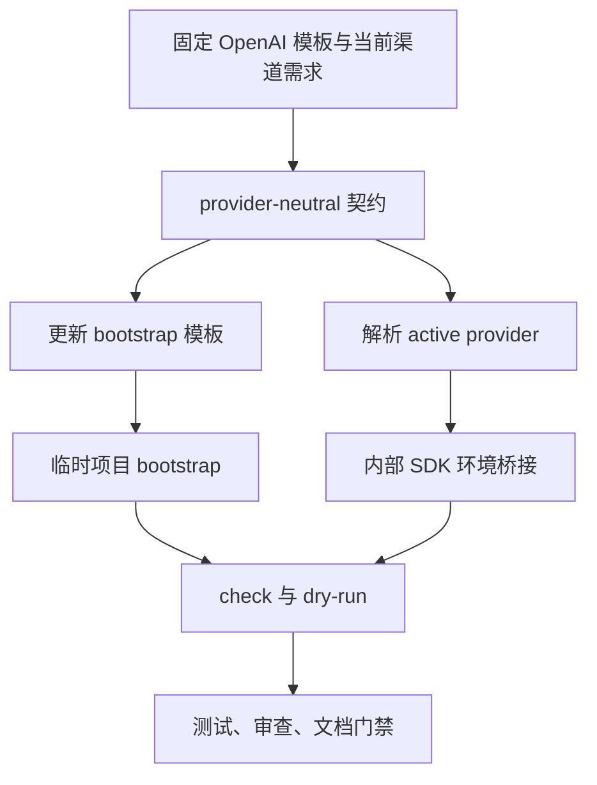
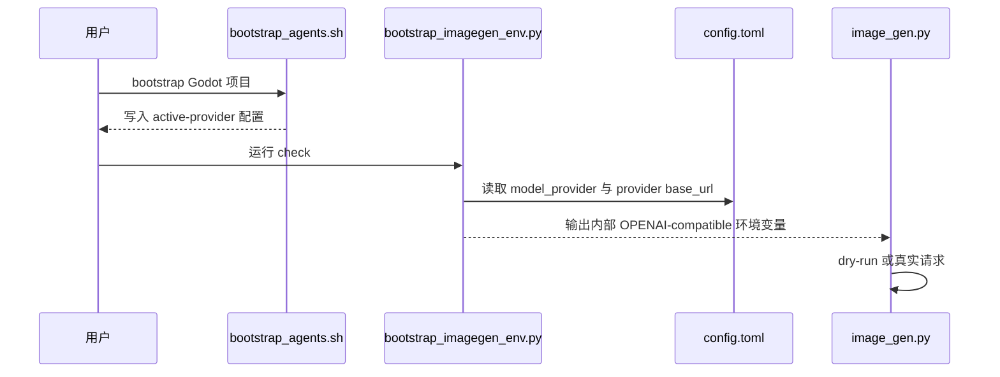

# 需求实施总览：project-agents-bootstrap 图像配置跟随当前渠道

## 1. 当前计划最终方案简要说明

将 Godot 规则模板和 imagegen 解析器改为 provider-neutral 配置。运行时读取当前进程配置、项目配置和 Codex `model_provider` 对应的 provider URL，最后只在 OpenAI-compatible 内部适配层映射为 `OPENAI_*` 环境变量；任何不兼容协议均明确 unavailable，不使用硬编码 OpenAI URL。

## 2. 基本信息

- agent 对当前问题的理解：模板固定写入 OpenAI URL，运行时只读取旧 `OPENAI_*` 和单一顶层 `base_url`，无法跟随当前 Codex provider。
- 当前范围：模板、运行时解析、SDK 桥接、诊断、文档、local fixture 测试。
- 非范围：供应商独立协议、数据库、Godot 场景、真实 API 生图、test/prod/staging、Git 历史写入。
- 当前优先闭环：新 bootstrap 配置不再固定 OpenAI；OpenAI 与 custom provider fixture 均能正确解析；旧变量保持兼容。
- 关键假设：`config.toml` 使用 `model_provider` 和 `[model_providers.<name>]`；现有 Codex auth bridge 继续提供 API key。
- unresolved_decisions: []
- 开始实施授权：已获得，用户明确要求按本计划实施。

## 3. 实施周期总览

| 周期 | 目标 | 任务顺序 | 收口条件 |
|---|---|---|---|
| `CYCLE-00` | 落盘实施文档与契约 | `TASK-00` | 文档校验通过 |
| `CYCLE-01` | 更新 bootstrap 模板 | `TASK-01` | 模板一致、幂等、无固定 URL |
| `CYCLE-02` | 扩展运行时和 SDK 桥接 | `TASK-02` -> `TASK-03` | provider fixture 与 dry-run 通过 |
| `CYCLE-03` | 文档同步与最终收口 | `TASK-04` -> `TASK-05` | 回归、审查、门禁全部通过 |

## 4. 阶段计划

| 阶段 | 只做一件事 | 输入 | 输出 | 验证门槛 |
|---|---|---|---|---|
| 阶段 1 | 冻结 provider-neutral 契约 | 当前模板和解析器 | `DEC-01` 至 `DEC-05` | 不再声明固定 OpenAI URL |
| 阶段 2 | 完成代码垂直切片 | 冻结契约 | 模板、解析器、入口 | local fixture dry-run 通过 |
| 阶段 3 | 完成验证与交付 | 全部实现 | 测试与门禁证据 | 无 P0/P1、无密钥泄漏 |

## 5. 最小任务清单

| 任务 | 周期 | 文件/符号 | 真实测试 | 完成条件 |
|---|---|---|---|---|
| `TASK-00` | `CYCLE-00` | `doc/3-实施/` | `validate_engineering_docs.py` | 4 个文档闭环 |
| `TASK-01` | `CYCLE-01` | `SKILL.md`、`GODOT_IMAGEGEN_SECTION` | `bash -n`、临时 bootstrap | 模板一致且幂等 |
| `TASK-02` | `CYCLE-02` | `bootstrap_imagegen_env.py` | unittest、py_compile | provider 与优先级正确 |
| `TASK-03` | `CYCLE-02` | `image_gen.py`、run 入口 | dry-run、跨平台 check | 无密钥泄漏 |
| `TASK-04` | `CYCLE-03` | imagegen 文档 | UTF-8、关键词检查 | 文档与实现一致 |
| `TASK-05` | `CYCLE-03` | 全量改动 | unittest、diff、文档门禁 | PASS 且停留未提交 |

每个任务必须按“实现 -> 真实测试 -> 审查 -> 验收”顺序完成；失败时只回到对应任务，不跨任务补决策。

## 6. 现状与落点

```text
F:\luode-skills\
├── project-agents-bootstrap\
│   ├── SKILL.md
│   └── scripts\bootstrap_agents.sh
├── imagegen\
│   ├── SKILL.md
│   ├── references\{cli.md,error-casebook.md,local-entrypoints.md}
│   ├── scripts\{bootstrap_imagegen_env.py,image_gen.py,run_imagegen.ps1,run_imagegen.sh}
│   └── tests\test_bootstrap_imagegen_env.py（测试资产实际归档于 `doc/5-tests/2026-07-12_171805/project-agents-image-channel/imagegen/`）
└── doc\3-实施\本需求实施文档
```

- 复用：现有配置块解析、Codex auth bridge、Bash/PowerShell 输出、OpenAI SDK。
- 新增：active provider 解析、provider-neutral 环境变量、fixture 测试。
- 数据库变更：`N/A + 原因 + 证据`；本需求没有 SQL、Repository、DAO 或持久化 schema。
- 图片资产：`N/A + 原因 + 证据`；本需求无视觉交付物，流程和时序使用 Mermaid。

## 7. 方案选择

| 方案 | 处理方式 | 结论 |
|---|---|---|
| A | provider-neutral 解析，内部保留 OpenAI-compatible SDK | 采用；改动小、兼容现有入口 |
| B | 为每个供应商新增独立 SDK/协议 | 不采用；超出本需求且无法从当前代码确认协议 |
| C | 继续固定 OpenAI URL | 不采用；不能满足当前渠道跟随要求 |

## 8. 真实测试安排

| 测试 | 命令 | 样本 | 通过标准 |
|---|---|---|---|
| `TEST-001` | `python -X utf8 -m unittest discover -s doc/5-tests/2026-07-12_171805/project-agents-image-channel -p "test_*.py" -v` | OpenAI/custom/缺失 provider fixture | 7/7 PASS |
| `TEST-002` | `python -m py_compile ...` | 受影响 Python 文件 | 退出码 0 |
| `TEST-003` | `bash -n ...` | 受影响 Bash 文件 | 退出码 0 |
| `TEST-004` | imagegen dry-run/check | local 临时环境 | 不联网、不泄漏密钥 |
| `TEST-005` | `validate_engineering_docs.py --strict` | 本需求文档 | `valid: true` |

所有测试只使用 local fixture、临时目录和 dry-run；禁止访问 test/prod/staging 或真实图像 API。

## 9. 图形化执行路径

图形目的：表达模板、解析器、当前 provider 和 SDK 之间的依赖。关联 ID：`REQ-IMAGE-CHANNEL-20260712`、`CYCLE-01`、`CYCLE-02`。



图形目的：表达用户执行 bootstrap 到 imagegen 请求的时序。关联 ID：`TASK-01`、`TASK-02`、`TASK-03`。



## 10. 追踪矩阵

| 来源 | 决策 | 规则/需求 | 验收 | 周期/任务 | 测试/证据 |
|---|---|---|---|---|---|
| `SRC-01` 用户要求跟随渠道 | `DEC-01` provider-neutral 模板 | `REQ-01` 不固定 URL | `AC-01` 模板无固定 URL | `CYCLE-01/TASK-01` | `TEST-001` bootstrap diff |
| `SRC-02` 当前配置有 active provider | `DEC-02` 读取 `model_provider` | `RULE-01` 使用活动 provider | `AC-02` custom URL 正确 | `CYCLE-02/TASK-02` | `TEST-001` fixture |
| `SRC-03` SDK 依赖 `OPENAI_*` | `DEC-03` 内部兼容桥接 | `RULE-02` 旧变量兼容 | `AC-03` 旧变量可用 | `CYCLE-02/TASK-03` | `TEST-004` dry-run |
| `SRC-04` 文档现有 OpenAI-only 表述 | `DEC-04` 同步文档 | `RULE-03` 文档不超出实现 | `AC-04` 文档一致 | `CYCLE-03/TASK-04` | `TEST-005` diff |
| `SRC-05` 交付门禁 | `DEC-05` 串行闭环 | `RULE-04` 每任务有证据 | `AC-05` 全量 PASS | `CYCLE-03/TASK-05` | `TEST-005` validator |

## 11. 风险与阻断项

- provider schema 变化：无法解析 `model_provider` 或目标 provider 时停止，不猜测配置。
- 非 OpenAI-compatible 协议：明确 unavailable，不新增协议适配。
- 密钥泄漏：诊断只输出 SET/MISSING、provider 和 source，不输出原值。
- 编码/换行：修改后回读 UTF-8，Shell 文件保持 LF，运行 `git diff --check`。
- skill 字典：本轮不改 description 或 `##` 标题；若执行中改变，必须运行 `python skill-dictionary/generate_dictionary.py`。
- Git：不执行 commit/push/rebase/merge；最终保持工作树未提交。

## 12. 图片资产决策

图片资产决策：N/A + 原因 + 证据：本实施总览只描述配置、解析、测试和交付流程，不包含 UI、截图、视觉对比或真实图片产物；流程和时序已由 Mermaid 表达，且本需求不执行真实图像生成。

## 13. 任务完成、停止与最大推进边界

- 完成条件：模板、运行时、文档、fixture 测试、py_compile、bash -n、dry-run、审查和文档 validator 全部 PASS。
- 停止条件：出现 P0/P1、真实网络依赖、密钥泄漏、固定 URL 回退、未解释的全文件伪变更或 schema 无法确认。
- 最大推进边界：不扩展到供应商独立协议、数据库、Godot 运行态和 Git 历史。
- 回滚总则：只恢复本需求触达文件；保留用户已有无关改动；不使用破坏性 Git 命令。

## 14. 自审结论

- 覆盖度：通过；模板、解析器、入口、文档、测试、风险和交付均有承接。
- 周期：通过；四周期有顺序、进入条件、收口条件和交接关系。
- 任务：通过；每个任务有文件/符号、真实测试、断言、回滚、停止和最大推进边界。
- 追踪：通过；`SRC -> DEC -> REQ/RULE -> AC -> CYCLE -> TASK -> TEST -> EVIDENCE` 已闭合。
- 当前状态：`accepted`；`TASK-00` 至 `TASK-05` 已完成，所有实现、测试、审查和门禁通过。
