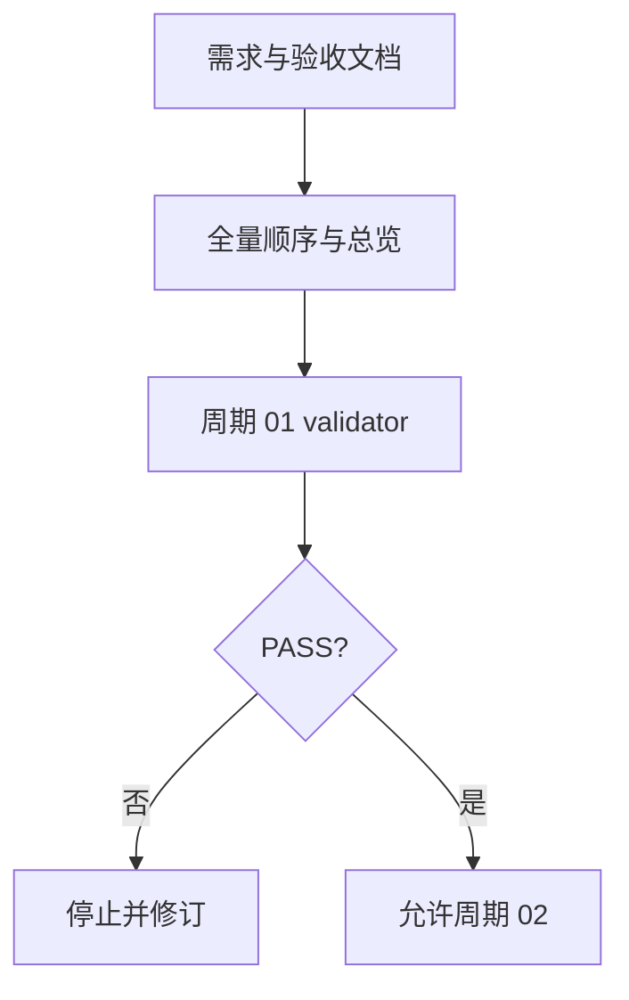

# 实施周期 01：契约与前置验收

图片资产决策：N/A + 原因：周期依赖使用 Mermaid；证据：本文件包含周期门禁流程图。

## 当前代码/文档基线

现有 Skill 以 `generate_release_test_plan.py` 生成扫描结果和计划骨架；统一 IR、运行时执行器和事件基线尚未存在。本周期只落盘文档契约和前置验收，不修改业务代码或 Skill 运行代码。

## 当前周期目标、边界与进入条件

目标是建立需求、验收、全量顺序方案和实施总览，并以 validator 证明文档可交接。进入条件为 `REQ-RT-20260712-001` 已确认；范围外为运行时引擎编码。收口条件为三类文档 profile PASS，追踪 ID 可回指。

## 周期内最小任务执行顺序

图形目的：展示周期 01 的文档门禁顺序。关联 ID：`CYCLE-RT-01`、`TASK-RT-C01-01`、`TASK-RT-C01-02`、`TASK-RT-C01-03`。

| 顺序 | 任务 | 文件/符号 | 依赖 |
| --- | --- | --- | --- |
| 1 | `TASK-RT-C01-01` | `doc/2-需求`、`doc/7-验收` 主文档 | 需求来源 |
| 2 | `TASK-RT-C01-02` | `doc/3-实施` 全量顺序与总览 | T01-01 |
| 3 | `TASK-RT-C01-03` | 周期 01 文档和 validator 证据 | T01-02 |

## 最小任务闭环

| 任务 | 文件/符号操作契约 | 真实测试与断言 | 失败预期/清理/回滚 | 证据 |
| --- | --- | --- | --- | --- |
| `TASK-RT-C01-01` | 新建需求和验收 Markdown；保留稳定 ID | `python -X utf8 artifact-delivery-gate-rules/scripts/validate_engineering_docs.py --profile requirement ... --strict`；断言 PASS | 失败则停止，删除本任务未通过文件并重写；不触碰旧文档 | `EVD-TASK-RT-C01-01-IMPL`、`EVD-TASK-RT-C01-01-TEST`、`EVD-TASK-RT-C01-01-REVIEW`、`EVD-TASK-RT-C01-01-ACCEPT` |
| `TASK-RT-C01-02` | 新建全量顺序和总览；回指需求/验收 | 分别执行 master/overview profile；断言章节、图形和表格存在 | 失败则保留失败报告，回滚本任务新增文件 | `EVD-TASK-RT-C01-02-IMPL`、`EVD-TASK-RT-C01-02-TEST`、`EVD-TASK-RT-C01-02-REVIEW`、`EVD-TASK-RT-C01-02-ACCEPT` |
| `TASK-RT-C01-03` | 新建本周期文档；闭合任务证据链 | 执行 implementation_cycle profile；断言四类证据 ID齐全 | 失败则停止周期，修正文档后从 T01-03 重验 | `EVD-TASK-RT-C01-03-IMPL`、`EVD-TASK-RT-C01-03-TEST`、`EVD-TASK-RT-C01-03-REVIEW`、`EVD-TASK-RT-C01-03-ACCEPT` |

## 当前周期验证矩阵

| 检查 | 命令/样本 | 断言 | 失败路由 |
| --- | --- | --- | --- |
| UTF-8 | Python UTF-8 读取全部新增文件 | 无解码错误 | `BLOCKED` |
| 需求/验收 | validator requirement/acceptance | PASS | 回到 T01-01 |
| 计划/总览 | validator implementation_master/overview | PASS | 回到 T01-02 |
| 图形 | Mermaid 提取与 CLI 真解析 | flowchart/sequenceDiagram 通过 | 回到 T01-03 |

## 周期状态表

| 状态 | 进入 | 通过条件 | 输出 |
| --- | --- | --- | --- |
| `in_progress` | 需求已确认 | 三任务顺序执行 | 任务证据 |
| `blocked` | validator 或图形失败 | 修订并重验 | 失败报告 |

## 文件/符号操作契约

只允许新增本周期列出的 Markdown；不得修改 `project-release-test-rules` 代码、测试、字典或 Git 历史。所有文件使用 UTF-8 并保留末尾换行。

## 周期阻断、停止与回滚

停止条件：validator 非 0、失效链接、重复/孤立 ID、Mermaid 解析失败、发现非 local 连接或敏感值。回滚 ID：`ROLLBACK-RT-C01-001`，删除本周期未通过新增文件并保留失败报告；旧文件不回退。

## 自审结论

本周期的真实测试是文档 validator 和 Mermaid 真解析；`unresolved_decisions=0`，通过后才允许 `CYCLE-RT-02`。
