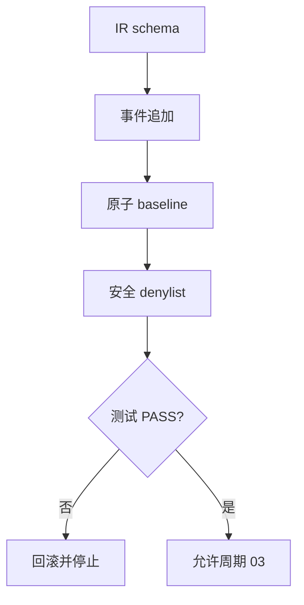

# 实施周期 02：契约内核与事件基线

图片资产决策：N/A + 原因：周期依赖使用 Mermaid；证据：本文件包含周期门禁流程图。

## 当前代码/文档基线

周期 01 提供文档契约；代码侧尚无版本化 IR、schema registry、事件存储和 safety denylist。目标落点为 `project-release-test-rules/scripts/release_test_engine/{model.py,schema_registry.py,events.py,storage.py,safety.py}`。

## 当前周期目标、边界与进入条件

进入条件：`CYCLE-RT-01` PASS。目标是冻结 IR v2、结果状态、事件模型、原子 baseline 和安全拒绝规则。边界是不接入协议 adapter，不连接任何运行环境；收口条件是 schema、恢复和 denylist 测试 PASS。

## 周期内最小任务执行顺序

图形目的：展示 IR、事件和安全内核的依赖。关联 ID：`CYCLE-RT-02`、`TASK-RT-C02-01`、`TASK-RT-C02-02`、`TASK-RT-C02-03`。

| 顺序 | 任务 | 文件/符号 | 依赖 |
| --- | --- | --- | --- |
| 1 | `TASK-RT-C02-01` | `model.py`、`schema_registry.py` | C01 |
| 2 | `TASK-RT-C02-02` | `events.py`、`storage.py` | T02-01 |
| 3 | `TASK-RT-C02-03` | `safety.py` | T02-02 |

## 最小任务闭环

| 任务 | 文件/符号操作契约 | 真实测试与断言 | 失败预期/清理/回滚 | 证据 |
| --- | --- | --- | --- | --- |
| `TASK-RT-C02-01` | 新增 `IRModel`、状态枚举和 v2 schema | `python -m unittest tests/test_model.py`；合法样本 PASS、非法样本结构化失败 | 测试失败停止；删除未通过生成物；`ROLLBACK-RT-C02-001` | `EVD-TASK-RT-C02-01-IMPL`、`EVD-TASK-RT-C02-01-TEST`、`EVD-TASK-RT-C02-01-REVIEW`、`EVD-TASK-RT-C02-01-ACCEPT` |
| `TASK-RT-C02-02` | 新增 append event、锁、临时文件和原子 replace | 崩溃注入/磁盘失败测试；旧 baseline 可读 | 清理临时目录；恢复旧 baseline；`ROLLBACK-RT-C02-002` | `EVD-TASK-RT-C02-02-IMPL`、`EVD-TASK-RT-C02-02-TEST`、`EVD-TASK-RT-C02-02-REVIEW`、`EVD-TASK-RT-C02-02-ACCEPT` |
| `TASK-RT-C02-03` | 新增安全 denylist 和 `SafetyDecision` | 对 DROP/TRUNCATE/删库与普通业务 DELETE fixture 断言前者阻断、后者允许 | 命中危险样本不发送；清理日志；`ROLLBACK-RT-C02-003` | `EVD-TASK-RT-C02-03-IMPL`、`EVD-TASK-RT-C02-03-TEST`、`EVD-TASK-RT-C02-03-REVIEW`、`EVD-TASK-RT-C02-03-ACCEPT` |

## 当前周期验证矩阵

| 检查 | 样本 | 断言 | 证据 |
| --- | --- | --- | --- |
| IR schema | valid/invalid JSON | 仅合法 IR 接受 | `TEST-RT-C02-01` |
| 原子存储 | crash、lock、disk-full fixture | 旧 baseline 不变 | `TEST-RT-C02-02` |
| safety | denylist 和业务 DELETE | 极端操作零发送 | `TEST-RT-C02-03` |
| 脱敏 | token/password/DSN fixture | 事件和 baseline 无原值 | `TEST-RT-C02-04` |

## 周期状态表

| 状态 | 进入 | 通过条件 | 输出 |
| --- | --- | --- | --- |
| `in_progress` | C01 PASS | schema、恢复、denylist PASS | engine core |
| `blocked` | 任一安全失败 | 恢复旧 baseline | 阻断证据 |

## 文件/符号操作契约

只允许修改周期表中的 engine core 文件和对应单元测试；不修改 adapter、CLI 或被测项目。运行命令只使用 local 临时目录。

## 周期阻断、停止与回滚

停止条件：schema 无版本、状态枚举分裂、事件不可重放、原子替换失败、denylist 漏拦或 secret 泄漏。回滚 `ROLLBACK-RT-C02-001..003`，恢复旧模块和 baseline 备份。

## 自审结论

本周期为后续所有 adapter 和 runner 的硬前置；`unresolved_decisions=0`，未通过安全测试不得进入周期 03。
