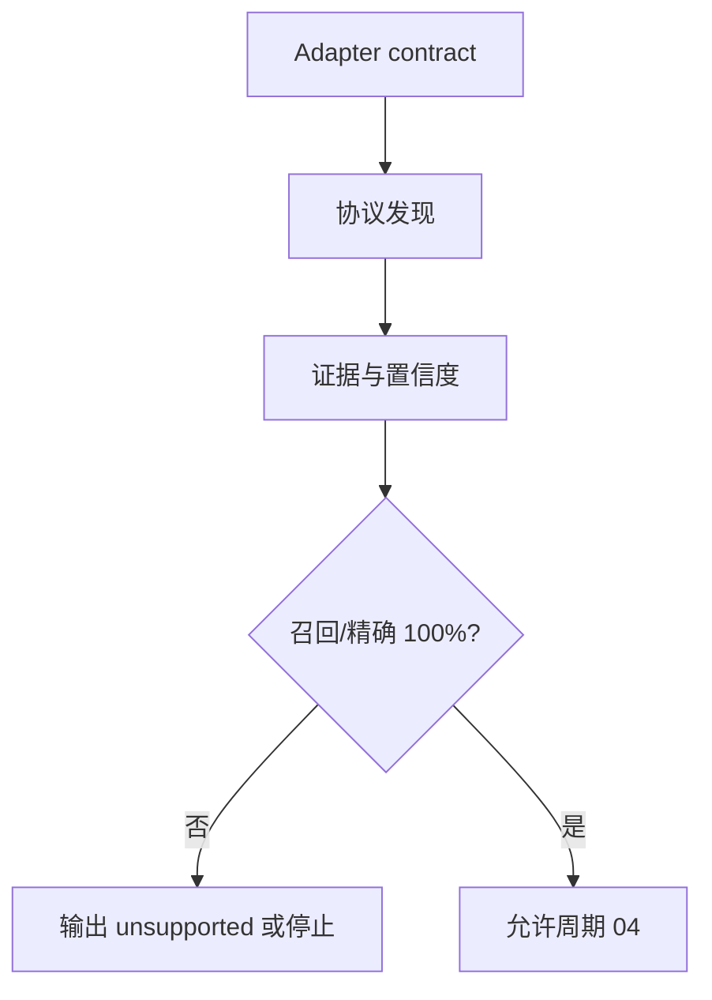

# 实施周期 03：发现适配器

图片资产决策：N/A + 原因：周期依赖使用 Mermaid；证据：本文件包含周期门禁流程图。

## 当前代码/文档基线

现有扫描器是全文正则，无法可靠处理路由组、schema、消息和任务注册。目标落点为 `adapters/base.py`、`discovery.py` 以及 `adapters/http_openapi.py`、`graphql.py`、`grpc.py`、`websocket.py`、`soap_jsonrpc.py`、`messaging.py`、`cli_entry.py`、`scheduler.py`、`event_handler.py`。

## 当前周期目标、边界与进入条件

进入条件：`CYCLE-RT-02` PASS。目标是用 adapter 发现支持矩阵内入口并输出证据、完整度、置信度和 unsupported 降级。边界是只发现和归一化，不执行请求；收口条件是 golden fixture 召回率和精确率均为 100%。

## 周期内最小任务执行顺序

图形目的：展示 adapter 契约到协议发现的顺序。关联 ID：`CYCLE-RT-03`、`TASK-RT-C03-01`、`TASK-RT-C03-02`、`TASK-RT-C03-03`。

| 顺序 | 任务 | 文件/符号 | 依赖 |
| --- | --- | --- | --- |
| 1 | `TASK-RT-C03-01` | `adapters/base.py`、`discovery.py` | C02 |
| 2 | `TASK-RT-C03-02` | HTTP/OpenAPI、GraphQL、gRPC、WS | T03-01 |
| 3 | `TASK-RT-C03-03` | SOAP/JSON-RPC、MQ、CLI、scheduler、event | T03-02 |

## 最小任务闭环

| 任务 | 文件/符号操作契约 | 真实测试与断言 | 失败预期/清理/回滚 | 证据 |
| --- | --- | --- | --- | --- |
| `TASK-RT-C03-01` | 定义 `DiscoveryAdapter`、IR evidence 和 support matrix | adapter contract fixture；断言字段和 unsupported 枚举稳定 | 契约失败停止，清理 fixture 输出；`ROLLBACK-RT-C03-001` | `EVD-TASK-RT-C03-01-IMPL`、`EVD-TASK-RT-C03-01-TEST`、`EVD-TASK-RT-C03-01-REVIEW`、`EVD-TASK-RT-C03-01-ACCEPT` |
| `TASK-RT-C03-02` | 实现 HTTP/OpenAPI、GraphQL、gRPC、WebSocket adapter | 多框架 fixture；断言 prefix、method、schema、auth、message 入口 100% 对齐 | 漏报/误报停止；不伪造入口；`ROLLBACK-RT-C03-002` | `EVD-TASK-RT-C03-02-IMPL`、`EVD-TASK-RT-C03-02-TEST`、`EVD-TASK-RT-C03-02-REVIEW`、`EVD-TASK-RT-C03-02-ACCEPT` |
| `TASK-RT-C03-03` | 实现 SOAP/JSON-RPC、MQ、CLI、任务和事件 adapter | WSDL/proto/topic/arg/cron fixture 100% 对齐 | 缺依赖输出 unsupported；清理产物；`ROLLBACK-RT-C03-003` | `EVD-TASK-RT-C03-03-IMPL`、`EVD-TASK-RT-C03-03-TEST`、`EVD-TASK-RT-C03-03-REVIEW`、`EVD-TASK-RT-C03-03-ACCEPT` |

## 当前周期验证矩阵

| 检查 | 样本 | 断言 | 失败路由 |
| --- | --- | --- | --- |
| 路由 | Flask/Spring/Django fixture | prefix 和 method 正确 | `DISCOVERY_INCOMPLETE` |
| 标准契约 | OpenAPI/GraphQL/proto/WSDL | schema、auth、response 正确 | 停止并回滚 |
| 非 HTTP | topic/CLI/cron/event fixture | 入口 ID 唯一 | unsupported 或阻断 |
| 误报 | Markdown、示例、历史报告 | 不生成入口 | fixture 失败 |

## 周期状态表

| 状态 | 进入 | 通过条件 | 输出 |
| --- | --- | --- | --- |
| `in_progress` | C02 PASS | 支持矩阵 fixture 100% | IR 发现证据 |
| `blocked` | 漏报/误报 | 修订 adapter 后重验 | 差异报告 |

## 文件/符号操作契约

只修改 discovery engine、adapter 文件和 discovery tests；不执行真实请求，不读取非 local 配置，不扫描 `.git` 和隐藏工作树历史。

## 周期阻断、停止与回滚

停止条件：入口召回/精确率低于 100%、method 默认猜 GET、缺证据或 unsupported 被标为 PASS。回滚 `ROLLBACK-RT-C03-001..003`，恢复旧扫描器输出并保留差异报告。

## 自审结论

发现 adapter 输出是参数和依赖阶段的唯一入口事实源；`unresolved_decisions=0`，低置信入口必须阻断自动执行。
