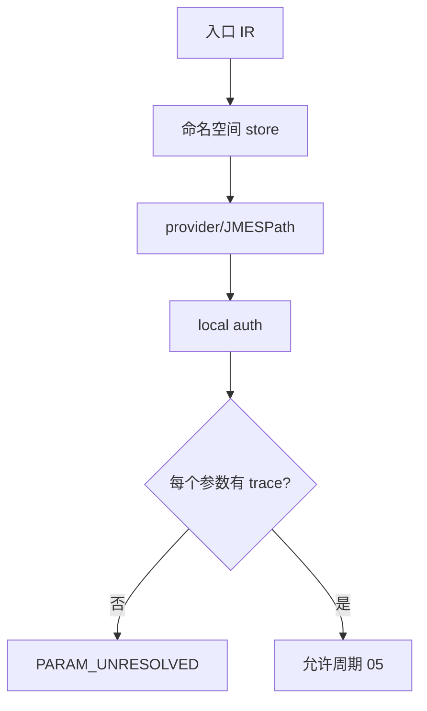

# 实施周期 04：参数解析与鉴权

图片资产决策：N/A + 原因：周期依赖使用 Mermaid；证据：本文件包含参数 trace 流程图。

## 当前代码/文档基线

现有参数逻辑依赖全局 YAML 参数集合，没有入口命名空间、运行时 provider 提取或 local DB/cache 查询。目标落点为 `resolver.py`、`parameter_store.py` 和 `auth.py`。

## 当前周期目标、边界与进入条件

进入条件：`CYCLE-RT-03` PASS。目标是固定参数命名空间、来源优先级、JMESPath 提取、local DB/cache provider 和鉴权会话。边界是解析和准备请求，不发送业务请求；收口条件是每个参数有唯一 trace。

## 周期内最小任务执行顺序

图形目的：展示参数来源和鉴权准备顺序。关联 ID：`CYCLE-RT-04`、`TASK-RT-C04-01`、`TASK-RT-C04-02`、`TASK-RT-C04-03`。

| 顺序 | 任务 | 文件/符号 | 依赖 |
| --- | --- | --- | --- |
| 1 | `TASK-RT-C04-01` | `parameter_store.py` | C03 |
| 2 | `TASK-RT-C04-02` | `resolver.py`、JMESPath extractor | T04-01 |
| 3 | `TASK-RT-C04-03` | `auth.py`、session provider | T04-02 |

## 最小任务闭环

| 任务 | 文件/符号操作契约 | 真实测试与断言 | 失败预期/清理/回滚 | 证据 |
| --- | --- | --- | --- | --- |
| `TASK-RT-C04-01` | 实现 `service.operation.location.field` store | 多接口同名 id fixture；断言不串用 | 发现跨接口污染停止并清理 store；`ROLLBACK-RT-C04-001` | `EVD-TASK-RT-C04-01-IMPL`、`EVD-TASK-RT-C04-01-TEST`、`EVD-TASK-RT-C04-01-REVIEW`、`EVD-TASK-RT-C04-01-ACCEPT` |
| `TASK-RT-C04-02` | 实现 reusable/provider/local DB/cache/example/fixture/rule 优先级和 JMESPath | provider-consumer fixture；断言唯一来源和提取值 | 无来源输出 `PARAM_UNRESOLVED`；清理临时 secrets；`ROLLBACK-RT-C04-002` | `EVD-TASK-RT-C04-02-IMPL`、`EVD-TASK-RT-C04-02-TEST`、`EVD-TASK-RT-C04-02-REVIEW`、`EVD-TASK-RT-C04-02-ACCEPT` |
| `TASK-RT-C04-03` | 实现 local auth bootstrap、cookie、header、token handle | 登录 fixture；断言 secret 只在内存、过期可识别 | 非 local auth 或明文泄露停止；`ROLLBACK-RT-C04-003` | `EVD-TASK-RT-C04-03-IMPL`、`EVD-TASK-RT-C04-03-TEST`、`EVD-TASK-RT-C04-03-REVIEW`、`EVD-TASK-RT-C04-03-ACCEPT` |

## 当前周期验证矩阵

| 检查 | 样本 | 断言 | 失败路由 |
| --- | --- | --- | --- |
| 命名空间 | 两个接口均含 `id` | trace 唯一 | `PARAM_UNRESOLVED` |
| 提取 | provider JSON/headers | JMESPath 值正确 | 停止 |
| 优先级 | reusable 到 rule 全层级 | 顺序固定 | 回滚 |
| 鉴权 | local login/cookie/token | 无 secret 落盘 | `AUTH_UNRESOLVED` |

## 周期状态表

| 状态 | 进入 | 通过条件 | 输出 |
| --- | --- | --- | --- |
| `in_progress` | C03 PASS | 参数 trace 100% | resolver 证据 |
| `blocked` | 无来源或泄露 | 清理 token 并重验 | 阻断报告 |

## 文件/符号操作契约

只修改 resolver/store/auth 和测试；local DB/cache 只读，业务写入留给周期 06；不允许读取 test/prod 配置或把 token 写入报告。

## 周期阻断、停止与回滚

停止条件：参数跨接口串用、来源不唯一、token 明文、provider 无 trace 或 local 配置缺失。回滚 `ROLLBACK-RT-C04-001..003`，清理临时 token handle 和 fixture。

## 自审结论

本周期将“查询参数”落实为可执行来源链；`unresolved_decisions=0`，任何无来源字段不得进入 runner。
