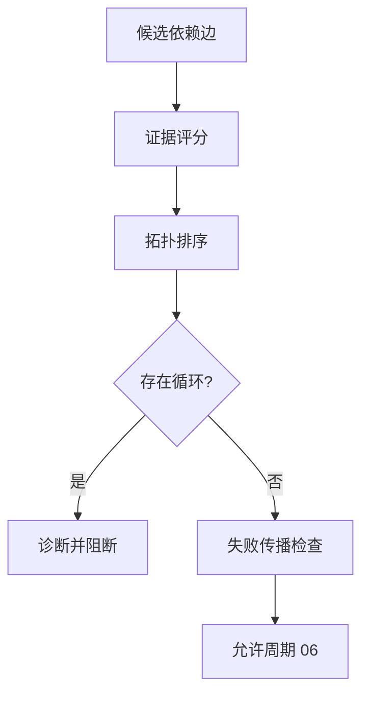

# 实施周期 05：依赖图与拓扑执行

图片资产决策：N/A + 原因：周期依赖使用 Mermaid；证据：本文件包含依赖门禁流程图。

## 当前代码/文档基线

当前依赖图仅搬运人工 YAML 字段，没有评分、拓扑排序、循环诊断和 provider 失败传播。目标落点为 `graph.py`、`topology.py` 和 `dependency_diagnostics.py`。

## 当前周期目标、边界与进入条件

进入条件：`CYCLE-RT-04` PASS。目标是从显式关系、字段语义、schema 类型/格式、模型关系和历史证据生成候选边，按阈值确定执行图。边界是不执行网络请求；收口条件是拓扑顺序、循环和失败传播测试 PASS。

## 周期内最小任务执行顺序

图形目的：展示候选边评分到拓扑计划的顺序。关联 ID：`CYCLE-RT-05`、`TASK-RT-C05-01`、`TASK-RT-C05-02`、`TASK-RT-C05-03`。

| 顺序 | 任务 | 文件/符号 | 依赖 |
| --- | --- | --- | --- |
| 1 | `TASK-RT-C05-01` | `graph.py` 候选边和评分 | C04 |
| 2 | `TASK-RT-C05-02` | `topology.py` 拓扑执行计划 | T05-01 |
| 3 | `TASK-RT-C05-03` | `dependency_diagnostics.py` 循环和传播 | T05-02 |

## 最小任务闭环

| 任务 | 文件/符号操作契约 | 真实测试与断言 | 失败预期/清理/回滚 | 证据 |
| --- | --- | --- | --- | --- |
| `TASK-RT-C05-01` | 实现候选边证据、评分和 override | provider-consumer/同名字段 fixture；低分边为 PENDING | 低分边被自动执行则停止；`ROLLBACK-RT-C05-001` | `EVD-TASK-RT-C05-01-IMPL`、`EVD-TASK-RT-C05-01-TEST`、`EVD-TASK-RT-C05-01-REVIEW`、`EVD-TASK-RT-C05-01-ACCEPT` |
| `TASK-RT-C05-02` | 实现稳定拓扑排序、fan-in/out 和 auth bootstrap | DAG fixture；断言顺序唯一且 provider 先行 | 顺序不稳定停止；清理计划文件；`ROLLBACK-RT-C05-002` | `EVD-TASK-RT-C05-02-IMPL`、`EVD-TASK-RT-C05-02-TEST`、`EVD-TASK-RT-C05-02-REVIEW`、`EVD-TASK-RT-C05-02-ACCEPT` |
| `TASK-RT-C05-03` | 实现循环诊断、条件边和失败传播 | cycle/conditional/provider-fail fixture；断言 consumer `BLOCKED_BY_DEPENDENCY` | 循环或误判停止；`ROLLBACK-RT-C05-003` | `EVD-TASK-RT-C05-03-IMPL`、`EVD-TASK-RT-C05-03-TEST`、`EVD-TASK-RT-C05-03-REVIEW`、`EVD-TASK-RT-C05-03-ACCEPT` |

## 当前周期验证矩阵

| 检查 | 样本 | 断言 | 失败路由 |
| --- | --- | --- | --- |
| 评分 | 显式/类型/格式/历史边 | 分值和理由可复现 | `PENDING` |
| 拓扑 | DAG、fan-in/out | 顺序唯一 | 阻断 |
| 循环 | A->B->A | 输出循环路径 | 停止 |
| 传播 | provider FAIL | consumer 不误判自身 FAIL | `BLOCKED_BY_DEPENDENCY` |

## 周期状态表

| 状态 | 进入 | 通过条件 | 输出 |
| --- | --- | --- | --- |
| `in_progress` | C04 PASS | 图顺序唯一 | dependency plan |
| `blocked` | 循环/低置信 | 输出诊断并停止 | graph evidence |

## 文件/符号操作契约

只修改 graph/topology/diagnostics 和测试；不连接服务，不修改基线，不执行任何入口。所有图输出必须含边证据和版本。

## 周期阻断、停止与回滚

停止条件：低置信边自动采用、拓扑不稳定、循环被忽略、provider 失败未传播。回滚 `ROLLBACK-RT-C05-001..003`，删除新图并恢复上一版本计划。

## 自审结论

本周期完成“接口关联”核心能力；`unresolved_decisions=0`，无法确认关系只能 PENDING 并等待显式 override。
