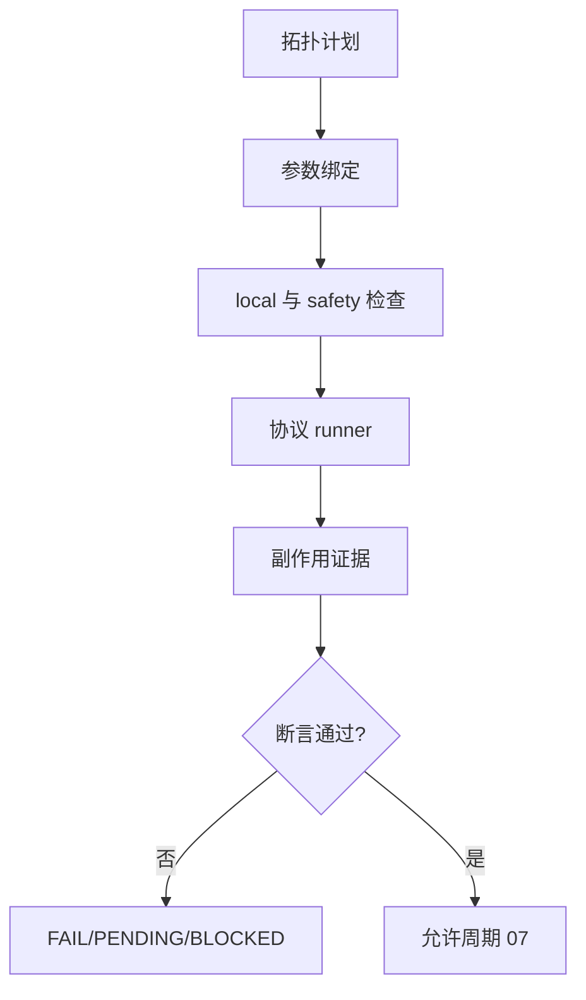

# 实施周期 06：多协议执行器

图片资产决策：N/A + 原因：周期依赖使用 Mermaid；证据：本文件包含执行门禁流程图。

## 当前代码/文档基线

当前 Skill 没有 HTTP/RPC/消息/CLI/任务执行器。目标落点为 `runner.py` 和 `adapters/*_runner.py`，所有连接配置必须来自 local。

## 当前周期目标、边界与进入条件

进入条件：`CYCLE-RT-05` PASS。目标是按统一 IR 执行 HTTP、GraphQL、gRPC、WebSocket、SOAP、JSON-RPC、消息、CLI、定时任务和事件入口，允许 local 真实业务写入及第三方副作用。极端操作由 C02 safety 在发送前阻断。

## 周期内最小任务执行顺序

图形目的：展示参数绑定、安全检查和多协议执行顺序。关联 ID：`CYCLE-RT-06`、`TASK-RT-C06-01`、`TASK-RT-C06-02`、`TASK-RT-C06-03`。

| 顺序 | 任务 | 文件/符号 | 依赖 |
| --- | --- | --- | --- |
| 1 | `TASK-RT-C06-01` | HTTP/GraphQL/SOAP/JSON-RPC runner | C05 |
| 2 | `TASK-RT-C06-02` | gRPC/WebSocket runner | T06-01 |
| 3 | `TASK-RT-C06-03` | MQ/CLI/scheduler/event runner | T06-02 |

## 最小任务闭环

| 任务 | 文件/符号操作契约 | 真实测试与断言 | 失败预期/清理/回滚 | 证据 |
| --- | --- | --- | --- | --- |
| `TASK-RT-C06-01` | 实现请求构造、超时、重试、multipart、cookie 和副作用采集 | local HTTP/GraphQL/SOAP/JSON-RPC service；断言状态/schema/副作用 | 非 local 或缺参数不发送；业务数据按 fixture 清理；`ROLLBACK-RT-C06-001` | `EVD-TASK-RT-C06-01-IMPL`、`EVD-TASK-RT-C06-01-TEST`、`EVD-TASK-RT-C06-01-REVIEW`、`EVD-TASK-RT-C06-01-ACCEPT` |
| `TASK-RT-C06-02` | 实现 unary/stream gRPC 和 WS request/subscription | local grpc/ws service；断言消息顺序、关闭和错误传播 | stream 泄漏停止；关闭连接并清理；`ROLLBACK-RT-C06-002` | `EVD-TASK-RT-C06-02-IMPL`、`EVD-TASK-RT-C06-02-TEST`、`EVD-TASK-RT-C06-02-REVIEW`、`EVD-TASK-RT-C06-02-ACCEPT` |
| `TASK-RT-C06-03` | 实现 MQ publish/consume、CLI exit/stdout/stderr、任务触发和事件处理 | local broker/CLI/task fixture；断言 ack、退出码和处理结果 | 消息重复或任务残留停止；清理 topic/job；`ROLLBACK-RT-C06-003` | `EVD-TASK-RT-C06-03-IMPL`、`EVD-TASK-RT-C06-03-TEST`、`EVD-TASK-RT-C06-03-REVIEW`、`EVD-TASK-RT-C06-03-ACCEPT` |

## 当前周期验证矩阵

| 检查 | 样本 | 断言 | 失败路由 |
| --- | --- | --- | --- |
| HTTP 类 | local service + write fixture | 请求、schema、副作用完整 | `FAIL` |
| streaming | grpc/ws fixture | 顺序、关闭、超时正确 | 停止 |
| message | local broker | ack、重试、消费证据完整 | `BLOCKED` |
| CLI/task | local process/cron/event | exit、日志、状态正确 | 回滚 |

## 周期状态表

| 状态 | 进入 | 通过条件 | 输出 |
| --- | --- | --- | --- |
| `in_progress` | C05 PASS | local 多协议 E2E PASS | run evidence |
| `blocked` | 环境/安全/断言失败 | 清理连接和数据 | runner failure |

## 文件/符号操作契约

只修改 runner、adapter runner 和测试；运行时只读取 local 配置。允许业务写入和第三方副作用，但必须记录 run id、清理动作和不可逆副作用摘要。

## 周期阻断、停止与回滚

停止条件：非 local 请求、未通过 safety、无参数 trace、写入无清理/副作用证据、stream/message 泄漏。回滚 `ROLLBACK-RT-C06-001..003`，关闭连接、清理 fixture 并恢复 runner 版本。

## 自审结论

本周期首次形成真实端到端执行链；`unresolved_decisions=0`，执行失败必须落为 FAIL/PENDING/BLOCKED，不能静默忽略。
