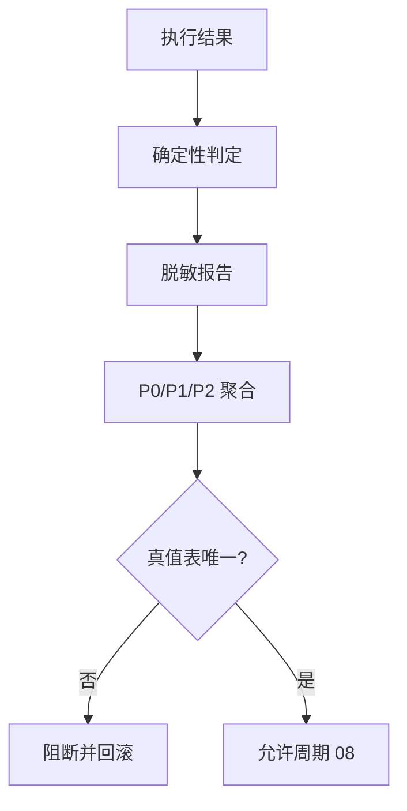

# 实施周期 07：判定、报告与门禁

图片资产决策：N/A + 原因：周期依赖使用 Mermaid；证据：本文件包含判定门禁流程图。

## 当前代码/文档基线

执行结果尚无统一判定顺序、断言 DSL、报告 schema 或门禁真值表。目标落点为 `judge.py`、`report.py`、`gate.py` 和脱敏过滤器。

## 当前周期目标、边界与进入条件

进入条件：`CYCLE-RT-06` PASS。目标是冻结传输、协议/schema、显式断言、副作用、清理和业务语义判定顺序，生成机器可读报告并计算唯一门禁。边界是不改 runner 和 baseline schema。

## 周期内最小任务执行顺序

图形目的：展示判定、脱敏和门禁聚合顺序。关联 ID：`CYCLE-RT-07`、`TASK-RT-C07-01`、`TASK-RT-C07-02`、`TASK-RT-C07-03`。

| 顺序 | 任务 | 文件/符号 | 依赖 |
| --- | --- | --- | --- |
| 1 | `TASK-RT-C07-01` | `judge.py`、assertion DSL | C06 |
| 2 | `TASK-RT-C07-02` | `report.py`、脱敏 | T07-01 |
| 3 | `TASK-RT-C07-03` | `gate.py`、门禁真值表 | T07-02 |

## 最小任务闭环

| 任务 | 文件/符号操作契约 | 真实测试与断言 | 失败预期/清理/回滚 | 证据 |
| --- | --- | --- | --- | --- |
| `TASK-RT-C07-01` | 实现确定性状态和断言顺序；未知语义 PENDING | response/schema/side-effect fixture；重复运行结果一致 | 断言冲突停止；清理报告；`ROLLBACK-RT-C07-001` | `EVD-TASK-RT-C07-01-IMPL`、`EVD-TASK-RT-C07-01-TEST`、`EVD-TASK-RT-C07-01-REVIEW`、`EVD-TASK-RT-C07-01-ACCEPT` |
| `TASK-RT-C07-02` | 实现 JSON/YAML 报告、证据引用和 secret redaction | token/password/DSN fixture；断言原值零命中 | 发现泄露立即隔离并删除报告；`ROLLBACK-RT-C07-002` | `EVD-TASK-RT-C07-02-IMPL`、`EVD-TASK-RT-C07-02-TEST`、`EVD-TASK-RT-C07-02-REVIEW`、`EVD-TASK-RT-C07-02-ACCEPT` |
| `TASK-RT-C07-03` | 实现 P0/P1/P2 门禁真值表和聚合器 | 状态组合 fixture；断言每组唯一结果 | 真值冲突停止；恢复上一版本 gate；`ROLLBACK-RT-C07-003` | `EVD-TASK-RT-C07-03-IMPL`、`EVD-TASK-RT-C07-03-TEST`、`EVD-TASK-RT-C07-03-REVIEW`、`EVD-TASK-RT-C07-03-ACCEPT` |

## 当前周期验证矩阵

| 检查 | 样本 | 断言 | 失败路由 |
| --- | --- | --- | --- |
| 判定顺序 | transport/schema/assertion/side-effect | 顺序唯一 | `PENDING/FAIL` |
| 未知语义 | 未定义业务响应 | 只能 PENDING | 阻断 |
| 脱敏 | secret fixture | 报告无原值 | 停止并清理 |
| 门禁 | P0/P1/P2 组合 | 每组唯一结论 | 回滚 |

## 周期状态表

| 状态 | 进入 | 通过条件 | 输出 |
| --- | --- | --- | --- |
| `in_progress` | C06 PASS | 判定和门禁真值表 PASS | report/gate |
| `blocked` | 泄露或冲突 | 删除报告并恢复旧版本 | 阻断证据 |

## 文件/符号操作契约

只修改 judge/report/gate 和测试；报告不得写入真实凭据、连接串、个人隐私或未脱敏响应。门禁只能消费结构化结果，不接受模型自由文本覆盖。

## 周期阻断、停止与回滚

停止条件：判定顺序不固定、P0 非 PASS 未 FAIL、未知语义 PASS、报告泄露或门禁多值。回滚 `ROLLBACK-RT-C07-001..003`，删除泄露报告并恢复旧 gate。

## 自审结论

本周期形成上线可信结论的唯一来源；`unresolved_decisions=0`，未通过真值表不得进入周期 08。
