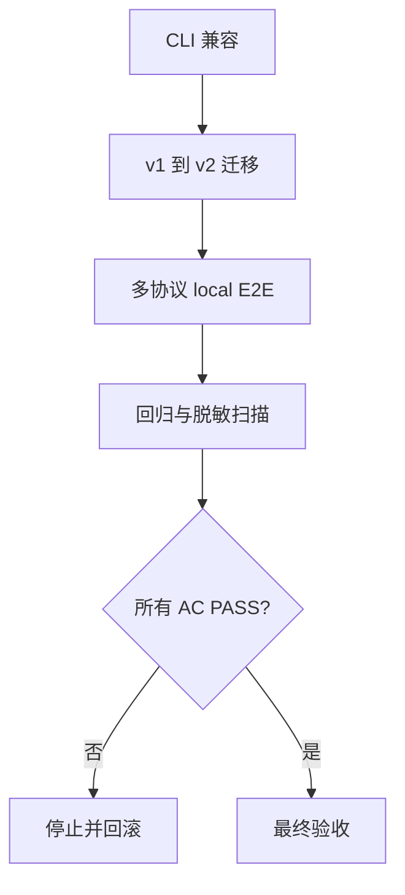

# 实施周期 08：迁移、兼容与最终交付

图片资产决策：N/A + 原因：周期依赖使用 Mermaid；证据：本文件包含交付门禁流程图。

## 当前代码/文档基线

周期 07 已有新执行链和门禁；旧 CLI 十个子命令、v1 baseline、交易业务硬编码和使用指南仍需兼容迁移。目标落点为 `cli.py`、兼容包装、`migrate_baseline.py`、Skill references 和指南。

## 当前周期目标、边界与进入条件

进入条件：`CYCLE-RT-07` PASS。目标是保留旧 CLI 行为、迁移 v1 资产、清理通用规则中的项目业务事实，并用多协议 E2E 完成最终验收。边界是不扩大支持矩阵、不连接非 local、不自动 Git 提交。

## 周期内最小任务执行顺序

图形目的：展示兼容、迁移、E2E 和最终验收顺序。关联 ID：`CYCLE-RT-08`、`TASK-RT-C08-01`、`TASK-RT-C08-02`、`TASK-RT-C08-03`。

| 顺序 | 任务 | 文件/符号 | 依赖 |
| --- | --- | --- | --- |
| 1 | `TASK-RT-C08-01` | `cli.py`、旧脚本兼容包装 | C07 |
| 2 | `TASK-RT-C08-02` | `migrate_baseline.py`、references、使用指南 | T08-01 |
| 3 | `TASK-RT-C08-03` | 多协议 E2E、回归和最终交付证据 | T08-02 |

## 最小任务闭环

| 任务 | 文件/符号操作契约 | 真实测试与断言 | 失败预期/清理/回滚 | 证据 |
| --- | --- | --- | --- | --- |
| `TASK-RT-C08-01` | 新增 doctor/discover/infer/resolve/execute/judge/report/gate/run，同时保留旧十命令 | CLI contract fixture；断言旧命令输出与新 run 状态稳定 | 旧命令失败停止；恢复旧 wrapper；`ROLLBACK-RT-C08-001` | `EVD-TASK-RT-C08-01-IMPL`、`EVD-TASK-RT-C08-01-TEST`、`EVD-TASK-RT-C08-01-REVIEW`、`EVD-TASK-RT-C08-01-ACCEPT` |
| `TASK-RT-C08-02` | v1->v2 迁移、schema 校验、通用 references 和指南更新 | 迁移正/负 fixture；断言失败不替换原资产，指南命令可执行 | 清理临时迁移目录；恢复备份；`ROLLBACK-RT-C08-002` | `EVD-TASK-RT-C08-02-IMPL`、`EVD-TASK-RT-C08-02-TEST`、`EVD-TASK-RT-C08-02-REVIEW`、`EVD-TASK-RT-C08-02-ACCEPT` |
| `TASK-RT-C08-03` | 多协议 local E2E、故障恢复、脱敏和最终验收证据 | 完整测试命令；断言支持矩阵、写入、副作用、恢复、门禁均符合 AC | 任一 P0/P1、安全或泄露失败停止并回滚；`ROLLBACK-RT-C08-003` | `EVD-TASK-RT-C08-03-IMPL`、`EVD-TASK-RT-C08-03-TEST`、`EVD-TASK-RT-C08-03-REVIEW`、`EVD-TASK-RT-C08-03-ACCEPT` |

## 当前周期验证矩阵

| 检查 | 样本/命令 | 断言 | 失败路由 |
| --- | --- | --- | --- |
| CLI 兼容 | 旧十命令和新 `run` | contract PASS | 回滚 |
| baseline 迁移 | v1 valid/invalid | 原子替换、失败可恢复 | 停止 |
| 通用性 | REST/GraphQL/gRPC/WS/SOAP/JSON-RPC/MQ/CLI/task/event fixture | 支持矩阵无误报 | `UNSUPPORTED_ADAPTER` |
| 最终门禁 | 全链路 local E2E | P0/P1/P2 真值表正确且无 secret | 最终 BLOCKED |

## 周期状态表

| 状态 | 进入 | 通过条件 | 输出 |
| --- | --- | --- | --- |
| `in_progress` | C07 PASS | 兼容、迁移、E2E PASS | 交付证据 |
| `blocked` | 迁移/回归/安全失败 | 恢复 wrapper 和备份 | 最终阻断 |

## 文件/符号操作契约

只修改周期列出的 CLI、迁移、references 和交付证据；不得覆盖用户已有变更，不得 commit/push。所有真实测试仅使用 local 配置和脱敏 fixture。

## 周期阻断、停止与回滚

停止条件：旧 CLI 破坏性变更、迁移覆盖原资产、业务硬编码仍作为通用规则、支持矩阵误报、P0/P1 非 PASS、secret 泄漏或非 local 连接。回滚 `ROLLBACK-RT-C08-001..003`，恢复 wrapper、baseline 备份和文档引用。

## 自审结论

本周期完成从骨架到可复用上线测试引擎的最终交付闭环；`unresolved_decisions=0`，所有 AC、测试、审查和验收证据齐全后才可标记 accepted。
