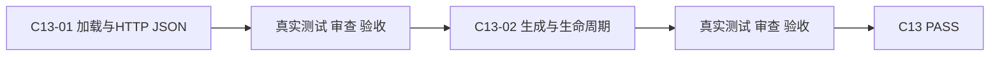
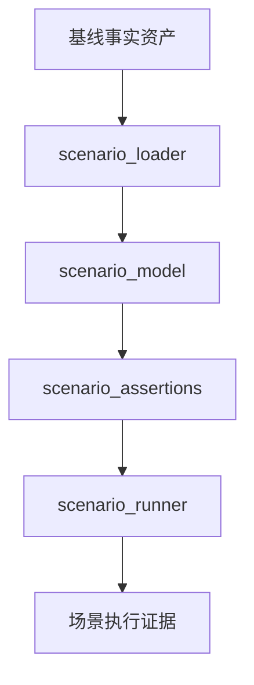

# 实施周期 13：外部场景契约与生命周期

结论：先建立独立场景格式并跑通一个真实网页读场景。影响：人工或模型生成的候选不能再直接进入门禁。范围：契约、跨步骤捕获、来源指纹和生命周期。非范围：其他负载和实时协议。变化：新增候选验证与错误晋级保护。完成标准：正向、负向、故障注入、清理和来源漂移测试全部通过。术语说明：来源指纹用于识别场景依据是否已经变化。验证状态：正在实施首个最小任务。 图片资产决策：N/A + 原因：契约和依赖由 YAML/JSON 与 Mermaid 表达；证据：本文件不需要位图。

## 当前代码/文档基线

现有 IR 为 `2.0`，接口 runner 只能逐接口执行，`scenario-results.json` 仍写入接口结果。新增代码仅落在唯一行为 Owner 的 `release_test_engine/`，不修改 IR、不复制到基线 Skill。

## 当前周期目标、边界与进入条件

进入条件：`REQ-RT-009` 与 `AC-RT-010` 已冻结。目标是加载 `external-scenario/1.0`、跑通一个真实 HTTP JSON 读场景，并完成候选生成、确定性验证、来源漂移与生命周期迁移。非目标是其他 HTTP 负载和实时协议。

## 周期内最小任务执行顺序

图形目的：展示契约加载到 verified 晋级的顺序。关联 ID：`CYCLE-RT-13`、`C13-01`、`C13-02`。

图形目的：匹配本周期职责与唯一 Owner。关联 ID：`REQ-RT-009`、`DEC-RT-008..010`。

| 顺序 | 任务 | 文件/符号 | 依赖 |
| --- | --- | --- | --- |
| 1 | `C13-01` | `scenario_model.py`、`scenario_loader.py`、`scenario_assertions.py`、`scenario_runner.py`、`test_scenario_contract.py` | 文档 validator |
| 2 | `C13-02` | `scenario_generation.py`、上述生命周期符号、同一测试文件 | C13-01 全闭环 |

## 最小任务闭环

| 任务 | 实现 | 真实测试与断言 | 失败预期/清理/回滚 | 证据 |
| --- | --- | --- | --- | --- |
| `C13-01` | 白名单 schema、JSON Pointer 捕获、HTTP JSON 步骤上下文 | 合法/非法契约和随机回环 HTTP；断言真实响应值跨步骤相等 | 未知字段、动作、非 local、错误类型必须非零；关闭服务；仅回滚本任务文件 | `EVD-RT-C13-01-{IMPL,TEST,REVIEW,ACCEPT}` |
| `C13-02` | candidate 生成、来源指纹、verify 与状态迁移 | 正向通过、故障注入识别、清理成功、来源漂移和错误晋级 | 未满足五条件不得 verified；删除临时候选；仅回滚 generation 与测试增量 | `EVD-RT-C13-02-{IMPL,TEST,REVIEW,ACCEPT}` |

## 当前周期验证矩阵

| 验证项 | 样本/入口 | 通过断言 | 证据 |
| --- | --- | --- | --- |
| 契约加载 | `test_scenario_contract.py` 合法/非法目录 | 合法场景可加载；未知字段、未知动作和非 local 稳定拒绝 | `TEST-RT-C13-CONTRACT` |
| 生命周期 | candidate、故障注入、清理和来源漂移样本 | 五项晋级条件缺一不可；漂移后不得保持 verified | `TEST-RT-C13-LIFECYCLE` |

## 周期状态表

| 状态 | 进入条件 | 完成或阻断条件 | 输出 |
| --- | --- | --- | --- |
| `in_progress` | 需求与验收冻结 | 依次完成本周期每个最小任务的实现、真实测试、审查和验收 | 本任务四类证据 |
| `blocked` | 真实测试、安全、清理或契约门禁失败 | 停止后续任务并按本周期边界回滚 | 阻断原因和重入入口 |
| `accepted` | 本周期全部任务 PASS | 四类证据齐全且无未决 P0/P1 | 允许进入 C14 |

## 文件/符号操作契约

每任务最多五个文件；新增注释使用中文；事件字段固定包含 `run_id/scenario_id/step_id/action/status/duration_ms/failure_type`；不得嵌入任意代码或原始 SQL。

## 周期阻断、停止与回滚

停止条件：非 local、敏感字段落盘、来源漂移误晋级、故障注入未识别、清理失败或测试失败立即停止。回滚只删除本周期新增模块和测试增量，不覆盖其他工作树改动。

## 自审结论

| 审查项 | 结论 | 依据 |
| --- | --- | --- |
| 双向追踪 | PASS | `SRC-USER-RT-002 -> DEC-RT-008..010 -> REQ-RT-009 -> AC-RT-010 -> CYCLE-RT-13/C13-01..02 -> TEST-RT-C13-* -> EVD-RT-C13-*` |
| 任务闭环 | PASS | 每个最小任务均独立执行“实现 -> 真实测试 -> 审查 -> 验收” |
| 范围与回滚 | PASS | 未扩展计划外协议、未修改生产语义、未覆盖其他工作树改动 |
| 未决事项 | PASS | `unresolved_decisions=0`；存在阻断时不得进入下一周期 |
