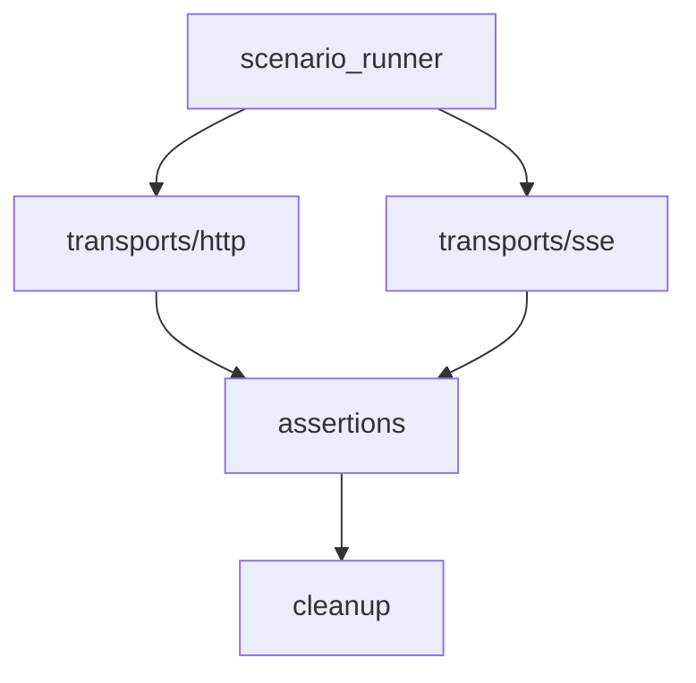

# 实施周期 14：HTTP 负载与 SSE

结论：把常见网页负载和服务端事件流纳入真实消费者闭环。影响：上传、下载和持续事件不再由普通请求或静态样本冒充。范围：表单、文件上传、下载摘要、事件关联和重连。非范围：实时双向连接和性能。变化：新增两类专用传输。完成标准：真实回环服务的正反例、清理和端口回收全部通过。术语说明：事件流是服务器持续向客户端推送的单向连接。验证状态：等待前一周期完成。 图片资产决策：N/A + 原因：运行链由 Mermaid 和协议契约表达；证据：无图片资产需求。

## 当前代码/文档基线

C13 提供场景上下文和 JSON 请求能力；本周期新增 form、multipart、下载摘要和 SSE，不扩张旧接口级 runner。

## 当前周期目标、边界与进入条件

进入条件：C13 全闭环。目标是让常用 HTTP 负载和 SSE 形成真实消费者闭环。边界是不支持性能、浏览器或非 local 服务。

## 周期内最小任务执行顺序

图形目的：展示三种 HTTP/SSE 垂直切片顺序。关联 ID：`CYCLE-RT-14`、`C14-01..03`。

图形目的：匹配传输、断言和清理职责。关联 ID：`REQ-RT-010`、`AC-RT-011`。

| 顺序 | 任务 | 文件/符号 | 依赖 |
| --- | --- | --- | --- |
| 1 | `C14-01` | `transports/http.py`、`scenario_runner.py`、测试 fixture | C13 |
| 2 | `C14-02` | HTTP 下载摘要与断言、同一测试文件 | C14-01 |
| 3 | `C14-03` | `transports/sse.py`、runner 关联/重连、同一测试文件 | C14-02 |

## 最小任务闭环

| 任务 | 真实测试 | 失败预期与清理 | 完成条件 |
| --- | --- | --- | --- |
| `C14-01` | form/multipart 上传，HTTP 读回摘要 | 错误媒体类型稳定 FAIL；删除上传临时文件 | 上传、读回和清理均 PASS |
| `C14-02` | 下载头、长度、SHA-256 | 错误摘要稳定 FAIL；关闭响应流 | 头与内容断言 PASS |
| `C14-03` | 先订阅 SSE、HTTP 触发、按关联 ID 接收、断流重连 | 断流/缺事件/错关联稳定 FAIL；关闭流和服务 | 顺序、关联和重连 PASS |

## 当前周期验证矩阵

| 验证项 | 样本/入口 | 通过断言 | 证据 |
| --- | --- | --- | --- |
| 表单与上传 | form/multipart 写入、HTTP 读回和 DELETE 清理 | 媒体类型、摘要、读回值和清理状态全部符合契约 | `TEST-RT-C14-HTTP-WRITE` |
| 下载 | 下载头、长度和 SHA-256 正反例 | 错误摘要稳定 FAIL，响应流关闭 | `TEST-RT-C14-DOWNLOAD` |
| SSE | 先订阅、HTTP 触发、事件关联、断流和重连 | 错关联、断流和缺事件稳定 FAIL；游标重连不丢目标事件 | `TEST-RT-C14-SSE` |

## 周期状态表

| 状态 | 进入条件 | 完成或阻断条件 | 输出 |
| --- | --- | --- | --- |
| `in_progress` | C13 全闭环 | 依次完成本周期每个最小任务的实现、真实测试、审查和验收 | 本任务四类证据 |
| `blocked` | 真实测试、安全、清理或契约门禁失败 | 停止后续任务并按本周期边界回滚 | 阻断原因和重入入口 |
| `accepted` | 本周期全部任务 PASS | 四类证据齐全且无未决 P0/P1 | 允许进入 C15 |

## 文件/符号操作契约

只新增 `transports/http.py`、`transports/sse.py` 及场景 runner 的必要分派；不得修改业务项目依赖或将原始上传内容写入正式证据。

## 周期阻断、停止与回滚

停止条件：错误媒体类型未被识别、下载摘要不一致仍通过、SSE 断流或错关联未失败、清理失败、端口残留、非 local 来源或敏感信息落盘时立即停止。回滚仅限本周期 transport、runner 和测试增量。

## 自审结论

| 审查项 | 结论 | 依据 |
| --- | --- | --- |
| 双向追踪 | PASS | `REQ-RT-010 -> AC-RT-011 -> CYCLE-RT-14/C14-01..03 -> TEST-RT-C14-* -> EVD-RT-C14-*` |
| 任务闭环 | PASS | 每个最小任务均独立执行“实现 -> 真实测试 -> 审查 -> 验收” |
| 范围与回滚 | PASS | 未扩展计划外协议、未修改生产语义、未覆盖其他工作树改动 |
| 未决事项 | PASS | `unresolved_decisions=0`；存在阻断时不得进入下一周期 |
