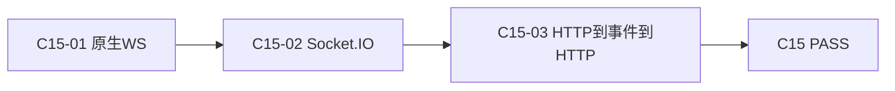
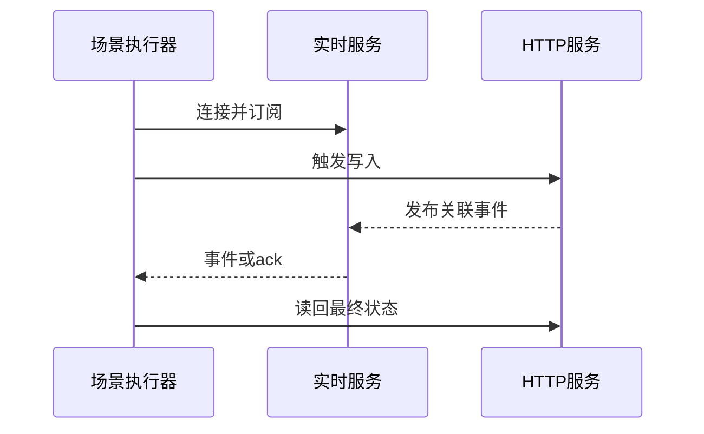

# 实施周期 15：WebSocket 与 Socket.IO

结论：分别建立原生实时连接和事件框架的真实网络测试。影响：静态发现和内存样本不再能证明实时协议可用。范围：连接、鉴权、收发、顺序、重复、确认、关闭、重连和跨协议读回。非范围：负载和性能。变化：新增两条独立实时传输链。完成标准：错误事件、乱序、重复和错误确认均稳定失败且资源清理完整。术语说明：确认是服务端对客户端事件的明确处理回执。验证状态：等待前置周期。 图片资产决策：N/A + 原因：实时协议时序由 Mermaid 表达；证据：无位图需求。

## 当前代码/文档基线

现有 WebSocket 适配器只有静态发现/fixture，不能证明真实网络连接；Socket.IO 尚无模型。本周期建立两条独立真实传输链。

## 当前周期目标、边界与进入条件

进入条件：C14 全闭环。目标覆盖 RFC 6455 握手、鉴权、收发、顺序、关闭、重连，以及 Socket.IO namespace/event/ack；最后完成 HTTP 到实时事件再到 HTTP 读回。非目标是负载和性能。

## 周期内最小任务执行顺序

图形目的：展示实时协议和跨协议闭环顺序。关联 ID：`C15-01..03`。

图形目的：展示消费者、服务和 oracle 的时序。关联 ID：`REQ-RT-011`、`AC-RT-012`。

## 最小任务闭环

| 任务 | 文件/符号 | 真实测试 | 失败预期/清理 |
| --- | --- | --- | --- |
| `C15-01` | `transports/websocket.py`、runner | 随机回环 RFC6455，鉴权、顺序、重复、关闭、重连 | 丢失/乱序/重复稳定 FAIL；关闭连接和服务 |
| `C15-02` | `transports/socketio.py`、runner | namespace、event、ack 正反例 | ack 错误稳定 FAIL；disconnect |
| `C15-03` | runner/assertions 跨协议关联 | HTTP 触发、实时接收、HTTP 读回 | 任一值不一致 FAIL；清理实体 |

## 当前周期验证矩阵

| 验证项 | 样本/入口 | 通过断言 | 证据 |
| --- | --- | --- | --- |
| 原生 WebSocket | RFC 6455 鉴权、收发、顺序、关闭和重连 | 丢失、乱序、重复和错误关闭稳定 FAIL | `TEST-RT-C15-WS` |
| Socket.IO | namespace、event、ack 正反例 | 错误 namespace、事件或 ack 稳定 FAIL | `TEST-RT-C15-SOCKETIO` |
| 跨协议闭环 | HTTP 写入、实时事件、HTTP 读回 | 三个阶段使用同一关联值且最终读回一致 | `TEST-RT-C15-CROSS` |

## 周期状态表

| 状态 | 进入条件 | 完成或阻断条件 | 输出 |
| --- | --- | --- | --- |
| `in_progress` | C14 全闭环 | 依次完成本周期每个最小任务的实现、真实测试、审查和验收 | 本任务四类证据 |
| `blocked` | 真实测试、安全、清理或契约门禁失败 | 停止后续任务并按本周期边界回滚 | 阻断原因和重入入口 |
| `accepted` | 本周期全部任务 PASS | 四类证据齐全且无未决 P0/P1 | 允许进入 C16 |

## 文件/符号操作契约

依赖仅安装到工具隔离环境；不得修改被测项目依赖。日志必须带完整事件字段且不落鉴权原值。

## 周期阻断、停止与回滚

停止条件：协议 runtime 缺失、fixture 结果冒充 runtime PASS、鉴权绕过、事件丢失/乱序/重复未被识别、ack 错误仍通过、连接或数据未清理时立即停止。回滚仅限本周期实时 transport、runner 和测试增量。

## 自审结论

| 审查项 | 结论 | 依据 |
| --- | --- | --- |
| 双向追踪 | PASS | `REQ-RT-011 -> AC-RT-012 -> CYCLE-RT-15/C15-01..03 -> TEST-RT-C15-* -> EVD-RT-C15-*` |
| 任务闭环 | PASS | 每个最小任务均独立执行“实现 -> 真实测试 -> 审查 -> 验收” |
| 范围与回滚 | PASS | 未扩展计划外协议、未修改生产语义、未覆盖其他工作树改动 |
| 未决事项 | PASS | `unresolved_decisions=0`；存在阻断时不得进入下一周期 |
