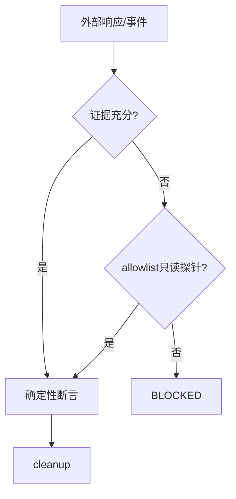

# 实施周期 16：确定性 Oracle、探针与清理

结论：外部结果是正确性首要依据，只允许受控只读探针补证。影响：数据库或内部状态不能覆盖外部错误，也不能留下测试污染。范围：探针白名单、清理、跨协议值和最终一致性。非范围：任意代码、原始查询语句和写探针。变化：新增污染阻断和统一判定器。完成标准：越权必阻断、清理率百分之百、错误值和超时稳定失败。术语说明：判定依据是用来确认外部结果正确与否的确定性证据。验证状态：等待前置周期。 图片资产决策：N/A + 原因：判定优先级和停止分支由 Mermaid 表达；证据：无图片资产。

## 当前代码/文档基线

C13-C15 已提供外部可观察结果；本周期只在外部结果不足时允许项目显式注册的只读 local 探针补证，并统一清理和跨协议 oracle。

## 当前周期目标、边界与进入条件

进入条件：C15 全闭环。目标是外部结果优先、探针 allowlist、临时命名空间、污染阻断、结构化断言和最终一致性等待。禁止任意代码、原始 SQL 和写探针。

## 周期内最小任务执行顺序

图形目的：展示探针、清理和 oracle 的串行闭环。关联 ID：`C16-01..03`。

图形目的：冻结正确性依据优先级。关联 ID：`REQ-RT-012`、`AC-RT-013`。

## 最小任务闭环

| 任务 | 文件/符号 | 真实测试 | 失败预期/清理 |
| --- | --- | --- | --- |
| `C16-01` | `local_probe.py`、loader/runner | allowlist 探针和越权样本 | 越权、写操作、非 local 为 BLOCKED |
| `C16-02` | runner cleanup/临时命名空间 | 成功清理与故意失败 | 清理失败立即停止后续写场景 |
| `C16-03` | assertions/runner | schema、状态、类型、枚举、相等、包含、正则、数量、摘要、关联、顺序、重复、最终一致性 | 错值和超时稳定 FAIL |

## 当前周期验证矩阵

| 验证项 | 样本/入口 | 通过断言 | 证据 |
| --- | --- | --- | --- |
| 受控探针 | allowlist 只读探针、越权和写操作样本 | 只读 local 注册项可运行；越权、写操作和非 local 为 BLOCKED | `TEST-RT-C16-PROBE` |
| 清理与污染 | 成功清理、幂等清理和故意失败 | 清理失败升级 BLOCKED 并停止后续写场景 | `TEST-RT-C16-CLEANUP` |
| 确定性 Oracle | 跨步骤/跨协议值、顺序、重复和最终一致性 | 外部结果优先；错误值和超时稳定 FAIL | `TEST-RT-C16-ORACLE` |

## 周期状态表

| 状态 | 进入条件 | 完成或阻断条件 | 输出 |
| --- | --- | --- | --- |
| `in_progress` | C15 全闭环 | 依次完成本周期每个最小任务的实现、真实测试、审查和验收 | 本任务四类证据 |
| `blocked` | 真实测试、安全、清理或契约门禁失败 | 停止后续任务并按本周期边界回滚 | 阻断原因和重入入口 |
| `accepted` | 本周期全部任务 PASS | 四类证据齐全且无未决 P0/P1 | 允许进入 C17 |

## 文件/符号操作契约

探针只接收项目 adapter 注册名和结构化参数；不得接受 SQL 文本、模块路径或任意 callable。外部证据与探针冲突时 FAIL，不以探针覆盖外部错误。

## 周期阻断、停止与回滚

停止条件：探针不在 allowlist、探针写入、内部状态覆盖外部失败、清理失败、污染残留、最终一致性超时被忽略、非 local 或敏感值落盘时立即停止。回滚仅限本周期探针、清理、断言和测试增量。

## 自审结论

| 审查项 | 结论 | 依据 |
| --- | --- | --- |
| 双向追踪 | PASS | `REQ-RT-012 -> AC-RT-013 -> CYCLE-RT-16/C16-01..03 -> TEST-RT-C16-* -> EVD-RT-C16-*` |
| 任务闭环 | PASS | 每个最小任务均独立执行“实现 -> 真实测试 -> 审查 -> 验收” |
| 范围与回滚 | PASS | 未扩展计划外协议、未修改生产语义、未覆盖其他工作树改动 |
| 未决事项 | PASS | `unresolved_decisions=0`；存在阻断时不得进入下一周期 |
