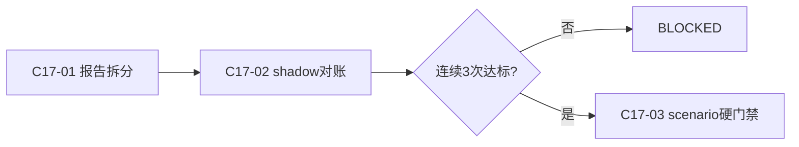
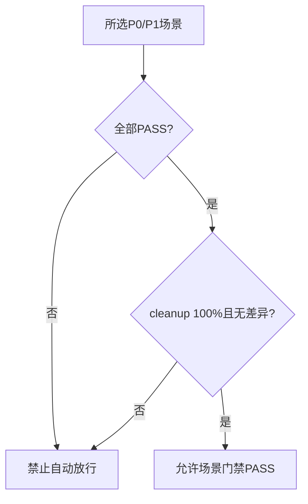

# 实施周期 17：双轨报告与场景硬门禁

结论：先拆分接口和场景报告，再通过三次双轨对账切换硬门禁。影响：任何最高或高风险场景未通过都不能自动放行。范围：报告、覆盖、清理、差异和门禁切换。非范围：删除旧兼容资产。变化：旧门禁从放行依据变为迁移期对照。完成标准：连续三次覆盖完整、全部通过、清理完整且无未解释差异。术语说明：硬门禁是不能被部分通过或旧结果绕过的放行判断。验证状态：等待前置周期。 图片资产决策：N/A + 原因：门禁迁移用 Mermaid 和 JSON 报告表达；证据：无图片需求。

## 当前代码/文档基线

旧报告将接口结果冒名写入 `scenario-results.json`，旧门禁只要求 P0 且可能输出 PARTIAL。本周期拆分真假结果，增加 shadow 对账和不可运行时回退的场景硬门禁。

## 当前周期目标、边界与进入条件

进入条件：C16 全闭环。目标是产出六类正式场景资产并实现 legacy/shadow/scenario；非目标是删除旧兼容资产。

## 周期内最小任务执行顺序

图形目的：展示报告拆分、双轨对账和硬切顺序。关联 ID：`C17-01..03`。

图形目的：冻结 P0/P1 门禁真值。关联 ID：`REQ-RT-013`、`AC-RT-014`。

## 最小任务闭环

| 任务 | 文件/符号 | 真实测试 | 完成条件 |
| --- | --- | --- | --- |
| `C17-01` | `report.py` | 接口与场景结果分离、覆盖/能力/清理/证据清单 | 不再用接口结果冒充场景 |
| `C17-02` | `gate.py`、`cli.py`、报告 | legacy 与 scenario 同输入对账 | 差异有分类且未解释差异为零 |
| `C17-03` | gate/CLI 切换状态 | 连续三次全量 local replay | P0/P1 100% PASS、cleanup 100% |

## 当前周期验证矩阵

| 验证项 | 样本/入口 | 通过断言 | 证据 |
| --- | --- | --- | --- |
| 报告拆分 | 接口结果、场景结果和五类附属资产 | 接口结果不得冒充场景结果；空场景为 not_configured | `TEST-RT-C17-REPORT` |
| shadow 对账 | legacy/scenario 同输入和差异分类 | 每项差异可解释，未解释差异为零 | `TEST-RT-C17-SHADOW` |
| 场景硬门禁 | 连续三次全量 local 运行 | P0/P1 覆盖 100%、全部 PASS、清理 100%、目录指纹一致 | `TEST-RT-C17-GATE` |

## 周期状态表

| 状态 | 进入条件 | 完成或阻断条件 | 输出 |
| --- | --- | --- | --- |
| `in_progress` | C16 全闭环 | 依次完成本周期每个最小任务的实现、真实测试、审查和验收 | 本任务四类证据 |
| `blocked` | 真实测试、安全、清理或契约门禁失败 | 停止后续任务并按本周期边界回滚 | 阻断原因和重入入口 |
| `accepted` | 本周期全部任务 PASS | 四类证据齐全且无未决 P0/P1 | 允许进入 C18 |

## 文件/符号操作契约

正式产物固定为 `interface-results.json`、`scenario-results.json`、`consumer-coverage.json`、`protocol-capabilities.json`、`cleanup-report.json`、`dual-gate-diff.json` 和脱敏证据清单。

## 周期阻断、停止与回滚

停止条件：接口结果冒充场景结果、P0/P1 覆盖不足、任一 FAIL/BLOCKED/PENDING、清理不足、双轨差异未解释、历史记录不可复核或硬切后请求旧门禁时立即停止。回滚仅限切换前本周期报告和门禁增量，硬切后不得运行时回退。

## 自审结论

| 审查项 | 结论 | 依据 |
| --- | --- | --- |
| 双向追踪 | PASS | `REQ-RT-013 -> AC-RT-014 -> CYCLE-RT-17/C17-01..03 -> TEST-RT-C17-* -> EVD-RT-C17-*` |
| 任务闭环 | PASS | 每个最小任务均独立执行“实现 -> 真实测试 -> 审查 -> 验收” |
| 范围与回滚 | PASS | 未扩展计划外协议、未修改生产语义、未覆盖其他工作树改动 |
| 未决事项 | PASS | `unresolved_decisions=0`；存在阻断时不得进入下一周期 |
