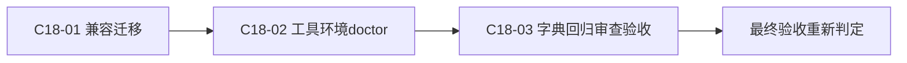
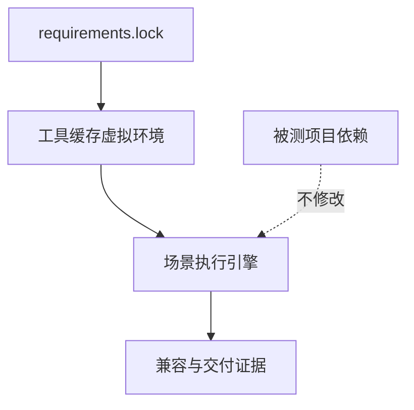

# 实施周期 18：兼容、工具环境与最终交付

结论：保留一个 schema 版本的兼容窗口，并用独立工具环境完成最终交付；本周期已完成兼容迁移、隔离依赖和 doctor，当前只收口字典、回归、审查与最终验收。影响：上线放行依据和交付证据升级，被测项目依赖保持不变。范围：`C18-03` 的真实测试、文档校验、字典、审查、验收和残留清理。非范围：下一主版本删除兼容、扩展新协议和修改生产语义。变化：工具依赖从隐式安装改为可复现隔离环境，旧格式迁移后不得继承旧 PASS。完成标准：四类 strict validator、新测试、历史回归、字典、Skill 合规、总审查和最终验收全部通过。术语说明：兼容窗口是旧格式仍受支持但会提示弃用的一段版本周期。验证状态：C18-03 已完成。

## 当前代码/文档基线

C17 已具备场景硬门禁；本周期保留旧 CLI、旧报告读取和旧场景资产一个 schema 版本，建立隔离工具依赖和 doctor，并完成字典、历史回归、审查和最终验收。

## 当前周期目标、边界与进入条件

进入条件：C17 shadow 切换条件成立。目标是兼容迁移、依赖零污染和最终交付。边界是不自动提交 Git、不修改被测项目依赖、不扩展新协议。

图片资产决策：N/A + 原因：兼容和交付证据为文本、JSON/YAML 与 Mermaid；证据：无图片资产。

## 最小任务闭环

每个任务固定按“实现 -> 真实测试 -> 实现审查 -> 任务验收”顺序闭环。`C18-03` 只能在前一步证据落盘且失败样本可识别后继续；任一环节失败都保持 `BLOCKED`，不得以静态阅读、编译或人工判断替代真实测试。

| 任务 | 实现动作 | 真实测试与断言 | 审查/验收证据 |
| --- | --- | --- | --- |
| `C18-01` | 迁移旧场景结果和兼容 CLI | 旧列表结果转为 `PENDING/LEGACY_INTERFACE_RESULT`，不继承旧 PASS | `EVD-RT-C18-01` 四件套 |
| `C18-02` | 建立锁定依赖和只读 doctor | 缺依赖、协议 runtime 缺失、被测项目依赖污染均被识别 | `EVD-RT-C18-02` 四件套 |
| `C18-03` | 刷新字典、执行回归并完成总审查 | 新测试 `42/42 PASS`，历史回归、validator、quick validate 均通过 | `EVD-RT-C18-03` 四件套 |

## 验证矩阵

| 验证项 | 入口 | 样本/环境 | 通过标准 |
| --- | --- | --- | --- |
| 新增外部场景回归 | `python3 -X utf8 -m unittest discover` | local 随机回环端口和隔离临时环境 | `42/42 PASS` |
| 文档严格校验 | `validate_engineering_docs.py --profile ... --strict` | 需求、验收、实施总览、周期 18 | 四类 profile 全部 PASS |
| Skill 与字典 | `quick_validate.py`、`generate_dictionary.py` | 当前 Skill 资产和生成结果 | 校验通过且 `data.js` 与 `字典.md` 一致 |
| 兼容与工具环境 | `test_dual_gate_migration.py` | 旧资产、锁定依赖、doctor | 兼容窗口有效且不改被测项目依赖 |

## 文件/符号操作矩阵

| 文件或目录 | 操作 | 保护条件 | 证据 |
| --- | --- | --- | --- |
| `scenario_migration.py`、`tool_env.py` | 读取、迁移、doctor | 只接受 local 配置，敏感值脱敏 | `TEST-RT-C18-01/02` |
| `release_test_engine/report.py`、`gate.py` | 读取、报告和门禁回归 | 真实场景 FAIL/BLOCKED 不得被摘要覆盖 | `TEST-RT-C17-*`、`TEST-RT-C18-*` |
| `SKILL.md`、`references/` | 规则与契约核对 | 不新增平行 Owner，不扩协议范围 | Skill 合规审查 |
| `skill-dictionary/data.js`、`字典.md` | 生成覆盖 | 必须由仓库生成器刷新 | 字典回归证据 |

## 停止、回滚与结束条件

| 条件 | 立即动作 | 回滚边界 | 重新进入条件 |
| --- | --- | --- | --- |
| 非 local 来源、敏感信息落盘或清理失败 | 立即停止后续写场景并标记 `BLOCKED` | 仅恢复 C18-03 新增证据和临时产物 | local 配置、脱敏和清理复验通过 |
| 兼容测试、历史回归或 validator 失败 | 停止最终放行 | 仅恢复对应任务文件，不回退用户改动 | 同一真实测试入口复验通过 |
| P0/P1 覆盖不足或双轨差异未解释 | 保持旧门禁或 `BLOCKED`，不伪造切换 | 不运行时回退已切换的 scenario 门禁 | 连续 3 次 local 达标且差异可解释 |
| 全部证据通过且无残留 | 结束 C18-03 并重新判定最终验收 | 不自动提交 Git | 最终验收文档与投影状态一致 |

## 周期内最小任务执行顺序

图形目的：展示兼容、工具环境和交付顺序。关联 ID：`C18-01..03`。

图形目的：匹配工具依赖与被测项目隔离边界。关联 ID：`REQ-RT-014`、`AC-RT-015`。

| 任务 | 文件/符号 | 真实测试 | 失败预期/清理 |
| --- | --- | --- | --- |
| `C18-01` | `scenario_migration.py`、兼容 CLI | 旧 schema、旧报告和旧命令 | 弃用提示缺失或行为破坏为 FAIL；清理迁移副本 |
| `C18-02` | `requirements.in/lock`、`tool_env.py`、doctor | Python 3.11、锁版本、隔离环境、依赖缺失 | 不修改被测项目；临时 venv 可清理 |
| `C18-03` | `SKILL.md`、references、字典、审查/验收证据 | 新测试、两轮历史测试、validator、字典、合规审查 | 任一失败保持 BLOCKED |

## 当前周期验证矩阵

执行 `test_tool_env_and_trigger.py`、本轮全部测试、两轮历史回归、四类工程文档 validator、Skill quick validate、字典生成与 diff、当前改动总审查。通过标准为全部 PASS、无残留进程/端口/数据、被测项目依赖零变更。

## 文件/符号操作契约

旧 CLI/报告/资产兼容保留一个 schema 版本并输出弃用提示；下一主版本删除不在本期执行。依赖只写目标 Skill 的工具锁文件和缓存环境。

## 周期阻断、停止与回滚

兼容破坏、依赖污染、历史回归失败、validator/字典/Skill 合规失败或最终门禁不一致立即停止。停止条件是上述任一高风险条件发生，或无法提供原成功标准的真实证据。逐任务回滚；最终验收继续 `BLOCKED`，不伪造 accepted。

## 追踪矩阵与自审

`SRC-USER-RT-002 -> DEC-RT-008/011 -> REQ-RT-014 -> AC-RT-015 -> CYCLE-RT-18/C18-01..03 -> TEST-RT-C18-* -> EVD-RT-C18-*`。`unresolved_decisions=0`；全部证据通过后才可重新判定最终验收。

## 自审结论

| 审查项 | 结论 | 依据 |
| --- | --- | --- |
| 任务粒度 | PASS | C18-03 独立完成实现、真实测试、审查、验收 |
| 真实测试 | PASS | 新测试、历史回归、validator 和字典均有固定入口 |
| 安全与兼容 | PASS | local-only、脱敏、旧 schema 迁移和被测项目依赖零变更 |
| 最终放行 | PASS | 最终验收已确认双轨切换条件、P0/P1 全部 PASS 和无残留 |
