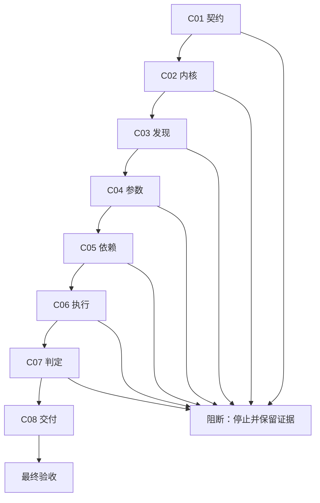
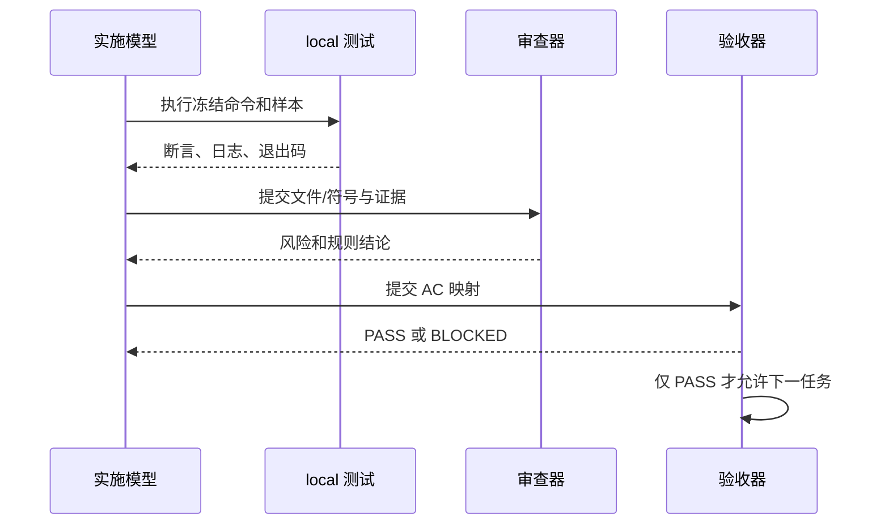

# 通用上线测试引擎实施总览

## 当前计划最终方案简要说明

图片资产决策：N/A + 原因：周期依赖和端到端流程使用 Mermaid；证据：本文件包含流程图和时序图。

采用统一 IR、可插拔 adapter、字段级依赖图、运行时参数解析、协议执行器、确定性判定器和事件化基线的垂直链路。八个周期按契约、内核、发现、解析、关系、执行、判定、迁移顺序推进，任何 P0/P1 或安全阻断都停止后续周期。

## Agent 对当前问题的理解

现有 Skill 能扫描和生成骨架，但不能稳定执行接口、查询参数、推断依赖或输出可信门禁。本次范围覆盖多协议入口和可复用信息；非范围包括非 local 连接、被测项目业务代码改造和 Git 历史写入。当前优先闭环是 `SLICE-RT-001`，关键假设是 local 配置可提供脱敏 fixture 和受控真实写入。

## 现状与落点

现状是正则扫描和人工 YAML 计划，落点是 `scripts/release_test_engine/` 下的 IR、adapter、resolver、graph、runner、judge、report 和 storage 符号；每个周期任务明确具体文件/符号，执行模型不得自行增加落点。

## 文档与代码落点

```text
project-release-test-rules/
├── scripts/generate_release_test_plan.py
├── scripts/release_test_engine/
│   ├── cli.py
│   ├── model.py
│   ├── discovery.py
│   ├── graph.py
│   ├── resolver.py
│   ├── runner.py
│   ├── judge.py
│   ├── report.py
│   └── adapters/
└── tests/
    ├── fixtures/
    └── test_*.py
```

文件/符号落点必须由周期任务继续冻结；执行模型不得自行扩大目录。

## 实施周期总览

| 周期 | 目标 | 进入条件 | 收口条件 |
| --- | --- | --- | --- |
| `CYCLE-RT-01` | 需求、验收、公共契约冻结 | 当前计划确认 | 文档 validator PASS |
| `CYCLE-RT-02` | IR、事件、存储和安全内核 | C01 PASS | schema/恢复/denylist 测试 PASS |
| `CYCLE-RT-03` | adapter 发现矩阵 | C02 PASS | 支持 fixture 发现 100% |
| `CYCLE-RT-04` | 参数来源与解析 | C03 PASS | 参数 trace 100% |
| `CYCLE-RT-05` | 依赖评分和拓扑执行 | C04 PASS | 循环/失败传播测试 PASS |
| `CYCLE-RT-06` | 多协议执行器 | C05 PASS | local E2E 写入和副作用证据 PASS |
| `CYCLE-RT-07` | 判定、报告和门禁 | C06 PASS | 真值表无冲突 |
| `CYCLE-RT-08` | 兼容、迁移和最终交付 | C07 PASS | 全量回归和最终验收 PASS |

## 阶段计划

| 阶段 | 重点 | 任务边界 |
| --- | --- | --- |
| 第一阶段 | 契约和内核 | C01-C02，只改文档和 engine core |
| 第二阶段 | 发现、解析、关系 | C03-C05，只改 adapter/graph/resolver |
| 第三阶段 | 执行、判定、交付 | C06-C08，只改 runner/judge/report/兼容层 |

## 最小任务清单

| 任务 | 文件/符号 | 真实测试 | 完成条件 |
| --- | --- | --- | --- |
| `TASK-RT-C01-01` | 需求、验收、实施文档 | validator profiles | 文档落盘且可解析 |
| `TASK-RT-C02-01` | `model.py`、`schema_registry.py` | IR golden | 合法/非法 schema 结果稳定 |
| `TASK-RT-C03-02` | `adapters/http_openapi.py` | 多框架 fixture | 入口召回/精确 100% |
| `TASK-RT-C04-02` | `resolver.py` | provider-consumer fixture | 参数 trace 完整 |
| `TASK-RT-C05-02` | `graph.py` | 循环/拓扑 fixture | 顺序唯一 |
| `TASK-RT-C06-01` | HTTP runner | local service | 写入和清理证据完整 |
| `TASK-RT-C07-02` | `report.py` | 门禁真值表 | PASS/PARTIAL/FAIL 唯一 |
| `TASK-RT-C08-03` | CLI/迁移/E2E | 全套回归 | 兼容和交付 PASS |

## 真实测试安排

统一环境为 `uv + CPython 3.11`，只加载 local 配置。命令模板：

```powershell
uv run --python 3.11 python -X utf8 -m unittest discover -s doc/5-tests/2026-07-12_180240/project-release-test-rules/tests -p "test_*.py" -v
python -X utf8 artifact-delivery-gate-rules/scripts/validate_engineering_docs.py --profile implementation_cycle --doc <cycle-doc> --root . --strict
```

每个任务必须使用脱敏 fixture、给出断言和失败预期；写入数据执行清理，业务不可逆副作用保留脱敏 run id。构建、lint 和人工阅读不能替代真实测试。

## 风险与阻断项

| 风险 | 触发 | 处置 |
| --- | --- | --- |
| 未支持协议 | adapter/依赖不可用 | `UNSUPPORTED_ADAPTER`，不生成 PASS |
| 环境越权 | 读取非 local 配置 | `ENV_BLOCKED`，停止并清理 |
| 安全命中 | denylist 命令或 SQL | `SAFETY_BLOCKED`，不发送 |
| 证据丢失 | 参数或副作用无 trace | `PENDING/BLOCKED`，禁止门禁通过 |
| 基线损坏 | 原子投影失败 | 执行 `ROLLBACK-RT-001` |

## 周期依赖与端到端流程

图形目的：说明周期依赖和端到端测试主链路。关联 ID：`CYCLE-RT-01` 至 `CYCLE-RT-08`、`AC-RT-001` 至 `AC-RT-009`。



## 实施时序

图形目的：展示任务实现、测试、审查、验收四步闭环。关联 ID：`TASK-RT-*`、`TEST-RT-*`、`EVIDENCE-RT-*`。



## 任务完成、停止与最大推进边界

任务完成必须同时满足实现、真实测试、审查、验收四类证据；停止条件包括非 local、secret 泄漏、极端操作、P0/P1 失败、参数无来源、依赖循环和基线损坏。最大推进边界是一次仅执行当前周期当前任务，未收口不得进入下一任务。`unresolved_decisions=0`。

## 追踪矩阵

| 来源 | 需求/规则 | 验收 | 周期/任务 | 测试/证据 |
| --- | --- | --- | --- | --- |
| `SRC-USER-RT-001` | `REQ-RT-001..008` | `AC-RT-001..009` | `CYCLE-RT-01..08` | `TEST-RT-001..005` |
| `DEC-RT-001..007` | `RULE-RT-001..007` | `AC-RT-002..008` | `TASK-RT-C02-01..C08-03` | `EVIDENCE-RT-001..005` |

## 自审结论

| 项目 | 状态 |
| --- | --- |
| 方案 | 已冻结统一 IR、adapter、依赖、执行、判定、基线链路 |
| 文件/符号 | 已给出目标目录树，具体符号在周期任务中冻结 |
| 真实测试 | 每个代码任务有 local 命令、样本、断言和失败预期 |
| 最大推进边界 | 按 C01-C08 串行，任务闭环后才推进 |
| 未决 | `unresolved_decisions=0` |
