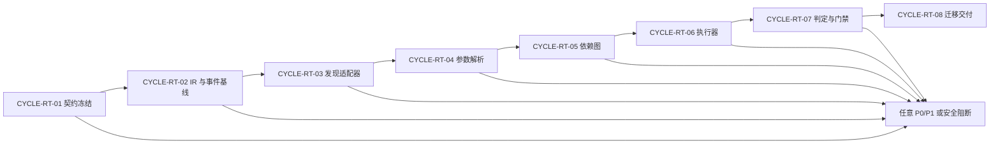

# 通用上线测试引擎需求与实施计划全量顺序实施方案

## 文档信息

| 字段 | 内容 |
| --- | --- |
| `doc_id` | `PLAN-RT-MASTER-20260712-001` |
| 来源需求 | [需求主文档](../2-需求/2026-07-12_180240_通用上线测试引擎完善需求.md) |
| 来源验收 | [验收标准](../7-验收/2026-07-12_180240_通用上线测试引擎完善需求_验收标准.md) |
| 主入口 | 周期 01 的 `TASK-RT-C01-01` |
| 当前状态 | confirmed；正式编码前必须先通过前置验收 |
| 图片资产决策 | N/A + 原因：计划依赖和顺序由 Mermaid 表达；证据：本文件包含全量流程图。 |

## 来源对象清单

图片资产决策：N/A + 原因：计划依赖和顺序由 Mermaid 表达；证据：本文件包含全量流程图。

| 来源对象 | 类型 | 关联 |
| --- | --- | --- |
| `REQ-RT-20260712-001` | 需求 | 目标、边界、规则和追踪 |
| `AC-RT-DOC-20260712-001` | 前置验收 | 进入实施和周期收口门槛 |
| `PLAN-RT-OVERVIEW-20260712-001` | 实施总览 | 周期级任务与依赖 |

## 当前执行入口与下一步

| 顺序 | 入口 | 依赖 | 下一步 |
| --- | --- | --- | --- |
| 0 | `TASK-RT-C01-01` 文档契约落盘 | 需求已确认 | 运行 requirement/acceptance validator |
| 1 | `TASK-RT-C01-02` 需求前置验收 | `AC-RT-001..009` | 允许周期 02 |
| 2 | `TASK-RT-C02-01` 统一 IR 和 schema | 周期 01 PASS | 进入事件与基线 |

## 依赖与阻断

| 阻断 ID | 触发 | 阻断结果 | 恢复入口 |
| --- | --- | --- | --- |
| `BOUND-RT-001` | 非 local 配置 | `ENV_BLOCKED`，不执行 | 切换 local 后重试 |
| `GAP-RT-001` | 入口或参数无证据 | `DISCOVERY_INCOMPLETE/PARAM_UNRESOLVED` | 补 adapter/fixture 证据 |
| `GAP-RT-002` | 需求、验收、周期链接失效 | `BLOCKED` | 修文档并重跑 validator |
| `ROLLBACK-RT-001` | 迁移或原子投影失败 | 恢复旧 baseline | `TASK-RT-C02-02` |

## 全量执行顺序

图形目的：展示八个周期的依赖和唯一推进方向。关联 ID：`CYCLE-RT-01` 至 `CYCLE-RT-08`、`TASK-RT-*`。

## 周期与任务总表

| 周期 | 任务顺序 | 主要落点 | 对应验收 |
| --- | --- | --- | --- |
| `CYCLE-RT-01` | `TASK-RT-C01-01`、`TASK-RT-C01-02`、`TASK-RT-C01-03` | 需求、验收、计划文档 | `AC-RT-001` |
| `CYCLE-RT-02` | `TASK-RT-C02-01`、`TASK-RT-C02-02`、`TASK-RT-C02-03` | IR、schema、事件、存储、安全 | `AC-RT-008` |
| `CYCLE-RT-03` | `TASK-RT-C03-01`、`TASK-RT-C03-02`、`TASK-RT-C03-03` | adapter SDK 与协议发现 | `AC-RT-001` |
| `CYCLE-RT-04` | `TASK-RT-C04-01`、`TASK-RT-C04-02`、`TASK-RT-C04-03` | 参数命名空间与解析 | `AC-RT-002` |
| `CYCLE-RT-05` | `TASK-RT-C05-01`、`TASK-RT-C05-02`、`TASK-RT-C05-03` | 依赖评分、拓扑、循环处理 | `AC-RT-003` |
| `CYCLE-RT-06` | `TASK-RT-C06-01`、`TASK-RT-C06-02`、`TASK-RT-C06-03` | 多协议执行器与 local 写入 | `AC-RT-004`、`AC-RT-005` |
| `CYCLE-RT-07` | `TASK-RT-C07-01`、`TASK-RT-C07-02`、`TASK-RT-C07-03` | 判定、报告、门禁 | `AC-RT-006`、`AC-RT-007` |
| `CYCLE-RT-08` | `TASK-RT-C08-01`、`TASK-RT-C08-02`、`TASK-RT-C08-03` | CLI 兼容、迁移、端到端交付 | `AC-RT-008`、`AC-RT-009` |

## 统一任务闭环要求

每个 `TASK-RT-*` 必须依次完成实现、真实测试、审查、验收。任务卡必须给出文件/符号、local 命令、样本、断言、失败预期、清理、回滚、停止条件和最大推进边界。普通执行模型的 `unresolved_decisions` 必须为 0。

| 任务证据类别 | ID 规则 | 记录内容 |
| --- | --- | --- |
| 实现 | `EVD-<TASK>-IMPL` | 文件/符号和变更摘要 |
| 真实测试 | `EVD-<TASK>-TEST` | 命令、样本、断言、退出码 |
| 审查 | `EVD-<TASK>-REVIEW` | 规则、风险和差异审查 |
| 验收 | `EVD-<TASK>-ACCEPT` | AC 结论、证据路径和状态 |

## 自审结论

| 项目 | 结论 |
| --- | --- |
| 全量顺序 | 已冻结为 C01-C08 串行，周期内任务按表顺序执行 |
| 依赖与阻断 | 已冻结 local-only、安全 denylist、P0/P1 停止和 baseline 回滚 |
| 未决决策 | `unresolved_decisions=0`；缺证据必须 BLOCKED |
| 计划状态 | 可进入周期 01 文档验收，未授权直接编码 |
