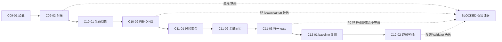
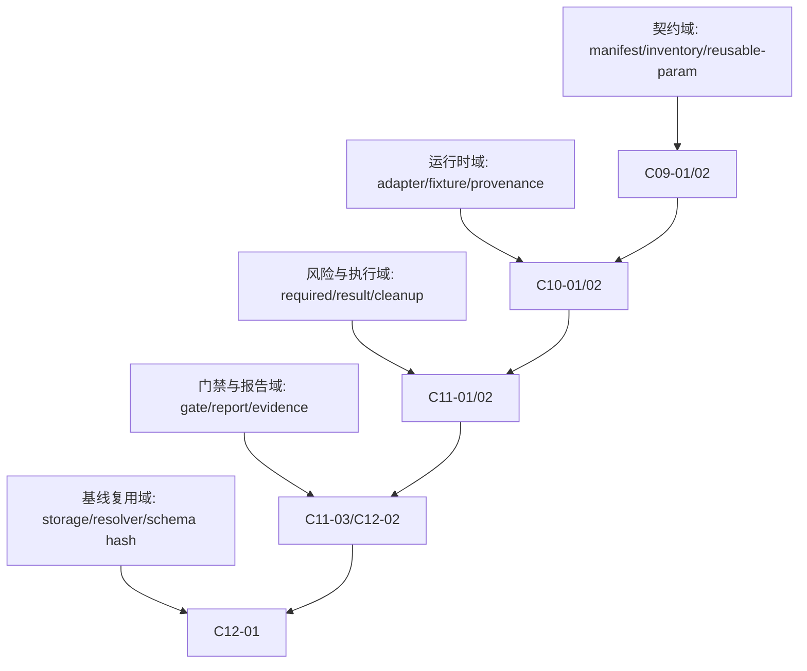
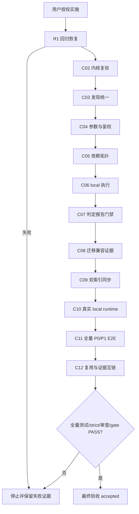
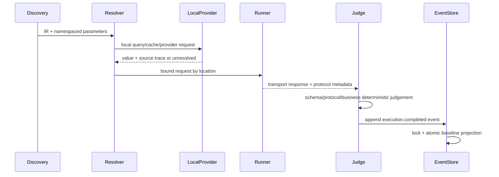

# 通用上线测试引擎修订版全量实施计划

## 文档信息

| 字段 | 内容 |
| --- | --- |
| `doc_id` | `PLAN-RT-REV-20260712-190609` |
| 文档类型 | `implementation_master` 修订计划；本轮仅输出计划，未授权继续编码 |
| 需求来源 | `REQ-RT-20260712-001` |
| 验收来源 | `AC-RT-DOC-20260712-001` |
| 原全量顺序 | `doc/3-实施/2026-07-12_180240_通用上线测试引擎完善需求_需求与实施计划全量顺序实施方案.md` |
| 当前状态 | `blocked_before_next_cycle`；C09、C10 实现与专项测试已通过，C10 四类任务证据尚未真实落盘，C08-03 最终门禁仍为 `PARTIAL` |
| 图片资产决策 | `N/A + 原因 + 证据`：本计划只表达流程、依赖、时序和门禁，使用 Mermaid；没有 UI、截图、视觉对比或真实图片产物 |

## 1. 当前计划最终方案简要说明

图片资产决策：N/A + 原因 + 证据：本计划只表达流程、依赖、时序和门禁，使用 Mermaid；没有 UI、截图、视觉对比或真实图片产物。

先把现有已通过的 R1、C02-C08 窄闭环固化为可信基线，再按“契约双索引 -> 真实 local runtime -> 全量 P0/P1 执行 -> 门禁与复用验收”的垂直切片推进。继续复用现有 `scripts/release_test_engine/`、统一 IR v2、local-only 规则和既有文档链，不另起第二套测试框架；本轮只形成可零决策执行的 C09-C12 计划，所有未来执行仍严格限定 local fixture，最终放行继续受 P0、证据和 gate=PASS 约束。

## 2. 基本信息

| 字段 | 冻结内容 |
| --- | --- |
| 来源需求 | `doc/2-需求/2026-07-12_180240_通用上线测试引擎完善需求.md` |
| 来源验收 | `doc/7-验收/2026-07-12_180240_通用上线测试引擎完善需求_验收标准.md` |
| 原全量顺序 | `doc/3-实施/2026-07-12_180240_通用上线测试引擎完善需求_需求与实施计划全量顺序实施方案.md` |
| 原实施总览 | `doc/3-实施/2026-07-12_180240_通用上线测试引擎完善需求_实施总览.md` |
| 修订原因 | 并行改动后的回归已修复；当前持久化报告为 `PARTIAL`，真实非 HTTP local runtime、双索引主流程接入和全量 P0/P1 证据仍不完整 |
| 当前问题/目标 | 将已有骨架变成任何项目可复用的“发现入口、解析参数、建立依赖、local 执行、确定性判定、基线复用、门禁报告”引擎 |
| 本轮范围 | 在已完成 R1-C08 窄闭环之上，规划 C09-C12 的双索引同步、真实 local runtime、全量 P0/P1 E2E、门禁 PASS、跨项目 baseline 复用与最终验收 |
| 明确不在范围 | 不连接 test/staging/pre/release/prod；不修改被测业务代码/schema；不新增第二套框架；不执行 Git commit/push/rebase/merge |
| 当前优先闭环 | `SLICE-RT-002`：双索引同步、真实 local runtime、全量 P0/P1 门禁和跨项目基线复用 |
| 当前状态 | C09-01 `4/4 PASS`、C09-02 `6/6 PASS`、C10 runtime matrix 全量 `37/37 PASS`；当前阻断点是 C10-01/02 四类证据未落盘、C11/C12 尚未执行，现有报告门禁仍为 `PARTIAL`，最终验收保持 `BLOCKED` |
| 开始实施授权 | 否；本轮用户只要求实施计划，计划确认前不得进入编码、测试实施或服务启动 |
| 未决决策 | `0`；运行时缺口、索引缺失和 P0/P1 证据不足均已冻结为明确阻断条件，不允许执行模型自行补默认值 |

本计划当前是待用户确认的执行方案，不构成编码授权；任何非 local 连接、secret 泄漏、P0 非 PASS、双索引缺失或 C08-C12 证据缺失都必须停止并保留阻断证据。

### 2.1 当前已确认的失败与缺口证据

| 证据 ID | 事实 | 影响 | 处理任务 |
| --- | --- | --- | --- |
| `EVIDENCE-RT-REGRESSION-001` | `discovery.py` gRPC `setdefault` 位于循环外，无匹配时 `item` 未绑定 | 普通项目发现抛 `UnboundLocalError` | `TASK-RT-R01` |
| `EVIDENCE-RT-REGRESSION-002` | RPC endpoint 仅由环境变量名命中，未证明显式 local provenance 时可能尝试远程 URL | 违反 local-only 红线 | `TASK-RT-R02` |
| `EVIDENCE-RT-REGRESSION-003` | 旧 CLI contract 仍期望旧委派行为，新 `compat_*` 方向导致 mock 调用为空 | 兼容入口验收失败 | `TASK-RT-R03` |
| `EVIDENCE-RT-GAP-001` | `run_doctor` 只看发现数量，不看 execution status | discovery-ready/execution-pending 可能误报 PASS | `TASK-RT-P01` |
| `EVIDENCE-RT-GAP-002` | 低置信依赖边仍可能进入自动执行 | 猜测关系污染结果 | `TASK-RT-P02` |
| `EVIDENCE-RT-GAP-003` | resolver 未接入 `service.operation.location.field` 命名空间 | 同名参数可能串接口 | `TASK-RT-P03` |
| `EVIDENCE-RT-GAP-004` | local DB/cache 仅静态 value/query，无通用 local provider | 参数来源链无法真实查询 | `TASK-RT-P04` |
| `EVIDENCE-RT-GAP-005` | HTTP query/path/header/cookie/form/multipart 构造不完整 | 真实请求位置错误 | `TASK-RT-P05` |
| `EVIDENCE-RT-GAP-006` | judge 未覆盖 JSON schema、GraphQL/JSON-RPC/SOAP 错误语义 | 2xx 错误可能误判 PASS | `TASK-RT-P06` |
| `EVIDENCE-RT-GAP-007` | gRPC/WS/MQ/scheduler/event 主要为 PENDING，缺 local runtime fixture | 支持矩阵无真实执行证据 | `TASK-RT-P07` |
| `EVIDENCE-RT-GAP-008` | OpenAPI adapter 存在但主 discovery 仍保留旧解析路径 | 入口证据可能分叉 | `TASK-RT-P08` |
| `EVIDENCE-RT-GAP-009` | v1 migration 未完整接入 CLI/pipeline，缺 invalid fixture 和原资产不变断言 | 迁移不可交付 | `TASK-RT-P09` |
| `EVIDENCE-RT-GAP-010` | 报告目录/字段未完全符合 output-artifacts/report-format | 产物不可复核 | `TASK-RT-P10` |
| `EVIDENCE-RT-GAP-011` | C08 实现/测试/审查/验收证据文件未真实落盘 | 不能宣称最终放行 | `TASK-RT-P11` |

### 2.2 本轮已完成事实与未完成事实（计划基线）

| 事实 ID | 已确认事实 | 对本计划的含义 | 证据位置 |
| --- | --- | --- | --- |
| `FACT-RT-C09-01-001` | 三方契约资产加载专项测试 `4/4 PASS` | C09-01 实现闭环已完成，仍需保留四类 EVD | `doc/5-tests/2026-07-12_191712/project-release-test-rules/tests/test_contract_asset_sync.py` |
| `FACT-RT-C09-02-001` | 三方集合、schema hash、reusable-param 对账专项测试 `6/6 PASS` | C09-02 实现闭环已完成，允许进入 C10 证据收口 | `doc/5-tests/2026-07-12_191712/project-release-test-rules/tests/test_contract_reconcile.py` |
| `FACT-RT-C10-001` | 五协议 local fixture 生命周期、strict provenance、callback 和唯一 `run_id` 测试全量 `37/37 PASS` | C10 代码/测试结果可作为 C11 前置，但不等于 C10 证据验收完成 | `tests/test_runtime_matrix.py`、`tests/test_runtime_report_contract.py` |
| `BLOCK-RT-C10-EVD-001` | C10-01/02 的 `IMPL/TEST/REVIEW/ACCEPT` 文件尚未全部真实落盘 | 当前唯一优先收口动作是补齐 C10 四类证据并通过文档校验 | `evidence/EVD-TASK-RT-C10-01-*`、`evidence/EVD-TASK-RT-C10-02-*` |
| `BLOCK-RT-C11-001` | C11 风险集合、全量 P0/P1 E2E 与唯一 gate 尚未执行 | 未完成前不得写 `gate=PASS` | `risk-coverage.yaml`、`p0-p1-evidence.yaml` 尚未形成 |
| `BLOCK-RT-C12-001` | 第二项目 baseline 复用和最终互链尚未执行 | 最终验收必须保持 `BLOCKED` | `doc/7-验收/2026-07-12_180240_通用上线测试引擎完善需求_验收标准.md` |

## 3. 实施周期总览

本修订计划保留八个业务周期，但把现有已完成声明改为“待复验”，并在每个周期前插入可独立验收的修复任务。周期排序采用“先恢复可信基线，再扩展能力；每个任务实现、真实测试、审查、验收闭环后才进入下一任务”。

| 期次 | 周期 | 只做一件事 | 进入条件 | 收口条件 |
| --- | --- | --- | --- | --- |
| 第一期 | `R1` 回归恢复 | 修复发现、RPC provenance、旧 CLI 三个已知失败 | 本计划被用户采纳并授权实施 | 原失败用例 PASS，local-only 无回归 |
| 第二期 | `CYCLE-RT-02` 契约内核复验 | 冻结 IR、事件、原子存储和安全契约 | R1 PASS | schema、锁、恢复、denylist 全 PASS |
| 第三期 | `CYCLE-RT-03` 发现矩阵统一 | 统一 adapter 注册，补多协议发现精度 | R2 PASS | fixture 入口 precision/recall 100%，无旧解析分叉 |
| 第四期 | `CYCLE-RT-04` 参数与鉴权 | 位置化参数、命名空间、local provider、鉴权脱敏 | R3 PASS | 每个必填参数有 trace 或明确 PENDING |
| 第五期 | `CYCLE-RT-05` 依赖拓扑 | 低置信阈值、循环、失败传播和确定性排序 | R4 PASS | 无低置信自动边、consumer 正确 BLOCKED |
| 第六期 | `CYCLE-RT-06` 协议执行 | HTTP/RPC/CLI 及可用协议 local runtime fixture | R5 PASS | execution matrix 与 runtime evidence 一致 |
| 第七期 | `CYCLE-RT-07` 判定报告门禁 | 协议错误/schema、报告字段、P0/P1/P2 聚合 | R6 PASS | 真值表、脱敏、报告格式全部 PASS |
| 第八期 | `CYCLE-RT-08` 迁移兼容交付 | v1 migration、旧十命令、baseline、报告专项 | R7 PASS | C08-03 产物专项 PASS；交付/最终验收仍可为 BLOCKED |
| 第九期 | `CYCLE-RT-09` 双索引同步 | manifest、inventory、reusable-param 三方加载与对账 | C08-03 产物专项 PASS | 缺失/单边/漂移均有结构化阻断；三方集合和 schema hash 对齐 |
| 第十期 | `CYCLE-RT-10` 真实 local runtime | 五类非 HTTP fixture 契约、生命周期和执行矩阵 | C09 PASS | 有 fixture 的入口可判定；无 fixture 只能 PENDING/UNSUPPORTED_ADAPTER |
| 第十一期 | `CYCLE-RT-11` 全量 P0/P1 E2E | 风险集合冻结、全量执行、清理和证据覆盖 | C10 PASS | 结果 ID 集合等于必测集合；P0 全 PASS；P1 无未解释阻断 |
| 第十二期 | `CYCLE-RT-12` 复用与最终验收 | 第二项目 baseline 复用、全量门禁和交付收口 | C11 gate=PASS | gate=PASS、四类 EVD 互链、最终验收 `accepted` |

## 来源对象清单

| 来源对象 | 类型 | 关系 |
| --- | --- | --- |
| `REQ-RT-20260712-001` | 需求 | 冻结通用发现、参数、依赖、执行、判定和基线目标 |
| `AC-RT-DOC-20260712-001` | 前置验收 | 冻结 AC-RT-001..009 与异常/停止条件 |
| `PLAN-RT-MASTER-20260712-001` | 原实施总表 | 提供 C01-C08 原顺序，本修订计划只补缺口和回归 |
| `EVIDENCE-RT-REGRESSION-20260712-190000` | 当前回归证据集合 | 提供 `23/2/1` 事实和 R1 入口 |

## 当前执行入口与下一步

| 顺序 | 当前入口 | 依赖 | 下一步 |
| --- | --- | --- | --- |
| 0 | 用户确认本计划并明确开始实施 | 当前未满足 | 只允许进入 C09-01 |
| 1 | `TASK-RT-C09-01` | R1-C08 窄闭环证据齐全 | 校验双索引输入，缺失则 BLOCKED |
| 2 | `TASK-RT-C10-01/02` 证据收口 | C10 代码和 `37/37 PASS` 已存在 | 先落盘四类 EVD、更新 README/验证记录；未完成不得进入 C11 |
| 3 | `TASK-RT-C11-01` | C10 两任务四类 EVD、strict validator PASS | 建立全量 P0/P1 样本矩阵 |
| 4 | `TASK-RT-C12-01` | C11 gate=PASS 且 P0/P1 证据完整 | 第二项目复用 baseline，准备最终验收 |

## 全量执行顺序

全量顺序固定为 `R1-R01 -> R1-R02 -> R1-R03 -> C02 -> C03 -> C04 -> C05 -> C06 -> C07 -> C08 -> C09 -> C10 -> C11 -> C12 -> 最终验收`。R1-C08 的历史证据只作为前置输入；C09-C12 必须逐任务完成“实现 -> 真实测试 -> 审查 -> 验收”四步，未闭环不得推进；任何 P0/P1、安全、双索引或非 local 阻断都停止在当前任务。

## 4. 阶段计划

| 阶段 | 单一目标 | 输入 | 输出 | 验证门槛 |
| --- | --- | --- | --- | --- |
| 阶段 1：可信基线恢复 | 把当前 23/2/1 结果恢复为可复验起点 | 现有代码、26 个测试、三条失败证据 | R1 修复记录和回归报告 | 原失败全部通过；否则停止 |
| 阶段 2：发现到参数垂直切片 | 任何入口都能生成带来源的可执行请求 | IR、adapter、fixture、local provider | 入口 inventory、参数 trace、依赖图 | 无猜测执行，PENDING 可解释 |
| 阶段 3：执行到门禁垂直切片 | local 执行结果可确定性判定并形成报告 | runtime fixtures、judge、gate | report、responses、baseline event | 协议错误不误报 PASS，secret 零泄漏 |
| 阶段 4：兼容与交付 | 旧入口不破坏，新入口可复用历史 | CLI、v1 baseline、产物规则 | C08 证据、最终验收输入 | 全量测试、strict validator、审查均 PASS |

## 依赖与阻断

| 依赖/阻断 | 处理 |
| --- | --- |
| 非 local 配置或 endpoint provenance 不明 | 不发送，输出 `ENV_BLOCKED/LOCAL_CONFIG_PROVENANCE_INVALID` |
| 低置信依赖或参数无来源 | 输出 `PENDING/PARAM_UNRESOLVED`，不得猜测执行 |
| provider 失败 | consumer 输出 `BLOCKED_BY_DEPENDENCY` |
| schema/协议错误语义未冻结 | 不判 PASS，转 `FAIL/PENDING` 并保留证据 |
| C08 证据缺失或 strict validator 失败 | 停止最终验收，不输出上线放行 |

## 5. 最小任务清单与执行契约

以下任务是唯一允许的执行顺序。每个任务必须先完成“实现 -> 真实测试 -> 审查 -> 验收”，任务未收口不得进入下一任务。每个任务预计触达文件不超过 5 个；测试资产只放当前时间戳测试根目录 ASCII 镜像。

### 5.1 R1 回归恢复

#### `TASK-RT-R01` 修复 gRPC 无匹配发现回归

- 所属周期/顺序：`R1` / 1。
- 只做这一件事：将 gRPC 入口投影放回 `_GRPC.finditer` 循环内，并增加无匹配普通项目回归断言。
- 文件/符号：`project-release-test-rules/scripts/release_test_engine/discovery.py::discover_project`；`doc/5-tests/2026-07-12_191712/project-release-test-rules/tests/test_discovery_regression.py`。
- 禁止触碰：adapter 业务规则、接口 schema、非 local 配置、无关格式化。
- 真实测试：`python -X utf8 -m unittest doc/5-tests/2026-07-12_191712/project-release-test-rules/tests/test_discovery_regression.py -v`。
- 样本：仅含 `@KafkaListener` 的普通 `.java` 文件；含一个 gRPC service 的 `.proto`；无 gRPC match 的 `.proto`。
- 断言：无匹配不抛异常；有匹配恰好发现对应 operation；跨文件同名入口不互相覆盖。
- 失败预期：出现 `UnboundLocalError`、入口数量不稳定或错误协议均判 FAIL。
- 清理/回滚：删除临时 fixture；仅回滚本任务两处文件；不恢复并行 agent 的其他改动。
- 完成条件：测试 PASS、diff 只含目标行、审查无 P1、验收记录 `EVD-TASK-RT-R01-*`。
- 停止条件：发现需要改 adapter 契约或生产项目代码；立即停止并转需求 gap。
- 前置/下一任务：无 / `TASK-RT-R02`。
- 预计触达文件数：2。

#### `TASK-RT-R02` 修复 RPC local provenance 与鉴权边界

- 所属周期/顺序：`R1` / 2。
- 只做这一件事：要求 endpoint 来自显式 `local_config`/local adapter 配置，并在发起网络请求前阻断未证明 local 的 URL；保留 local auth 引用和脱敏。
- 文件/符号：`runner.py::_rpc_http`、`auth.py::resolve_auth`；`test_protocol_adapters.py` 追加负向测试。
- 真实测试：`python -X utf8 -m unittest doc/5-tests/2026-07-12_180240/project-release-test-rules/tests/test_protocol_adapters.py -v`。
- 样本：`env={graphql_endpoint:https://prod.example}`、显式 `local_config=http://127.0.0.1:<port>`、local auth `env_ref`、缺失 auth ref。
- 断言：远程 URL 在发送前得到 `LOCAL_CONFIG_PROVENANCE_INVALID`；local endpoint 才进入 transport；auth 原值不出现在结果/报告。
- 失败预期：任何远程连接尝试、错误码变为 `LOCAL_SERVICE_UNAVAILABLE` 或 secret 明文均 FAIL。
- 清理/回滚：不启动远程服务；local fixture 端口由测试释放；回滚仅限 `_rpc_http` 与测试断言。
- 完成条件：RPC/GraphQL/JSON-RPC/SOAP 四类 provenance 负向测试 PASS。
- 停止条件：需要读取 test/prod 配置或真实外部服务；立即 BLOCKED。
- 前置/下一任务：`TASK-RT-R01` / `TASK-RT-R03`。
- 预计触达文件数：3。

#### `TASK-RT-R03` 修复旧十命令与新 pipeline 兼容契约

- 所属周期/顺序：`R1` / 3。
- 只做这一件事：冻结旧十命令原语义、`compat_*` handler 和 `doctor/run` 新入口的委派边界，修正 mock/缺 handler 时的结构化回退。
- 文件/符号：`generate_release_test_plan.py` 的 `command_*` 与 compat dispatch；`tests/cli_compat/test_cli_contract.py`。
- 真实测试：`python -X utf8 -m unittest doc/5-tests/2026-07-12_180240/project-release-test-rules/tests/cli_compat/test_cli_contract.py -v`。
- 样本：旧十命令逐个构造最小参数；`run --baseline-root`；engine 不可导入；compat handler 存在/不存在。
- 断言：旧命令不误跑完整 run；新 run 正确转发 baseline/config/inventory/plan/modules/adapters；engine 缺失返回结构化 PENDING；兼容 mock 调用可观察。
- 失败预期：calls 为空、旧命令输出字段丢失、参数静默丢弃均 FAIL。
- 清理/回滚：删除临时 argv 和 mock；保留旧 wrapper 回退路径；不改业务脚本。
- 完成条件：CLI contract 全 PASS，旧十命令行为矩阵有证据。
- 停止条件：发现必须破坏旧输出或改动业务项目适配；停止并提交边界 gap。
- 前置/下一任务：`TASK-RT-R02` / `TASK-RT-C02-01`。
- 预计触达文件数：2。

### 5.2 CYCLE-RT-02 契约内核复验

#### `TASK-RT-C02-01` IR/schema/事件原子存储复验

- 文件/符号：`model.py`、`schema_registry.py`、`events.py`、`storage.py`；测试沿用 `test_core_engine.py`，只新增缺失负例。
- 真实测试：`python -X utf8 -m unittest doc/5-tests/2026-07-12_180240/project-release-test-rules/tests/test_core_engine.py -v`。
- 样本/断言：合法 IR round-trip；未知 protocol、缺 required field、非法 event；锁竞争、projector 异常后旧 baseline hash 不变。
- 完成：schema、append-only、lock、atomic replace、replay 全 PASS；失败则停止在 C02。

### 5.3 CYCLE-RT-03 发现适配器统一

#### `TASK-RT-C03-01` 统一 OpenAPI 与 adapter registry

- 文件/符号：`discovery.py::discover_project`、`adapters/__init__.py::discovery_adapters`、`adapters/http_openapi.py::OpenAPIAdapter`。
- 真实测试：`python -X utf8 -m unittest doc/5-tests/2026-07-12_180240/project-release-test-rules/tests/test_protocol_adapters.py -v`。
- 样本/断言：OpenAPI YAML/JSON、HTTP 源码、GraphQL、gRPC、CLI、SOAP/JSON-RPC、WS/MQ/scheduler/event fixture；同源同入口只保留一个 IR，证据 source 唯一。
- 完成：旧 `_parse_openapi` 不再作为第二事实源；入口 precision/recall 100%；未支持入口输出结构化 `UNSUPPORTED_ADAPTER`。

#### `TASK-RT-C03-02` doctor execution matrix

- 文件/符号：`cli.py::run_doctor`、adapter status helpers、`test_engine_extensions.py` 追加 doctor 负例。
- 真实测试：同一 unittest 入口；样本为 discovery-ready/execution-pending 和真实 local runner ready。
- 断言：doctor 只有 discovery 且 execution pending 时输出 `PENDING/PARTIAL`，不得 PASS；adapter matrix 与 runner status 一致。

### 5.4 CYCLE-RT-04 参数与鉴权

#### `TASK-RT-C04-01` 命名空间与参数位置

- 文件/符号：`resolver.py::resolve_parameters`、`model.py::ParameterIR`、`runner.py::_http`。
- 真实测试：新增 `test_parameter_locations.py`，命令为 `python -X utf8 -m unittest ...test_parameter_locations -v`。
- 样本/断言：同名 `id` 分属 `service.operation.query.id`、`...path.id`、`...header.id`、`...cookie.id`、`...body.id`；HTTP URL path 替换、query 编码、header/cookie/form/multipart 位置正确。
- 完成：每个参数有唯一 namespace、source、trace；无 namespace 的同名值不得执行。

#### `TASK-RT-C04-02` local provider 查询与失败传播

- 文件/符号：`resolver.py` provider dispatch、`parameter_store.py`、local fixture provider helper。
- 真实测试：新增 `test_local_provider_resolution.py`；只使用临时 SQLite/local cache fixture。
- 样本/断言：query 成功、空结果、多行 selector、非法 SQL/非 local provider；失败必须 `PARAM_UNRESOLVED`，不得回退猜测值。
- 清理：每个 SQLite 临时库和 cache key 测试后删除；不读项目真实 test/prod 连接。

### 5.5 CYCLE-RT-05 依赖图与拓扑

#### `TASK-RT-C05-01` 低置信阈值与诊断

- 文件/符号：`topology.py::infer_edges`、`graph.py::build_dependency_graph`、`dependency_diagnostics.py`。
- 真实测试：`test_engine_extensions.py` 扩展显式高置信、低置信 `0.65`、人工 override、循环图。
- 断言：低于冻结阈值的边标记 `PENDING`，不进入执行 order；只有显式 override 才可执行并记录证据。

#### `TASK-RT-C05-02` provider/consumer 失败传播

- 文件/符号：`cli.py::run_pipeline`、`gate.py::aggregate_gate`。
- 真实测试：provider FAIL、provider 参数不可提取、consumer 自身 FAIL 三组 local fixture。
- 断言：前两者分别为 `BLOCKED_BY_DEPENDENCY`/`PARAM_UNRESOLVED`，不得归因 consumer transport；拓扑顺序稳定且无环。

### 5.6 CYCLE-RT-06 多协议执行

#### `TASK-RT-C06-01` HTTP/RPC/CLI local runtime

- 文件/符号：`runner.py` HTTP/RPC/CLI 分派、`test_local_e2e.py`、CLI fixture command。
- 真实测试：`python -X utf8 -m unittest doc/5-tests/2026-07-12_191712/project-release-test-rules/tests/test_local_e2e.py -v`，外加 `cli_command:<name>` subprocess fixture；旧轮 `2026-07-12_180240` 只读复用。
- 断言：HTTP 写入有 run id 与清理；RPC auth 注入；CLI 仅执行显式 local command map；dry-run 不发送。

#### `TASK-RT-C06-02a` 非 HTTP fixture 契约

- 文件/符号：`model.py::RuntimeFixtureIR`、`runner.py::validate_fixture`、`references/output-artifacts.md`、`tests/test_runtime_matrix.py`；预计触达 4 个文件。
- 本任务只做这一件事：冻结五类非 HTTP fixture 的字段、状态枚举、local provenance 和 cleanup 契约，不实现协议执行。
- fixture 契约：`fixture_id`、`protocol`、`transport`、`local_provenance`、`handler`、`expected_status`、`cleanup`、`failure_type` 均必填；允许状态仅为 `PASS`、`FAIL`、`PENDING`、`UNSUPPORTED_ADAPTER`。
- 真实测试：`python -X utf8 -m unittest doc/5-tests/2026-07-12_191712/project-release-test-rules/tests/test_runtime_matrix.py -v`；完整、缺字段、非法枚举、`local_provenance=false` 四类 fixture。
- 断言：schema 缺字段必拒绝；非 local fixture 不进入 runner；reason/failure_type 缺失必拒绝。
- 失败预期：把 discovery-ready 当 execution-ready、缺 status 默认为 PASS、允许隐式 endpoint 均 FAIL。
- 清理/回滚：只写临时 fixture schema，失败删除临时文件，不改运行时状态。
- 审查点：检查字段命名、枚举、敏感字段不落盘。
- 验收点：fixture schema 能被 `runtime-matrix.yaml` 读取，四类负例结果稳定。
- 完成条件：契约正反例全 PASS，文档字段与测试断言一致。
- 停止条件：需要引入外部 broker、无法冻结字段或发现 schema 与现有 IR 冲突时停止 C06-02a。
- 前置/下一任务：`TASK-RT-C06-01` / `TASK-RT-C06-02b`。

#### `TASK-RT-C06-02b` 非 HTTP execution matrix

- 文件/符号：`adapters/grpc.py`、`adapters/websocket.py`、`adapters/messaging.py`、`adapters/scheduler.py`、`adapters/event_handler.py`、`runner.py::run_adapter`、`cli.py::run_pipeline`、`tests/test_runtime_matrix.py`；按协议拆为五个独立 fixture 子闭环，每个子闭环不超过 5 个文件。
- 本任务只做这一件事：将五类 fixture 接入执行矩阵，逐入口写入 discovery、fixture、execution、reason、cleanup 五列。
- 真实测试：同 `test_runtime_matrix.py`，只使用显式 local in-process fixture，不访问 broker/staging/test/prod。
- 样本/断言：gRPC、WebSocket、message、scheduler、event 各一条 PASS、一条 FAIL、一条缺 fixture；无 fixture 必须为 `PENDING/UNSUPPORTED_ADAPTER`，不得聚合 PASS；混合矩阵逐入口状态和原因完整。
- 失败预期：fixture status 缺失、非 local transport、线程/端口无法清理或 P0/P1 PENDING 均 FAIL。
- 清理/回滚：handler 释放 socket、线程、队列和临时文件；失败时保留脱敏 run id，回滚仅限本任务 fixture/runner 状态。
- 审查点：检查 status 聚合不把 discovery-ready 当 execution-ready，检查 transport 来源和 secret 脱敏。
- 验收点：`runtime-matrix.yaml` 与测试输出逐入口一致，P0/P1 若为 PENDING 必须阻断后续周期。
- 完成条件：五协议可执行/缺失/非法三类样本均 PASS，矩阵每行具备五列证据和 cleanup 结果。
- 停止条件：需要真实 broker、外部网络、不可回滚副作用或 fixture 无法清理时停止，不降级为伪 PASS。
- 前置/下一任务：`TASK-RT-C06-02a` / `TASK-RT-C07-01`。

### 5.7 CYCLE-RT-07 判定、报告与门禁

#### `TASK-RT-C07-01` 协议错误和 schema 判定

- 所属周期/顺序：`CYCLE-RT-07` / 1；所属阶段：阶段 3（判定）。
- 本任务只做这一件事：把 transport、schema、协议错误和未知业务语义映射为确定性接口结果。
- 文件/符号：`judge.py::judge`、schema helper、`tests/test_judge_protocols.py`；预计触达 3 个文件。
- 真实测试：`python -X utf8 -m unittest doc/5-tests/2026-07-12_191712/project-release-test-rules/tests/test_judge_protocols.py -v`；HTTP schema mismatch、GraphQL `errors`、JSON-RPC `error`、SOAP Fault、业务 code 非成功、未知语义六类脱敏 fixture。
- 断言：transport 2xx 不等于 PASS；schema/协议错误为 FAIL 或 PENDING；未知业务语义只能 PENDING；请求/响应为合法脱敏 JSON 字符串。
- 失败预期：2xx 错误误判 PASS、错误响应无 reason、敏感字段原值落盘均 FAIL。
- 审查点：真值表覆盖错误优先级，判定理由可复核，未知语义不被模型补默认。
- 验收点：每类 fixture 均有 verdict、failure_type、reason、evidence path。
- 完成条件：六类真值表全 PASS，judge 输出枚举与 gate 输入一致。
- 停止条件：协议语义无法冻结、schema 校验库行为不确定或出现 secret 时停止 C07-01。
- 前置/下一任务：`TASK-RT-C06-02b` / `TASK-RT-C07-02`。

#### `TASK-RT-C07-02` 报告布局与基线投影

- 所属周期/顺序：`CYCLE-RT-07` / 2；所属阶段：阶段 3（判定）。
- 本任务只做这一件事：生成符合报告规范的接口明细、脱敏响应、事件和 baseline 原子投影；双索引加载与三方对账转由 C09 承担。
- 文件/符号：`report.py::write_report/project_execution_to_baseline`、`cli.py::run_pipeline`、`references/output-artifacts.md`、`references/report-format.md`；预计触达 4 个文件。
- 真实测试：`python -X utf8 -m unittest doc/5-tests/2026-07-12_191712/project-release-test-rules/tests/test_c08_e2e_artifacts.py -v`；local pipeline 产物检查。
- 断言：`README.md`、ASCII mirror、`interface-test-results.md`、`responses.json`、`release-test-report.json`、`interface-sync-report.yaml` 均存在且字段齐全；baseline event 含 interfaces、dependency graph、results、latest gate、scenarios；secret 扫描为零；时间戳为 ISO。
- 失败预期：接口明细使用 Markdown 表格、响应只有 verdict 占位、baseline 覆盖旧版本、secret 扫描非零或字段缺失均 FAIL。
- 清理/回滚：报告写入时间戳临时目录；projector 失败时保留旧 baseline，删除不完整新投影。
- 审查点：核对 report-format 字段顺序、dataPreview、raw/masked/resolved 分离和原子投影。
- 验收点：C08-03 artifact replay 通过，专项状态可与最终 gate 区分。
- 完成条件：产物专项测试 PASS，报告/baseline 可 replay，未宣称上线 PASS。
- 停止条件：字段无法满足 report-format、baseline hash 改变或 secret 泄漏时停止 C07-02。
- 前置/下一任务：`TASK-RT-C07-01` / `TASK-RT-C08-01`。

### 5.8 CYCLE-RT-08 迁移兼容与交付

#### `TASK-RT-C08-01` v1->v2 CLI/pipeline migration

- 文件/符号：`migrate_baseline.py`、`cli.py::run_pipeline`、`generate_release_test_plan.py::command_migrate`、`tests/test_migration_cli.py`。
- 本任务只做这一件事：把 v1 baseline 转换为 v2 IR/event 资产，并保证 invalid 输入不会覆盖原 baseline。
- 真实测试：`python -X utf8 -m unittest doc/5-tests/2026-07-12_191712/project-release-test-rules/tests/test_migration_cli.py -v`；valid/invalid v1 脱敏 fixture。
- 断言：invalid migration 退出非零或 `BLOCKED`，原 baseline hash 不变；valid migration 可被 v2 schema/replay 读取且事件顺序稳定。
- 清理/回滚：迁移输出写入临时目录，失败删除临时投影并保留原文件；不得覆盖基线原文件。
- 审查点：检查 schema version、字段丢失、敏感字段脱敏和原子替换边界。
- 验收点：证据 `EVD-TASK-RT-C08-01-{IMPL,TEST,REVIEW,ACCEPT}.md` 各存在且互相回链测试报告。
- 完成条件：valid/invalid 两类断言 PASS，四类 EVD 落盘并互链。
- 停止条件：原 baseline hash 改变、迁移写入非 local 路径或出现 secret；停止在 C08-01。
- 前置/下一任务：`TASK-RT-C07-02` / `TASK-RT-C08-02`。
- 预计触达文件数：4。

#### `TASK-RT-C08-02` 旧十命令行为矩阵

- 文件/符号：`generate_release_test_plan.py::command_*`、`project-release-test-rules/scripts/release_test_engine/cli.py`、`tests/cli_compat/test_cli_contract.py`。
- 本任务只做这一件事：逐命令冻结旧十命令的输入、输出和回退行为，并验证新 pipeline 参数不静默丢失。
- 真实测试：`python -X utf8 -m unittest doc/5-tests/2026-07-12_191712/project-release-test-rules/tests/cli_compat/test_cli_contract.py -v`；逐命令 argv、缺 engine、缺 baseline、存在 compat handler 四类样本。
- 断言：每个旧命令输出字段兼容；`bootstrap-inventory`、`generate-plan`、`run --baseline-root` 的 forwarding 可观察；缺 handler 返回结构化 PENDING，不误跑完整 pipeline。
- 清理/回滚：删除临时 argv 和 mock 输出；回滚仅限 wrapper/compat dispatch，不改业务项目。
- 审查点：检查旧输出 schema、退出码、错误消息和新字段保留。
- 验收点：证据 `EVD-TASK-RT-C08-02-{IMPL,TEST,REVIEW,ACCEPT}.md` 互链并覆盖十命令矩阵。
- 完成条件：十命令矩阵无静默丢参，四类 EVD 真实存在并互链。
- 停止条件：任一旧命令行为破坏、参数丢失或需要改被测项目；停止在 C08-02。
- 前置/下一任务：`TASK-RT-C08-01` / `TASK-RT-C08-03`。
- 预计触达文件数：3。

#### `TASK-RT-C08-03` 全量 E2E、证据归档与最终验收输入

- 文件/符号：`doc/5-tests/2026-07-12_191712/project-release-test-rules/README.md`、`release-test-report.json`、`interface-sync-report.yaml`、`artifacts/`、`evidence/`、`doc/7-验收/2026-07-12_191712_通用上线测试引擎_最终验收.md`。
- 本任务只做这一件事：归档当前已完成窄测试和报告/baseline 专项结果；不把 `PARTIAL` 伪装成上线放行。
- 真实测试总入口：`python -X utf8 -m unittest discover -s doc/5-tests/2026-07-12_191712/project-release-test-rules/tests -p "test_*.py" -v`；旧轮 `2026-07-12_180240` 仅只读复用。
- 辅助验证：Python `py_compile`；engineering docs strict validator；skill quick validator；`git diff --check`（只读检查，不提交）。
- 断言：全量窄测试 0 error/0 failure；报告、raw/masked/resolved/trace、baseline event、replay 产物存在；当前 `missing_manifest=true`、`missing_inventory=true`、`requires_refresh=true` 必须如实保留；C08-03 产物专项 PASS，但交付 gate 保持 PARTIAL/BLOCKED。
- 审查点：逐项检查 `EVD-TASK-RT-C08-03-{IMPL,TEST,REVIEW,ACCEPT}.md` 的路径和回链，检查 README/report/sync/risk coverage 字段一致。
- 验收点：只验收“产物真实、脱敏、可 replay、阻断诚实”；不验收上线放行，放行前置转交 C09-C12。
- 完成条件：C08-03 四文件真实存在并互链；当前报告字段完整；最终验收文档继续为 `BLOCKED`。
- 停止条件：路径不存在、EVD 缺失/断链、P0/P1 未覆盖、secret、非 local、validator FAIL；停止在 C08-03。
- 前置/下一任务：`TASK-RT-C08-02` / `TASK-RT-C09-01`。
- 预计触达文件数：6。

### 5.8.1 C09-C12 统一任务执行契约

以下字段是 C09-C12 每个最小任务的强制字段；任务卡若缺任一字段，状态自动为 `BLOCKED`，不得进入实现：

| 字段 | 必须冻结的内容 |
| --- | --- |
| 前置条件 | 前置任务 ID、来源 `REQ/AC`、输入资产精确路径、baseline hash、local fixture/配置前提、前置状态 |
| 允许落点 | 精确文件路径与函数/类/配置区段；新增、修改、生成、删除分别列出 |
| 禁止触碰区 | 被测业务项目代码/schema、test/staging/pre/release/prod 配置、外部网络、长期 baseline、Git 历史 |
| 实施步骤 | 编号步骤；每步写输入、命令或调用、预期输出、失败转 `BLOCKED` 的条件 |
| 真实测试 | 精确 local 命令、固定 fixture 路径、样本、正向断言、失败预期、退出码/统计标准 |
| 清理与回滚 | `CLEAN-*`、`ROLLBACK-*` 唯一 ID；执行顺序、命令、临时数据清除、旧 hash 恢复和残留断言 |
| 审查与验收 | 审查入口、`AC-*`、四类 EVD 精确路径和回链目标 |
| 边界 | 任务完成条件、任务停止/结束条件、任务级最大推进边界；未满足不得进入下一任务/周期 |

统一 local 约束：所有命令只允许读取 `config_local*`、`.env.local`、`.env.development` 或任务目录下脱敏 fixture；禁止以地址是否为 localhost 作为唯一判断。统一证据命名：`EVD-TASK-<TASK-ID>-IMPL.md`、`...-TEST.md`、`...-REVIEW.md`、`...-ACCEPT.md`。

### 5.8.2 C09-C12 周期依赖图与领域匹配图

图形目的：冻结 C09-C12 的任务顺序、阻断点和领域责任；关联 ID：`CYCLE-RT-09..12`、`AC-RT-004..009`。



图形目的：显示 C09-C12 的契约、运行时、风险、门禁和复用领域匹配；关联 ID：`TASK-RT-C09-01`、`TASK-RT-C10-01`、`TASK-RT-C11-01`、`TASK-RT-C12-01`。



### 5.9 CYCLE-RT-09 双索引同步

#### `TASK-RT-C09-01` manifest/inventory/reusable-param 三方加载

- 所属周期/顺序：`CYCLE-RT-09` / 1；所属阶段：阶段 5（契约索引）。
- 本任务只做这一件事：从项目根目录显式加载 `swag/.swag-manifest.yaml`、`doc/5-tests/基线/interface-inventory.yaml` 和 `doc/5-tests/基线/reusable-params.yaml`，并输出带 provenance 的结构化加载结果。首次接入采用 bootstrap 兼容模式：缺索引仍可完成代码发现并输出待确认候选，但状态只能为 `not_configured/PENDING`；strict release 模式把缺失、非法或非 local 来源升级为 `BLOCKED`，绝不把空集合视为 PASS。
- 文件/符号：`project-release-test-rules/scripts/release_test_engine/cli.py::load_interface_contract_assets`、`discovery.py::load_inventory`、`report.py::write_report(sync_metadata=...)`（后续可增加 `write_sync_report` 薄包装）、`tests/test_contract_asset_sync.py`；预计触达 4 个文件。
- 输入/样本：完整三方 fixture、manifest 缺失、inventory 缺失、reusable-param 缺失、非 local 路径、YAML 非法五类脱敏样本。
- 真实测试入口：`python -X utf8 -m unittest doc/5-tests/2026-07-12_191712/project-release-test-rules/tests/test_contract_asset_sync.py -v`；仅读取 local 临时目录，不连接任何服务。
- 通过标准：每个来源记录 `path`、`sha256`、`loaded_at`、`source_type`、`status`；缺失输出 `missing_*` 与 `requires_refresh=true`；非法 YAML 输出 `BASELINE_INVALID`；不把缺失索引当 PASS。
- 失败预期：来源路径漂移、隐式读取 example 文件、缺失来源默认为空集合、secret 进入报告均 FAIL。
- 清理/回滚：删除临时 fixture 和同步报告；不覆盖长期基线，失败保留旧报告 hash。
- 审查点：审查 local 路径来源、schema version、敏感字段脱敏、读写边界。
- 验收点：五类输入均有稳定 status 和 reason，当前真实报告中的 `missing_manifest=true`、`missing_inventory=true` 可被同样重现。
- 任务完成条件：加载器单测全 PASS，产物 schema 可被 report 读取，缺失状态可追踪。
- 兼容约束：相对资产路径统一相对项目根解析；`InterfaceIR` 仍是唯一执行输入，双索引只作为同步元数据；既有 CLI 的 inventory->baseline_path 映射不得回归。
- 任务停止/结束条件：索引来源不明、读取非 local 配置或 schema 无法判定时停止，不自行创建业务索引。
- 前置/下一任务：`TASK-RT-C08-03` / `TASK-RT-C09-02`。

#### `TASK-RT-C09-02` 三方集合、schema hash 与可复用参数对账

- 所属周期/顺序：`CYCLE-RT-09` / 2；所属阶段：阶段 5（契约索引）。
- 本任务只做这一件事：对比代码发现、swag manifest、interface inventory 三方的 HTTP method+path、schema hash 和 reusable-param 引用，生成可审计对账结果。
- 文件/符号：`cli.py::sync_interface_contract_assets`、`graph.py::reconcile_inventory`、`report.py::write_sync_report`、`tests/test_contract_reconcile.py`；预计触达 4 个文件。
- 真实测试入口：`python -X utf8 -m unittest doc/5-tests/2026-07-12_191712/project-release-test-rules/tests/test_contract_reconcile.py -v`；补充命令 `sync-interface-contract-assets --project-root <local-fixture> --manifest <local-fixture>/swag/.swag-manifest.yaml --inventory <local-fixture>/doc/5-tests/基线/interface-inventory.yaml --reusable-params <local-fixture>/doc/5-tests/基线/reusable-params.yaml --output <temp>`。
- 样本/断言：三方完全一致、manifest 少一接口、inventory 少一接口、schema hash 漂移、reusable-param schema_changed 五类；一致才 `synced=true`，任何差异输出 `requires_dual_refresh` 或 `schema_changed`，P0/P1 受影响时门禁阻断。
- 失败预期：任一单边索引、hash 不一致、重复 interface_id 或 reusable-param 过期未标记时对账 FAIL。
- 清理/回滚：同步结果写临时目录；失败不覆盖原 inventory、manifest 或 reusable params。
- 审查点：检查集合比较使用稳定排序，路径参数归一化规则固定，漂移证据含旧/新 hash。
- 验收点：`interface-sync-report.yaml`、`inventory-reconcile.yaml` 与报告 README 的统计一致；缺失/单边/漂移均可回放。
- 任务完成条件：五类样本全部 PASS，P0/P1 未同步不会被标记为 PASS。
- 任务停止/结束条件：三方无法定位同一入口、hash 算法不一致或发现未知业务覆盖范围时停止在 C09。
- 前置/下一任务：`TASK-RT-C09-01` / `TASK-RT-C10-01`。

### 5.10 CYCLE-RT-10 真实 local runtime

#### `TASK-RT-C10-01` 五协议 local fixture 生命周期

- 所属周期/顺序：`CYCLE-RT-10` / 1；所属阶段：阶段 6（运行时）。
- 本任务只做这一件事：为 gRPC、WebSocket、message、scheduler、event 五类入口提供显式 local in-process fixture 生命周期，不实现外部 broker 或线上连接；严格模式必须覆盖 CLI/映射入口和入口级引用，不能只校验 fixture 字段。
- 文件/符号：`adapters/grpc.py`、`adapters/websocket.py`、`adapters/messaging.py`、`adapters/scheduler.py`、`adapters/event_handler.py`、`adapters/__init__.py::fixture_capability`、`runner.py::_fixture`、`cli.py::run_pipeline/run_doctor`、`tests/test_runtime_matrix.py`；每个协议独立 fixture，预计每个闭环最多 5 个文件。
- 真实测试入口：`python -X utf8 -m unittest doc/5-tests/2026-07-12_191712/project-release-test-rules/tests/test_runtime_matrix.py -v`。
- 样本/断言：每协议一条成功 fixture、一条业务 FAIL fixture、一条缺依赖 fixture；fixture 必须声明 `local_provenance=true`、启动句柄、可执行 handler、可执行 cleanup 回调、run id；`run_pipeline`/`run_doctor` 的映射参数必须真实透传 `strict_contracts`/`strict_fixture`；成功/失败状态不得混入 discovery-only 状态。
- 入口安全断言：除 fixture map 外，还必须扫描 `InterfaceIR.entrypoint` 的 `endpoint`、`url`、`base_url`、`target_ref`、`endpoint_ref`、`base_url_ref` 等外部引用；命中 test/staging/pre/release/prod 或非 local provenance 时，结果固定为 `PENDING/LOCAL_CONFIG_PROVENANCE_INVALID`，不得因为存在 fixture 而 PASS。
- 生命周期断言：callback 签名固定为 `startup_handle() -> opaque handle`、`handler(params: Mapping[str, Any]) -> response body`、`cleanup() -> None`；三者均必须可调用；handler 的真实返回值进入 judge，生命周期 callback 不得直接序列化进 response body；pipeline 生成的唯一 `run_id` 必须向 fixture、handler、request evidence、cleanup evidence 和顶层报告贯穿，禁止使用互不一致的静态 run id；cleanup 成功记录 `cleanup_status=PASS`，异常记录 `BLOCKED/FIXTURE_CLEANUP_FAILED` 并保留同一 run id。
- 失败预期：缺 `local_provenance`、handler、cleanup 或出现外部 endpoint 时 fixture FAIL，严格入口未透传时测试 FAIL，禁止回退到网络探测；五协议不得用静态 `fixture_response.body` 冒充 execution PASS。
- 清理/回滚：测试结束关闭线程、socket、队列和临时文件；任何 cleanup 失败即任务 FAIL，项目 gate 不得将其降级为可放行的 PARTIAL，并保留 run id 与清理错误证据。
- 审查点：检查 fixture 不读取环境变量中的 test/prod endpoint，不写生产路径，不吞异常；检查 handler/startup/cleanup 的异常传播、脱敏和 callback 生命周期边界。
- 验收点：`runtime-matrix.yaml` 每行均有 `run_id`、`discovery_status`、`fixture_status`、`execution_status`、`reason`、`cleanup_status`、`capability_status`、`local_provenance`；同一行及顶层报告的 `run_id` 必须一致；五协议均有成功、业务 FAIL、缺依赖和 cleanup 失败证据。
- 任务完成条件：五协议成功/失败/清理样本全 PASS，local provenance 可验证，严格开关从所有入口生效，外部引用和不可执行生命周期均被阻断。
- 任务停止/结束条件：需要真实 broker、外部网络、不可回滚副作用、doctor 无法预检 cleanup、handler 返回值不可观测或 fixture 无法清理时停止，不降级为伪 PASS。
- 前置/下一任务：`TASK-RT-C09-02` / `TASK-RT-C10-02`。

**C10-01 执行契约补充**

- 前置条件：`TASK-RT-C09-02` 的 `synced=true` 或结构化阻断已验收；输入根目录固定为 `doc/5-tests/2026-07-12_191712/project-release-test-rules/fixtures/C10-01/`；执行环境为 CPython 3.11+，不读取项目外配置；关联 `REQ-RT-005`、`AC-RT-004`、`AC-RT-005`。
- 操作类型与允许落点：`MODIFY` `adapters/{__init__,grpc,websocket,messaging,scheduler,event_handler}.py`、`runner.py::_fixture`、`cli.py::run_pipeline/run_doctor`；`ADD` `tests/test_runtime_matrix.py` 的 fixture 样本；`GENERATE` `runtime-matrix.yaml`；不删除长期资产。
- 禁止触碰区：被测项目源码/schema、任何 `test/staging/pre/release/prod` 配置、真实 broker/队列、外部 URL、Git 历史和旧 baseline。
- 垂直执行批次（每批最多 5 个文件）：`C10-01A` fixture capability/lifecycle（五协议 adapters + `runner.py` + `test_runtime_matrix.py`）；`C10-01B` 入口 provenance/strict 透传（`cli.py` + `runner.py` + `test_runtime_matrix.py`）；`C10-01C` run_id/cleanup evidence（`report.py` + `gate.py` + `test_runtime_report_contract.py`）。父任务仅在三批全部 PASS 后验收。
- 固定样本路径：`fixtures/C10-01/grpc/{pass,business-fail,missing-dependency,cleanup-fail}.yaml`、`websocket/...`、`messaging/...`、`scheduler/...`、`event/...`；每个样本必须声明 callback 名称、`local_provenance`、期望 `execution_status` 和 `cleanup_status`。
- 实施步骤与验证点：1) 读取并校验 fixture schema，预期五协议均有 capability 行；2) 启动 callback 并记录 opaque handle，预期 handler/cleanup 可调用；3) 透传 `strict_fixture=true --strict-contracts=true` 执行 `run_doctor` 与 `run_pipeline`，预期入口级非 local 引用返回 `PENDING/LOCAL_CONFIG_PROVENANCE_INVALID`；4) 写入 `runtime-matrix.yaml` 并运行 `python -X utf8 -m unittest doc/5-tests/2026-07-12_191712/project-release-test-rules/tests/test_runtime_matrix.py doc/5-tests/2026-07-12_191712/project-release-test-rules/tests/test_runtime_report_contract.py -v`，预期 0 error/0 failure；5) 执行 cleanup 并断言线程、socket、队列、临时文件均无残留。
- 清理/回滚：`CLEAN-RT-C10-01` 按 protocol 逆序执行 callback cleanup，失败即保留同一 `run_id` 的错误证据；`ROLLBACK-RT-C10-01` 删除本轮 `runtime-matrix.yaml` 与临时 fixture 输出，恢复旧报告 hash，禁止覆盖长期 baseline。
- 审查/验收/证据：审查 `adapters/*` callback 异常传播、`runner.py::_fixture` provenance、`cli.py` strict 透传；验收 `AC-RT-004/005`；证据为 `evidence/EVD-TASK-RT-C10-01-IMPL.md`、`...-TEST.md`、`...-REVIEW.md`、`...-ACCEPT.md`，四份均回链 `runtime-matrix.yaml`、两份测试输出和本任务 AC。
- 最大推进边界：父任务四类 EVD 和三批测试未全部 PASS 前，不得进入 `TASK-RT-C10-02`；不得启动非 local runtime，不得把静态 capability 当 execution PASS，不得改业务项目或执行 Git 历史写入。

#### `TASK-RT-C10-02` 缺 runtime 的确定性 PENDING

- 所属周期/顺序：`CYCLE-RT-10` / 2；所属阶段：阶段 6（运行时）。
- 本任务只做这一件事：将缺失、非法或非 local runtime 统一映射为 `PENDING/UNSUPPORTED_ADAPTER`，并阻止其参与 PASS 聚合。
- 文件/符号：`runner.py::capability_status`、`cli.py::run_doctor`、`gate.py::aggregate_gate`、`report.py::write_report/_interface_fields`、`tests/test_runtime_matrix.py`；预计触达 5 个文件。
- 真实测试入口：同 `test_runtime_matrix.py`，追加缺 fixture、status 缺失、`local_provenance=false`、混合 PENDING/PASS 矩阵、映射入口 strict 开关、doctor cleanup 预检和 cleanup failure gate 七类样本。
- 通过标准：reason/failure_type 非空；P0/P1 缺 runtime 或 cleanup failure 直接阻断；P2 缺 runtime 可进入 `PARTIAL` 但必须写风险与补测计划；不得把 `discovery_ready` 变成 `execution_pass`，不得把 doctor 的静态 capability PASS 当作可执行 PASS。
- 失败预期：doctor 仅因 discovery 成功而输出 PASS、P0/P1 PENDING 被聚合为 PASS、reason 为空，均 FAIL。
- 清理/回滚：无运行时启动；删除临时矩阵文件，保留阻断证据。
- 审查点：检查 gate 只消费 execution status，检查 PENDING/cleanup failure 传播和风险等级；doctor 必须执行或等价预检 lifecycle callback，不能只做字段静态检查。
- 验收点：doctor、pipeline、report 三者状态一致，缺 runtime 或 cleanup failure 的接口在 README 有明确阻断原因；`runtime-matrix.yaml` 逐行输出 `discovery_status`、`fixture_status`、`execution_status`、`reason`、`failure_type`、`cleanup_status`、`capability_status`；`report.py` 不得把 `UNSUPPORTED_ADAPTER`、`FIXTURE_LIFECYCLE_INCOMPLETE`、`FIXTURE_EXTERNAL_ENDPOINT`、`FIXTURE_CLEANUP_FAILED` 折叠为“无”；`capability_status`、`execution_status`、`cleanup_status` 不得互相矛盾。
- 任务完成条件：七类负例 PASS，任何非法状态、strict 开关丢失、cleanup callback 异常或静态能力冒充执行结果均被拒绝。
- 任务停止/结束条件：状态枚举漂移、P0/P1 被错误放行或出现非 local 请求时停止在 C10。
- 前置/下一任务：`TASK-RT-C10-01` / `TASK-RT-C11-01`。

**C10-02 执行契约补充**

- 前置条件：`TASK-RT-C10-01` 三批 fixture 生命周期均 PASS；输入矩阵为本任务生成的 `runtime-matrix.yaml`；关联 `REQ-RT-005`、`AC-RT-004`、`AC-RT-006`、`AC-RT-007`。
- 操作类型与允许落点：`MODIFY` `runner.py::capability_status`、`cli.py::run_doctor/run_pipeline`、`gate.py::aggregate_gate`、`report.py::write_report/_interface_fields`；`ADD` `tests/test_runtime_matrix.py` 七类负例；`GENERATE` `artifacts/runtime-blocked-summary.yaml`。
- 禁止触碰区：任何 runtime 启动入口、外部 endpoint、长期报告和业务 schema；本任务不得通过重试或网络探测“补齐”缺失 runtime。
- 实施步骤与验证点：1) 构造 `fixtures/C10-02/{missing,invalid,nonlocal,cleanup-failed,pending-mixed,p0-pending,p1-pending}.yaml`；2) 分别运行 `python -X utf8 -m unittest .../test_runtime_matrix.py -v` 与 `python -X utf8 project-release-test-rules/scripts/generate_release_test_plan.py doctor --project-root <local-fixture> --strict-fixture --strict-contracts`；3) 断言 `reason`/`failure_type` 非空、P0/P1 为 `BLOCKED`、P2 仅可 `PARTIAL`；4) 断言 doctor、pipeline、report 三者状态相同；5) 不启动 fixture，清理临时矩阵并回读旧报告 hash。
- 清理/回滚：`CLEAN-RT-C10-02` 删除 `artifacts/runtime-blocked-summary.yaml` 和临时负例目录；`ROLLBACK-RT-C10-02` 恢复旧 gate/report 文件，保留 `PENDING` 阻断证据和失败类型。
- 审查/验收/证据：逐项审查 `UNSUPPORTED_ADAPTER`、`FIXTURE_LIFECYCLE_INCOMPLETE`、`FIXTURE_EXTERNAL_ENDPOINT`、`FIXTURE_CLEANUP_FAILED` 未被折叠；验收 `AC-RT-006/007`；证据为 `evidence/EVD-TASK-RT-C10-02-{IMPL,TEST,REVIEW,ACCEPT}.md` 四份精确文件，回链 runtime matrix、doctor/pipeline 输出、gate 结果。
- 最大推进边界：七类负例和四类 EVD 未 PASS 前不得进入 `TASK-RT-C11-01`；任一非 local 请求、P0/P1 错误放行或状态枚举漂移立即停止 C10。

### 5.11 CYCLE-RT-11 全量 P0/P1 E2E

#### `TASK-RT-C11-01` 风险集合冻结与覆盖矩阵

- 所属周期/顺序：`CYCLE-RT-11` / 1；所属阶段：阶段 7（全量门禁）。
- 本任务只做这一件事：根据 inventory risk、发现 IR 和人工冻结规则生成唯一必测 P0/P1 集合及覆盖矩阵。
- 文件/符号：`cli.py::build_required_risk_set`、`report.py::write_risk_coverage`、`references/test-selection-policy.md`、`tests/test_risk_coverage.py`；预计触达 4 个文件。
- 真实测试入口：`python -X utf8 -m unittest doc/5-tests/2026-07-12_191712/project-release-test-rules/tests/test_risk_coverage.py -v`。
- 样本/断言：P0/P1 完整且唯一、inventory 缺入口、discovery 多入口、重复 ID、未分类 risk 五类；`p0-p1-evidence.yaml` 的 required set 必须等于对账后的唯一入口集合。
- 失败预期：required 集合存在遗漏、重复、未知风险或只来自已执行结果时 FAIL。
- 清理/回滚：矩阵只写当前测试目录临时/时间戳目录；失败删除新矩阵，不改变长期 inventory。
- 审查点：检查风险来源优先级、重复入口归并、未分类默认 PENDING。
- 验收点：每个 P0/P1 有唯一 `interface_id`、risk、source、required、evidence_expected。
- 任务完成条件：required 集合稳定可重放，无孤立或重复 ID。
- 任务停止/结束条件：集合无法冻结、P0/P1 来源冲突或发现遗漏时停止 C11。
- 前置/下一任务：`TASK-RT-C10-02` / `TASK-RT-C11-02`。

**C11-01 执行契约补充**

- 前置条件：C10-01/02 四类 EVD 已存在且 strict validator PASS；输入固定为 `interface-sync-report.yaml`、`inventory-reconcile.yaml`、`release-test-plan.yaml`；关联 `REQ-RT-007`、`AC-RT-006`、`AC-RT-007`。
- 操作类型与允许落点：`MODIFY` `cli.py::build_required_risk_set`、`report.py::write_risk_coverage`、`references/test-selection-policy.md`；`ADD` `tests/test_risk_coverage.py`、`risk-coverage.yaml`、`p0-p1-evidence.yaml`；不修改长期 inventory。
- 禁止触碰区：业务项目风险标签、非 local 资产、已执行结果反向推导 required 集合、Git 历史。
- 固定输入/输出：输入快照 `artifacts/C11-01/input-{manifest,inventory,discovery}.json`；输出 `risk-coverage.yaml`、`p0-p1-evidence.yaml`；集合 hash 字段为 `required_set_sha256`。
- 实施步骤与验证点：1) 读取三方入口并按 `interface_id` 归并；2) 应用 P0/P1 优先级和未分类默认 `PENDING` 规则；3) 生成稳定排序的 required 集合与 hash；4) 运行 `python -X utf8 -m unittest doc/5-tests/2026-07-12_191712/project-release-test-rules/tests/test_risk_coverage.py -v`；5) 以相同输入重放，断言集合和 hash 不变、无重复/孤立 ID。
- 清理/回滚：`CLEAN-RT-C11-01` 删除 `artifacts/C11-01/` 临时快照；`ROLLBACK-RT-C11-01` 恢复上一版风险矩阵 hash，不覆盖长期 inventory。
- 审查/验收/证据：审查风险来源优先级、归并规则和 unknown/PENDING 处理；验收 `AC-RT-006/007`；证据为 `evidence/EVD-TASK-RT-C11-01-{IMPL,TEST,REVIEW,ACCEPT}.md` 四份，回链输入快照、required hash 和测试日志。
- 最大推进边界：required 集合未稳定、hash 重放不一致、P0/P1 来源冲突或四类 EVD 缺失时不得进入 C11-02；不得由已执行结果反向缩小集合。

#### `TASK-RT-C11-02` 全量 local 执行与副作用清理

- 所属周期/顺序：`CYCLE-RT-11` / 2；所属阶段：阶段 7（全量门禁）。
- 本任务只做这一件事：按冻结 required set 执行全部 local P0/P1 入口，保存 request/response/trace/judge/cleanup 五类证据。
- 文件/符号：`cli.py::run_pipeline`、`runner.py`、`report.py::write_report`、`tests/test_full_local_pipeline.py`；预计触达 4 个文件。
- 真实测试入口：`python -X utf8 -m unittest doc/5-tests/2026-07-12_191712/project-release-test-rules/tests/test_full_local_pipeline.py -v`，仅 local fixture/临时 SQLite/cache。
- 样本/断言：每个 required ID 一次成功或结构化失败；结果集合必须与 required set 完全相等；每个写入口有 run id、清理状态和脱敏响应；重复执行两轮 IR/result hash 稳定。
- 失败预期：任何 required ID 无结果、结果多出未知 ID、写入无 cleanup、两轮 hash 漂移或出现 secret 时 FAIL。
- 清理/回滚：写入仅 local 临时库；测试结束执行清理并断言无残留记录；清理失败即 FAIL，不进入下一任务。
- 审查点：检查请求未越权、参数来源完整、依赖传播正确、响应脱敏和 raw/masked 分离。
- 验收点：`p0-p1-evidence.yaml` 每行具备 result、request、response、judge_reason、failure_type、evidence_path、cleanup。
- 任务完成条件：required/result 集合相等，P0/P1 均有证据，重复执行可复现。
- 任务停止/结束条件：缺结果、未知入口、PENDING、secret、非 local 或清理失败时停止 C11。
- 前置/下一任务：`TASK-RT-C11-01` / `TASK-RT-C11-03`。

**C11-02 执行契约补充**

- 前置条件：C11-01 `required_set_sha256` 已验收；local fixture 根目录固定为 `fixtures/C11-02/`，临时 SQLite 文件固定为 `artifacts/C11-02/local.sqlite`；关联 `REQ-RT-005/007`、`AC-RT-004/006/007`。
- 操作类型与允许落点：`MODIFY` `cli.py::run_pipeline`、`runner.py::run_interface`、`report.py::write_report`；`ADD` `tests/test_full_local_pipeline.py`、`p0-p1-evidence.yaml` 和脱敏 request/response/trace 资产；禁止修改业务 schema。
- 禁止触碰区：test/prod 数据库、外部 HTTP/RPC、非幂等写入、长期 baseline 和任何未列入 required 集合的入口。
- 实施步骤与验证点：1) 初始化 local SQLite/cache fixture 并记录 before hash；2) 运行 `python -X utf8 project-release-test-rules/scripts/generate_release_test_plan.py run --project-root <local-fixture> --strict-fixture --strict-contracts --output <temp-output>`；3) 逐 required ID 写入 request/response/judge/cleanup 五类证据；4) 运行 `python -X utf8 -m unittest doc/5-tests/2026-07-12_191712/project-release-test-rules/tests/test_full_local_pipeline.py -v`；5) 完整重放两轮，断言 required/result 集合相等、IR/result hash 相同、无 secret 和无残留记录。
- 清理/回滚：`CLEAN-RT-C11-02` 按 fixture manifest 逆序删除 SQLite/cache/临时文件并执行残留 SQL 查询；`ROLLBACK-RT-C11-02` 恢复 before hash、删除本轮 projection，cleanup 失败时保持 `BLOCKED`。
- 审查/验收/证据：审查参数 trace、依赖传播、脱敏和写入口副作用；验收 `AC-RT-004/006/007`；证据为 `evidence/EVD-TASK-RT-C11-02-{IMPL,TEST,REVIEW,ACCEPT}.md`，回链 `p0-p1-evidence.yaml`、两轮 hash、cleanup 日志。
- 最大推进边界：任何 required 缺结果、未知结果、PENDING、secret、非 local 请求、cleanup 失败或两轮 hash 漂移时不得进入 C11-03。

#### `TASK-RT-C11-03` P0/P1 门禁聚合

- 所属周期/顺序：`CYCLE-RT-11` / 3；所属阶段：阶段 7（全量门禁）。
- 本任务只做这一件事：根据完整覆盖矩阵和逐接口结果计算唯一 gate，不把未执行或 UNKNOWN 当作通过。
- 文件/符号：`gate.py::aggregate_gate`、`report.py::write_gate_summary`、`tests/test_gate_risk_coverage.py`；预计触达 3 个文件。
- 真实测试入口：`python -X utf8 -m unittest doc/5-tests/2026-07-12_191712/project-release-test-rules/tests/test_gate_risk_coverage.py -v`。
- 样本/断言：P0 全 PASS、P0 一项 FAIL、P0 一项 PENDING、P1 少量 FAIL、required/result 不相等五类真值表；结果分别为 PASS、FAIL、FAIL、PARTIAL、FAIL。
- 失败预期：P0 非 PASS 仍输出 PASS、P1 风险缺修复/补测/回滚字段、UNKNOWN 被忽略时 FAIL。
- 审查点：核对 `execution-gate.md` 和写入口 EXPECTED_FAIL 规则，风险项含影响、修复、补测、回滚、负责人确认。
- 验收点：README、report JSON、gate summary 三者结论一致且理由具体。
- 任务完成条件：真值表全 PASS，P0 无遗漏时才允许 gate=PASS。
- 任务停止/结束条件：任何 P0 非 PASS、required 集合不等价或判定理由缺失时停止 C11。
- 前置/下一任务：`TASK-RT-C11-02` / `TASK-RT-C12-01`。

**C11-03 执行契约补充**

- 前置条件：C11-02 全量结果与 required 集合相等，`p0-p1-evidence.yaml` 每行具备 judge/cleanup/evidence；关联 `RULE-RT-006/007`、`AC-RT-006/007`。
- 操作类型与允许落点：`MODIFY` `gate.py::aggregate_gate`、`report.py::write_gate_summary`；`ADD` `tests/test_gate_risk_coverage.py`、`artifacts/gate-summary.yaml`；不改逐接口事实结果。
- 唯一 gate 输入契约：`required_interface_ids`、`result_interface_ids`、`missing_ids`、`extra_ids`、`p0_non_pass`、`p1_unexplained_blocked`、`cleanup_failures`、`strict_fixture`、`strict_contracts`、`contract_sync_status`、`runtime_failure_types`、`input_fingerprint`。优先级固定为：非 local/secret/cleanup failure > required-result 不等价 > P0 非 PASS > strict/contract sync 非 PASS > P1 未解释阻断 > 其余 PASS/PARTIAL；输出 `gate_summary.status`、`reason_codes`、`input_fingerprint`，不得由 README 手工覆盖。
- 禁止触碰区：不得忽略 PENDING/UNKNOWN、不得手工覆盖 gate、不得修改 README 以掩盖失败、不得连接非 local。
- 实施步骤与验证点：1) 读取 required/result/cleanup/strict/contract-sync 五类输入；2) 按优先级计算唯一 `gate_summary.status`；3) 运行 `python -X utf8 -m unittest doc/5-tests/2026-07-12_191712/project-release-test-rules/tests/test_gate_risk_coverage.py -v`；4) 验证真值表 `PASS/FAIL/FAIL/PARTIAL/FAIL` 与计划一致；5) 回读 README、report JSON、gate summary，断言 status/reason 相同。
- 清理/回滚：`CLEAN-RT-C11-03` 删除临时 gate summary，不删除逐接口证据；`ROLLBACK-RT-C11-03` 恢复上一版唯一 gate 文件，保留失败输入和计算日志。
- 审查/验收/证据：审查 `execution-gate.md` 真值表和 P0/P1 优先级；验收 `AC-RT-006/007`；证据为 `evidence/EVD-TASK-RT-C11-03-{IMPL,TEST,REVIEW,ACCEPT}.md`，回链 required/result 集合、gate summary 和 README。
- 最大推进边界：任何 P0 非 PASS、集合不等价、理由为空或四类 EVD 缺失时必须保持 `gate=FAIL/BLOCKED`，不得进入 C12。

### 5.12 CYCLE-RT-12 复用与最终验收

#### `TASK-RT-C12-01` 第二项目 baseline 复用

- 所属周期/顺序：`CYCLE-RT-12` / 1；所属阶段：阶段 8（复用交付）。
- 本任务只做这一件事：使用结构不同但契约兼容的第二个 local fixture 项目验证接口、参数、依赖和场景 baseline 可复用，并记录 stale/schema_changed 生命周期。
- 文件/符号：`storage.py::replay_baseline`、`resolver.py::reuse_parameter`、`report.py::write_reuse_summary`、`tests/test_cross_project_reuse.py`；预计触达 4 个文件。
- 真实测试入口：`python -X utf8 -m unittest doc/5-tests/2026-07-12_191712/project-release-test-rules/tests/test_cross_project_reuse.py -v`。
- 样本/断言：同 schema 不同项目路径、字段 schema_changed、参数 expired、依赖 topology_changed；可复用项成功绑定，失效项只能 `stale/invalid/quarantined`，不得静默复用。
- 失败预期：跨项目误绑定、schema hash 不同仍标 reusable、失效参数无生命周期事件或污染原 baseline 时 FAIL。
- 清理/回滚：第二项目仅使用临时 local fixture；删除临时 baseline projection，保留原项目 baseline hash。
- 审查点：检查复用键、schema hash、来源链和脱敏。
- 验收点：`reusable-param-events.yaml` 和 `baseline-update-summary.yaml` 能回放生命周期变更。
- 任务完成条件：成功复用与失效隔离均 PASS，原 baseline 不被污染。
- 任务停止/结束条件：项目边界无法区分、schema 漂移未被识别或原 baseline 改变时停止 C12。
- 前置/下一任务：`TASK-RT-C11-03` / `TASK-RT-C12-02`。

**C12-01 执行契约补充**

- 前置条件：C11 gate 唯一对象为 `gate-summary.yaml` 且 `status=PASS`；第二项目固定为 `fixtures/C12-01/project-b/`，原项目 baseline hash 和第二项目 hash 均先记录；关联 `REQ-RT-008`、`AC-RT-008`、`AC-RT-009`。
- 操作类型与允许落点：`MODIFY` `storage.py::replay_baseline`、`resolver.py::reuse_parameter`、`report.py::write_reuse_summary`；`ADD` `tests/test_cross_project_reuse.py`、`artifacts/C12-01/reuse-events.yaml`；不写入原项目长期 baseline。
- 禁止触碰区：项目边界外路径、schema 不兼容参数、非 local 配置、原 baseline 事件流和任何业务数据。
- 固定样本/步骤：1) 创建同 schema 不同 project root、schema_changed、expired、topology_changed 四类 fixture；2) 运行 `python -X utf8 -m unittest doc/5-tests/2026-07-12_191712/project-release-test-rules/tests/test_cross_project_reuse.py -v`；3) 断言可复用项绑定成功，失效项为 `stale/invalid/quarantined`；4) 回读原 baseline hash，断言前后相同。
- 清理/回滚：`CLEAN-RT-C12-01` 删除第二项目临时 projection 和事件；`ROLLBACK-RT-C12-01` 恢复第二项目前 hash，原 baseline hash 不变，否则立即 `BLOCKED`。
- 审查/验收/证据：审查复用 key、project root、schema hash、来源链和脱敏；验收 `AC-RT-008/009`；证据为 `evidence/EVD-TASK-RT-C12-01-{IMPL,TEST,REVIEW,ACCEPT}.md`，回链 reuse-events、baseline hash 和测试输出。
- 最大推进边界：项目边界无法区分、schema 漂移未识别、事件生命周期缺失或原 baseline 改变时不得进入 C12-02。

#### `TASK-RT-C12-02` 最终证据互链与验收收口

- 所属周期/顺序：`CYCLE-RT-12` / 2；所属阶段：阶段 8（复用交付）。
- 本任务只做这一件事：完成四类 EVD、报告、双索引对账、风险覆盖和最终验收文档的双向互链，并把 gate 结论写入唯一主 README。
- 文件/符号：`doc/5-tests/2026-07-12_191712/project-release-test-rules/evidence/EVD-TASK-RT-C12-02-{IMPL,TEST,REVIEW,ACCEPT}.md`、`README.md`、`doc/7-验收/2026-07-12_191712_通用上线测试引擎_最终验收.md`、`tests/test_final_evidence_links.py`；预计触达 5 个文件。
- 真实测试入口：`python -X utf8 -m unittest doc/5-tests/2026-07-12_191712/project-release-test-rules/tests/test_final_evidence_links.py -v`；随后运行 implementation/acceptance strict validator、skill quick validator、`git diff --check`。
- 互链断言：每份 IMPL/TEST/REVIEW/ACCEPT 均回链 README、report、sync、risk coverage；README 回链四份 EVD、最终验收回链 README 和 gate summary；路径存在、ID 唯一、状态一致。
- 失败预期：任一链接失效、四类 EVD 缺失、状态不一致或专项 PASS 被改写为上线 PASS 时 FAIL。
- 审查点：检查不存在“专项 PASS -> 上线 PASS”的语义偷换，最终验收只有 gate=PASS 且 P0/P1 条件满足才可 `accepted`。
- 验收点：strict validator PASS、证据链接测试 PASS、最终验收文档状态与真实 gate 一致。
- 任务完成条件：四类 EVD、双索引、风险覆盖、全量报告和最终验收双向可追溯，且无孤立 ID。
- 任务停止/结束条件：任一链接失效、状态不一致、P0/P1 缺证据、gate 非 PASS 或 validator 失败时保持 `BLOCKED`。
- 前置/下一任务：`TASK-RT-C12-01` / 最终验收。

**C12-02 执行契约补充**

- 前置条件：C12-01 四类复用样本 PASS；`gate-summary.yaml` 为唯一 gate 来源；关联 `AC-RT-008/009`。
- 操作类型与允许落点：拆为 `C12-02A` 证据互链产物（evidence、README、report、sync、risk 文件）和 `C12-02B` 最终验收/validator（验收文档、`test_final_evidence_links.py`、validator 输出）；`ADD/MODIFY` 均限定在本测试目录与 `doc/7-验收/2026-07-12_191712_通用上线测试引擎_最终验收.md`。
- 禁止触碰区：不得改写历史 EVD 事实、不得把专项 PASS 改成上线 PASS、不得删除失败证据、不得执行 Git 历史写入。
- 实施步骤与验证点：1) 展开并校验 12 个任务的四类 EVD 精确文件路径；2) README 回链 report/sync/risk/gate，EVD 回链 README 和测试日志；3) 运行 `python -X utf8 -m unittest doc/5-tests/2026-07-12_191712/project-release-test-rules/tests/test_final_evidence_links.py -v`；4) 运行 `python -X utf8 F:/luode-skills/artifact-delivery-gate-rules/scripts/validate_engineering_docs.py --profile implementation_master --doc doc/3-实施/2026-07-12_190609_通用上线测试引擎_修订版全量实施计划.md --root . --strict` 和 acceptance profile；5) 断言 README、report、gate summary、最终验收状态一致。
- 清理/回滚：`CLEAN-RT-C12-02` 仅删除 validator 临时输出，不删除 EVD；`ROLLBACK-RT-C12-02` 恢复验收文档到 `BLOCKED` 和旧 gate summary，任何互链失败保持阻断。
- 审查/验收/证据：审查不存在“专项 PASS -> 上线 PASS”偷换、路径真实存在、ID 唯一；验收 `AC-RT-008/009`；证据分别为 `evidence/EVD-TASK-RT-C12-02-IMPL.md`、`...-TEST.md`、`...-REVIEW.md`、`...-ACCEPT.md`，并回链最终验收文档和 validator 报告。
- 最大推进边界：C12-02A/B 四类 EVD、strict validator、互链测试和 gate 一致性未全部 PASS 前，最终验收必须为 `BLOCKED`；只有唯一 gate=PASS 且 P0/P1 完整时才可写 `accepted`。

## 6. 现状与代码落点目录树

```text
project-release-test-rules/
├── SKILL.md
├── references/
│   ├── output-artifacts.md
│   ├── report-format.md
│   ├── dependency-graph-rules.md
│   └── reusable-script-toolbox.md
└── scripts/
    ├── generate_release_test_plan.py
    └── release_test_engine/
        ├── adapters/
        │   ├── __init__.py
        │   ├── http_openapi.py
        │   ├── graphql.py
        │   ├── grpc.py
        │   ├── websocket.py
        │   ├── messaging.py
        │   ├── scheduler.py
        │   ├── event_handler.py
        │   ├── cli_entry.py
        │   └── soap_jsonrpc.py
        ├── cli.py
        ├── discovery.py
        ├── resolver.py
        ├── topology.py
        ├── graph.py
        ├── runner.py
        ├── judge.py
        ├── report.py
        ├── migrate_baseline.py
        ├── storage.py
        └── schema_registry.py

doc/5-tests/2026-07-12_191712/project-release-test-rules/
├── README.md
├── interface-sync-report.yaml
├── inventory-reconcile.yaml
├── runtime-matrix.yaml
├── risk-coverage.yaml
├── p0-p1-evidence.yaml
├── release-test-report.json
├── artifacts/
│   ├── gate-summary.yaml
│   ├── runtime-blocked-summary.yaml
│   └── C12-01/reuse-events.yaml
├── evidence/
│   ├── EVD-TASK-RT-C09-01-{IMPL,TEST,REVIEW,ACCEPT}.md
│   ├── EVD-TASK-RT-C09-02-{IMPL,TEST,REVIEW,ACCEPT}.md
│   ├── EVD-TASK-RT-C10-01-{IMPL,TEST,REVIEW,ACCEPT}.md
│   ├── EVD-TASK-RT-C10-02-{IMPL,TEST,REVIEW,ACCEPT}.md
│   ├── EVD-TASK-RT-C11-01-{IMPL,TEST,REVIEW,ACCEPT}.md
│   ├── EVD-TASK-RT-C11-02-{IMPL,TEST,REVIEW,ACCEPT}.md
│   ├── EVD-TASK-RT-C11-03-{IMPL,TEST,REVIEW,ACCEPT}.md
│   ├── EVD-TASK-RT-C12-01-{IMPL,TEST,REVIEW,ACCEPT}.md
│   └── EVD-TASK-RT-C12-02-{IMPL,TEST,REVIEW,ACCEPT}.md
└── tests/
    ├── test_discovery_regression.py
    ├── test_contract_asset_sync.py
    ├── test_contract_reconcile.py
    ├── test_runtime_matrix.py
    ├── test_runtime_report_contract.py
    ├── test_parameter_locations.py
    ├── test_local_provider_resolution.py
    ├── test_risk_coverage.py
    ├── test_full_local_pipeline.py
    ├── test_gate_risk_coverage.py
    ├── test_cross_project_reuse.py
    └── test_final_evidence_links.py
```

复用点：现有 IR v2、adapter SDK、`BaselineStore`、`resolve_auth`、`test_local_e2e.py`、`test_core_engine.py`、`test_engine_extensions.py`。禁止新增测试专用生产方法、测试专用数据库字段或第二套入口协议。

## 7. 方案选择

| 方案 | 做法 | 结论 |
| --- | --- | --- |
| A | 在现有 engine 内修复和扩展，adapter 只负责发现，runner/judge/storage 保持协议中立 | 推荐；改动最小、与 IR v2 和现有基线兼容 |
| B | 每种协议新增独立测试脚本和独立报告 | 不采用；重复逻辑、无法统一门禁和历史复用 |
| C | 将所有未知协议强行转成 HTTP fixture | 不采用；会伪造 execution PASS，违反未知语义 PENDING 规则 |

## 8. 实施步骤与验证点

1. `R1/阶段1/TASK-RT-R01`：修复 gRPC 发现回归；验证无匹配普通项目不抛异常。
2. `R1/阶段1/TASK-RT-R02`：修复 RPC local provenance；验证远程 URL 不发送。
3. `R1/阶段1/TASK-RT-R03`：修复旧十命令契约；验证旧命令不误委派完整 run。
4. `CYCLE-RT-02/阶段1/TASK-RT-C02-01`：复验 IR、事件、锁、原子投影和安全。
5. `CYCLE-RT-03/阶段2/TASK-RT-C03-01..02`：统一发现 registry 并修复 doctor execution matrix。
6. `CYCLE-RT-04/阶段2/TASK-RT-C04-01..02`：完成参数 namespace、位置化构造和 local provider。
7. `CYCLE-RT-05/阶段2/TASK-RT-C05-01..02`：完成依赖阈值、拓扑和失败传播。
8. `CYCLE-RT-06/阶段3/TASK-RT-C06-01 -> C06-02a -> C06-02b`：完成 local runtime、fixture 契约与协议状态矩阵。
9. `CYCLE-RT-07/阶段3/TASK-RT-C07-01..02`：完成协议判定、报告字段和 baseline 投影。
10. `CYCLE-RT-08/阶段4/TASK-RT-C08-01..03`：完成迁移、兼容、E2E、证据和最终验收输入。
11. `CYCLE-RT-09/阶段5/TASK-RT-C09-01..02`：加载三方契约索引并完成缺失、单边、漂移对账。
12. `CYCLE-RT-10/阶段6/TASK-RT-C10-01..02`：完成五协议 local fixture 契约和缺 runtime 阻断。
13. `CYCLE-RT-11/阶段7/TASK-RT-C11-01..03`：冻结 P0/P1 集合、全量执行并聚合唯一 gate。
14. `CYCLE-RT-12/阶段8/TASK-RT-C12-01..02`：验证跨项目 baseline 复用并完成最终证据互链。

## 9. 真实测试总安排

| 层级 | 入口 | 环境 | 样本 | 通过标准 |
| --- | --- | --- | --- | --- |
| 单元/契约 | `python -X utf8 -m unittest ...test_core_engine.py ...test_engine_extensions.py ...test_protocol_adapters.py -v` | CPython 3.11，local fixture | IR、依赖、协议负例 | 0 error/0 failure |
| local E2E | `python -X utf8 -m unittest ...test_local_e2e.py -v` | 临时 localhost/127.0.0.1 服务 | HTTP provider/consumer、写入/清理 | 请求有 run id，baseline 可读 |
| CLI 兼容 | `python -X utf8 -m unittest ...cli_compat/test_cli_contract.py -v` | 本地 subprocess/mock | 旧十命令、新 run、缺 engine | 输出契约和 forwarding 完整 |
| 新增 provider/位置 | 对应任务 test 文件 | 临时 SQLite/cache | query/path/header/cookie/form/multipart | namespace/source/trace 完整 |
| 全量 | `python -X utf8 -m unittest discover -s doc/5-tests/2026-07-12_191712/project-release-test-rules/tests -p "test_*.py" -v` | 仅 local | 全部 fixture | 0 error、0 failure |
| 双索引加载/对账 | `test_contract_asset_sync.py`、`test_contract_reconcile.py` | local 临时目录 | manifest/inventory/reusable-param 完整、缺失、单边、漂移 | status/reason/hash/集合断言稳定 |
| 非 HTTP runtime | `test_runtime_matrix.py` | local in-process fixture | 五协议 PASS/FAIL/PENDING/非法 fixture | capability、execution、reason、cleanup 齐全 |
| P0/P1 覆盖 | `test_risk_coverage.py`、`test_full_local_pipeline.py`、`test_gate_risk_coverage.py` | local fixture + 临时 SQLite/cache | required/result 集合、逐接口证据和真值表 | P0 全 PASS 才允许 gate PASS |
| 跨项目复用/证据互链 | `test_cross_project_reuse.py`、`test_final_evidence_links.py` | 两个 local 临时项目 | stale/schema_changed、EVD 四类互链 | 无孤立 ID、状态一致 |
| 静态/文档 | `python -m py_compile`、engineering docs strict、skill quick validator | 本地文件 | 文档、脚本、UTF-8、Mermaid | 全部 PASS；仅静态检查不替代真实测试 |

免测仅适用于纯文档字段或证据索引变更；代码、脚本、测试支撑、runner/judge/storage 变更一律必须真实测试。

## 10. 图形化执行路径

图形目的：显示当前受限计划从回归恢复到最终放行的唯一顺序；关联 ID：`EVIDENCE-RT-REGRESSION-001`、`TASK-RT-R01`、`TASK-RT-C08-03`、`AC-RT-001`、`AC-RT-009`。



图形目的：明确一次接口执行中 provider、consumer、judge、baseline 的数据时序；关联 ID：`REQ-RT-003`、`REQ-RT-004`、`RULE-RT-005`、`AC-RT-008`。



## 11. 风险、阻断与回滚

| 风险/阻断 | 触发 | 立即动作 | 回滚/恢复 |
| --- | --- | --- | --- |
| 非 local provenance | endpoint/config 来源不明确 | 不发送请求，输出 `LOCAL_CONFIG_PROVENANCE_INVALID` | 改用显式 local 配置后重试 |
| secret 泄漏 | 日志、request、response、baseline 命中敏感值 | 停止、隔离证据、删除临时文件 | 从旧 baseline 恢复并重新脱敏 |
| 低置信依赖 | score 低于阈值且无 override | 不进 order，输出 `PENDING` | 补显式证据或人工 override |
| provider 失败 | provider FAIL/无可提取值 | consumer `BLOCKED_BY_DEPENDENCY/PARAM_UNRESOLVED` | 修 provider 或参数来源 |
| schema/协议语义不明 | 2xx 但 errors/Fault/schema mismatch | 不判 PASS | 补 response contract 或保持 PENDING |
| adapter 依赖缺失 | runtime 未就绪 | 只输出 `UNSUPPORTED_ADAPTER` | 提供 local fixture/依赖后复验 |
| baseline 投影失败 | lock/磁盘/projector 异常 | 保留旧 baseline，停止 C08 | replay event 或恢复备份 |
| CLI 兼容回归 | 旧输出/参数丢失 | 停止后续周期 | 恢复旧 wrapper，再补新 adapter |

最大推进边界：一次只执行当前任务；当前任务四类证据未齐不得进入下一任务；C08 专项 PASS 不等于上线放行，必须完成 C09-C12；任何 P0/P1、双索引、非 local、secret 或安全阻断不得以 PARTIAL 代替放行。

## 12. 交付物与证据结构

```text
doc/5-tests/2026-07-12_191712/project-release-test-rules/
├── README.md
├── tests/                         # ASCII 可执行测试代码
├── fixtures/                      # 脱敏 local fixture
├── artifacts/                    # 原始响应、日志、repro、签名
├── interface-test-results.md
├── release-test-report.json
├── responses.json
├── interface-sync-report.yaml
├── inventory-reconcile.yaml
├── runtime-matrix.yaml
├── risk-coverage.yaml
├── p0-p1-evidence.yaml
├── dependency-trace.json
├── artifacts/baseline-update-summary.yaml
└── evidence/
    ├── EVD-TASK-RT-C08-01-{IMPL,TEST,REVIEW,ACCEPT}.md
    ├── EVD-TASK-RT-C08-02-{IMPL,TEST,REVIEW,ACCEPT}.md
    ├── EVD-TASK-RT-C08-03-{IMPL,TEST,REVIEW,ACCEPT}.md
    ├── EVD-TASK-RT-C09-01-{IMPL,TEST,REVIEW,ACCEPT}.md
    ├── EVD-TASK-RT-C09-02-{IMPL,TEST,REVIEW,ACCEPT}.md
    ├── EVD-TASK-RT-C10-01-{IMPL,TEST,REVIEW,ACCEPT}.md
    ├── EVD-TASK-RT-C10-02-{IMPL,TEST,REVIEW,ACCEPT}.md
    ├── EVD-TASK-RT-C11-01-{IMPL,TEST,REVIEW,ACCEPT}.md
    ├── EVD-TASK-RT-C11-02-{IMPL,TEST,REVIEW,ACCEPT}.md
    ├── EVD-TASK-RT-C11-03-{IMPL,TEST,REVIEW,ACCEPT}.md
    ├── EVD-TASK-RT-C12-01-{IMPL,TEST,REVIEW,ACCEPT}.md
    └── EVD-TASK-RT-C12-02-{IMPL,TEST,REVIEW,ACCEPT}.md
```

主 README 必须写明测试范围、local 环境、执行命令、样本来源、通过/失败/待确认数、门禁、阻断原因、ASCII 资产路径和清理结果。报告请求与简要响应为脱敏 JSON 字符串；完整响应只存脱敏 JSON 文件，不使用接口明细 Markdown 表格。上方带 `{...}` 的文件名只表示计划模板，执行时必须展开为四个真实文件，任何通配符不得作为最终证据路径。

## 13. 追踪矩阵

以下矩阵是摘要级双向追踪入口；逐任务落点以 13.1 和各任务卡为准。

| SRC | DEC | REQ/RULE | AC | CYCLE/TASK | 文件/符号 | TEST | EVIDENCE |
| --- | --- | --- | --- | --- | --- | --- | --- |
| `SRC-USER-RT-001` | `DEC-RT-001` | `REQ-RT-001/002`、`RULE-RT-001` | `AC-RT-001` | `C03/TASK-RT-C03-01..02` | `discovery.py`、`adapters/*`、`cli.py::run_doctor` | `test_protocol_adapters.py`、discovery regression | `EVIDENCE-RT-001` |
| `SRC-USER-RT-001` | `DEC-RT-002` | `REQ-RT-003`、`RULE-RT-003` | `AC-RT-002` | `C04/TASK-RT-C04-01..02` | `resolver.py`、`runner.py::_http`、provider dispatch | parameter location/provider tests | `EVIDENCE-RT-002` |
| `SRC-USER-RT-001` | `DEC-RT-003` | `REQ-RT-004`、`RULE-RT-002` | `AC-RT-003` | `C05/TASK-RT-C05-01..02` | `topology.py`、`graph.py`、`cli.py::run_pipeline` | topology/propagation tests | `EVIDENCE-RT-003` |
| `SRC-USER-RT-001` | `DEC-RT-004/005` | `REQ-RT-005/006`、`RULE-RT-004` | `AC-RT-004/005` | `R1-R02/C06` | `runner.py`、`auth.py`、safety denylist | local E2E/provenance/safety | `EVIDENCE-RT-004` |
| `SRC-USER-RT-001` | `DEC-RT-006` | `REQ-RT-007`、`RULE-RT-006/007` | `AC-RT-006/007` | `C07/TASK-RT-C07-01..02` | `judge.py`、`report.py`、`gate.py` | judge truth table/report contract | `EVIDENCE-RT-005` |
| `SRC-PLAN-RT-001` | `DEC-RT-007` | `REQ-RT-008`、`RULE-RT-005` | `AC-RT-008/009` | `C02/C07/C08` | `storage.py`、`events.py`、migration/CLI | storage/report/CLI/migration E2E | `EVIDENCE-RT-006` |
| `SRC-PLAN-RT-001` | `DEC-RT-001/004` | `REQ-RT-001/005`、`BOUND-RT-001/002` | `AC-RT-001/004/009` | `R1/TASK-RT-R01..R03` | `discovery.py`、`runner.py`、compat dispatch | targeted regression tests | `EVIDENCE-RT-REGRESSION-001..003` |

### 13.1 C09-C12 逐任务双向追踪

| SRC | DEC | REQ/RULE | AC | CYCLE/TASK | 文件/符号 | TEST | EVIDENCE |
| --- | --- | --- | --- | --- | --- | --- | --- |
| `SRC-USER-RT-001` | `DEC-RT-001/007` | `REQ-RT-001/002/008`、`RULE-RT-001/005` | `AC-RT-001/008/009` | `C09/TASK-RT-C09-01` | `cli.py::load_interface_contract_assets`、`discovery.py::load_inventory` | `test_contract_asset_sync.py` | `EVD-TASK-RT-C09-01-{IMPL,TEST,REVIEW,ACCEPT}` |
| `SRC-BASELINE-RT-001` | `DEC-RT-002/003` | `RULE-RT-002/003/005` | `AC-RT-002/003/009` | `C09/TASK-RT-C09-02` | `cli.py::sync_interface_contract_assets`、`graph.py::reconcile_inventory` | `test_contract_reconcile.py` | `EVD-TASK-RT-C09-02-{IMPL,TEST,REVIEW,ACCEPT}` |
| `SRC-USER-RT-001` | `DEC-RT-004` | `REQ-RT-005`、`BOUND-RT-001/002` | `AC-RT-004` | `C10/TASK-RT-C10-01` | `adapters/__init__.py::fixture_capability`、`adapters/grpc.py`、`adapters/websocket.py`、`adapters/messaging.py`、`adapters/scheduler.py`、`adapters/event_handler.py`、`runner.py::_fixture` | `TEST-RT-C10-01`=`test_runtime_matrix.py` | `evidence/EVD-TASK-RT-C10-01-{IMPL,TEST,REVIEW,ACCEPT}.md` |
| `SRC-USER-RT-001` | `DEC-RT-004` | `REQ-RT-005`、`BOUND-RT-001/002` | `AC-RT-005` | `C10/TASK-RT-C10-02` | `cli.py::run_doctor/run_pipeline`、`runner.py::capability_status`、`gate.py::aggregate_gate`、`report.py::_interface_fields` | `TEST-RT-C10-02`=`test_runtime_report_contract.py` | `evidence/EVD-TASK-RT-C10-02-{IMPL,TEST,REVIEW,ACCEPT}.md` |
| `SRC-USER-RT-001` | `DEC-RT-006` | `REQ-RT-007`、`RULE-RT-006` | `AC-RT-006` | `C11/TASK-RT-C11-01` | `cli.py::build_required_risk_set`、`report.py::write_risk_coverage` | `TEST-RT-C11-01`=`test_risk_coverage.py` | `evidence/EVD-TASK-RT-C11-01-{IMPL,TEST,REVIEW,ACCEPT}.md` |
| `SRC-USER-RT-001` | `DEC-RT-006` | `REQ-RT-007`、`RULE-RT-006` | `AC-RT-006/007` | `C11/TASK-RT-C11-02` | `cli.py::run_pipeline`、`runner.py::run_interface`、`report.py::write_report` | `TEST-RT-C11-02`=`test_full_local_pipeline.py` | `evidence/EVD-TASK-RT-C11-02-{IMPL,TEST,REVIEW,ACCEPT}.md` |
| `SRC-USER-RT-001` | `DEC-RT-007` | `REQ-RT-007`、`RULE-RT-007` | `AC-RT-007` | `C11/TASK-RT-C11-03` | `gate.py::aggregate_gate`、`report.py::write_gate_summary` | `TEST-RT-C11-03`=`test_gate_risk_coverage.py` | `evidence/EVD-TASK-RT-C11-03-{IMPL,TEST,REVIEW,ACCEPT}.md` |
| `SRC-PLAN-RT-001` | `DEC-RT-007` | `REQ-RT-008`、`RULE-RT-005` | `AC-RT-008` | `C12/TASK-RT-C12-01` | `storage.py::replay_baseline`、`resolver.py::reuse_parameter`、`report.py::write_reuse_summary` | `TEST-RT-C12-01`=`test_cross_project_reuse.py` | `evidence/EVD-TASK-RT-C12-01-{IMPL,TEST,REVIEW,ACCEPT}.md` |
| `SRC-PLAN-RT-001` | `DEC-RT-007` | `REQ-RT-008`、`RULE-RT-005` | `AC-RT-009` | `C12/TASK-RT-C12-02` | `README.md`、`release-test-report.json`、`interface-sync-report.yaml`、`inventory-reconcile.yaml`、`risk-coverage.yaml`、`doc/7-验收/...最终验收.md` | `TEST-RT-C12-02`=`test_final_evidence_links.py` | `evidence/EVD-TASK-RT-C12-02-{IMPL,TEST,REVIEW,ACCEPT}.md` |

### 13.2 反向追踪与机器校验契约

执行 C12-02 时必须生成反向索引 `artifacts/traceability-index.yaml`，每条原子边至少包含 `source_id`、`decision_id`、`requirement_id`、`ac_id`、`cycle_id`、`task_id`、`file_symbol`、`test_id`、`evidence_path`、`status`。校验规则如下：

1. 每个 `TASK-RT-C09-01` 至 `TASK-RT-C12-02` 都必须有且仅有四个真实 EVD 文件；通配符只允许出现在计划模板，不得出现在索引。
2. 每个 `TEST-RT-*` 必须同时回链一个任务、一个 AC 和一个四类 EVD 集合；每个 AC 必须能反查到至少一个测试和一个验收证据。
3. `required_interface_ids` 与 `result_interface_ids` 的集合差异、cleanup failure、strict flags、contract sync status 必须写入 `gate_summary` 并参与 `status` 计算。
4. validator 的 PASS 只证明其实际扫描范围；若旧 profile 未扫描 `PLAN-RT-REV-20260712-190609`，必须把结果标为 `PASS_WITH_SCOPE_LIMIT`，不得宣称本计划追踪已验证。

## 14. 自审结论

| 检查项 | 结论 |
| --- | --- |
| 计划类型 | 待用户确认的正式实施计划；本轮不构成编码授权 |
| 需求/验收来源 | 已落盘且可回指 |
| 当前失败事实 | 已明确记录，未伪造 PASS |
| 周期与任务 | R1、C02-C08 历史顺序保留，新增 C09-C12 作为最终必需闭环 |
| 每任务闭环 | C09-C12 已冻结逐任务执行契约、local 命令、fixture、断言、清理、回滚、最大边界和四类 EVD 路径；实际执行仍仅完成 C09 与 C10 代码/专项测试，C10 EVD、C11、C12 未完成，最终放行保持 BLOCKED |
| local-only | 所有运行测试均限定 local fixture；非 local 只做阻断样本 |
| 追踪 | 正向表和反向索引契约已写入计划；真实 `traceability-index.yaml`、原子边和 C12 互链尚未生成，不能把旧 validator PASS 当作本计划全量追踪 PASS |
| 未决项 | `0`；非 HTTP runtime、双索引缺失和 P0/P1 证据不足均是明确阻断，不是开放决策 |
| 文档校验 | 已有 strict validator 命令曾返回 PASS，但当前已知扫描范围未覆盖本计划全部 C09-C12 原子边；必须在 C12-02 生成专用 trace index 后复验并记录 `PASS_WITH_SCOPE_LIMIT` 或 `PASS` |
| 实施授权 | 否；本轮只输出/更新计划，未执行 Git 历史写入 |
