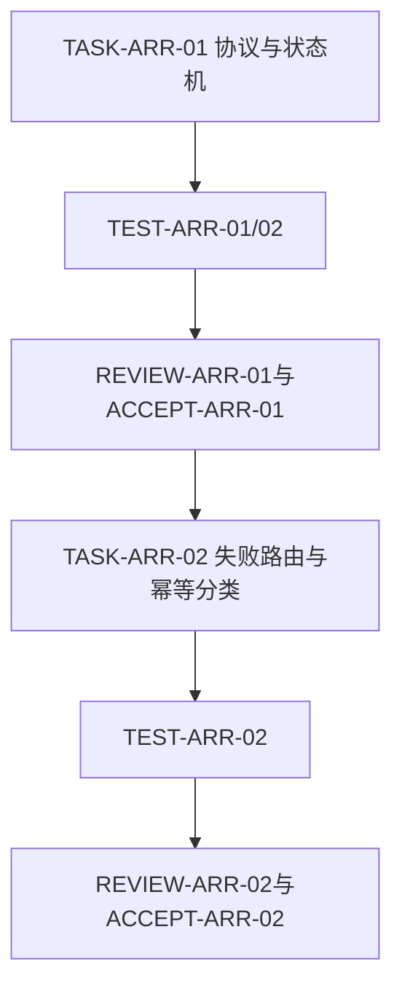

# 统一智能体运行期自恢复规则_实施周期01_协议与检查点

## 当前代码/文档基线

- 需求基线：`REQDOC-ARR-001` 已确认；验收基线：`ACDOC-ARR-001` pending。
- 既有能力：`execution-failure-learning-rules` 负责失败分类、案例查找和 candidate 门禁。
- 本周期新增/修改：`agent-runtime-recovery-rules` owner、协议参考、能力等级和失败路由；检查点原语、RecoveryEngine 与 local adapter 行为测试归入周期 02，不改安装类 skill 的安装行为。
- 环境：只使用 local 临时目录和 stub；任何 test/prod 配置均不读取。
- 图片资产决策：N/A；原因是周期交付为协议与测试代码，无视觉资产；证据为无截图和位图验收项。

## 当前周期目标、边界与进入条件

- 目标：完成 L0-L5 能力协议、状态机、恢复预算边界和失败路由。
- 范围：`TASK-ARR-01`、`TASK-ARR-02`。
- 非范围：checkpoint 实现、单飞锁实现、真实第三方平台 adapter、宿主重启集成和非幂等自动重放。
- 进入条件：需求文档 requirement profile PASS；验收标准 acceptance profile PASS 或明确由本周期先修复的文档门禁问题。
- 收口条件：两项任务逐一完成实现、真实测试、审查和验收；`AC-ARR-001`、`AC-ARR-002` PASS。

## 周期内最小任务执行顺序

图形目的：表达本周期任务依赖和每项独立验证边界；关联 ID：`TASK-ARR-01`,`TASK-ARR-02`,`TASK-ARR-03`,`TEST-ARR-01`,`TEST-ARR-03`。

## 最小任务闭环

| 任务 | 文件/符号操作契约 | 实现动作 | 真实测试、样本与断言 | 失败预期 | 清理/回滚 | 证据 |
| --- | --- | --- | --- | --- | --- | --- |
| `TASK-ARR-01` | 新建 owner `SKILL.md`、状态机参考和 capability 表 | 冻结 L0-L5、状态、预算、scope 与错误码 | `python -X utf8 doc/5-tests/2026-07-12_203429/agent-runtime-recovery-rules/test_agent_runtime_recovery.py` 与 `python -X utf8 doc/5-tests/2026-07-12_205724/agent-runtime-recovery-rules/test_recovery_engine_fixture.py`；断言状态和动作边界 | 状态不匹配即停止，不进入 TASK-02 | 删除临时状态文件 | `EVD-TASK-ARR-01-IMPL`,`EVD-TASK-ARR-01-TEST`,`EVD-TASK-ARR-01-REVIEW`,`EVD-TASK-ARR-01-ACCEPT` |
| `TASK-ARR-02` | 更新失败路由、幂等分类和 owner 边界 | 安装/运行期/业务 Bug 路由分离；unknown -> manual_handoff | `test_recovery_engine_fixture.py`；scope 越权、non_idempotent 和缺能力断言不执行动作 | 任一路由重叠即阻断后续 | 回滚路由表变更 | `EVD-TASK-ARR-02-IMPL`,`EVD-TASK-ARR-02-TEST`,`EVD-TASK-ARR-02-REVIEW`,`EVD-TASK-ARR-02-ACCEPT` |

## 文件与符号操作契约

| 文件/符号 | 归属任务 | 允许变更 | 禁止变更 | 回滚 |
| --- | --- | --- | --- | --- |
| `agent-runtime-recovery-rules/SKILL.md` | `TASK-ARR-01` | owner、触发、停止、路由 | 平台专用命令、安装行为 | 删除新目录恢复 L0 |
| `agent-runtime-recovery-rules/references/recovery-state-machine.md` | `TASK-ARR-01` | 状态、预算、终态边界 | 平台专用动作 | 删除规则资产 |
| `execution-failure-learning-rules/references/classification-and-routing.md` | `TASK-ARR-02` | runtime owner 与故障类别路由 | 安装/业务 Bug 归属混淆 | 回滚路由表变更 |
| `doc/5-tests/2026-07-12_203429/agent-runtime-recovery-rules/test_agent_runtime_recovery.py` | `TASK-ARR-01/02` | local 契约测试与临时 fixture | test/prod URL | 删除 fixture |

## 当前周期验证矩阵

| AC | TEST | 输入样本 | 通过断言 | 失败预期 | EVIDENCE |
| --- | --- | --- | --- | --- | --- |
| `AC-ARR-001` | `TEST-ARR-01` | timeout、EOF | probe+一次不变复验 | 重试超过一次为 FAIL | `EVD-TASK-ARR-01-TEST`,`EVD-TASK-ARR-01-ACCEPT` |
| `AC-ARR-002` | `TEST-ARR-02` | L0/L2/L3/L4 mismatch | 仅执行声明动作 | 越权动作阻断 | `EVD-TASK-ARR-02-TEST`,`EVD-TASK-ARR-02-ACCEPT` |
| `AC-ARR-001` | `TEST-ARR-01` | timeout、EOF | probe+一次不变复验 | 重试超过一次为 FAIL | `EVD-TASK-ARR-01-TEST`,`EVD-TASK-ARR-01-ACCEPT` |
| `AC-ARR-002` | `TEST-ARR-02` | L0/L2/L3/L4 mismatch | 仅执行声明动作 | 越权动作阻断 | `EVD-TASK-ARR-02-TEST`,`EVD-TASK-ARR-02-ACCEPT` |

## 真实测试与断言

- 依赖环境：Python 3 标准库；周期 01 不启动外部服务、不执行平台命令。
- 命令 1：`python -X utf8 doc/5-tests/2026-07-12_203429/agent-runtime-recovery-rules/test_agent_runtime_recovery.py`；断言状态、路由、scope_hash、TTL 和终态语义。
- 命令 2：`python -X utf8 doc/5-tests/2026-07-12_205724/agent-runtime-recovery-rules/test_recovery_engine_fixture.py`；仅作为协议动作边界证据引用，不改变周期 01 的文件归属。
- 命令 3：`python -X utf8 -m py_compile agent-runtime-recovery-rules/scripts/recovery_state.py agent-runtime-recovery-rules/scripts/recovery_engine.py`；断言入口可编译；该命令不是功能测试，不能替代命令 1/2。
- 失败预期：任一命令非零、产生第二个 lifecycle 动作、输出敏感字段或把 unknown 标记 resumed，周期立即 STOP。
- 清理：测试后终止所有 local fixture，删除临时目录、锁和 token；保留脱敏测试摘要。

## 周期阻断、停止与回滚

### 停止条件

- 任一最小任务真实测试失败、出现未授权 adapter 动作、敏感字段落盘或 local fixture 未清理时，立即停止当前周期。
- 当前任务未完成“实现 -> 真实测试 -> 审查 -> 验收”四步闭环时，禁止进入下一个最小任务或下一实施周期。
- L5 外部平台能力未提供时，停止在协议与阻断证据，不把 `manual_handoff` 或 `blocked` 标记为恢复成功。

| 条件 | 状态 | 操作 | 责任 |
| --- | --- | --- | --- |
| L5 外部 API 不存在 | `blocked` | 本周期不实现 resume，保留协议字段 | adapter 维护者 |
| 脱敏失败 | `blocked` | 删除 checkpoint，保留错误摘要 | 安全审查者 |
| 单飞锁失效 | `blocked` | 停止并发测试，回滚 wrapper | 运行期规则维护者 |
| local 依赖缺失 | `blocked` | 初始化 local fixture，不切外部环境 | 测试维护者 |

最大推进边界：本周期只完成协议与路由，不执行真实第三方重启、不安装插件、不提交 Git；周期 02 必须等待本周期四类证据齐全。

停止条件：任一真实测试失败、敏感字段进入 checkpoint、单飞锁失效、unknown 操作被重放、或 local fixture 未清理时，立即停止本周期并标记 `blocked`。

## 周期追踪矩阵

| 来源/需求 | AC | CYCLE/TASK | TEST | EVIDENCE |
| --- | --- | --- | --- | --- |
| `SRC-ARR-001`,`DEC-ARR-001` -> `REQ-ARR-001`,`RULE-ARR-001` | `AC-ARR-001`,`AC-ARR-002` | `CYCLE-ARR-01` -> `TASK-ARR-01`,`TASK-ARR-02` | `TEST-ARR-01`,`TEST-ARR-02` | `EVD-TASK-ARR-01-*`,`EVD-TASK-ARR-02-*` |
| `SRC-ARR-003`,`DEC-ARR-002` -> `REQ-ARR-002` | `AC-ARR-003`,`AC-ARR-004` | `CYCLE-ARR-02` -> `TASK-ARR-03`,`TASK-ARR-04` | `TEST-ARR-03`,`TEST-ARR-04` | `EVD-TASK-ARR-03-*`,`EVD-TASK-ARR-04-*` |

## 自审结论

- 周期任务具有唯一归属、文件/符号、真实测试、失败预期、清理、回滚和停止边界。
- Mermaid 依赖图术语与任务表一致；L5 外部依赖按 blocked 处理，不伪造验证结果。
- 周期状态为 in_progress，只有真实命令和四类证据完成后才允许标记 accepted。
