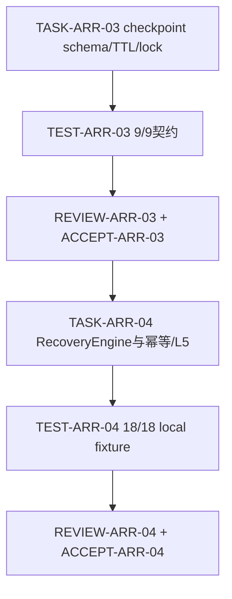

# 统一智能体运行期自恢复规则_实施周期02_检查点与单飞锁

## 当前计划最终方案简要说明

在周期 01 协议与路由闭环后，落地严格 checkpoint 契约和 `RecoveryEngine`。检查点只持久化白名单控制字段，作用域保存为 `scope_hash`，带 600 秒 TTL；恢复编排器只调用真实 adapter capability，执行 L2-L4 单次动作，并在具备真实 L5 hook 时验证原成功标准后返回 `resumed`。

## Agent 对当前周期的理解

- 目标：让统一 agent 能在 MCP/插件/宿主运行期故障中执行可审计的重连、重载、重启与可验证续接。
- 范围：`TASK-ARR-03` 检查点、TTL、单飞锁、白名单；`TASK-ARR-04` RecoveryEngine、幂等分流、L5 resume 和 local fixture。
- 非范围：第三方平台安装/启用、猜测 CLI 或进程、跨环境连接、任意强杀、真实外部宿主重启。
- 当前优先闭环：状态原语严格校验、引擎动作准入、local L0/L2/L3/L4/L5 行为测试。
- 关键阻断：真实第三方 L4/L5 lifecycle adapter 仍未提供；local stub 只能证明协议行为，不代表平台已接入。
- `unresolved_decisions`：无 P0/P1；`scope_hash`、TTL、动作预算和 L5 成功标准均已冻结。

## 进入条件、任务顺序与依赖

图形目的：表达周期 02 两个最小任务的先后关系与真实测试边界；关联 ID：`TASK-ARR-03`,`TASK-ARR-04`,`TEST-ARR-03`,`TEST-ARR-04`。

进入条件：`CYCLE-ARR-01` 的 TASK-ARR-01/02 四类证据已落盘；需求、验收和实施总览 profile PASS；local Python 3 可用。

## 最小任务闭环

| 任务 | 文件/符号操作契约 | 实现动作 | 真实测试、样本与断言 | 失败预期 | 清理/回滚 | 证据 |
| --- | --- | --- | --- | --- | --- | --- |
| `TASK-ARR-03` | `agent-runtime-recovery-rules/scripts/recovery_state.py`、`references/adapter-contract.schema.json` | 白名单字段、`scope_hash`、`expires_at`、损坏/过期拒绝、单飞锁和状态终态 | `python -X utf8 doc/5-tests/2026-07-12_203429/agent-runtime-recovery-rules/test_agent_runtime_recovery.py`；9/9，断言敏感/额外字段、TTL、损坏 JSON、`resumed -> healthy` | 任一敏感或额外字段落盘、过期/损坏继续读取即 STOP | 删除临时 checkpoint/lock；不改业务数据 | `EVD-TASK-ARR-03-IMPL`,`EVD-TASK-ARR-03-TEST`,`EVD-TASK-ARR-03-REVIEW`,`EVD-TASK-ARR-03-ACCEPT` |
| `TASK-ARR-04` | `agent-runtime-recovery-rules/scripts/recovery_engine.py`、local fixture | capability/scope 准入、L2-L4 单次动作、non-idempotent handoff、L5 criterion verified/unverified | `python -X utf8 doc/5-tests/2026-07-12_205724/agent-runtime-recovery-rules/test_recovery_engine_fixture.py`；18/18，断言动作序列与终态 | 未声明能力、缺 L5、成功标准未验证不得返回 `resumed` | 清理临时目录、释放锁；不执行外部命令 | `EVD-TASK-ARR-04-IMPL`,`EVD-TASK-ARR-04-TEST`,`EVD-TASK-ARR-04-REVIEW`,`EVD-TASK-ARR-04-ACCEPT` |

## 文件与符号操作契约

| 文件/符号 | 归属任务 | 允许变更 | 禁止变更 | 回滚 |
| --- | --- | --- | --- | --- |
| `agent-runtime-recovery-rules/scripts/recovery_state.py::create_checkpoint/read_checkpoint/claim/transition` | `TASK-ARR-03` | checkpoint 白名单、TTL、scope_hash、状态迁移 | 原始 scope、业务数据、凭据 | 删除临时状态文件 |
| `agent-runtime-recovery-rules/scripts/recovery_engine.py::RecoveryEngine.recover` | `TASK-ARR-04` | adapter capability 编排与终态 | 猜测平台命令、自动重放未知写入 | 停止引擎并释放锁 |
| `doc/5-tests/2026-07-12_203429/agent-runtime-recovery-rules/test_agent_runtime_recovery.py` | `TASK-ARR-03` | 契约与负向测试 | test/prod 连接 | 删除临时 fixture |
| `doc/5-tests/2026-07-12_205724/agent-runtime-recovery-rules/test_recovery_engine_fixture.py` | `TASK-ARR-04` | local adapter 行为测试 | 外部服务、生产配置 | 删除临时 fixture |

## 验证矩阵

| AC | TEST | 输入样本 | 通过断言 | 失败预期 | EVIDENCE |
| --- | --- | --- | --- | --- | --- |
| `AC-ARR-003` | `TEST-ARR-03` | 两 recovery id 竞争同一 checkpoint | 单飞锁只允许一个持有者 | 第二次动作被拒绝 | `EVD-TASK-ARR-03-TEST`,`EVD-TASK-ARR-03-ACCEPT` |
| `AC-ARR-004` | `TEST-ARR-03` | 敏感/额外字段、TTL 过期、损坏 JSON | 统一抛出拒绝并不续接 | 继续读取或输出敏感字段 | `EVD-TASK-ARR-03-TEST`,`EVD-TASK-ARR-03-ACCEPT` |
| `AC-ARR-005` | `TEST-ARR-04` | local L5 stub、criterion verified/unverified | verified 返回 `resumed`，否则 `manual_handoff` | 仅重启即 resumed | `EVD-TASK-ARR-04-TEST`,`EVD-TASK-ARR-04-ACCEPT` |
| `AC-ARR-006` | `TEST-ARR-04` | non-idempotent、缺能力、L0 | 不重放并转人工/阻断 | 自动重放写操作 | `EVD-TASK-ARR-04-TEST`,`EVD-TASK-ARR-04-ACCEPT` |

## 真实测试与命令

- 命令 1：`python -X utf8 doc/5-tests/2026-07-12_203429/agent-runtime-recovery-rules/test_agent_runtime_recovery.py`；结果 `9/9 OK`。
- 命令 2：`python -X utf8 doc/5-tests/2026-07-12_205724/agent-runtime-recovery-rules/test_recovery_engine_fixture.py`；结果 `18/18 OK`。
- 命令 3：`python -X utf8 -m py_compile agent-runtime-recovery-rules/scripts/recovery_state.py agent-runtime-recovery-rules/scripts/recovery_engine.py doc/5-tests/2026-07-12_203429/agent-runtime-recovery-rules/test_agent_runtime_recovery.py doc/5-tests/2026-07-12_205724/agent-runtime-recovery-rules/test_recovery_engine_fixture.py`；结果退出码 `0`。
- 所有样本来自 local 进程内 fixture 和临时目录；不连接 MCP、插件、宿主或 test/prod 服务。

## 停止、回滚与最大推进边界

- 停止条件：checkpoint 白名单失效、scope 明文落盘、TTL/损坏未拒绝、single-flight 失效、非幂等重放、L5 criterion 未验证却返回 resumed、fixture 未清理。
- 回滚：删除本轮临时 checkpoint/lock，停止 local fixture，保留脱敏失败摘要；不修改安装配置和业务数据。
- 外部阻断：真实第三方 lifecycle API 缺失时保留协议和 local stub 证据，不能把 local L5 stub 写成平台接入完成。
- 最大推进边界：本周期不执行真实第三方重启、不安装/升级插件、不连接非 local 环境、不提交 Git；周期 03 必须等待本周期四类证据齐全。

## 周期追踪矩阵

| 来源/需求 | 规则 | AC | CYCLE/TASK | TEST | EVIDENCE |
| --- | --- | --- | --- | --- | --- |
| `SRC-ARR-003`,`DEC-ARR-002` | `REQ-ARR-002`,`RULE-ARR-001` | `AC-ARR-003`,`AC-ARR-004` | `CYCLE-ARR-02` -> `TASK-ARR-03` | `TEST-ARR-03` | `EVD-TASK-ARR-03-*` |
| `SRC-ARR-002`,`DEC-ARR-003` | `REQ-ARR-003`,`REQ-ARR-NFR-003` | `AC-ARR-005`,`AC-ARR-006` | `CYCLE-ARR-02` -> `TASK-ARR-04` | `TEST-ARR-04` | `EVD-TASK-ARR-04-*` |

## 自审结论

- 周期 02 已按任务 03/04 独立拆分，所有命令和测试路径真实存在。
- 当前 local 证据已通过；真实第三方 L4/L5 adapter 仍是外部进入条件，不能由本周期伪造。
- 只有任务级四类证据和周期 01 顺序收口后，周期 02 才可标记 `accepted`。
