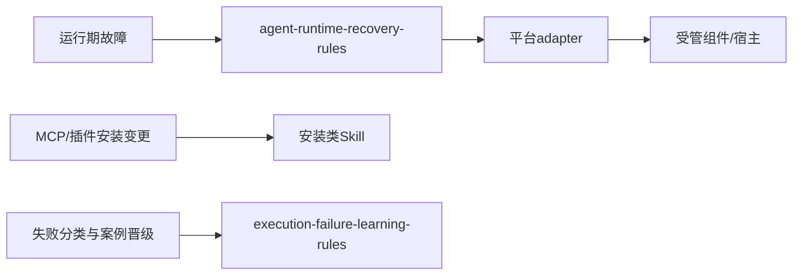
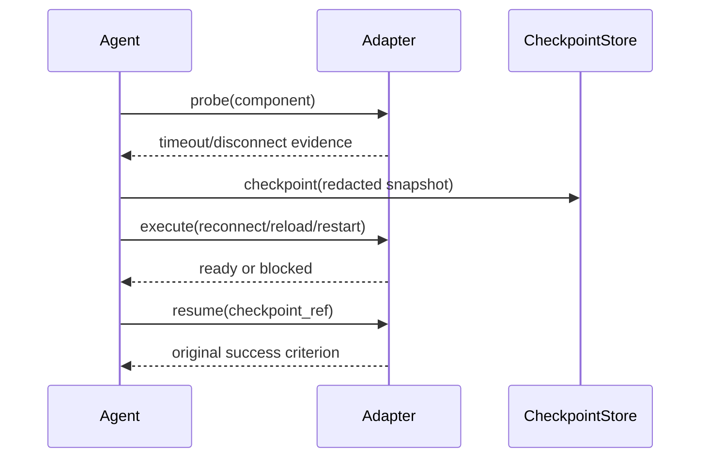

# 统一智能体运行期自恢复规则_实施总览

## 当前计划最终方案简要说明

新增厂商无关的运行期恢复规则层，统一处理 MCP、插件、浏览器会话和智能体宿主的故障。实施以 adapter capability 为唯一动作准入，采用 L0-L5 分级恢复、检查点、单飞锁、预算、脱敏和原成功标准复验；没有真实 L5 lifecycle API 的平台只能交付工具恢复，不得交付任务自动续接。

## Agent 对当前问题的理解

- 问题/目标：MCP 超时或断连可能阻断任务；agent 需要自行重连、重载、重启和可验证续接。
- 本轮范围：统一规则、协议、检查点、adapter contract、local 故障测试、失败路由和验收证据。
- 非范围：安装/升级/删除组件、test/prod、任意进程强杀、非幂等自动重放。
- 当前优先闭环：协议与状态机、检查点与锁、adapter L5 准入、local E2E。
- 关键假设：平台可提供真实 lifecycle API；若不能，记录 `GAP-ARR-L5-001` 并降级 L4。
- `unresolved_decisions`：无 P0/P1 未决项；外部 L5 能力是进入条件，不由执行模型猜测。

## 基本信息与落点

- 对应需求：`doc/2-需求/2026-07-12_210000_统一智能体运行期自恢复规则.md`。
- 对应验收：`doc/7-验收/2026-07-12_210000_统一智能体运行期自恢复规则_验收标准.md`。
- 全量顺序入口：`doc/3-实施/2026-07-12_210000_统一智能体运行期自恢复规则_需求与实施计划全量顺序实施方案.md`。
- 图片资产决策：N/A；原因是实施对象为协议与脚本，不产生 UI 位图；证据为无视觉交付物。

文件/符号落点目录树：

```text
agent-runtime-recovery-rules/
├── SKILL.md                                      # 规则 owner 与触发路由
├── references/recovery-state-machine.md          # 状态、预算、停止条件
├── references/adapter-contract.schema.json       # L0-L5 capability 契约
├── references/platform-capability-matrix.md      # 平台支持矩阵
├── scripts/recovery_state.py                    # 检查点、锁与状态迁移原语
├── scripts/recovery_engine.py                    # adapter capability 恢复编排
└── doc/5-tests/
    ├── 2026-07-12_203429/agent-runtime-recovery-rules/test_agent_runtime_recovery.py # 契约与负向测试
    └── 2026-07-12_205724/agent-runtime-recovery-rules/test_recovery_engine_fixture.py # local 行为 fixture
```

## 实施周期总览

| 周期 | 目标 | 依赖 | 主要输出 | 收口 |
| --- | --- | --- | --- | --- |
| `CYCLE-ARR-01` | 通用协议与状态机、失败路由 | 需求/验收文档 | owner skill、状态与路由 | `AC-ARR-001/002` |
| `CYCLE-ARR-02` | 检查点、TTL、单飞锁、RecoveryEngine、脱敏 | 周期 01 | schema、状态原语、引擎、local fixture | `AC-ARR-003/004/005/006` |
| `CYCLE-ARR-03` | adapter contract 与 L5 | 周期 02 | registry、capability probe | `AC-ARR-005` 或 L5 阻断 |
| `CYCLE-ARR-04` | local E2E、失败路由、交付 | 周期 03 | fixture、回归、审查、验收 | `AC-ARR-006/007` |

## 阶段计划

| 阶段 | 入口 | 执行重点 | 真实验证 | 停止条件 |
| --- | --- | --- | --- | --- |
| P1 协议冻结 | `CYCLE-ARR-01` | 状态、能力、幂等、错误码 | `TEST-ARR-01`,`TEST-ARR-02` | 状态或预算不一致 |
| P2 检查点实现 | `CYCLE-ARR-02` | 原子写入、锁、TTL、脱敏 | `TEST-ARR-03`,`TEST-ARR-04` | 敏感字段或并发失败 |
| P3 adapter 接入 | `CYCLE-ARR-03` | L2-L5 capability 与 scope | `TEST-ARR-05` | 无真实 lifecycle API |
| P4 验证交付 | `CYCLE-ARR-04` | 故障注入、路由、审查 | `TEST-ARR-06`,`TEST-ARR-07` | local 或审查阻断 |

## 最小任务清单

| 任务 | 归属周期 | 文件/符号操作契约 | 真实测试与断言 | 证据 |
| --- | --- | --- | --- | --- |
| `TASK-ARR-01` | `CYCLE-ARR-01` | 新建 owner `SKILL.md` 与状态机参考 | timeout/EOF 状态迁移正确 | `EVD-TASK-ARR-01-IMPL/TEST/REVIEW/ACCEPT` |
| `TASK-ARR-02` | `CYCLE-ARR-01` | 更新失败分类与路由矩阵 | 未知能力转 blocked | `EVD-TASK-ARR-02-IMPL/TEST/REVIEW/ACCEPT` |
| `TASK-ARR-03` | `CYCLE-ARR-02` | schema、`recovery_state.py`、单飞锁 | 并发、TTL、损坏、敏感字段负向测试 | `EVD-TASK-ARR-03-IMPL/TEST/REVIEW/ACCEPT` |
| `TASK-ARR-04` | `CYCLE-ARR-02` | `recovery_engine.py`、幂等与 L5 编排 | L0-L5、unknown/non-idempotent 不重放 | `EVD-TASK-ARR-04-IMPL/TEST/REVIEW/ACCEPT` |
| `TASK-ARR-05` | `CYCLE-ARR-03` | adapter contract、registry、wait_ready | L5 resume 原成功标准复验 | `EVD-TASK-ARR-05-IMPL/TEST/REVIEW/ACCEPT` |
| `TASK-ARR-06` | `CYCLE-ARR-04` | local stub、路由和回归测试 | timeout/断连/重启全链路 | `EVD-TASK-ARR-06-IMPL/TEST/REVIEW/ACCEPT` |

## 现状与落点

现状：仓库已有 `execution-failure-learning-rules` 负责失败分类与案例生命周期，但没有统一 runtime lifecycle owner、检查点 schema 或跨平台 adapter contract。新增能力只落在 `agent-runtime-recovery-rules/`，并通过路由表与已有安装 skill 解耦。

图形目的：说明新 owner 与既有安装/失败学习 skill 的职责边界；关联 ID：`RULE-ARR-002`,`TASK-ARR-02`。



图形目的：说明运行期故障由 agent 交给 adapter 并由检查点完成验证的交互顺序；关联 ID：`REQ-ARR-001`,`REQ-ARR-003`,`TASK-ARR-05`。



## 真实测试安排

| 测试 | 入口命令 | local 样本 | 断言 | 失败预期/清理 |
| --- | --- | --- | --- | --- |
| `TEST-ARR-01` | `python -X utf8 doc/5-tests/2026-07-12_203429/agent-runtime-recovery-rules/test_agent_runtime_recovery.py` | timeout、EOF、capability mismatch、scope_hash、TTL | 状态与预算 | 非零退出即停止；删除 temp |
| `TEST-ARR-02` | 同上 | scope 越权、unknown 操作 | blocked/manual_handoff | 不执行 adapter；释放锁 |
| `TEST-ARR-03` | `python -X utf8 doc/5-tests/2026-07-12_203429/agent-runtime-recovery-rules/test_agent_runtime_recovery.py` | 两并发恢复、过期/损坏 checkpoint、额外字段 | 单飞/TTL/白名单 | 非零退出即停止，清理临时状态 |
| `TEST-ARR-04` | `python -X utf8 doc/5-tests/2026-07-12_205724/agent-runtime-recovery-rules/test_recovery_engine_fixture.py` | L0/L2/L3/L4/L5、non-idempotent、criterion | 动作边界与终态 | 删除检查点 |
| `TEST-ARR-05` | `N/A`；原因：真实第三方 L5 API 未提供；证据：`GAP-ARR-L5-001` | 外部 adapter 接入后 L5 E2E | resume 且原标准通过 | 无 hook 则 L5 blocked |
| `TEST-ARR-06` | `N/A`；原因：当前仅完成协议与检查点周期；证据：`CYCLE-ARR-01` 状态为 `in_progress` | MCP/插件/宿主断连 fixture（后续周期） | L2-L4 分级恢复 | 预算耗尽转人工 |
| `TEST-ARR-07` | `python -X utf8 artifact-delivery-gate-rules/scripts/validate_engineering_docs.py --profile implementation_overview --doc "doc/3-实施/2026-07-12_210000_统一智能体运行期自恢复规则_实施总览.md" --root F:\luode-skills` | 文档全量 | profile PASS | 非零退出阻断交付 |

## 风险与阻断项

| ID | 风险/阻断 | 影响 | 缓解与停止条件 |
| --- | --- | --- | --- |
| `GAP-ARR-L5-001` | 平台没有真实 checkpoint/resume lifecycle API | 无法承诺任务续接 | 最高 L4；停止 L5 实现 |
| `GAP-ARR-SCOPE-001` | adapter scope 无法绑定当前任务 | 可能越权操作 | 拒绝动作，进入 blocked |
| `GAP-ARR-IDEMPOTENCY-001` | 调用幂等性未知 | 可能重复写入 | 只做状态核验，人工交接 |
| `GAP-ARR-LOCAL-001` | local fixture 缺失 | 无法真实验证 | 不切换外部环境，阻断周期 |

## 任务完成、停止与最大推进边界

- 完成条件：所有 `AC-ARR-*` 通过；每个任务有实现、真实测试、审查、验收四类证据；文档与 Mermaid 校验 PASS。
- 停止条件：触发任一 `GAP-ARR-*` 且无本周期内可验证替代；出现敏感泄露、scope 越权、非幂等重放或伪造 L5。
- 回滚：删除本次临时状态与锁，停止 local fixture；保留脱敏失败证据；不修改安装配置。
- 最大推进边界：本总览只授权按周期顺序执行，不授权 Git 提交、平台外部安装或任意宿主进程终止。

## 追踪矩阵

| 来源/决策 | 需求/规则 | AC | Cycle/Task | Test | Evidence |
| --- | --- | --- | --- | --- | --- |
| `SRC-ARR-001`,`DEC-ARR-001` | `REQ-ARR-001`,`RULE-ARR-001` | `AC-ARR-001/002` | `CYCLE-ARR-01`,`TASK-ARR-01/02` | `TEST-ARR-01/02` | `EVD-TASK-ARR-01-*`,`EVD-TASK-ARR-02-*` |
| `SRC-ARR-003`,`DEC-ARR-002` | `REQ-ARR-002`,`RULE-ARR-002` | `AC-ARR-003/004` | `CYCLE-ARR-02`,`TASK-ARR-03` | `TEST-ARR-03` | `EVD-TASK-ARR-03-*` |
| `SRC-ARR-002`,`DEC-ARR-003` | `REQ-ARR-003`,`REQ-ARR-NFR-003` | `AC-ARR-005/006` | `CYCLE-ARR-02`,`TASK-ARR-04` | `TEST-ARR-04` | `EVD-TASK-ARR-04-*` |
| `SRC-ARR-002`,`DEC-ARR-003` | `REQ-ARR-NFR-004` | `AC-ARR-007` | `CYCLE-ARR-03/04`,`TASK-ARR-05/06` | `TEST-ARR-05/06/07` | `EVD-TASK-ARR-05-*`,`EVD-TASK-ARR-06-*` |

## 自审结论

- 实施总览包含当前方案、问题理解、范围、依赖图、周期、任务、文件/符号、真实测试、风险、停止条件和最大推进边界。
- 外部 L5 adapter 是可验证准入条件；无 hook 时明确降级 L4 并阻断自动续接。
- 每个 TASK 计划独立闭环，避免跨周期先实现后统一验证。
