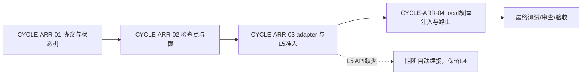

# 统一智能体运行期自恢复规则_需求与实施计划全量顺序实施方案

## 当前计划最终方案简要说明

按“协议与状态机 -> 检查点与并发控制 -> 平台 adapter -> local 故障验证 -> 路由与交付”垂直顺序推进。每一周期先完成本周期任务的实现、真实测试、审查和验收，再允许进入下一周期；外部 L5 adapter 缺少真实生命周期 API 时，保留 L4 工具恢复并阻断任务自动续接。

## 文档定位与维护状态

- 来源对象：`REQDOC-ARR-001` 与 `ACDOC-ARR-001`。
- 目的：作为项目级全量执行入口，不替代单来源实施总览或实施周期文档。
- 状态：in_progress；计划已冻结，代码实现需按用户开工授权和周期进入条件执行。
- 图片资产决策：N/A；原因是本文件只记录顺序与依赖，Mermaid 依赖图可表达关系；证据为无 UI 或位图交付物。

## 来源对象清单与回指关系

| 来源对象 | 主文档 | 下游文档 | 当前状态 |
| --- | --- | --- | --- |
| `REQDOC-ARR-001` | `doc/2-需求/2026-07-12_210000_统一智能体运行期自恢复规则.md` | `IMPL-ARR-OVERVIEW`,`ACDOC-ARR-001` | confirmed |
| `ACDOC-ARR-001` | `doc/7-验收/2026-07-12_210000_统一智能体运行期自恢复规则_验收标准.md` | `IMPL-ARR-OVERVIEW`,`CYCLE-ARR-01` | pending |

## 全量执行顺序

图形目的：表达全量周期的无环依赖、阻断点和收口顺序；关联 ID：`CYCLE-ARR-01`,`CYCLE-ARR-02`,`CYCLE-ARR-03`,`CYCLE-ARR-04`。

| 顺序 | 周期 | 目标 | 进入条件 | 收口证据 | 阻断 |
| --- | --- | --- | --- | --- | --- |
| 1 | `CYCLE-ARR-01` | 冻结通用能力、状态和失败路由 | 需求与验收标准落盘 | `EVD-TASK-ARR-01-*`,`EVD-TASK-ARR-02-*` | 状态机或幂等边界不完整 |
| 2 | `CYCLE-ARR-02` | 检查点、TTL、单飞锁、RecoveryEngine 和脱敏 | 周期 01 四类证据 PASS | `EVD-TASK-ARR-03-*`,`EVD-TASK-ARR-04-*` | 敏感字段、TTL、并发锁或引擎测试失败 |
| 3 | `CYCLE-ARR-03` | adapter contract 与 L5 准入 | 周期 02 四类证据 PASS | `EVD-TASK-ARR-05-ACCEPT` | 无真实 lifecycle API |
| 4 | `CYCLE-ARR-04` | local 故障注入、路由和交付审查 | 周期 03 四类证据 PASS | `EVD-TASK-ARR-06-ACCEPT` | local fixture 或审查失败 |

## 当前执行入口与下一步

- 当前入口：`CYCLE-ARR-01` 收口复核，随后进入 `CYCLE-ARR-02`，对应 `TASK-ARR-03` 和 `TASK-ARR-04`。
- 真实测试：`python -X utf8 doc/5-tests/2026-07-12_203429/agent-runtime-recovery-rules/test_agent_runtime_recovery.py`（9/9）与 `python -X utf8 doc/5-tests/2026-07-12_205724/agent-runtime-recovery-rules/test_recovery_engine_fixture.py`（18/18）。
- 下一周期进入条件：周期 01 的 TASK-ARR-01/02 四类证据齐全，且 `AC-ARR-001`、`AC-ARR-002` PASS；周期 02 不能以 validator PASS 替代任务证据。
- 不满足条件时：维持当前周期并标记 blocked；不得并行推进依赖周期。

## 依赖、进入、收口与阻断

| 依赖 | 类型 | 验证 | 缺失处理 |
| --- | --- | --- | --- |
| `REQDOC-ARR-001` | 来源 | 文件存在且 requirement profile PASS | 停止所有周期 |
| `ACDOC-ARR-001` | 验收 | acceptance profile PASS | 不进入实现 |
| L5 lifecycle API | 外部平台 | capability/probe/wait_ready/resume E2E | 最高 L4，记录 `GAP-ARR-L5-001` |
| local fixture | 测试 | 临时端口与清理脚本 | 不切 test/prod，标记 blocked |

## 阶段与垂直切片矩阵

| 切片 | 需求/规则 | 文件/符号 | 真实测试 | 任务完成条件 |
| --- | --- | --- | --- | --- |
| `SLICE-ARR-001` | `REQ-ARR-001`,`RULE-ARR-001` | `SKILL.md`、状态机参考 | `TEST-ARR-01`,`TEST-ARR-02` | 状态与预算单测 PASS |
| `SLICE-ARR-002` | `REQ-ARR-002` | schema、wrapper、lock | `TEST-ARR-03`,`TEST-ARR-04` | 并发、TTL、脱敏 PASS |
| `SLICE-ARR-003` | `REQ-ARR-003` | adapter contract、registry | `TEST-ARR-05` | L5 API 存在才可 PASS |
| `SLICE-ARR-004` | `RULE-ARR-002`,`REQ-ARR-NFR-*` | local stub、路由、审查 | `TEST-ARR-06`,`TEST-ARR-07` | 失败路由和交付门禁 PASS |

## 自审结论

- 全量顺序、依赖、阻断和单来源回指已登记；无环依赖图可解析。
- 所有任务要求真实测试、停止条件、回滚和四类证据；L5 外部依赖未被伪造为已具备。
- `baseline_commit` 写明 N/A 原因与证据，符合未授权 Git 历史写入边界。
