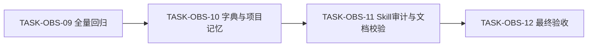

# CYCLE-OBS-03 真实验证与收口

图片资产决策：N/A + 原因：本周期只执行已有脚本、规则和文档门禁，不产生位图资产 + 证据：TASK-OBS-09 至 TASK-OBS-12。

## 当前周期最终方案简要说明

以 TASK-OBS-08 的双端实机 readback 为入口，先完成全量回归与工程文档校验，再刷新字典、项目状态和 Skill 合规证据，最后形成当前改动审查与验收结论。所有动作保持 local、bridge-only 和未提交状态。

## 当前代码/文档基线

| 基线 | 事实 |
| --- | --- |
| CYCLE-OBS-01 | Windows/WSL bridge、自动启动、selector、path 安全和 smoke 已收口 |
| CYCLE-OBS-02 | `distill_vault.py`、Skill/references 与 TASK-OBS-08 双端检索/写入已收口 |
| 安全 | 固定 vault `D:\obsidian_data`；vault 读写只能经 bridge；不连接非 local 环境；不执行 Git 历史写入 |
| 证据 | `35/35` 离线回归、长正文双端 hash、append 双端 hash 已落盘到测试 README |

## 周期依赖与任务顺序

图形目的：冻结“先回归、后合规、再审查、最后验收”的不可逆收口顺序。关联 ID：CYCLE-OBS-03、TASK-OBS-09 至 TASK-OBS-12。

## 周期内最小任务执行顺序

任务顺序固定为 TASK-OBS-09 -> TASK-OBS-10 -> TASK-OBS-11 -> TASK-OBS-12；每项都必须完成实现、真实测试、审查和验收后才进入下一项。

## 当前周期目标、边界与进入条件

目标：为 AC-OBS-001 至 AC-OBS-010 建立可追溯的实现、测试、审查和验收证据。进入条件：CYCLE-OBS-01、CYCLE-OBS-02 已完成且无已知 P0/P1；边界：不新增功能、不改变 vault 数据、不执行 Git 历史写入。

## 最小任务闭环

| TASK | 文件/符号 | 真实测试 | 完成条件 | 停止/回滚 |
| --- | --- | --- | --- | --- |
| TASK-OBS-09 | 当前测试目录、bridge/adapter/distill 入口 | `python -X utf8 -m unittest discover ... -p 'test_*.py' -v`、`py_compile`、PowerShell parser | `35/35 PASS`、parser PASS、无临时 response 残留 | 任一失败停在回归任务；不修改 vault |
| TASK-OBS-10 | `skill-dictionary/data.js`、`字典.md`、`PROJECT_CURRENT.md` | `python -X utf8 skill-dictionary/generate_dictionary.py`、UTF-8 回读 | 字典生成成功，当前状态覆盖写入且不覆盖其他项目交接 | 生成失败不手改产物，回退本轮状态改动 |
| TASK-OBS-11 | 受影响 Skill、周期/README 文档、审查文档 | `validate_engineering_docs.py --profile implementation_cycle --strict`、skill compliance/audit、`git diff --check` | 文档、Skill、编码、追踪和注释门禁 PASS | 任一门禁失败不得进入验收 |
| TASK-OBS-12 | 验收标准、最终审查与周期状态 | 逐 AC 对账、EVD 四类证据核对 | AC 全部有证据，周期状态 completed，保持未提交 | 缺证据则标记 blocked，不宣称完成 |

## 周期验证矩阵

| TEST/EVIDENCE | 断言 | 状态 |
| --- | --- | --- |
| TEST-OBS-001/003/004/006/008/010/011/012/013/014/015/016 | bridge/adapter/discovery/失败边界与 distill 入口 | PASS |
| EVD-TASK-OBS-08-WINDOWS-WSL | search/create/append/readback、transport、hash | PASS |
| EVD-TASK-OBS-09-REGRESSION | 35/35、py_compile、PowerShell parser | PASS |
| EVD-TASK-OBS-10-DICTIONARY | 字典生成与产物一致性 | PASS |
| EVD-TASK-OBS-11-DOC-GATE | 周期文档 strict、Skill compliance、diff/UTF-8 | PASS（周期02/03 strict、UTF-8、diff） |
| EVD-TASK-OBS-12-ACCEPTANCE | AC-OBS-001~010 逐项验收 | PASS |

## 当前周期验证矩阵

本矩阵与上表使用同一证据源；通过标准是命令退出码为 0、JSON 成功响应含 `verified=true`、文档 strict 报告 `valid=true`，失败时停止当前任务。

| 阶段 | 命令/动作 | 通过标准 | 清理 |
| --- | --- | --- | --- |
| TASK-OBS-09 | `python -X utf8 -m unittest discover -s doc/5-tests/2026-07-13_134643/skills/obsidian-knowledge-flow -p 'test_*.py' -v` | `35/35 PASS` | 删除测试生成的 `__pycache__` |
| TASK-OBS-09 | `python -X utf8 -m py_compile ...`、PowerShell parser | 均 PASS | 不生成 vault 文件 |
| TASK-OBS-10 | `python -X utf8 skill-dictionary/generate_dictionary.py` | 生成成功、`planned_missing=0` | 回读 `data.js`/`字典.md` |
| TASK-OBS-11 | 周期文档 strict、UTF-8、diff 检查、Skill compliance/audit | 全部 PASS | 不改用户 vault |
| TASK-OBS-12 | AC/EVD 逐项对账 | 无孤立 ID、无未决 P0/P1 | 保持未提交 |

## 真实测试与断言

真实测试只使用 local Windows、local WSL interop 和 bridge；静态阅读、build 或 validator 不能替代 search/create/append/readback 的实机证据。所有写入必须有官方 CLI readback，所有临时 request/response 必须在 bridge finally 清理。

## 周期停止、清理与最大推进边界

- bridge doctor、selector、interop、path、timeout 或 readback 失败：停止当前任务，不使用文件系统 fallback，不删除用户已有 Obsidian 进程。
- 所有临时 request/response 文件必须由 bridge scope 清理；测试笔记只能保留在 `_system-tests`，不得绕过 bridge 删除。
- 本周期不扩展到新平台、远程 vault、常驻服务或任何非 local 连接；不执行 `git commit`、`push`、`rebase`、`merge`。
- 停止条件：任一真实测试失败、文档 strict validator 失败、Skill compliance/audit 失败、AC 缺少 EVD 四类证据或出现未决 P0/P1。

## 周期阻断、停止与回滚

任一测试、strict validator、Skill compliance 或 AC 对账失败，立即将当前周期标记为 blocked，保留失败证据并停止后续任务；回滚只撤回本周期新增文档/状态改动，不删除用户已有 Obsidian 笔记。

## 自审结论

TASK-OBS-09 已完成 `35/35 PASS`、Python 编译和 PowerShell parser；TASK-OBS-10 已完成字典生成并返回 `implemented_total=84`、`planned_missing=0`、`seed_total=27`；TASK-OBS-11 的周期 strict、UTF-8、diff 和审查文档已 PASS；TASK-OBS-12 已完成 AC-OBS-001~010 逐项验收，最终验收文档 `doc/7-验收/2026-07-13_134643_Obsidian知识流跨Windows与WSL桥接_最终验收.md` 结论 PASS。CYCLE-OBS-03 收口。

证据链接：TASK-OBS-11 使用 `doc/6-审查/2026-07-13_185500_REQDOC-OBS-20260713_CYCLE-OBS-03_当前改动总审查.md`；TASK-OBS-12 使用 `doc/7-验收/2026-07-13_134643_Obsidian知识流跨Windows与WSL桥接_最终验收.md`。

## 追踪矩阵

| CYCLE | TASK | AC | TEST | EVIDENCE |
| --- | --- | --- | --- | --- |
| CYCLE-OBS-03 | TASK-OBS-09 | AC-OBS-001/002/007/010 | TEST-OBS-001~016 | EVD-TASK-OBS-09-* |
| CYCLE-OBS-03 | TASK-OBS-10 | AC-OBS-009 | dictionary/UTF-8 | EVD-TASK-OBS-10-* |
| CYCLE-OBS-03 | TASK-OBS-11 | AC-OBS-009 | doc/skill/diff gates | EVD-TASK-OBS-11-* |
| CYCLE-OBS-03 | TASK-OBS-12 | AC-OBS-001~010 | acceptance matrix | EVD-TASK-OBS-12-* |
