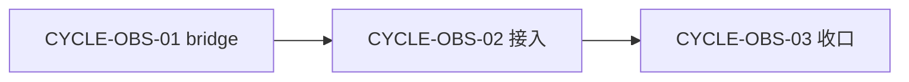
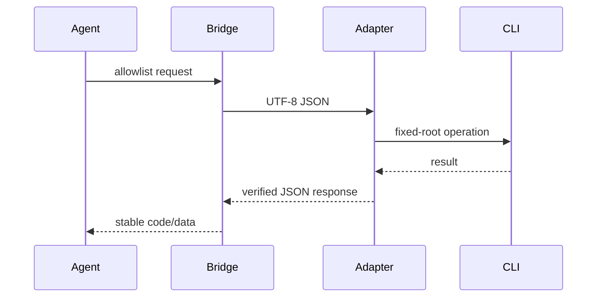

# Obsidian 知识流跨 Windows 与 WSL 桥接实施总览

图片资产决策：N/A + 原因：实施架构和周期依赖均由 Mermaid 表达，未产生视觉验收所需位图 + 证据：DEC-OBS-001、CYCLE-OBS-01。

## 当前计划最终方案简要说明

新增 Python 跨平台 bridge 与 Windows PowerShell adapter；bridge 统一参数、host 和项目身份，adapter 负责官方 Windows CLI、应用恢复和动态 vault selector。唯一 root 固定为 `D:\obsidian_data`，所有笔记以 `知识库/` 相对路径操作，因此 WSL 不必安装第二套 CLI。

## Agent 对当前问题的理解

目标是在不引入第二套 CLI、文件系统 vault fallback 或非 local 连接的前提下，为 Windows 与 WSL 提供同一 bridge。当前优先闭环是 CYCLE-OBS-01 的双端 doctor 与 smoke readback；周期 02/03 是后续依赖，不能越级推进。

## 现状与落点

```text
obsidian-knowledge-flow/
├── scripts/obsidian_cli_bridge.py             # 新增：公开 allowlist、host/identity、JSON transport
├── scripts/obsidian_cli_windows.ps1           # 新增：Windows CLI、启动恢复、selector、readback
├── scripts/distill_vault.py                   # 周期 02：迁移为调用 bridge
├── SKILL.md                                   # 周期 02：统一调用规则
├── agents/openai.yaml                         # 周期 02：默认 prompt
└── references/                                # 周期 02：CLI/vault/schema/案例/验证规则
doc/5-tests/<TASK_TS>/                         # 周期 01 起承接 local 测试资产
```

| 文件/符号 | 职责 | 进入周期 |
| --- | --- | --- |
| `obsidian_cli_bridge.py:main` | allowlist、参数校验、Windows/WSL transport、canonical project ID | CYCLE-OBS-01 |
| `obsidian_cli_windows.ps1` | version、一次启动、`vaults verbose`、CLI operation、readback | CYCLE-OBS-01 |
| `distill_vault.py` | 删除重复 transport，改为 bridge 客户端 | CYCLE-OBS-02 |

## 实施周期总览

| 周期 | 目标 | 进入条件 | 收口条件 |
| --- | --- | --- | --- |
| CYCLE-OBS-01 | 跨宿主 CLI bridge | 本需求与验收已冻结 | 双端 doctor、smoke、异常契约通过 |
| CYCLE-OBS-02 | 知识流与批处理接入 | CYCLE-OBS-01 无 P0/P1 | skill/脚本无 nested vault 或重复 transport |
| CYCLE-OBS-03 | 真实验证与交付收口 | 前两周期全部闭环 | AC-OBS-001~010、validator、审查和验收 PASS |

## 阶段计划

图形目的：声明周期依赖，禁止在 bridge 未验证时迁移旧脚本。关联 ID：CYCLE-OBS-01、CYCLE-OBS-02、CYCLE-OBS-03。



图形目的：说明调用责任分层与 CLI-only 安全边界。关联 ID：DEC-OBS-001、RULE-OBS-004、AC-OBS-005。



## 最小任务清单

| TASK | 文件/符号 | 实现与真实测试 | 完成条件 | 停止条件 | 最大推进边界 |
| --- | --- | --- | --- | --- | --- |
| TASK-OBS-01 | 需求、验收、总览、周期01 四文档 | 文档 profile validator | 四份 profile PASS、无未决 P0/P1 | ID/图/validator 失败 | 不建 bridge 代码 |
| TASK-OBS-02 | `obsidian_cli_bridge.py`、bridge 测试与 fixture | path/identity/Unicode 单元测试 | 无外部进程依赖的测试通过 | identity 不稳定或正文泄漏 | 不写真实 vault |
| TASK-OBS-03 | `obsidian_cli_windows.ps1`、contract 测试/fake CLI | adapter 成功、超时、启动、selector、readback 契约测试 | 错误映射稳定 | 需文件 API 或杀进程 | 不改 skill/批处理 |
| TASK-OBS-04 | 当前测试任务 README 与证据 | Windows/WSL real smoke | 双端内容一致、verified | interop/selector/readback 失败 | 不进入周期02 |

## 真实测试安排

| TEST | 环境与样本 | 命令入口 | 断言 |
| --- | --- | --- | --- |
| TEST-OBS-001~003 | local Windows、WSL、registered fixed vault | `bridge.py doctor --json` | selector 唯一、transport 正确 |
| TEST-OBS-004/013 | smoke note，中文和换行 | create/append/read | 双端回读一致 |
| TEST-OBS-008~012 | fake CLI 与非法输入 fixture | unittest contract | 不调用 CLI、错误码稳定 |
| TEST-OBS-010 | 10KB 中文 fixture | bridge create/read | 分块后正文完整 |

## 风险与阻断项

| ID | 风险 | 处理/回滚 |
| --- | --- | --- |
| ROLLBACK-OBS-001 | WSL interop 或应用不可达 | 停在 CYCLE-OBS-01；不改 SKILL 主入口；不使用文件 fallback |
| ROLLBACK-OBS-002 | 新脚本导致 nested-vault 风险 | 保持旧脚本调用关系，明确拒绝 legacy root；不静默写入 |
| RISK-OBS-003 | 并发分块覆盖 | 单次 request 内串行；发现覆盖立即停止 |

## 自审结论

`unresolved_decisions: 0`。方案复用现有 Windows 官方 CLI 与标准库，不引入常驻服务或额外第三方依赖；每个 TASK 均被限定在实现、真实测试、审查、验收的独立闭环内。

## 任务完成、停止与最大推进边界

只有 AC-OBS-001 至 AC-OBS-010 具有对应 `EVIDENCE-*`、全部 profile/测试/审查通过时可完成。出现 selector 不唯一、interop 不可用、启动一次后仍不可达、读回不一致或必须文件 API fallback 时停止；不越过 CYCLE-OBS-01 迁移旧脚本。

## 追踪矩阵

| SRC/DEC | REQ/AC | CYCLE/TASK | TEST | ROLLBACK |
| --- | --- | --- | --- | --- |
| SRC-OBS-001、DEC-OBS-001 | REQ-OBS-001、AC-OBS-001/002 | CYCLE-OBS-01、TASK-OBS-02 | TEST-OBS-001~005 | ROLLBACK-OBS-001 |
| SRC-OBS-003、DEC-OBS-003 | REQ-OBS-003、AC-OBS-003 | CYCLE-OBS-01、TASK-OBS-03 | TEST-OBS-006/011 | ROLLBACK-OBS-001 |
| SRC-OBS-004、DEC-OBS-002/004 | REQ-OBS-002、AC-OBS-004/005 | CYCLE-OBS-02、TASK-OBS-05~08 | TEST-OBS-008/012/014 | ROLLBACK-OBS-002 |
