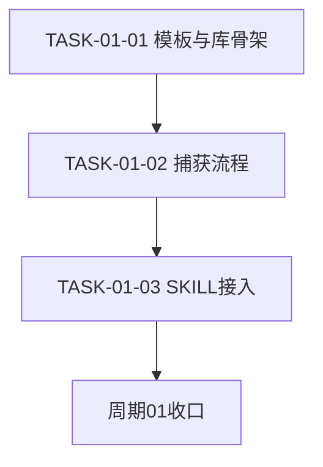
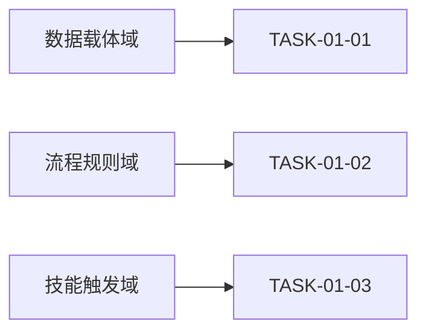

# 实施周期01：反馈捕获与确认写入

## 1. 当前周期目标、边界与进入条件

- 对应需求文档：`doc/2-需求/2026-07-13_174006_代码风格体系反馈驱动持续迭代.md`
- 对应实施总览：`doc/3-实施/2026-07-13_174006_代码风格体系反馈驱动持续迭代_实施总览.md`
- 周期序号 / 大进度定位：CYCLE-01，第一期，能力地基。
- 当前周期目标：让用户说不对到提取反例与正例、回显 candidate、用户确认、写入 active、去重的链路端到端可用。
- 当前周期只做这一件事：建立反馈写入侧闭环。
- 边界：本周期不改 `code-generation-style-rules` 的写码前加载，不碰截图路由，那属后续周期。
- 图片资产决策：N/A —— 周期落点为 Markdown 规则文件，任务依赖与领域匹配由 Mermaid 表达，无位图证据需求。

## 2. 进入条件与收口条件

- 进入条件：阶段0 需求、验收、总览文档对应 profile 校验 PASS；用户已授权实施。
- 收口条件：模拟一条文字反馈能走完写入 active 并触发去重，证据落 `doc/5-tests/`；库中出现一条格式合规 active 条目，重复反馈只增计数不新增正文。

## 3. 当前代码/文档基线

- 基线提交：214fdbd。
- `code-style-consistency-rules/references/` 现有 style-baseline.md、local-convention-detection.md、consistency-examples.md、go-coding-rules.md，无反馈学习文件。
- `code-style-consistency-rules/SKILL.md` 现无用户反馈捕获节。
- 参照基线：`execution-failure-learning-rules/references/case-template.md` 的字段结构与去重键。

## 4. 周期内最小任务执行顺序

| 顺序 | TASK | 唯一目标 | 前置依赖 | 允许文件 | 禁止触碰区 |
| --- | --- | --- | --- | --- | --- |
| 1 | TASK-01-01 | 新增 case 模板与反例库骨架 | 阶段0 | style-case-template.md、user-style-feedback-library.md | 其它 skill 目录 |
| 2 | TASK-01-02 | 编写捕获学习流程 | TASK-01-01 | style-feedback-workflow.md | SKILL.md |
| 3 | TASK-01-03 | consistency SKILL 接入捕获 | TASK-01-02 | code-style-consistency-rules/SKILL.md | 其它 skill 目录 |

## 5. 文件/符号操作契约

| TASK | 操作类型 | 目标文件 | 目标符号/区段 | 改前后职责 |
| --- | --- | --- | --- | --- |
| TASK-01-01 | 新增 | references/style-case-template.md | 全文 | 无到单条 case 字段模板 |
| TASK-01-01 | 新增 | references/user-style-feedback-library.md | 全文加一条示例 active | 无到全局反例库 |
| TASK-01-02 | 新增 | references/style-feedback-workflow.md | 全文 | 无到捕获写入流程 |
| TASK-01-03 | 修改 | SKILL.md | 新增用户风格反馈捕获与学习节加 description | 一致性检查到额外承接反馈学习 |

## 6. 最小任务闭环

- TASK-01-01：实现两文件后，真实测试用结构自检加 `md5sum` 与 `wc -c` 指纹校验字段齐全与 UTF-8；审查点对齐 case-template 字段；验收点库文件可被后续任务读取；停止条件为模板字段无法对齐时停并记 GAP；回滚为删除新建文件。
- TASK-01-02：实现流程文件后，真实测试按流程对一条文字反馈演练并记录每步输入输出；审查点与确认后生效决策一致；验收点能指导 TASK-01-03；停止条件为流程与确认后生效冲突时停；回滚为还原流程文件。
- TASK-01-03：改 SKILL 后，真实测试模拟含触发词的一轮消息演练命中并走流程写入；审查点 description 与标题改动已登记供字典重跑；验收点端到端写入闭环成立；停止条件为触发与既有一致性检查职责冲突时停；回滚为撤回新增节。
- 每个任务按实现、真实测试、审查、验收逐个闭环，不先连续实现再统一验证。

## 7. 当前周期验证矩阵

| TASK | TEST | AC | 真实测试入口 | 通过标准 |
| --- | --- | --- | --- | --- |
| TASK-01-01 | TEST-02 | AC-02 | 结构自检加指纹 | 字段齐全 UTF-8 无乱码 去重键存在 |
| TASK-01-02 | TEST-01 | AC-01 | 文字反馈演练 | 产出 candidate 到 active 去重键正确 |
| TASK-01-03 | TEST-01 | AC-01 | 触发词命中演练 | 命中触发 回显 candidate 确认后写 active |

- 真实测试证据统一落 `doc/5-tests/2026-07-13_174006/`。

## 8. 周期阻断、停止与回滚

- 停止条件：任一任务停止条件命中即停在该任务修复，不进入下一任务。
- 回滚：ROLLBACK-01 撤回本周期新增文件与 SKILL 新增节，恢复到基线 214fdbd 状态。
- 阻断条件：目录不可写或 case-template 字段无法对齐时记 GAP 并停止。

| ID | 触发 | 处置 | 回滚动作 |
| --- | --- | --- | --- |
| ROLLBACK-01 | 本周期改动导致写入闭环损坏 | 停在当前任务修复 | 撤回新增文件与 SKILL 新增节回到 214fdbd |
| GAP-CYCLE01-01 | case-template 字段无法对齐 | 记 GAP 并停止 | 保留基线不改 |

图形目的：描述本周期任务依赖顺序。
关联 ID：TASK-01-01、TASK-01-02、TASK-01-03。

图形目的：领域匹配，展示本周期任务归属的能力域。
关联 ID：TASK-01-01、TASK-01-02、TASK-01-03。

## 9. 自审结论

- 覆盖度检查：含周期目标、进入收口条件、基线、任务顺序、文件/符号契约、闭环、验证矩阵、停止条件、回滚。
- 最小任务闭环检查：三任务各含实现、真实测试、审查、验收与停止条件。
- 占位词检查：无占位词。
- 图文一致性检查：任务 DAG 与领域匹配图节点与任务表一致。
- 真实测试检查：每任务有真实测试入口与通过标准，证据路径明确。
