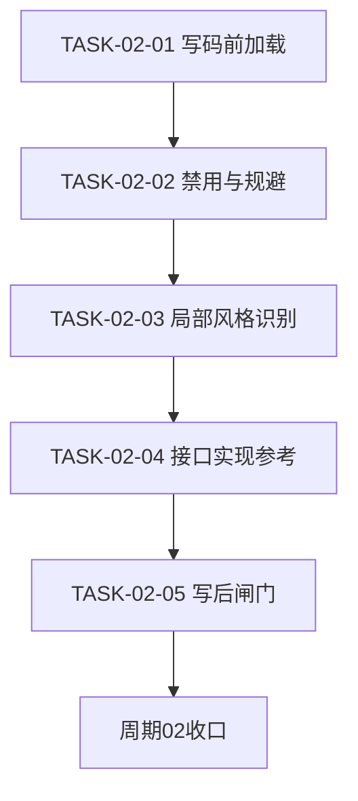
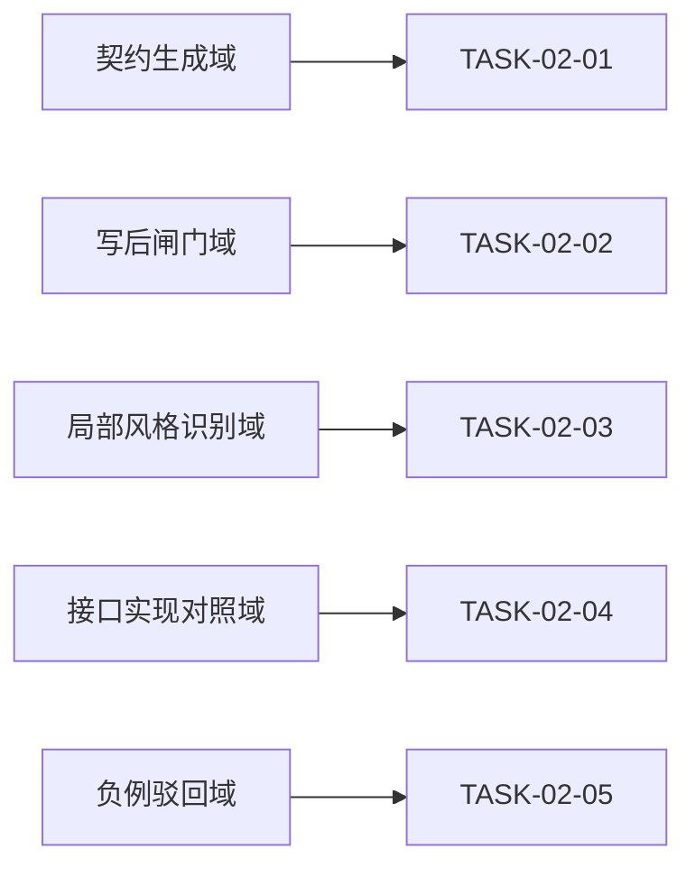

# 实施周期02：写码前加载与规避

结论：在已有 active 反例加载能力上补充局部统一风格和接口实现参考；影响：代码生成前的风格契约与写后检查；范围：新增局部风格、接口实现和负例规则；非范围：反馈捕获、截图路由和业务代码；变化：稳定代码区段只做必要替换，接口实现必须记录参考或降级依据；完成标准：新增正例通过、负例驳回、冲突可停止；术语说明：风格契约是执行模型编码前必须遵循的本轮规则；验证状态：周期任务、测试、审查和最终验收均已通过。

## 1. 当前周期目标、边界与进入条件

- 对应需求文档：`doc/2-需求/2026-07-13_174006_代码风格体系反馈驱动持续迭代.md`
- 对应实施总览：`doc/3-实施/2026-07-13_174006_代码风格体系反馈驱动持续迭代_实施总览.md`
- 周期序号 / 大进度定位：CYCLE-02，第二期，能力消费端。
- 当前周期目标：写码前契约强制加载全局反例库，识别局部统一风格和既有接口实现，active 反例进入禁用写法，命中风格跳变或多余代码时在写后闸门驳回。
- 当前周期只做这一件事：打通写码前加载与规避消费端。
- 边界：本周期不改捕获写入侧，不碰截图路由。
- 图片资产决策：N/A —— 周期落点为 Markdown 规则文件，任务依赖与领域匹配由 Mermaid 表达，无位图证据需求。

## 2. 进入条件与收口条件

- 进入条件：CYCLE-01 已收口，全局反例库中至少一条 active。
- 收口条件：造一条 active 反例后，写码前契约来源含反例库、局部风格证据和接口参考实现字段；写码演练产出正例改写，风格跳变/多余代码负例被驳回，证据落 `doc/5-tests/`。

## 3. 当前代码/文档基线

- 基线提交：214fdbd。
- `code-generation-style-rules/references/` 现有 pre-coding-checklist.md、style-priority.md、style-contract-template.md、post-change-style-gate.md。
- `code-generation-style-rules/SKILL.md` 现编码前来源为 PROJECT_STYLE.md 加当前文件加同目录样例，未含全局反例库。
- CYCLE-01 产出的 `user-style-feedback-library.md` 作为本周期加载来源。
- 本轮新增来源：用户明确给出的统一注册区段示例，以及接口实现优先参考既有实现的规则。

## 4. 周期内最小任务执行顺序

| 顺序 | TASK | 唯一目标 | 前置依赖 | 允许文件 | 禁止触碰区 |
| --- | --- | --- | --- | --- | --- |
| 1 | TASK-02-01 | 写码前加载反例库 | CYCLE-01 收口 | code-generation-style-rules/SKILL.md、pre-coding-checklist.md | 捕获写入侧文件 |
| 2 | TASK-02-02 | 禁用写法纳入并规避 | TASK-02-01 | style-contract-template.md、code-generation-style-rules/SKILL.md | 反例库数据文件 |
| 3 | TASK-02-03 | 局部统一风格识别与最小变更约束 | TASK-02-02 | local-context-and-interface-style.md、pre-coding-checklist.md、code-generation-style-rules/SKILL.md | 反例库数据文件 |
| 4 | TASK-02-04 | 接口实现参考与契约字段 | TASK-02-03 | style-priority.md、style-contract-template.md | 反例库数据文件 |
| 5 | TASK-02-05 | 写后风格闸门与负例驳回 | TASK-02-04 | post-change-style-gate.md | 反例库数据文件 |

## 5. 文件/符号操作契约

| TASK | 操作类型 | 目标文件 | 目标符号/区段 | 改前后职责 |
| --- | --- | --- | --- | --- |
| TASK-02-01 | 修改 | SKILL.md | 编码前必读来源节 | 三来源到四来源含反例库 |
| TASK-02-01 | 修改 | references/pre-coding-checklist.md | 来源顺序步骤 | 补加载 user-style-feedback-library 步骤 |
| TASK-02-02 | 修改 | references/style-contract-template.md | 契约字段表 | 补用户反例规避字段 |
| TASK-02-02 | 修改 | SKILL.md | 写后闸门收口段 | 命中反例即列禁用写法并驳回 |
| TASK-02-03 | 新增/修改 | references/local-context-and-interface-style.md、references/pre-coding-checklist.md、SKILL.md | 局部统一风格规则与编码前检查 | 新增局部模板识别、最小替换和多余代码禁用 |
| TASK-02-04 | 修改 | references/style-priority.md、references/style-contract-template.md | 专项裁决与契约字段 | 新增接口参考实现、无参考降级和冲突处理 |
| TASK-02-05 | 修改 | references/post-change-style-gate.md | 风格闸门核对与驳回 | 新增局部风格跳变、接口未对照和多余代码驳回 |

## 6. 最小任务闭环

- TASK-02-01：改 SKILL 与 checklist 后，真实测试在库中放一条 active，演练一次写码前生成契约，核对契约来源列出现反例库；审查点优先级不破坏既有五级裁决；验收点契约可携带反例；停止条件为与优先级规则冲突时停；回滚为撤回来源新增步骤。
- TASK-02-02：改契约模板与收口段后，真实测试模拟写一段命中反例的代码，演练契约把它标为禁用并给出正例改写；审查点驳回逻辑与既有写后闸门一致；验收点写码演练规避成功；停止条件为与写后闸门重复冲突时停；回滚为撤回禁用字段与收口段。
- TASK-02-03：新增局部风格 reference 并接入编码前流程后，真实测试用多行同构注册区段演练新增一行；通过标准是只替换目标名称和必要说明，不产生 helper、变量、循环、日志、校验或抽象；停止条件为局部多数无法判定；回滚为撤回 reference 和接入段。
- TASK-02-04：补优先级和契约字段后，真实测试用已有接口实现演练新实现；通过标准是记录参考文件/符号并沿用方法顺序、结构、注释和错误处理；无参考时记录降级依据；停止条件为冲突无法收敛；回滚为撤回专项字段。
- TASK-02-05：补写后闸门后，真实测试用正例和风格跳变/多余代码负例演练；通过标准是正例通过、负例被驳回且必要安全/正确性代码不被删除；停止条件为无法形成可执行判定；回滚为撤回闸门条目。
- 每个任务按实现、真实测试、审查、验收逐个闭环。

## 7. 当前周期验证矩阵

| TASK | TEST | AC | 真实测试入口 | 通过标准 |
| --- | --- | --- | --- | --- |
| TASK-02-01 | TEST-03 | AC-03 | 契约来源核对 | 契约来源含反例库 优先级正确 |
| TASK-02-02 | TEST-03 | AC-03 | 写码规避演练 | 禁用写法含该反例 演练产出正例 |
| TASK-02-03 | TEST-06 | AC-06 | 局部模板演练 | 新增项与局部模板同构且无多余代码 |
| TASK-02-04 | TEST-07 | AC-07 | 接口实现对照演练 | 契约记录参考实现并沿用既有风格 |
| TASK-02-05 | TEST-08 | AC-08 | 正反例闸门演练 | 正例通过，风格跳变和多余代码负例被驳回 |

- 真实测试证据统一落 `doc/5-tests/2026-07-15_145924/`。

## 8. 周期阻断、停止与回滚

- 停止条件：任一任务停止条件命中即停在该任务修复，不进入下一任务。
- 回滚：ROLLBACK-02 撤回本周期对 generation-rules 的改动，恢复到基线 214fdbd 状态。
- 阻断条件：反例库来源缺失或优先级规则冲突无法收敛时记 GAP 并停止。

| ID | 触发 | 处置 | 回滚动作 |
| --- | --- | --- | --- |
| ROLLBACK-02 | 加载或规避逻辑破坏既有契约 | 停在当前任务修复 | 撤回 generation-rules 改动回到 214fdbd |
| GAP-CYCLE02-01 | 优先级规则冲突无法收敛 | 记 GAP 并停止 | 保留基线不改 |
| GAP-CYCLE02-02 | 局部样例或接口实现冲突无法收敛 | 记 GAP 并停止 | 保留基线不改 |

图形目的：描述本周期任务依赖顺序。
关联 ID：TASK-02-01、TASK-02-02、TASK-02-03、TASK-02-04、TASK-02-05。

图形目的：领域匹配，展示本周期任务归属的能力域。
关联 ID：TASK-02-01、TASK-02-02、TASK-02-03、TASK-02-04、TASK-02-05。

## 9. 自审结论

- 覆盖度检查：含周期目标、进入收口条件、基线、任务顺序、文件/符号契约、闭环、验证矩阵、停止条件、回滚。
- 最小任务闭环检查：两任务各含实现、真实测试、审查、验收与停止条件。
- 占位词检查：无占位词。
- 图文一致性检查：任务 DAG 与领域匹配图节点与任务表一致。
- 真实测试检查：每任务有真实测试入口与通过标准，证据路径明确。
