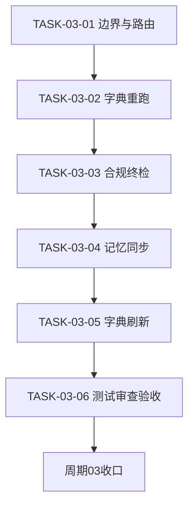
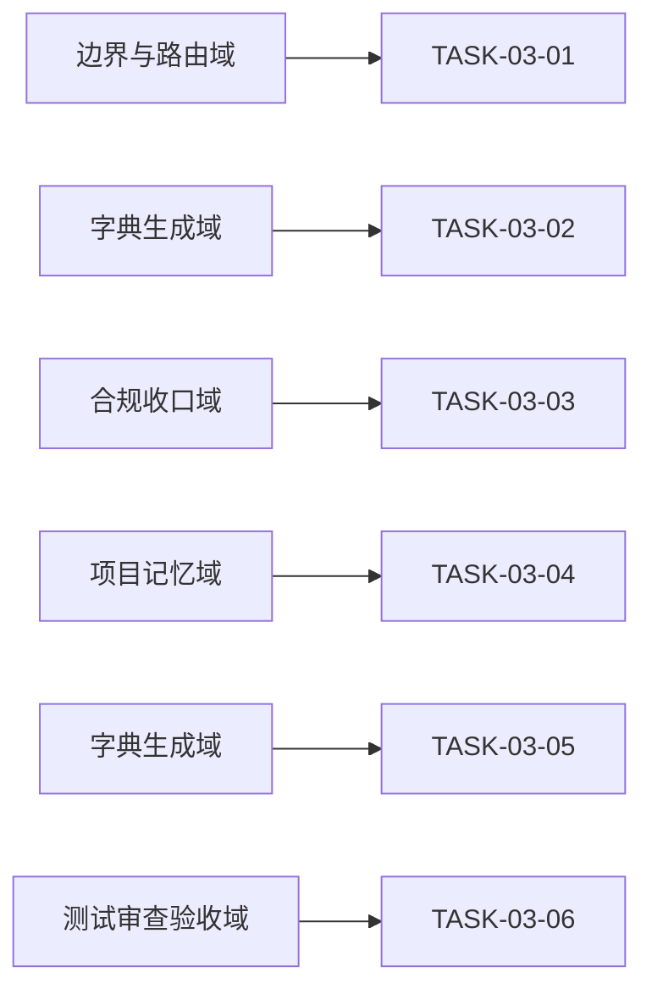

# 实施周期03：边界厘清、截图路由与合规收口

结论：完成边界路由、长期记忆、字典刷新、测试审查和最终验收收口；影响：本轮代码生成风格规则的长期可检索性和交付可追溯性；范围：本需求第三期的任务、测试、审查、字典和验收；非范围：业务代码、外部服务和 Git 历史；变化：新增规则进入项目记忆、字典和最终验收链路；完成标准：本周期全部任务按顺序闭环且文档校验、合规和最终验收均通过；术语说明：无技术术语需要解释；验证状态：本周期文档、测试、审查和最终验收均已通过。

## 1. 当前周期目标、边界与进入条件

- 对应需求文档：`doc/2-需求/2026-07-13_174006_代码风格体系反馈驱动持续迭代.md`
- 对应实施总览：`doc/3-实施/2026-07-13_174006_代码风格体系反馈驱动持续迭代_实施总览.md`
- 周期序号 / 大进度定位：CYCLE-03，第三期，收口。
- 当前周期目标：厘清 project-style-rules 边界、补截图路由出口、同步长期风格与项目记忆、刷新字典、走 compliance gate、文档校验终检和最终验收。
- 当前周期只做这一件事：边界路由与合规收口。
- 边界：本周期不改捕获写入与加载规避核心逻辑，只补边界、路由与收口。
- 图片资产决策：N/A —— 周期落点为 Markdown 规则文件与生成 js，任务依赖与领域匹配由 Mermaid 表达，无位图证据需求。

## 2. 进入条件与收口条件

- 进入条件：CYCLE-01 与 CYCLE-02 均已收口。
- 收口条件：字典脚本重跑成功且产物反映新标题；`skill-compliance-gate-rules` 判 PASS；所有实施文档对应 profile 校验 PASS；无未决 P0/P1。

## 3. 当前代码/文档基线

- 基线提交：214fdbd。
- `project-style-rules/SKILL.md` 现只维护项目级 PROJECT_STYLE.md，无全局反例库边界说明。
- `image-redbox-focus-rules/SKILL.md` 现路由出口未含风格纠正转向。
- `skill-dictionary/generate_dictionary.py` 与产物 data.js、字典.md 为基线状态。

## 4. 周期内最小任务执行顺序

| 顺序 | TASK | 唯一目标 | 前置依赖 | 允许文件 | 禁止触碰区 |
| --- | --- | --- | --- | --- | --- |
| 1 | TASK-03-01 | 边界与截图路由 | CYCLE-02 收口 | project-style-rules/SKILL.md、image-redbox-focus-rules/SKILL.md | 反例库与契约逻辑 |
| 2 | TASK-03-02 | 重跑字典脚本 | TASK-03-01 | skill-dictionary 产物 | 字典脚本源码 |
| 3 | TASK-03-03 | 合规收口与终检 | TASK-03-02 | 最终验收文档 | skill 实现文件 |
| 4 | TASK-03-04 | 同步长期风格与项目记忆 | TASK-03-03 | PROJECT_STYLE.md、PROJECT_MEMORY.md、PROJECT_CURRENT.md、PROJECT_HISTORY.md | 业务代码与外部环境 |
| 5 | TASK-03-05 | 刷新字典生成产物 | TASK-03-04 | skill-dictionary/data.js、字典.md | 字典脚本源码 |
| 6 | TASK-03-06 | 测试、审查和最终验收收口 | TASK-03-05 | doc/5-tests/、doc/6-审查/、doc/7-验收/ | 业务代码与 Git 历史 |

## 5. 文件/符号操作契约

| TASK | 操作类型 | 目标文件 | 目标符号/区段 | 改前后职责 |
| --- | --- | --- | --- | --- |
| TASK-03-01 | 修改 | project-style-rules/SKILL.md | 权责边界节 | 补全局纠偏走反例库 项目专属走 PROJECT_STYLE 边界 |
| TASK-03-01 | 修改 | image-redbox-focus-rules/SKILL.md | 路由出口节 | 补截图属风格纠正转 consistency-rules |
| TASK-03-02 | 生成 | skill-dictionary/data.js 与 字典.md | 生成产物 | 刷新至含新标题与新 description |
| TASK-03-03 | 新增 | 7-验收 最终验收文档 | 全文 | 无到最终验收结论 |
| TASK-03-04 | 修改 | PROJECT_STYLE.md、PROJECT_MEMORY.md、PROJECT_CURRENT.md、PROJECT_HISTORY.md | 本轮规则条目与状态/历史 | 同步长期规则、当前状态和历史事件 |
| TASK-03-05 | 生成 | skill-dictionary/data.js、字典.md | 生成产物 | 反映更新后的 skill description 和 references |
| TASK-03-06 | 新增/修改 | doc/5-tests/2026-07-15_145924/、doc/6-审查/、doc/7-验收/ | README、证据、审查和最终验收 | 留存本轮全量收口证据 |

## 6. 最小任务闭环

- TASK-03-01：改两个 SKILL 后，真实测试模拟一张圈红错误写法截图消息，演练 image-redbox 命中并路由到 consistency 走流程；审查点边界与 project-style 职责不重叠；验收点截图反馈可进入学习闭环；停止条件为路由与既有 image 路由冲突时停；回滚为撤回边界段与路由出口。
- TASK-03-02：运行 `python skill-dictionary/generate_dictionary.py` 后，真实测试用脚本退出码加 grep 新标题与新 description 是否入库；审查点产物非手改；验收点字典反映新结构；停止条件为脚本报错时停并转失败学习路由；回滚为恢复旧产物。
- TASK-03-03：走 compliance gate 与文档校验后，真实测试对总览与周期文档跑 `validate_engineering_docs.py` 对应 profile；审查点追踪链 REQ 到 AC 到 CYCLE 到 TASK 到 TEST 到 EVIDENCE 完整；验收点整体交付合规；停止条件为任一闸门 FAIL 则回对应周期修复；回滚为保留证据不强行收口。
- TASK-03-04：把稳定规则写入 `PROJECT_STYLE.md` 和 `PROJECT_MEMORY.md`，把当前状态覆盖写入 `PROJECT_CURRENT.md`，把本次事件追加到 `PROJECT_HISTORY.md`；真实测试为 UTF-8 与关键词检查；职责串位或发现更高优先级冲突即停止。
- TASK-03-05：运行 `python -X utf8 skill-dictionary/generate_dictionary.py`，核对 description、references 和生成产物；脚本失败即停止并转失败学习路由，不手工改产物。
- TASK-03-06：完成 TEST-09/10/11、实现自审、当前改动总审查、skill 合规和最终验收；任一 profile、测试、审查或追踪门禁失败即回对应任务。
- 每个任务按实现、真实测试、审查、验收逐个闭环。

## 7. 当前周期验证矩阵

| TASK | TEST | AC | 真实测试入口 | 通过标准 |
| --- | --- | --- | --- | --- |
| TASK-03-01 | TEST-04 | AC-05 | 截图路由演练 | 截图命中并路由到捕获流程 |
| TASK-03-02 | TEST-05 | AC-05 | 脚本退出码加 grep | 退出码 0 产物含新标题与 description |
| TASK-03-03 | TEST-05 | AC-05 | validate 对应 profile | 各 profile PASS 无未决 P0 P1 |
| TASK-03-04 | TEST-11 | AC-06、AC-07、AC-08 | UTF-8 与关键词检查 | 四件套职责正确、UTF-8 可读、中文无乱码 |
| TASK-03-05 | TEST-10 | AC-06、AC-07、AC-08 | 字典脚本与产物核对 | 退出码 0，description/references 一致 |
| TASK-03-06 | TEST-09 | AC-06、AC-07、AC-08 | 四 profile、合规、审查和最终验收 | 全部通过且追踪链完整 |

- 真实测试证据统一落 `doc/5-tests/2026-07-15_145924/`；审查证据落 `doc/6-审查/2026-07-15_150741_代码风格体系反馈驱动持续迭代_*.md`。

## 8. 周期阻断、停止与回滚

- 停止条件：任一任务停止条件命中即停在该任务修复，不进入下一任务；任一闸门 FAIL 不强行收口。
- 回滚：ROLLBACK-03 撤回本周期边界段、路由出口与最终验收文档，恢复到基线 214fdbd 状态。
- 阻断条件：字典脚本或 validate 脚本不可用时记 GAP 并停止，转 `execution-failure-learning-rules` 路由。

| ID | 触发 | 处置 | 回滚动作 |
| --- | --- | --- | --- |
| ROLLBACK-03 | 边界或路由改动引入冲突 | 停在当前任务修复 | 撤回边界段与路由出口回到 214fdbd |
| GAP-CYCLE03-01 | 字典或 validate 脚本不可用 | 记 GAP 并停止 | 保留基线待环境恢复 |

图形目的：描述本周期任务依赖顺序。
关联 ID：TASK-03-01、TASK-03-02、TASK-03-03、TASK-03-04、TASK-03-05、TASK-03-06。

图形目的：领域匹配，展示本周期任务归属的能力域。
关联 ID：TASK-03-01、TASK-03-02、TASK-03-03、TASK-03-04、TASK-03-05、TASK-03-06。

## 9. 自审结论

- 覆盖度检查：含周期目标、进入收口条件、基线、任务顺序、文件/符号契约、闭环、验证矩阵、停止条件、回滚。
- 最小任务闭环检查：三任务各含实现、真实测试、审查、验收与停止条件。
- 占位词检查：无占位词。
- 图文一致性检查：任务 DAG 与领域匹配图节点与任务表一致。
- 真实测试检查：每任务有真实测试入口与通过标准，证据路径明确。
