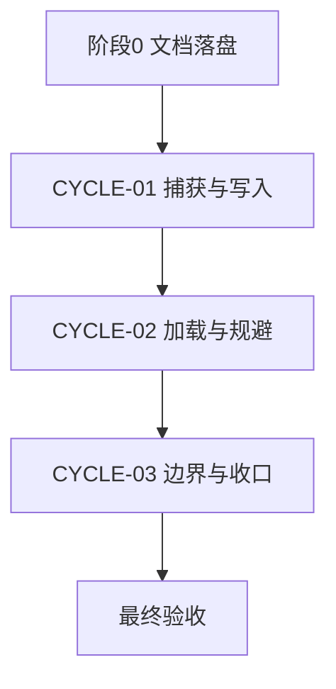
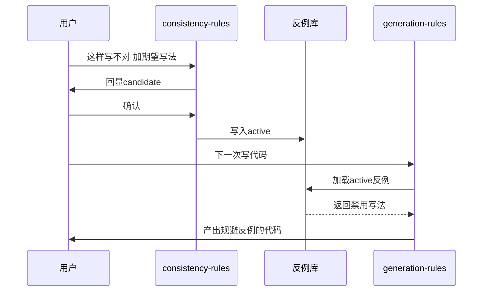

# 需求实施总览：代码风格体系反馈驱动持续迭代

结论：扩展既有写码前规则，使代码生成前能识别局部统一风格并参考既有接口实现；影响：规则资产维护和后续执行模型；范围：规则文件、文档、测试、记忆和字典；非范围：业务代码和远端协作；变化：新增规则进入写码前契约和写后闸门；完成标准：新增任务逐项验证并完成最终验收；术语说明：无技术术语需要解释；验证状态：实施、测试、审查和最终验收均已通过。

## 1. 当前计划最终方案简要说明

- 推荐方案一句话结论：在既有反例库消费链路上，补充 `code-generation-style-rules` 对局部统一代码模板和既有接口实现的强制对照，并在写后闸门拒绝风格跳变和多余代码。
- 主落点 / 主路径：`code-generation-style-rules/SKILL.md` 及其 references，扩展既有 CYCLE-02；`code-style-consistency-rules` 继续只负责全局反例库。
- 为什么先走这条路线：新增要求属于写码前风格契约的职责，复用现有 skill 可减少边界重复和全局改动，不需要新增 skill 或修改业务代码。

## 2. 基本信息

- 对应需求文档：`doc/2-需求/2026-07-13_174006_代码风格体系反馈驱动持续迭代.md`
- 来源对象标识：代码风格体系反馈驱动持续迭代
- 当前实施文档命名主干：2026-07-13_174006_代码风格体系反馈驱动持续迭代
- 对应需求与实施计划全量顺序实施方案：N/A —— 单一来源对象非多需求场景，无跨需求排序诉求（证据：本轮仅一个升级需求）。
- 对应验收标准文档：`doc/7-验收/2026-07-13_174006_代码风格体系反馈驱动持续迭代_验收标准.md`
- 对应最终验收文档：`doc/7-验收/2026-07-13_174006_代码风格体系反馈驱动持续迭代_最终验收.md`
- Agent 理解的问题 / 目标：让三件套具备从用户反馈提取正反例、确认、全局写入、写码前加载规避的闭环。
- 当前计划范围：新增局部风格与接口实现 reference，修改 generation skill 的编码前清单、优先级、契约模板和写后闸门，更新需求/验收/记忆、测试证据与字典。
- 明确不在范围：不新建 skill、不改 `code-style-consistency-rules` 核心职责、不改 `skill-dictionary/generate_dictionary.py`、不改业务代码、不实现截图 OCR。
- 当前优先闭环：周期 02 写码前加载与规避。
- 关键假设 / 待确认点：局部风格以当前文件/同目录/同模块稳定多数为证据；接口无参考实现时必须记录降级依据；冲突无法收敛时记录 GAP 并停止。
- 当前状态：in_progress。
- 是否已获得开始实施授权：是（用户已批准计划并授权实施）。
- unresolved_decisions：无（DEC-01 至 DEC-04 已冻结）。
- 图片资产决策：N/A —— 落点全为 Markdown 与生成 js，流程时序依赖均由 Mermaid 表达，无位图证据需求。

## 3. 现状与落点

- 涉及目录：`D:/luode/luode-skills/code-generation-style-rules/`、`doc/`、根目录记忆文件和 `skill-dictionary/`。
- 涉及文件 / 模块：`code-generation-style-rules/SKILL.md`、五份 references、既有需求/验收/实施文档、测试证据、项目记忆和字典产物。
- 复用点：既有全局 active 反例库、`style-priority.md` 的五级优先级、`style-contract-template.md` 的契约字段和既有 CYCLE-02 测试证据结构。
- 需要新增的内容：`local-context-and-interface-style.md`、局部统一风格/接口实现正反例证据和最终验收文档。
- 代码落点目录树：

```text
C:\Users\luode\.claude\skills\
├── code-style-consistency-rules\
│   ├── SKILL.md                              # 改：新增捕获学习节 加 description 加 references 规则
│   └── references\
│       ├── user-style-feedback-library.md    # 新增：全局 active 反例库
│       ├── style-case-template.md            # 新增：单条 case 字段模板
│       └── style-feedback-workflow.md        # 新增：捕获到写入流程
├── code-generation-style-rules\
│   ├── SKILL.md                              # 改：写码前加载反例库 禁用写法纳入 active 反例
│   └── references\
│       ├── pre-coding-checklist.md           # 改：来源顺序补加载反例库
│       └── style-contract-template.md        # 改：契约补用户反例规避字段
├── project-style-rules\
│   └── SKILL.md                              # 改：补边界说明
├── image-redbox-focus-rules\
│   └── SKILL.md                              # 改：路由出口补风格纠正转向
└── skill-dictionary\
    └── data.js                               # 生成产物：重跑刷新
```

## 4. 实施周期总览

- 总周期说明：按端到端垂直切片拆 3 个周期，先地基、再消费、后收口。
- 本次计划拆分的子任务周期数：3。
- 周期拆分原则：每周期一个可独立验证的端到端闭环，任务默认不超过 5 个文件。
- 周期排序说明：CYCLE-02 依赖 CYCLE-01，CYCLE-03 依赖 CYCLE-01 与 CYCLE-02。

| 周期 | 期次定位 | 周期目标 | 进入条件 | 收口条件 |
| --- | --- | --- | --- | --- |
| CYCLE-01 | 第一期 地基 | 捕获与确认写入闭环 | 阶段0文档 PASS | 模拟反馈写入 active 并去重 |
| CYCLE-02 | 第二期 消费 | 写码前加载与规避 | CYCLE-01 收口 | 演练规避 active 反例 |
| CYCLE-03 | 第三期 收口 | 边界路由与合规 | CYCLE-01、CYCLE-02 收口 | 字典重跑加 compliance PASS |

- 总体真实测试安排：见第 7 节；脚本级测试覆盖 validate 与字典重跑，行为演练覆盖捕获、写入、加载规避、截图路由。

## 5. 阶段计划

- 阶段 0：极致完整文档体系落盘。只做这一件事：落盘并校验文档。输入：授权。输出：需求、验收、总览、周期文档。验证门槛：对应 profile PASS。
- 阶段 1：反例库地基与写入闭环（对应 CYCLE-01）。只做这一件事：建立写入侧闭环。输入：阶段0通过。输出：三份新 references 加 consistency SKILL 捕获节。验证门槛：写入 active 加去重演练。
- 阶段 2：写码前加载规避（对应 CYCLE-02）。只做这一件事：打通消费端。输入：阶段1通过。输出：generation SKILL 与两份 references 改动。验证门槛：写码演练规避。
- 阶段 3：边界路由与合规收口（对应 CYCLE-03）。只做这一件事：收口。输入：阶段2通过。输出：project-style 与 image-redbox 改动加字典刷新加 compliance 结论。验证门槛：字典重跑加 compliance PASS 加文档校验。

## 6. 最小任务清单

- 执行顺序固定为 CYCLE-01 内任务逐个闭环、周期收口、再进入 CYCLE-02。每个 TASK 的文件/符号落点由本表与对应周期文档冻结。

| TASK | 所属周期 | 唯一目标 | 允许文件 | 真实测试入口 | 预计文件数 |
| --- | --- | --- | --- | --- | --- |
| TASK-01-01 | CYCLE-01 | 新增 case 模板与反例库骨架 | style-case-template.md、user-style-feedback-library.md | 结构自检加指纹 | 2 |
| TASK-01-02 | CYCLE-01 | 编写捕获学习流程 | style-feedback-workflow.md | 文字反馈演练 | 1 |
| TASK-01-03 | CYCLE-01 | consistency SKILL 接入捕获 | code-style-consistency-rules/SKILL.md | 触发词命中演练 | 1 |
| TASK-02-01 | CYCLE-02 | 写码前加载反例库 | code-generation-style-rules/SKILL.md、pre-coding-checklist.md | 契约来源核对 | 2 |
| TASK-02-02 | CYCLE-02 | 禁用写法纳入并规避 | style-contract-template.md、code-generation-style-rules/SKILL.md | 写码规避演练 | 2 |
| TASK-02-03 | CYCLE-02 | 局部统一风格识别与最小变更约束 | local-context-and-interface-style.md、pre-coding-checklist.md、code-generation-style-rules/SKILL.md | 局部模板演练 | 3 |
| TASK-02-04 | CYCLE-02 | 接口实现参考与契约字段 | style-priority.md、style-contract-template.md | 接口实现对照演练 | 2 |
| TASK-02-05 | CYCLE-02 | 写后风格闸门与负例驳回 | post-change-style-gate.md | 正反例闸门演练 | 1 |
| TASK-03-01 | CYCLE-03 | 边界与截图路由 | project-style-rules/SKILL.md、image-redbox-focus-rules/SKILL.md | 截图路由演练 | 2 |
| TASK-03-02 | CYCLE-03 | 重跑字典脚本 | skill-dictionary 产物 | 脚本退出码加 grep | 2 |
| TASK-03-03 | CYCLE-03 | 合规收口与终检 | 最终验收文档 | validate 加 compliance | 1 |
| TASK-03-04 | CYCLE-03 | 同步长期风格与项目记忆 | PROJECT_STYLE.md、PROJECT_MEMORY.md、PROJECT_CURRENT.md、PROJECT_HISTORY.md | UTF-8 与关键词核对 | 4 |
| TASK-03-05 | CYCLE-03 | 刷新字典生成产物 | skill-dictionary/data.js、字典.md | 字典脚本退出码与源产物一致性 | 2 |
| TASK-03-06 | CYCLE-03 | 测试证据与最终验收 | doc/5-tests/2026-07-15_145924/、doc/6-审查/、doc/7-验收/ | 文档 profile、合规、最终验收 | 7 |

- 追踪矩阵：

| REQ | AC | CYCLE | TASK | TEST |
| --- | --- | --- | --- | --- |
| REQ-01 | AC-01 | CYCLE-01 | TASK-01-03 | TEST-01 |
| REQ-03 | AC-01 | CYCLE-01 | TASK-01-02 | TEST-01 |
| REQ-04 | AC-02 | CYCLE-01 | TASK-01-01 | TEST-02 |
| REQ-06 | AC-04 | CYCLE-01 | TASK-01-03 | TEST-02 |
| REQ-05 | AC-03 | CYCLE-02 | TASK-02-02 | TEST-03 |
| REQ-02 | AC-05 | CYCLE-03 | TASK-03-01 | TEST-04 |
| REQ-07 | AC-06 | CYCLE-02 | TASK-02-03 | TEST-06 |
| REQ-08 | AC-07 | CYCLE-02 | TASK-02-04 | TEST-07 |
| REQ-07、REQ-08 | AC-08 | CYCLE-02 | TASK-02-05 | TEST-08 |
| REQ-07、REQ-08 | AC-06、AC-07、AC-08 | CYCLE-03 | TASK-03-04 | TEST-11 |
| REQ-07、REQ-08 | AC-06、AC-07、AC-08 | CYCLE-03 | TASK-03-05 | TEST-10 |
| REQ-07、REQ-08 | AC-06、AC-07、AC-08 | CYCLE-03 | TASK-03-06 | TEST-09 |

## 7. 真实测试安排

- 真实测试总表：
  - TEST-01：文字反馈捕获演练，验证命中与 candidate 回显，证据落 `doc/5-tests/`。
  - TEST-02：active 写入与去重演练，指纹校验字段齐全、同键只增计数。
  - TEST-03：写码前契约加载与规避演练，验证禁用写法与正例改写。
  - TEST-04：截图路由演练，验证 image-redbox 命中并路由到捕获流程。
  - TEST-05：脚本级校验，`validate_engineering_docs.py` 各 profile 与 `generate_dictionary.py` 重跑退出码 0。
  - TEST-06：局部统一风格演练，验证新增代码只做同构模板替换。
  - TEST-07：接口实现风格对照演练，验证契约记录参考实现和必要差异。
  - TEST-08：写后闸门正反例演练，验证风格跳变和多余代码被驳回。
  - TEST-09：文档完整性，需求、验收、实施总览和周期02 profile 均 PASS。
  - TEST-10：字典一致性，生成脚本退出码为 0，产物中的 description 和 references 与源文件一致。
  - TEST-11：UTF-8 与文件指纹，所有新增/修改 Markdown 可按 UTF-8 读取且关键文件可复核。
- 免测任务及理由：无。三件套改动均改变 agent 运行时行为，不满足免测条件。
- 诚实边界说明：skill 规则行为无法用传统单测断言，采用脚本级真实测试加受控行为演练留证组合；build、lint、纯人工阅读不计入。
- 新增规则的行为边界：局部统一代码区段只允许必要替换；接口实现必须有既有实现参考或明确降级依据；无法收敛时记录 GAP，不得静默选个人偏好。
- 本轮测试证据统一落 `doc/5-tests/2026-07-15_145924/`，审查证据落 `doc/6-审查/2026-07-15_150741_代码风格体系反馈驱动持续迭代_*.md`，最终验收落 `doc/7-验收/2026-07-15_150741_代码风格体系反馈驱动持续迭代_最终验收.md`。
- 文件/符号落点：每个 TEST 的被测文件/符号见第 6 节表与对应周期文档的文件/符号操作契约。

## 8. 风险与阻断项

| ID | 风险 | 缓解 | 回滚 |
| --- | --- | --- | --- |
| ROLLBACK-01 | 职责重叠 | RULE-03 边界隔离 | 撤回 project-style 边界段 |
| ROLLBACK-02 | 误提取污染 | RULE-01 确认后生效 | 删除误写 active 条目 |
| ROLLBACK-03 | 库膨胀 | RULE-02 三元组去重键 | 合并重复条目 |
| ROLLBACK-04 | 脚本不可用 | 转失败学习路由 | 停止收口待环境恢复 |

- 依赖：本机 Python 与 bash。
- 任务完成、停止与最大推进边界：任一周期收口条件未达成即停在该周期修复，不进入后续周期；任一闸门 FAIL 不强行收口；最大推进边界为三件套改造完成、全链验证 PASS、最终验收文档落盘，不扩展到新建 skill、改字典脚本、实现截图 OCR。

## 9. 图形化执行路径

图形目的：界定系统边界与数据流向。
关联 ID：CYCLE-01、CYCLE-02、CYCLE-03。


图形目的：固定周期执行顺序与依赖。
关联 ID：CYCLE-01、CYCLE-02、CYCLE-03。



图形目的：描述一次反馈从捕获到写码规避的端到端时序。
关联 ID：REQ-03、REQ-04、REQ-05。



## 10. 自审结论

- 覆盖度检查：含最终方案说明、问题理解、范围、周期、阶段、最小任务、真实测试、图、风险、边界、授权状态。
- 实施周期检查：3 周期顺序与依赖清晰。
- 最小任务闭环检查：每任务含目标、允许文件、真实测试入口，逐个闭环。
- 阶段单一目标检查：阶段 0 至 3 各只做一件事。
- 占位词检查：无占位词。
- 可执行性检查：落点精确到文件，给出反例库条目格式与校验命令。
- 图文一致性检查：三图节点与周期命名一致。
- 用户确认状态：计划已获用户批准并授权实施。
