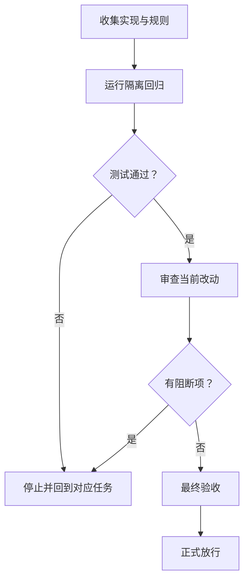

# Windows PowerShell 环境可靠性升级实施周期 04：交付收口

这一周期把已经完成的环境脚本改动收成可交付结果：两种 PowerShell 都能按同一规则判断环境，缺少不需要的工具不会卡住工作，用户原有的终端和配置也不会被测试碰到。完成标准是本地回归、审查和最终验收都有证据，并且浏览器和第三方条件不适用时不被误判为阻断。

## 当前周期目标、边界与进入条件

| 项目 | 内容 |
| --- | --- |
| 周期 | CYCLE-PSENV-04，第四期，交付收口 |
| 目标 | 验证现有实现、同步规则并形成可放行的交付证据 |
| 进入条件 | 前三期的状态、事务和恢复能力已完成，测试 runner 已落盘 |
| 本周期不做 | 真实软件下载、管理员操作、浏览器联调、第三方接口和业务代码 |
| 完成结果 | 规则、脚本、测试、审查、验收和技能字典口径一致 |

图片资产决策：N/A + 原因：本周期只表达脚本行为、任务顺序和验证结果。证据：表格与 Mermaid 已完整说明依赖和收口条件，没有 UI 或视觉对比产物。

## 进入条件与收口条件

| 类型 | 条件 | 证据 | 状态 |
| --- | --- | --- | --- |
| 进入 | 需求、验收标准和实施总览已存在 | REQDOC-PSENV-20260713、ACDOC-PSENV-20260713、IMP-OVERVIEW-PSENV-20260713 | 通过 |
| 进入 | 测试全部使用临时目录 | TEST-PSENV-001 至 TEST-PSENV-009 的 runner | 通过 |
| 收口 | 两种 PowerShell 的隔离回归都通过 | PowerShell 5.1 与 PowerShell 7 各九项通过 | 通过 |
| 收口 | 审查和最终验收都无阻断项 | REV-PSENV-20260713、ACCEPT-PSENV-20260713 | 通过 |

图形目的：说明本周期只有在验证、审查和验收依次完成后才允许放行。关联 ID：CYCLE-PSENV-04、TASK-PSENV-10 至 TASK-PSENV-12。

## 当前代码/文档基线

- 基线提交：`137b7d2`；本周期在其上完成未提交的规则、脚本、测试和交付文档改动。
- 已核实落点：环境入口脚本保留原调用方式；核心模块集中状态、锁、Terminal 和回滚；UTF-8 脚本负责隔离 profile 事务。
- 偏差停止规则：如果测试触碰真实用户 Terminal、profile、执行策略或软件安装，立即停止并保留临时目录证据；不得用真实环境补测。

## 周期内最小任务执行顺序

| 顺序 | 任务 | 唯一目标 | 前置依赖 | 状态 |
| ---: | --- | --- | --- | --- |
| 1 | TASK-PSENV-10 | 将规则、manifest、状态契约和相邻边界同步为同一口径 | 前三期脚本实现 | 已完成 |
| 2 | TASK-PSENV-11 | 在 PowerShell 5.1 与 7 中运行隔离回归 | 测试 runner 和临时 fixture | 已完成 |
| 3 | TASK-PSENV-12 | 完成当前改动审查、最终验收和技能字典刷新 | 真实测试通过 | 已完成 |

## 文件与符号操作契约

| 任务 | 文件/符号 | 操作 | 修改前职责 | 修改后职责 |
| --- | --- | --- | --- | --- |
| TASK-PSENV-10 | `PowerShellEnvironment.Core.psm1` / `Invoke-EnvironmentOperation` | 新增并集中逻辑 | 入口脚本承载分散判断 | 核心模块统一状态、锁、事务和回滚 |
| TASK-PSENV-10 | `tool-manifest.yaml` / source packages | 修改契约 | 工具映射缺少来源隔离 | 每个包源只使用自己的精确 ID |
| TASK-PSENV-11 | `run_v2_environment_tests.ps1` | 新增回归 | 缺少完整隔离验收 | 临时 fixture 覆盖九个关键场景 |
| TASK-PSENV-12 | Skill、审查和验收文档 | 更新与新增 | 口径分散 | 以 RequiredOnly、三态门禁和本地证据收口 |

## 最小任务闭环

| 任务 | 实现 | 真实测试 | 审查 | 验收 | 闭环 |
| --- | --- | --- | --- | --- | --- |
| TASK-PSENV-10 | 规则与脚本已同步 | parser 与运行入口通过 | 当前改动审查 | AC-PSENV-001 至 005 | 通过 |
| TASK-PSENV-11 | runner 已实现 | PS5、PS7 各九项通过 | 测试隔离范围已核对 | AC-PSENV-001 至 006 | 通过 |
| TASK-PSENV-12 | 收口文档与字典已更新 | 校验器、quick validate、字典通过 | REV-PSENV-20260713 | ACCEPT-PSENV-20260713 | 通过 |

## 当前周期验证矩阵

| 测试 | 精确入口 | local 依赖 | 关键断言 | 失败预期 | 清理 |
| --- | --- | --- | --- | --- | --- |
| TEST-PSENV-001 至 009 | `powershell.exe ... run_v2_environment_tests.ps1` | 临时 state、profile、Terminal、假包管理器 | RequiredOnly、degraded、WhatIf、回滚、candidate、精确 ID、Git Bash、用户设置保护 | 任一断言失败即退出 1 | finally 删除临时目录 |
| TEST-PSENV-001 至 009 | `pwsh.exe ... run_v2_environment_tests.ps1` | 同上 | 与 5.1 相同的九项断言 | 任一断言失败即退出 1 | finally 删除临时目录 |
| TEST-PSENV-010 | `quick_validate.py windows-powershell-environment-rules` | 本地 Python | Skill 结构与引用有效 | 非零退出 | 无写入 |

## 周期阻断、停止与回滚

- ROLLBACK-PSENV-001：Terminal 或 profile 写入只在 journal 的 after hash 未漂移时从备份恢复；漂移时返回 `rollback_refused`，不覆盖用户改动。
- 停止条件：脚本解析失败、九项断言任一失败、真实用户配置 hash 变化、或文档/字典校验失败。
- 恢复路径：解析或断言失败回到对应脚本任务；文档失败回到相应模板；不使用第三方或授权环境绕过失败。
- 最大推进边界：只完成本周期的规则、脚本、测试、审查、验收和字典；不提交、不推送、不真实安装软件。

## 周期追踪矩阵

| REQ/RULE | AC | TASK | 文件/符号 | TEST | EVIDENCE | 状态 |
| --- | --- | --- | --- | --- | --- | --- |
| RULE-PSENV-001、003 | AC-PSENV-001、003 | TASK-PSENV-10、11 | `Invoke-EnvironmentOperation` | TEST-PSENV-001、002 | PS5/PS7 输出 | 通过 |
| RULE-PSENV-002、005 | AC-PSENV-002、005 | TASK-PSENV-10、11 | `Get-ExactPackage`、Git Bash 识别 | TEST-PSENV-006、007、008 | candidate 与 fake manager 日志 | 通过 |
| RULE-PSENV-004、006 | AC-PSENV-004、006 | TASK-PSENV-10、11 | JSONC 补丁、profile 事务、runner | TEST-PSENV-003、004、005、009 | hash 与 fixture 回读 | 通过 |
| REQ-PSENV-001 至 003 | AC-PSENV-001 至 006 | TASK-PSENV-12 | 审查、验收、字典 | TEST-PSENV-010 | 本地校验输出 | 通过 |

## 自审结论

- 每个任务只承载一个交付目标，并按实现、真实测试、审查、验收顺序收口。
- 真实测试只使用本机临时文件和假包管理器；浏览器与第三方验证的适用性已在 YAML 门禁说明，原因是无页面和无网络范围，证据是 runner 只使用本地 fixture。
- 文件、符号、测试和回滚路径都有追踪记录；不存在未决 P0/P1 或需要猜测的包映射。
