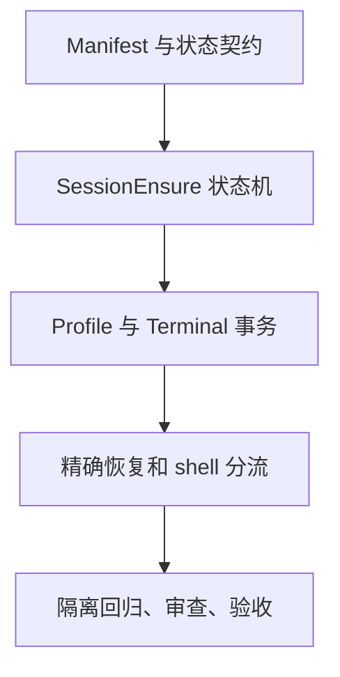
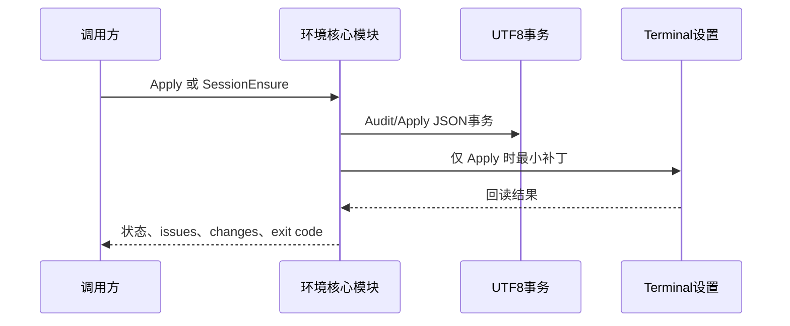

# Windows PowerShell 环境可靠性升级实施总览

推荐保留现有脚本入口，在内部补齐状态机、精确包源、事务回滚和跨 shell 诊断。这样调用方式不会突然改变，环境判断却能从“缺一个工具就失败”变成“只在真正不能继续时阻断”。

## 基本信息

- 对应需求：`REQDOC-PSENV-20260713`。
- 对应验收：`ACDOC-PSENV-20260713`。
- 当前范围：环境 Skill、UTF-8 profile 交接、测试与文档收口。
- 非范围：真实安装、管理员操作、业务代码和 Git 历史写入。
- 当前优先闭环：TASK-PSENV-03，修正 SessionEnsure 的可选工具误阻断。
- 开始实施授权：已获得，用户明确要求“按照计划执行”。

## 当前计划最终方案简要说明

保留已有命令入口，将共享逻辑收口到核心模块。SessionEnsure 只保证当前 PowerShell 工作所需条件，工具恢复只用精确映射，所有写入都进入可验证的事务。

## Agent 对当前问题的理解

- 问题：旧脚本把可选工具失败与必需条件失败混为一类，导致无故阻断。
- 目标：把可继续、受限、阻断和忙碌转为稳定的机器结果，同时不牺牲安装与回滚安全。
- 假设：本机可运行 PowerShell 5.1、PowerShell 7、Git Bash；缺失时只记录适用性，不能猜测替代路径。
- unresolved_decisions：无；未确认的包源映射一律不进入 manifest。

## 实施周期总览

| 周期 | 目标 | 最小任务 | 收口条件 |
| --- | --- | --- | --- |
| 周期 01 | manifest 与会话健康 | TASK-PSENV-01 至 03 | 可选缺项不阻断，状态可读 |
| 周期 02 | 写入事务与回滚 | TASK-PSENV-04 至 06 | profile/Terminal 可安全恢复 |
| 周期 03 | 恢复和 shell 分流 | TASK-PSENV-07 至 09 | 不猜包、不误判 Git Bash/WSL |
| 周期 04 | 文档与交付收口 | TASK-PSENV-10 至 12 | 回归、审查、验收、字典完成 |

## 阶段计划

| 阶段 | 只做这一件事 | 验证门槛 |
| --- | --- | --- |
| 阶段 1 | 冻结输入和兼容接口 | 需求、验收和 manifest schema 落盘 |
| 阶段 2 | 实现可靠环境判断 | RequiredOnly 与 optional 状态机回归通过 |
| 阶段 3 | 实现安全写入与恢复 | 临时 JSONC/profile 回滚回归通过 |
| 阶段 4 | 实现精确恢复与交付 | shell 分流、全量测试和审查通过 |

## 最小任务清单

- TASK-PSENV-01：建立来源需求、验收和实施锚点；纯文档任务，校验文档 profile 后收口。
- TASK-PSENV-02：实现 manifest v2 和 schema；用有效与损坏 manifest fixture 验证。
- TASK-PSENV-03：实现状态机、TTL 和锁；用 required/optional/busy fixture 验证。
- TASK-PSENV-04：实现 UTF-8 profile 的隔离交接；用临时 profile root 验证。
- TASK-PSENV-05：实现 JSONC 最小补丁；用注释、尾逗号和冲突 fixture 验证。
- TASK-PSENV-06：实现 hash 防漂移 rollback；用一致和漂移 fixture 验证。
- TASK-PSENV-07：实现精确包源恢复；用假包管理器参数日志验证。
- TASK-PSENV-08：实现 Git Bash、CMD、PowerShell 可见性诊断；用本机 shell 与 fixture 验证。
- TASK-PSENV-09：收敛 discovered 与 failure case 状态；用坏状态和脱敏 fixture 验证。
- TASK-PSENV-10 至 12：同步 Skill、相邻规则、测试、审查、验收、字典和项目记忆。

## 现状与落点

- 文件/符号：`initialize_windows_powershell.ps1` 保留 CLI；`PowerShellEnvironment.Core.psm1` 承接 manifest、状态、锁、终端、回滚与恢复；`enable_powershell_utf8.ps1` 承接 profile 事务。
- 复用点：既有 Windows Terminal profile GUID、UTF-8 marker、artifact-delivery 文档校验器和 Skill 字典生成器。
- 禁止触碰：系统 `powershell.exe`、真实安装包、VS Code 默认终端、全局 Git 配置和 WSL 原生安装。

## 方案选择

| 方案 | 结果 | 结论 |
| --- | --- | --- |
| 保留入口、抽共享模块 | 兼容旧调用，新增状态契约和测试 seam | 采用 |
| 新增独立 Skill 或重写所有入口 | 触发边界和迁移成本过大 | 不采用 |

## 实施步骤

| 步骤 | 周期/阶段/任务 | 本步只做 | 验证 |
| --- | --- | --- | --- |
| 1 | 周期01/阶段1/TASK-PSENV-02 | manifest v2 与 schema | PS5/PS7 parser、policy fixture |
| 2 | 周期01/阶段2/TASK-PSENV-03 | 状态机、TTL、锁、WhatIf | ready/degraded/busy fixture |
| 3 | 周期02/阶段3/TASK-PSENV-04 至 06 | profile 与 Terminal 事务 | 临时 profile/JSONC/rollback fixture |
| 4 | 周期03/阶段4/TASK-PSENV-07 至 09 | 精确恢复与 shell 分流 | 假包管理器、Git Bash、candidate fixture |
| 5 | 周期04/阶段4/TASK-PSENV-10 至 12 | 文档、审查、验收和字典 | profile 校验、quick validate、全量 runner |

## 真实测试安排

- 环境：仅本机 PowerShell 5.1、PowerShell 7、Git Bash 和临时目录。
- 样本：假 `winget`、`scoop`、`choco`，假命令、JSONC fixture 和 profile fixture。
- 通过：所有脚本以真实 shell 运行；断言状态、退出码、写入内容、hash 和清理结果。
- 不执行：网络下载、真实安装、UAC、浏览器、第三方接口。

| TEST | 真实测试入口 | 样本/数据来源 | 断言 | 失败预期 | 清理 |
| --- | --- | --- | --- | --- | --- |
| TEST-PSENV-001 | `run_v2_environment_tests.ps1` | 本机 pwsh 与临时 state | RequiredOnly ready | required probe 失败时 blocked | finally 删除 temp |
| TEST-PSENV-002 | 同上 | Extended 与本机缺失 optional | degraded + exit 0 + marker complete | complete=false 即失败 | finally 删除 temp |
| TEST-PSENV-003 至 005 | 同上 | JSONC、profile 与 journal fixture | WhatIf、保真、rollback/漂移 | 任一真实用户文件 hash 改变即失败 | finally 删除 temp |
| TEST-PSENV-006 至 009 | 同上 | candidate、假 Scoop、Git Bash | 不猜包、精确 ID、身份正确 | source 混用或 WSL 误判即失败 | 恢复 PATH 与删除 temp |

## 风险与阻断项

| 风险/阻断 | 处理 | 停止条件 |
| --- | --- | --- |
| JSONC 无法保真 | 回读并比较 fixture 注释 | 任何无关文本丢失即停止 |
| profile 已漂移 | 比较 after hash | rollback 返回拒绝，不覆盖 |
| 未确认包源 | 不安装，只记录 candidate | 不得猜测 Scoop/Chocolatey ID |
| 测试污染真实用户设置 | 前后 hash 和临时路径断言 | hash 变化即停止并恢复 |

## 自审结论

- 周期与任务：每个任务只承担一个可验证目标，当前任务闭环后才进入下一个。
- 文件/符号：新核心模块集中共享复杂度，没有增加无收益接口层。
- 真实测试：PowerShell 5.1、PowerShell 7、Git Bash 与假包管理器均在本机临时目录验证。
- 最大推进边界：完成规则、脚本、测试、审查、验收和字典；不提交、不推送、不执行真实安装。

## 图形化执行路径

图形目的：说明本轮从策略判断到安全交付的依赖。关联 ID：CYCLE-PSENV-01 至 CYCLE-PSENV-04。



图形目的：说明调用方、环境模块和编码事务的顺序。关联 ID：TASK-PSENV-03、TASK-PSENV-04、TASK-PSENV-05。



## 图片资产决策

图片资产决策：N/A + 原因：本任务没有 UI 或视觉产物，依赖、状态和顺序由 Mermaid 表达。证据：测试和验收均基于本地脚本输出。

## 执行附录

```text
windows-powershell-environment-rules/
├── scripts/
│   ├── initialize_windows_powershell.ps1
│   ├── recover_windows_command.ps1
│   └── PowerShellEnvironment.Core.psm1   # 新增：共享环境状态逻辑
└── references/
    ├── tool-manifest.yaml
    ├── tool-manifest.schema.json         # 新增：工具契约
    └── runtime-state.schema.json         # 新增：状态契约
```

## 追踪附录

REQ/RULE -> AC -> TASK -> TEST 的完整映射见需求文档追踪附录；每个任务必须先实现、再真实测试、审查、验收后才能进入下一个任务。
