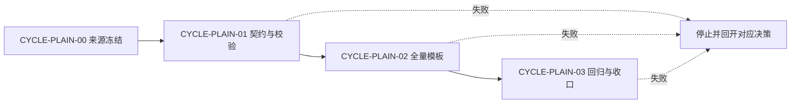
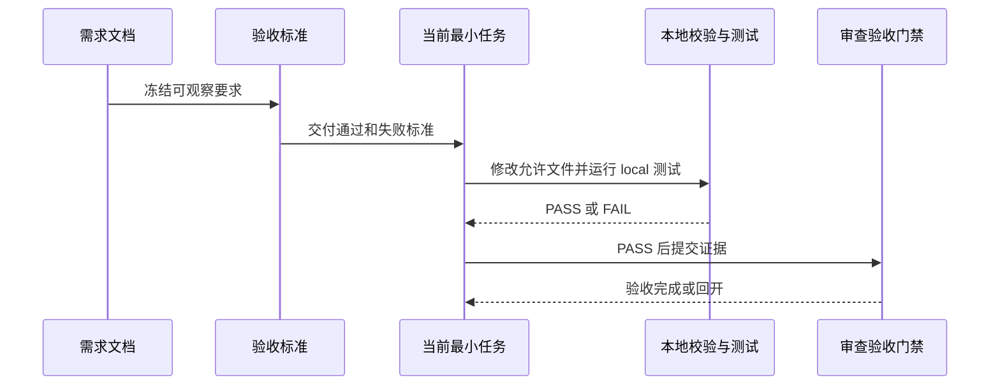

# 白话文档生成分层契约增强实施总览

结论：以统一摘要、末尾附录、模板登记和本地校验共同落实白话化。影响：业务读者先获得清晰结论，执行人员仍能准确核对操作与证据。范围：契约、模板、登记表、校验器、测试和必要收口文档。非范围：不批量迁移历史文档，不改产品代码、数据库或外部服务。变化：每个受管入口采用同一摘要和双附录边界，并接受自动检查。完成标准：所有适用验收、真实本地测试和收口门禁均通过。术语说明：模板登记表指记录全部生成入口及其结构要求的清单；双附录指执行附录和追踪附录。验证状态：来源文档已通过 profile 校验，实施进行中。

## 当前计划最终方案简要说明

先冻结固定摘要和附录职责，再按注册表同步所有受管模板，最后把规则写入校验器与正反例测试。这样可以用同一份来源、验收和追踪关系约束所有入口，避免只修一个模板或只检查一段中文造成的遗漏。

## Agent 对当前问题的理解

| 项目 | 冻结内容 |
| --- | --- |
| 问题 / 目标 | 现有白话化只验证开场存在，未验证业务信息完整、术语解释、附录承载和全部模板覆盖；目标是把这些约束变为可执行、可回归的统一能力 |
| 本轮范围 | 契约、模板、注册表、质量 profile、Python 校验器、单元测试、字典和必要收口文档 |
| 非范围 | 历史文档批量迁移、产品代码、数据库、外部 API、浏览器页面、Git 历史写入 |
| 当前优先闭环 | `CYCLE-PLAIN-00` 的来源文档已先行落盘并通过 profile 验证；随后进入契约与校验器闭环 |
| 关键假设 | 固定字段比主观可读性评分更可复验；已有专用附录名称可以保留，只登记职责映射 |
| `unresolved_decisions` | 无。若注册表无法判定某入口归属，立即记录 `GAP-PLAIN-001` 并停止该任务 |

## 图片资产决策与实施边界

图片资产决策：N/A + 原因：本计划描述的是文字结构、模板覆盖、校验规则和执行顺序，不需要 UI、截图、视觉对比或空间布局；证据：所有关系均可由 Mermaid 与表格表达，且 `BOUND-PLAIN-OUT-002` 排除页面改动。

Mermaid 边界：周期依赖和端到端交接继续使用 Mermaid；图片不得替代流程、时序或追踪门禁。真实生图、图片路径、格式签名和图片清单均为 N/A + 原因：没有需要观察的位图产物；证据：本节决策和对应需求文档图片资产决策。

## 已冻结决策与方案比较

| 决策 | 候选方案 | 选定方案 | 排除原因 | 回滚 |
| --- | --- | --- | --- | --- |
| `DEC-PLAIN-001` | 仅要求 H1 后中文；使用固定业务字段；接入主观评分 | 固定业务字段并用测试校验 | 仅中文无法保证完整；主观评分不可稳定复验 | 恢复到上一版本契约和对应测试 |
| `DEC-PLAIN-002` | 全文自由分布技术信息；统一附录职责 | 正文、执行附录、追踪附录分层 | 自由分布使业务读者无法快速理解，机器追踪难以定位 | 仅回滚当前任务的契约、模板和测试 |
| `DEC-PLAIN-003` | 手工逐目录检查；模板注册表 | 注册表加静态覆盖测试 | 手工检查会遗漏新入口 | 删除新增登记并恢复原模板前先确认范围 |
| `DEC-PLAIN-004` | 一次迁移历史；渐进迁移 | 渐进迁移 | 批量迁移会制造无关改动和兼容风险 | 保留未修改历史文档字节不变 |

## 现状与落点

### 当前代码/文档基线

- `plain-language-document-contract.md` 已定义 H1 后的白话开场和附录原则，但缺少固定业务槽位、术语落点和正文技术泄漏的完整校验。
- `validate_engineering_docs.py` 已加载质量 profile 和白话契约，但当前覆盖不足以证明 `REQ-PLAIN-001` 至 `REQ-PLAIN-004`。
- 多类 rules 的 references 存在模板入口，尚无覆盖全量受管入口的注册表测试。
- 未修改的历史文档必须继续按 `DEC-PLAIN-004` 保持兼容。

### 代码落点目录树

```text
artifact-delivery-gate-rules/
├── references/
│   ├── plain-language-document-contract.md        # 固定业务正文、术语与附录职责
│   ├── document-handoff-contract.md               # 零决策交接与追踪说明
│   └── document-quality-profiles.yaml             # 各文档类型的可检查要求
├── scripts/
│   └── validate_engineering_docs.py                # 本地 Markdown 质量校验器
└── tests/
    └── test_validate_engineering_docs.py           # 正反例和历史兼容回归

requirement-intake-rules/ references/               # 需求模板
acceptance-criteria-rules/ references/              # 验收模板
implementation-planning-rules/ references/          # 实施总览、周期和任务模板
bug-*/ references/                                  # Bug 入口模板
test-*/ references/                                 # 测试入口模板
final-acceptance-rules/ references/                 # 最终验收模板
architecture-doc-rules/ references/                 # 架构模板
project-design-doc-rules/ references/               # 项目设计模板
delivery-summary-rules/ references/                 # 交付模板
work-report-summary-rules/ references/              # 工作报告模板
skill-dictionary/                                   # 由生成脚本刷新的字典产物
```

### 文件与符号操作契约

| 任务 | 允许文件 | 目标符号或章节 | 禁止触碰区 |
| --- | --- | --- | --- |
| `TASK-PLAIN-01` | `artifact-delivery-gate-rules/references/` 下三份契约/profile 文件 | 白话正文、术语、附录职责和 profile 映射 | 产品代码、历史文档、非本需求规则 |
| `TASK-PLAIN-02` | `artifact-delivery-gate-rules/scripts/validate_engineering_docs.py`、对应测试 | 白话契约检查和 fixtures 断言 | 外部网络、非 local 配置、无关校验规则 |
| `TASK-PLAIN-03` 至 `TASK-PLAIN-04` | 注册表及各模板目录 | 全量受管入口的正文/执行附录/追踪附录位置 | 已修改完成的契约、产品代码、历史批量迁移 |
| `TASK-PLAIN-05` 至 `TASK-PLAIN-06` | 测试、字典生成物、审查与验收记录 | 回归、字典、合规和最终放行证据 | Git commit、push、生产环境 |

## 实施周期总览

| 顺序 | 周期 | 期次定位 | 单一目标 | 进入条件 | 收口条件 | 依赖 |
| ---: | --- | --- | --- | --- | --- | --- |
| 0 | `CYCLE-PLAIN-00` | 前置来源冻结 | 建立需求、验收和实施总览 | 用户确认范围 | 三份来源文档 profile 通过 | `SRC-USER-PLAIN-001` |
| 1 | `CYCLE-PLAIN-01` | 第一实施期 | 固定契约、质量 profile 和校验器行为 | 来源与验收已冻结 | 契约正反例和历史兼容回归通过 | `CYCLE-PLAIN-00` |
| 2 | `CYCLE-PLAIN-02` | 第二实施期 | 用注册表同步全部受管模板 | 第一实施期审查、验收通过 | 每个入口有唯一分层映射和模板证据 | `CYCLE-PLAIN-01` |
| 3 | `CYCLE-PLAIN-03` | 第三实施期 | 完成全量回归、字典、合规、审查与最终验收 | 第二实施期审查、验收通过 | `AC-PLAIN-001` 至 `AC-PLAIN-008` 全部 PASS | `CYCLE-PLAIN-02` |

图形目的：说明周期不可跳过，以及失败必须回到所属周期修复。关联 ID：`CYCLE-PLAIN-00` 至 `CYCLE-PLAIN-03`、`AC-PLAIN-001` 至 `AC-PLAIN-008`。



## 阶段计划

| 阶段 | 周期 | 唯一目标 | 输入 | 输出 | 验证门槛 |
| --- | --- | --- | --- | --- | --- |
| `PHASE-PLAIN-00` | `CYCLE-PLAIN-00` | 来源冻结 | 用户范围、现状检查、仓库规则 | 本需求、验收标准、实施总览 | 三份 profile PASS |
| `PHASE-PLAIN-01` | `CYCLE-PLAIN-01` | 契约与校验 | 已确认 `REQ/AC` | 契约、profile、校验器、单元测试 | 正反例与历史兼容 PASS |
| `PHASE-PLAIN-02` | `CYCLE-PLAIN-02` | 全量模板覆盖 | 已通过的契约和注册表 | 受管模板分层位置 | 注册表静态覆盖 PASS |
| `PHASE-PLAIN-03` | `CYCLE-PLAIN-03` | 收口放行 | 模板和测试证据 | 字典、合规、审查、最终验收 | 全部适用 AC PASS |

## 最小任务清单

| 周期内顺序 | 任务 | 垂直切片目标 | 预计文件数 | 文件/符号 | 真实测试 | 完成条件 | 停止条件 |
| ---: | --- | --- | ---: | --- | --- | --- | --- |
| 1 | `TASK-PLAIN-01` | 定义正文、术语、附录和 profile 的统一契约 | 4 | `references` 的契约与 quality profile | `TEST-PLAIN-001` | 需求条目均有可校验规则 | 契约冲突或缺 P0/P1 决策 |
| 2 | `TASK-PLAIN-02` | 让校验器和单元测试拒绝错误分层 | 2 | 校验函数与测试 fixtures | `TEST-PLAIN-002` | 正反例、历史兼容均 PASS | 命令失败、假阳性或漏检 |
| 1 | `TASK-PLAIN-03` | 为需求、验收、实施模板提供分层位置 | 不超过 5 | 三类目录的模板与注册表 | `TEST-PLAIN-003` | 映射完整且静态测试 PASS | 模板无等价承载位置 |
| 2 | `TASK-PLAIN-04` | 为 Bug、测试、审查、验收、架构、交付和报告模板提供分层位置 | 不超过 5/批次 | 对应模板与注册表 | `TEST-PLAIN-004` | 所有剩余入口映射完整 | 写集冲突或单任务超限 |
| 1 | `TASK-PLAIN-05` | 运行全量回归和来源文档校验 | 不超过 4 | 测试入口与证据记录 | `TEST-PLAIN-005` | 适用测试全 PASS | 负例未拒绝或历史误伤 |
| 2 | `TASK-PLAIN-06` | 刷新字典并完成合规、审查和最终验收 | 不超过 5 | 字典、审查、验收文档 | `TEST-PLAIN-006` | `AC-PLAIN-008` PASS | 任一门禁 FAIL 或未覆盖 |

## 追踪矩阵

| 来源/需求/验收 | 周期 | 任务 | 文件/符号 | 测试 | 证据 | 状态 |
| --- | --- | --- | --- | --- | --- | --- |
| `SRC-USER-PLAIN-001` / `REQ-PLAIN-001` / `AC-PLAIN-001`、`AC-PLAIN-002` | `CYCLE-PLAIN-01` | `TASK-PLAIN-01` | 契约、profile | `TEST-PLAIN-001` | `EVIDENCE-PLAIN-004` | 未执行 |
| `REQ-PLAIN-002` / `AC-PLAIN-003`、`AC-PLAIN-004` | `CYCLE-PLAIN-01` | `TASK-PLAIN-02` | 校验函数、单元测试 | `TEST-PLAIN-002` | `EVIDENCE-PLAIN-005` | 未执行 |
| `REQ-PLAIN-003` / `AC-PLAIN-005` | `CYCLE-PLAIN-02` | `TASK-PLAIN-03`、`TASK-PLAIN-04` | 模板注册表、受管模板 | `TEST-PLAIN-003`、`TEST-PLAIN-004` | `EVIDENCE-PLAIN-006` | 未执行 |
| `REQ-PLAIN-004` / `AC-PLAIN-006`、`AC-PLAIN-007` | `CYCLE-PLAIN-03` | `TASK-PLAIN-05` | 回归测试、profile 命令 | `TEST-PLAIN-005` | `EVIDENCE-PLAIN-007` | 未执行 |
| `REQ-PLAIN-005` / `AC-PLAIN-008` | `CYCLE-PLAIN-03` | `TASK-PLAIN-06` | 字典、合规、审查、最终验收 | `TEST-PLAIN-006` | `EVIDENCE-PLAIN-008` | 未执行 |

## 真实测试安排

| 测试 | 任务 | local 命令/入口 | 样本 | 断言 | 失败预期 | 清理 | 证据 |
| --- | --- | --- | --- | --- | --- | --- | --- |
| `TEST-PLAIN-001` | `TASK-PLAIN-01` | `python artifact-delivery-gate-rules/scripts/validate_engineering_docs.py --profile requirement --doc doc/2-需求/2026-07-14_003130_白话文档生成分层契约增强.md --root .` | 本需求文档 | 文档 profile PASS | 非零退出停止 | 无运行时数据 | `EVIDENCE-PLAIN-001` |
| `TEST-PLAIN-002` | `TASK-PLAIN-02` | `python -m unittest artifact-delivery-gate-rules.tests.test_validate_engineering_docs` | 正反 fixtures | 正例通过、负例拒绝、历史兼容通过 | 任一反例放行即 FAIL | 删除任务新增 fixture | `EVIDENCE-PLAIN-005` |
| `TEST-PLAIN-003` | `TASK-PLAIN-03` | 注册表静态测试入口 | 模板注册表与三类模板 | 覆盖且无重复映射 | 漏项即 FAIL | 仅删除新增测试数据 | `EVIDENCE-PLAIN-006` |
| `TEST-PLAIN-004` | `TASK-PLAIN-04` | 注册表静态测试入口 | 其余受管模板 | 全量入口有分层承载位置 | 漏项或重复即 FAIL | 仅删除新增测试数据 | `EVIDENCE-PLAIN-006` |
| `TEST-PLAIN-005` | `TASK-PLAIN-05` | 三份来源文档 profile 命令和全量 unittest | 本文、需求、验收与 fixtures | 全部 PASS | 任一失败停止 | 无运行时数据 | `EVIDENCE-PLAIN-007` |
| `TEST-PLAIN-006` | `TASK-PLAIN-06` | `python skill-dictionary/generate_dictionary.py` 和收口 gate | 生成字典与审查/验收结果 | 字典刷新且门禁 PASS | 生成或 gate 失败即 FAIL | 使用生成器回滚受影响生成物 | `EVIDENCE-PLAIN-008` |

## 风险与阻断项

| ID | 风险/阻断 | 触发证据 | 恢复路径 | 禁止动作 |
| --- | --- | --- | --- | --- |
| `GAP-PLAIN-001` | 某受管入口无法映射正文和附录位置 | 注册表审计发现未登记或职责冲突 | 回开 `DEC-PLAIN-002`，先冻结映射后再改模板 | 凭习惯自行补默认结构 |
| `GAP-PLAIN-002` | 校验器误伤历史文档 | 历史兼容回归 FAIL | 修正新建/修改识别并使用同输入复验 | 批量重写历史文档绕过失败 |
| `GAP-PLAIN-003` | 校验规则无法稳定识别术语解释 | 正反 fixture 无法区分 | 回开 `DEC-PLAIN-005`，定义可测标记 | 以主观人工意见替代测试 |
| `ROLLBACK-PLAIN-001` | 某最小任务扩大到无关文件 | `git diff` 显示越界路径 | 只回滚该任务允许文件，重新缩小写集 | 提交、推送或覆盖他人改动 |

## 任务完成、停止与最大推进边界

- 任务完成条件：当前任务的允许文件已完成，所属 `TEST-*` PASS，实现审查 PASS，关联 `AC-*` 可判定为 PASS。
- 任务停止 / 结束条件：出现任一 `GAP-*`、P0/P1 未决、local 测试失败、追踪不完整、Mermaid 无法解析、写集冲突或范围扩大。
- 当前 agent 最大推进边界：只推进契约、模板、校验器、测试、字典、审查和验收；不批量迁移历史文档、不修改产品功能、不写 Git 历史、不使用非 local 环境。
- 是否已获得用户开始实施授权：是。授权仅适用于本实施总览范围，仍须按每个最小任务的“实现 -> 真实测试 -> 审查 -> 验收”顺序推进。

## 自审结论

| 检查项 | 结果 | 依据 |
| --- | --- | --- |
| 来源、决策、需求、验收和实施追踪 | 通过 | 本文与需求、验收标准的稳定 ID 已双向映射 |
| 周期顺序与任务唯一归属 | 通过 | `CYCLE-PLAIN-00` 至 `CYCLE-PLAIN-03` 串行；每个任务仅归属一个周期 |
| 真实测试 | 通过 | 每个行为变更任务有 local 入口、样本、断言、失败预期和清理；来源文档任务明确免运行时测试理由 |
| 图形语义 | 通过 | 周期 flowchart 与端到端 sequenceDiagram 分别表达依赖与交接 |
| 图片资产 | 通过 | N/A + 原因 + 证据已声明，未伪造图片资产 |
| 历史兼容与 Git 边界 | 通过 | 不批量迁移历史文档，不执行提交或推送 |

## 端到端交接时序图

图形目的：展示来源需求、验收、实施任务、校验器和收口门禁的端到端交接。关联 ID：`REQ-PLAIN-001` 至 `REQ-PLAIN-005`、`AC-PLAIN-001` 至 `AC-PLAIN-008`、`TASK-PLAIN-01` 至 `TASK-PLAIN-06`。



## 附录

### 执行附录

- `CYCLE-PLAIN-00` 是纯 Markdown 来源冻结任务，运行时功能测试为 N/A + 原因：不改变程序行为；证据：`BOUND-PLAIN-OUT-002`。但三份文档必须执行各自 profile 校验。
- `CYCLE-PLAIN-01` 至 `CYCLE-PLAIN-03` 的命令、fixtures、清理和回滚以“真实测试安排”表为唯一执行口径；所有连接只能来自 local 配置。
- 每个任务在测试、审查和验收未闭环时不得进入下一任务；失败时只回滚本任务允许文件。

### 追踪附录

| 证据 | 产生者 | 关联周期/任务 | 最低内容 |
| --- | --- | --- | --- |
| `EVIDENCE-PLAIN-001` 至 `EVIDENCE-PLAIN-003` | `CYCLE-PLAIN-00` | 来源文档 | 三个 profile 的本地 PASS 输出 |
| `EVIDENCE-PLAIN-004` 至 `EVIDENCE-PLAIN-005` | `CYCLE-PLAIN-01` | 契约与校验器 | 正反例、兼容回归和任务审查结果 |
| `EVIDENCE-PLAIN-006` | `CYCLE-PLAIN-02` | 模板同步 | 注册表覆盖、各模板静态断言和任务审查结果 |
| `EVIDENCE-PLAIN-007` 至 `EVIDENCE-PLAIN-008` | `CYCLE-PLAIN-03` | 回归与收口 | 全量测试、字典、合规、总审查和最终验收结果 |
