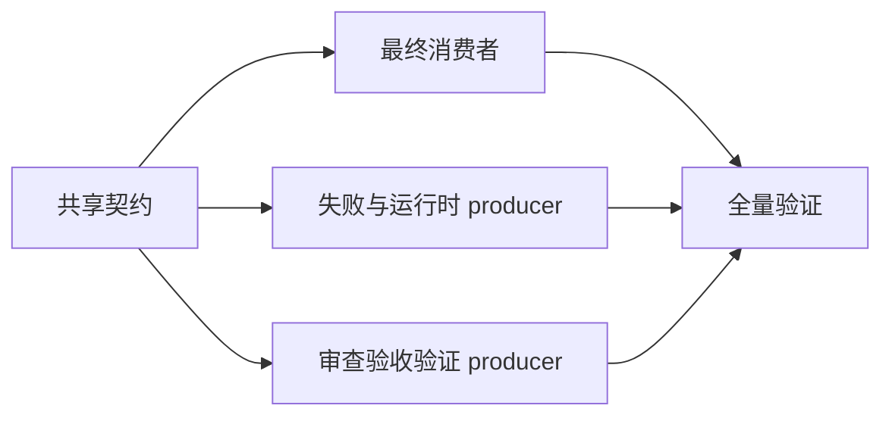
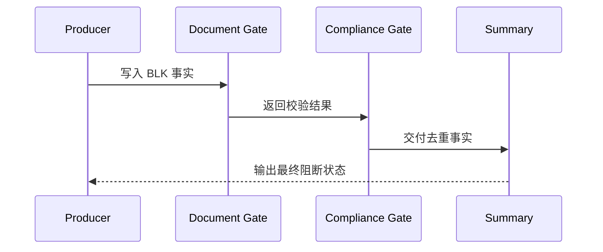

# 任务阻断收口与恢复计划实施总览

结论：共享契约让阻断事实只定义一次并在最终回复统一展示。影响：不同阶段不会输出冲突的恢复计划。范围：规则、模板、校验器、脚本和本地测试。非范围：业务系统与外部服务。变化：拆分十个可独立闭环的最小任务。完成标准：全部验收和真实测试通过。术语说明：上游阶段是指仅提供阻断事实、不直接面向用户编写恢复计划的执行步骤。验证状态：实施中。

## 当前计划最终方案简要说明

在共享 reference 中定义唯一 `BLK-*` 契约，所有上游只生产事实，最终总结唯一渲染。这样既能在任务结束时明确阻断，也不会让不同审查或验收步骤生成冲突的恢复计划。

## Agent 对当前问题的理解

目标是把“只说明阻断原因”升级为“明确任务已阻断并交付解决计划”。范围是规则、模板、validator、测试和项目记忆；非范围是业务系统、数据库和非 local 环境。当前优先闭环是共享契约与文档 validator；关键假设是所有状态都能映射为 `completed`、`limited`、`blocked` 或 `manual_handoff`。

图片资产决策：N/A；原因：本计划只使用 Mermaid 表达依赖和时序；证据：没有需要人工检查的位图资产。

## 实施周期总览

| 周期 | 垂直切片 | 任务 | 预计文件数 |
|---|---|---|---|
| CYCLE-BLK-001 | 契约到文档校验 | TASK-BLK-001, TASK-BLK-002 | 5 + 2 |
| CYCLE-BLK-002 | 事实到最终回复 | TASK-BLK-003 | 4 |
| CYCLE-BLK-003 | 失败到运行时交接 | TASK-BLK-004, TASK-BLK-005 | 3 + 5 |
| CYCLE-BLK-004 | 审查验收到恢复计划 | TASK-BLK-006..009 | 每项不超过 5 |
| CYCLE-BLK-005 | 全量验证与长期记忆 | TASK-BLK-010 | 5 |

## 阶段计划

1. 创建并验证共享契约和文档门禁。
2. 让最终总结和自动执行消费去重后的阻断事实。
3. 让失败、运行时、审查、验收和验证 producer 输出同一事实。
4. 运行单测、文档校验、字典生成、总审查和最终验收。

## 实施流程图

图形目的：说明共享契约到最终收口的交付顺序。
关联 ID：CYCLE-BLK-001、CYCLE-BLK-002、CYCLE-BLK-003、CYCLE-BLK-004、CYCLE-BLK-005。



## 实施时序图

图形目的：说明上游阶段、门禁和最终总结的职责顺序。
关联 ID：RULE-BLK-001、RULE-BLK-005、TEST-BLK-001。



## 最小任务清单

| 任务 | 文件/符号 | 完成判据 | 停止边界 |
|---|---|---|---|
| TASK-BLK-001 | `task-blocker-closure-contract.md` | 9 个字段和去重键完整 | 状态语义未冻结 |
| TASK-BLK-002 | `validate_engineering_docs.py` | 阻断正负例通过 | limited 被误报 |
| TASK-BLK-003 | 总结、合规、自动执行 Skill | 最终状态区唯一渲染 | 出现第二套计划 |
| TASK-BLK-004 | 失败学习 Skill | 失败停止可交接 | 无变化重试 |
| TASK-BLK-005 | 运行时恢复 schema/script | 健康失败不伪报成功 | 无 adapter 或幂等未知 |
| TASK-BLK-006 | 实现/总审查 Skill | P0/P1 有复审入口 | P2/P3 被阻断 |
| TASK-BLK-007 | 最终验收 Skill | 不放行有重验入口 | limited 被阻断 |
| TASK-BLK-008 | 功能验证 Skill | 必需验证缺失有恢复计划 | 非必需验证阻断 |
| TASK-BLK-009 | Bug 验证 Skill | 带风险关闭不伪报完成 | 状态冲突 |
| TASK-BLK-010 | 字典、记忆、审查文档 | 全量测试和校验通过 | 任一门禁失败 |

## 最小任务追踪矩阵

| 追踪项 | 来源要求 | 实现任务 | 验证入口 |
|---|---|---|---|
| 共享阻断契约 | REQ-BLK-002 | TASK-BLK-001、TASK-BLK-002 | TEST-BLK-004 |
| 最终回复唯一渲染 | REQ-BLK-003 | TASK-BLK-003 | TEST-BLK-001 |
| 失败与恢复交接 | REQ-BLK-004 | TASK-BLK-004、TASK-BLK-005 | TEST-BLK-003 |
| 审查、验收与验证 | REQ-BLK-005 | TASK-BLK-006 至 TASK-BLK-009 | TEST-BLK-002、TEST-BLK-005 |

## 现状与落点

```text
artifact-delivery-gate-rules/
  references/task-blocker-closure-contract.md  # 共享契约
  scripts/validate_engineering_docs.py          # 文档门禁
reasoning-summary-structure-rules/              # 最终用户输出
execution-failure-learning-rules/               # 连续失败 producer
agent-runtime-recovery-rules/                   # 运行时 blocked producer
implementation-review-rules/                    # 审查 producer
project-change-review-rules/
final-acceptance-rules/
functional-validation-rules/
bug-validation-rules/
```

## 真实测试安排

| TEST | 入口与样本 | 通过标准 | 清理 |
|---|---|---|---|
| TEST-BLK-001 | 模板与文本断言 | blocked 有完整最终状态区 | 无持久运行数据 |
| TEST-BLK-002 | review/acceptance fixture | 同根因去重 | 删除临时 fixture |
| TEST-BLK-003 | recovery engine 单测 | 预算耗尽进入 blocked/handoff | 删除临时状态 |
| TEST-BLK-004 | `python -m unittest artifact-delivery-gate-rules/tests/test_validate_engineering_docs.py` | 全部通过 | 无 |
| TEST-BLK-005 | validation 正反例 | limited/not_applicable 不阻断 | 无 |

## 风险与阻断项

N/A；原因：无未决 P0/P1；证据：需求和验收标准的未决决策清单为空。若测试发现上游阶段字段不同，必须停止在所属 TASK，统一回写共享契约后再继续。

## 任务完成、停止与最大推进边界

完成：所有 AC-BLK-* 有真实证据、所有 producer/consumer 引用共享契约、最终文案和文档校验通过。停止：任何 P0/P1、非 local 外部依赖、权限要求或无安全恢复路径。最大推进边界：仅本仓库的 Skill、references、脚本、测试、文档、字典和项目记忆；不提交 Git、不连接业务服务。

## 自审结论

每个任务都有文件落点、真实测试、停止条件和回滚方式；无未决决策。
