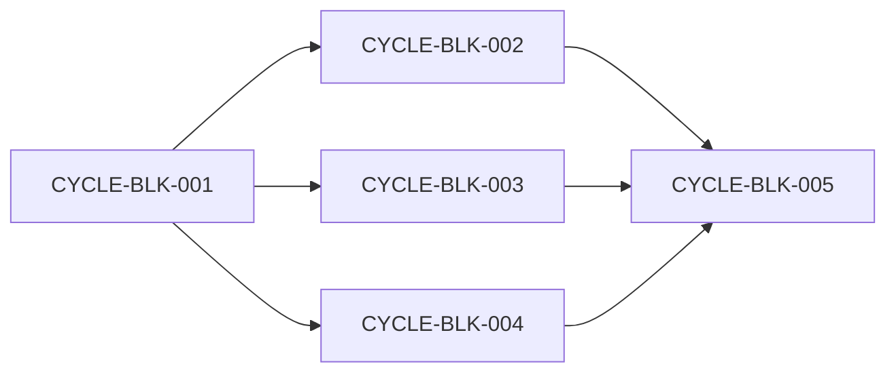

# 任务阻断收口与恢复计划全量顺序实施方案

结论：所有实施按共享契约优先、上游阶段并行、统一收口最后执行。影响：任一周期失败会阻止后续周期越过验证。范围：本需求的需求、验收、实施、测试、审查和验收产物。非范围：其他来源对象。变化：明确五个周期的执行顺序。完成标准：全部真实测试通过。术语说明：周期表示按依赖关系推进的工作边界。验证状态：实施中。

## 文档信息

本方案按共享契约、最终消费者、失败恢复、审查验收与验证、统一收口的顺序执行；任何周期未通过真实测试、审查和验收不得推进。图片资产决策：N/A；原因：流程使用 Mermaid；证据：无需要检查的视觉产物。

## 来源对象清单与回指关系

| 来源 | 验收 | 实施总览 | 当前状态 |
|---|---|---|---|
| REQDOC-BLK-001 | ACDOC-BLK-001 | PLAN-BLK-001 | 进行中 |

## 全量执行顺序

| 顺序 | 周期 | 目标 | 前置 | 收口证据 |
|---|---|---|---|---|
| 1 | CYCLE-BLK-001 | 共享 BLK 契约与 validator | 需求、验收标准 | TEST-BLK-004 |
| 2 | CYCLE-BLK-002 | 最终总结与合规收口 | CYCLE-BLK-001 | TEST-BLK-001 |
| 3 | CYCLE-BLK-003 | 执行失败和运行时恢复 | CYCLE-BLK-001 | TEST-BLK-003 |
| 4 | CYCLE-BLK-004 | 审查、验收、功能与 Bug producer | CYCLE-BLK-001 | TEST-BLK-002, TEST-BLK-005 |
| 5 | CYCLE-BLK-005 | 全量审查、文档、字典和验收 | 周期 1-4 | 所有 TEST-BLK-* |

## 需求到周期追踪矩阵

| 来源要求 | 实施周期 | 最小任务 | 验证证据 |
|---|---|---|---|
| REQ-BLK-002 | CYCLE-BLK-001 | TASK-BLK-001、TASK-BLK-002 | TEST-BLK-004 |
| REQ-BLK-003 | CYCLE-BLK-002 | TASK-BLK-003 | TEST-BLK-001 |
| REQ-BLK-004 | CYCLE-BLK-003 | TASK-BLK-004、TASK-BLK-005 | TEST-BLK-003 |
| REQ-BLK-005 | CYCLE-BLK-004 | TASK-BLK-006 至 TASK-BLK-009 | TEST-BLK-002、TEST-BLK-005 |
| 全部来源要求 | CYCLE-BLK-005 | TASK-BLK-010 | 全部 TEST-BLK-* |

## 依赖、进入、收口与阻断

图形目的：说明 CYCLE-BLK-001 至 CYCLE-BLK-005 的依赖顺序。
关联 ID：CYCLE-BLK-001、CYCLE-BLK-002、CYCLE-BLK-003、CYCLE-BLK-004、CYCLE-BLK-005。

阻断：任一周期的真实测试失败、共享字段不一致、非阻断误报，或需要非 local 依赖。恢复：修复所属周期后重新执行该周期的测试、审查和验收。

## 当前执行入口与下一步

当前入口：CYCLE-BLK-001。完成后按表顺序执行；同周期任务必须逐个闭环。N/A；原因：没有跨项目来源对象，本次只覆盖同一规则需求；证据：REQDOC-BLK-001。

## 自审结论

顺序、依赖和测试入口已冻结；未决事项为零。
